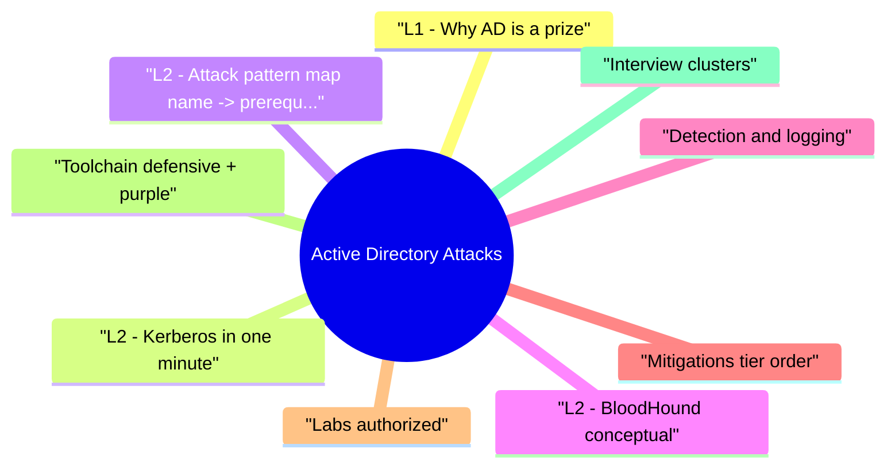

# Active Directory Attacks revision map

Active Directory Attacks in one sitting. That is the deal. I mined Critical Clarification Active Directory Attacks Misconceptions.md, Active Directory Attacks - Comprehensive Guide.md, Active Directory Attacks - Interview Questions & Answers.md, Active Directory Attacks - Quick Reference.md. The outline keeps every H2 I cared about from those files.

## L1 - Why AD is a prize
- Single directory powers workstations, servers, Exchange, Azure AD Connect hybrid.
- One domain admin-equivalent compromise often flattens the forest if tiering failed.

## L2 - Kerberos in one minute
- User authenticates to KDC -> TGT (encrypted with krbtgt hash).
- User requests TGS for SPN service -> ticket encrypted with service account hash.
- User presents TGS to service.

## L2 - Attack pattern map (name -> prerequisite)
- Exact ESC numbers (ESC1, ESC8, ...) rotate in community literature-learn the mechanism (who can enroll, EKU, subject supplied).

## L2 - BloodHound (conceptual)
- A graph of principals, rights, and shortest abuse paths-defenders use it for cleanup; attackers for prioritization. Interview: "It's reachability analysis on ACLs and Kerberos edges."

## Detection and logging
- 4769 Kerberos service ticket events (volume/noise tradeoffs).
- 4662 DS access with sensitive GUIDs for DCSync-class detections.
- Cert enrollment spikes, unusual template use.

## Mitigations (tier order)
- Tier model: Tier 0 workstations separate from internet email.
- Strong service account passwords / gMSA; remove stale SPNs.
- LDAP/SMB signing; EPA for NTLM contexts that support it.
- AD CS baseline (templates, enrollment agents, HTTP endpoints).
- PAM / JIT for admin; Audit ACLs continuously.

## Labs (authorized)
- TryHackMe / HTB AD paths; Microsoft defensive labs; PingCastle / Purple Knight for health metrics (read-only assessment tools).

## Toolchain (defensive + purple)
- BloodHound (authorized) · SharpHound collectors · Certipy / PSPKI for CA reviews · Microsoft Advanced Threat Analytics (legacy) / Sentinel rules

## Interview clusters

## Authoritative references
- MITRE ATT&CK Enterprise Windows techniques under Credential Access / Lateral Movement.
- Microsoft Securing Active Directory guidance.
- SpecterOps / harmj0y research (BloodHound lineage).

## Cross-links
- Windows Security Boundaries · MITRE ATTACK Interview Fluency · IAM and Least Privilege at Scale

## Verification checklist
- [ ] Explain why Kerberoasting needs user-backed SPNs.
- [ ] Name two log sources that help detect DCSync-class abuse.

## Pocket list

## Crown jewels
- DCs · krbtgt · AD CS CA · AADC servers · Tier 0 workstations (should be zero)

## Abuse patterns (memorize names)
- AS-REP roast · Kerberoast · DCSync · NTLM relay · Pass-the-Hash · Golden/Silver tickets · AD CS template abuse

## Quick mitigations
- gMSA for SPNs · kill pre-auth exceptions · SMB/LDAP signing · EPA · tier model · CA template audit

## Logs (examples)

## Tools
- BloodHound / SharpHound · PingCastle · Certipy (authorized)

## Cross-read
- Windows Security Boundaries · MITRE ATTACK Interview Fluency

## One-liner

## The clarification file, compressed

## "Azure AD means on-prem AD doesn't matter."
- Reality: Hybrid connect syncs identities; on-prem compromise propagates cloud risk.

## "Disabling Kerberos fixes everything."
- Reality: NTLM fallback and legacy apps widen relay surface-migrate safely, don't toggle blindly.

## "BloodHound is only offensive."
- Reality: Defenders use the same graph to find over-permissioned paths before attackers.

## "Local admin doesn't affect the domain."
- Reality: Credential theft and lateral movement from workstations feeds domain privilege chains.

## "Complex password policy eliminates Kerberoasting."
- Reality: Service accounts often miss rotation; gMSA and SPN hygiene matter more than length rules alone.

## "SIEM alerts on every TGS request."
- Reality: Volume is massive; tuning and risk-based sampling required.

## "Pentest found no DA-AD is clean."
- Reality: Time-boxed tests miss ACL depth; continuous assessment tools find latent edges.

## "AD CS is optional for security."
- Reality: Mis-issued certs are domain admin primitives in many orgs-treat PKI as tier 0.

## "Linux servers in the org are out of scope."
- Reality: Synced identities, trusts, and SMB clients bridge Linux into AD attack graphs.

## "Resetting krbtgt twice fixes golden tickets."
- Reality: Rotation helps contain known compromise but doesn't replace eviction and full credential rotation program.

## Oral prompts worth repeating

- Q: Kerberoasting vs AS-REP roasting?
- Q: Golden vs silver ticket (high level)?
- Q: Why does NTLM relay still matter?
- Q: What is "ESC" in AD CS abuse?

## 60-second answer
- Q: How do attackers move through Active Directory, and how do you harden it?

## Kerberos

## NTLM

## Certificates

### Q: What is "ESC" in AD CS abuse?
- A: A catalog of misconfiguration classes (who can enroll, subject alternatives, agent templates) leading to DOMAIN ADMIN-level certs-review templates and enrollment permissions.

## Mock ladder

## What sits next to this topic

- Stay inside this folder for the long guide. Jump only when a section names a sibling topic.
- Cookie Security, CSRF, XSS, JWT, OAuth, and TLS show up as neighbors on a lot of these maps.
