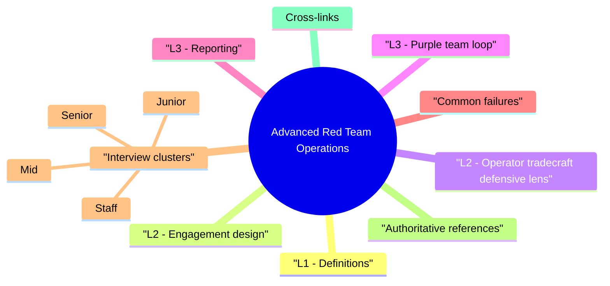

# Advanced Red Team Operations revision map

This is the Advanced Red Team Operations spine I actually use. Types, failures, fixes, traps. Sources: Critical Clarification Advanced Red Team Operations Misconceptions.md, Advanced Red Team Operations - Comprehensive Guide.md, Advanced Red Team Operations - Interview Questions & Answers.md, Advanced Red Team Operations - Quick Reference.md. I do not treat it as a second textbook.

## L1 - Definitions

## L2 - Engagement design
- Sponsor & objectives: What decision should leadership make (e.g., "Is MFA bypass detectable?")?
- Threat model: Actor profile (financial, ransomware, insider collusion).
- RoE: Targets, hours, data handling, stop conditions, legal review.
- Safety: No production destructive actions unless explicit; rollback plans.
- Metrics: Time-to-detect, time-to-contain, coverage of ATT&CK techniques tested.

## L2 - Operator tradecraft (defensive lens)
- Interviewers may ask high-level concepts:
- Beaconing: periodic callbacks-detection via DNS/HTTPS patterns, jitter defeats naive thresholds.
- Living-off-the-land: PowerShell, WMI, certutil-behavior analytics > IOC lists.
- Lateral movement: credential reuse, RDP, WinRM-segmentation and PAM tests.

## L3 - Purple team loop
- Execute atomic test (e.g., T1059 subset).
- Measure detection: SIEM rule fired? EDR alert?
- Tune: log source, rule, response playbook.
- Re-test until consistent visibility.

## L3 - Reporting
- Narrative timeline + ATT&CK mapping.
- Blast radius and sensitive data touched (even if simulated).
- Fix owners with verification steps-not only findings list.

## Common failures
- Theater: objectives unclear; no detection metrics.
- Scope creep without approval.
- Findings dump without business translation.

## Interview clusters

### Junior
- Red team vs pen test?

### Mid
- What is a purple team exercise?

### Senior
- Metrics for red team success beyond compromise?

### Staff
- Governance: how often, who approves, how findings enter risk register?

## Authoritative references
- MITRE ATT&CK (tactics/techniques)
- NIST adversarial testing themes (organizational)
- FIRST ethics for assessments

## Cross-links
- Threat Modeling · EDR Evasion Awareness and Defense · IAM · Zero Trust · Incident Response

## Verification checklist
- [ ] One objective you'd sell to a CISO.
- [ ] Three purple team metrics.
- [ ] RoE elements from memory.

## The one-pager, exploded

## Definitions
- Red team - objective-driven adversary simulation (authorized)
- Purple - attack + detection tuning together

## Engagement checklist
- Objectives · Threat profile · RoE · Safety · Metrics · Reporting · Remediation owners

## Metrics (examples)
- TTD · TTC · ATT&CK coverage · detection rule hit rate · replay after fix

## Defender-facing tradecraft topics
- Beaconing · LOLBins · lateral movement · identity abuse

## Deliverables
- Timeline · ATT&CK mapping · business risk · verified fixes

## Cross-read
- Threat Modeling · EDR Evasion Awareness · Incident Response · Detection Engineering

## One-liner

## What people get wrong

## "Red team = try to pwn everything."
- Reality: Objectives are negotiated-exfil simulation, detection validation, segmentation test. Unbounded scope creates legal and operational risk.

## "If we weren't caught, the SOC failed."
- Reality: Stealth may be in scope; success includes post-incident hunt findings and control gaps documented-not only real-time alerts.

## "Red team findings are always Critical."
- Reality: Chained Mediums can be worse than single Critical CVE. Narrative risk matters.

## "We don't need purple team if we have a red team."
- Reality: Purple accelerates detection engineering; red alone may leave SIEM blind spots unfixed.

## "Offensive tools in prod are fine with a letter."
- Reality: RoE must cover each action; mistakes can still be criminal or contract breach-operational discipline required.

## "Red team replaces vulnerability management."
- Reality: Complementary-VM drives patch cadence; red team tests realistic paths and detection.

## "ATT&CK mapping is bureaucracy."
- Reality: It enables coverage metrics and communication with blue team-use technique level appropriately.

## "Product security engineers don't need red team literacy."
- Reality: Design reviews and threat models improve when you know how attackers chain weaknesses.

## Questions that showed up in mocks

- Q: What belongs in rules of engagement?
- Q: How do you avoid "red team theater"?
- Technical (high level)
- Q: Name two detection opportunities for beaconing.
- Q: Living-off-the-land-why is it hard for SOC?
- Q: How do you brief executives after a red team?

## 60-second answer
- Q: What is advanced red teaming and how does it differ from a pen test?

## Scoping

### Q: How do you avoid "red team theater"?
- A: Pre-negotiate success metrics (detection SLAs, control effectiveness), map exercises to threat intel, close the loop with fixes and re-tests.

### Q: Living-off-the-land-why is it hard for SOC?
- A: Legitimate binaries used maliciously-pure IOC blocking fails; need behavior analytics, command-line logging, correlation with identity.

## Leadership

## Depth: Follow-ups
- Legal hold harmless and insurance.
- Cloud red team vs on-prem.
- Safe C2 lab architecture (isolated).

## Mock ladder

## If I only open two more topics

- Stay inside this folder for the long guide. Jump only when a section names a sibling topic.
- Cookie Security, CSRF, XSS, JWT, OAuth, and TLS show up as neighbors on a lot of these maps.
