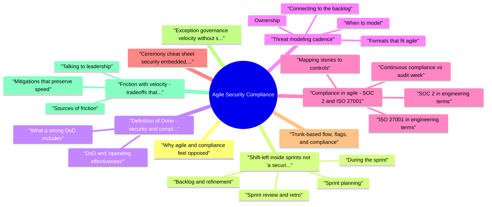

# Agile Security Compliance revision map

I keep this Agile Security Compliance map for the night before a screen, when five markdown files is too many clicks. Built from Critical Clarification Agile Security Compliance.md, Agile Security Compliance - Comprehensive Guide.md, Agile Security Compliance - Interview Questions &.md, Agile Security Compliance - Quick Reference.md. Twenty minutes. Then I close the laptop.

## Why agile and compliance feel opposed
- Agile assumes change is normal; compliance historically assumed periodic proof of a stable baseline. Tension shows up as:
- Velocity pressure: Teams skip reviews, defer hardening, or route around gates.
- Evidence pressure: Auditors ask for trails that only exist if you designed for them (approvals, logs, config history).
- Ownership blur: Product owns outcomes; platform owns infrastructure; security "consulted" too late.

## Shift-left inside sprints (not "a security sprint")
- Shift-left means moving assurance work earlier and making it continuous, not dumping all security into planning day one.

### Backlog and refinement
- Tag work by risk tier (e.g., customer data, auth, payments, admin, internal-only). Tier drives minimum controls and review depth.
- Security acceptance criteria on stories that touch identity, data flows, exports, integrations, or privilege.
- Spikes for unknowns (new integration, new data store): time-boxed design and threat sketch before commitment.

### Sprint planning
- Reserve capacity for security debt, control remediation, and tooling upgrades-same as any other non-feature work.
- Pull compliance-sustaining work into the backlog explicitly: access review automation, log pipeline fixes, policy tests, key rotation tasks.
- Align with release train or flag strategy if you use continuous deployment: "done" may mean merged and behind a flag, with prod rollout governed by change policy.

### During the sprint
- Default-on checks in CI: SAST, SCA, secrets, IaC policy, container scans-tiered from advisory to blocking.
- Pair or mob on sensitive changes; use lightweight design notes in the ticket (data flow, trust boundaries).
- Security champions or liaisons answer questions in-channel to avoid a formal review queue for every small change.

### Sprint review and retro
- Review control health indicators alongside features: open critical findings, policy violations, exception age.
- Retro: friction items (false positives, slow scans, unclear DoD)-fix the system, not only "try harder."

### Definition of Ready (optional but powerful)
- For high-tier stories, "ready" might require: data classification, owner for abuse cases, rollback/feature flag plan, and known logging/audit events-so the team does not start coding blind.

## Definition of Done: security and compliance that stick
- Definition of Done (DoD) is your contract for "this increment is shippable." For regulated or customer-trust contexts, DoD should reflect actual control operation, not a checkbox list no one reads.

### What a strong DoD includes
- Tests: Unit and integration coverage appropriate to risk; security-relevant paths covered (authz, input validation, critical business rules).
- Automated checks: Required scans completed or documented waiver with owner and expiry; no undeclared use of new critical dependencies without review.
- Secrets and config: No secrets in repo; configuration follows policy as code or approved patterns.
- Observability: Meaningful logs/metrics/traces for security-relevant events (auth failures, admin actions, export jobs)-without logging secrets.
- Documentation: Runbooks or operational notes for on-call when behavior is new or risky.
- Privacy and data handling: Retention, minimization, and access paths consistent with classification (especially for exports and third-party shares).
- Change and release evidence: For environments in scope, who approved, what changed, how rollback works-traceable in ticketing or deployment systems.

### DoD and "operating effectiveness"
- For SOC 2 and ISO-style programs, auditors care whether controls run over time, not only whether a policy PDF exists. Engineering DoD should connect to:
- Preventive controls (pipeline policy, least privilege in code reviews).
- Detective controls (alerts, log review sampling, anomaly detection).
- Corrective controls (incident runbooks, patch SLAs, rollback).

## Threat modeling cadence
- Threat modeling is not a one-time diagram; it is structured thinking about abuse cases tied to what you are changing.

### When to model
- New features or services that change trust boundaries, data flows, or authentication/authorization.
- Material architecture changes (new broker, new public endpoint, new tenant isolation boundary).
- Third-party integrations that receive or send sensitive data.
- Periodic refresh for long-lived systems (e.g., quarterly or twice a year for high-value surfaces).

### Formats that fit agile
- 30-60 minute sessions per epic or milestone, not per story-capture assets, actors, entry points, and top threats.
- Incremental updates: Append deltas when scope changes; link the model from epic or architecture doc.
- Outputs you can use: Ranked risks with owners, mitigations (design, code, detect), and tests or monitoring hooks.

### Connecting to the backlog
- Each significant threat should yield actionable backlog items: hardening tasks, abuse-case tests, rate limits, admin audit logs, or alerts. If modeling never creates tickets, it is theater.

### Ownership
- Product engineering owns the system design; security facilitates method and quality bar. The goal is repeatable habit, not perfect diagrams.

## Compliance in agile: SOC 2 and ISO 27001
- You rarely "implement ISO" in the abstract. You implement controls-access, logging, encryption, vulnerability management, incident response, vendor risk-and map them to framework criteria with evidence.

### SOC 2 in engineering terms
- SOC 2 (Trust Services Criteria) is often about proving design and operating effectiveness of controls over a period. For agile teams, that implies:
- Consistent pipelines and protected branches; merges tied to review and CI results.
- Production access via break-glass or approved paths with logging.
- Vulnerability and patch processes with measurable SLAs.
- Incidents logged, classified, and tied to corrective actions.
- Vendors handling customer data documented and reviewed on a schedule.

### ISO 27001 in engineering terms
- ISO 27001 centers on an ISMS: risk treatment, documented procedures, and continuous improvement. In agile delivery:
- Policies are short, owned, and versioned; procedures live where engineers work (runbooks, playbooks, pipeline definitions).
- Risk registers update when architecture or scope changes; security work is prioritized like other product risk.
- Internal audits and management review become scheduled ceremonies with metrics, not annual surprises.

### Mapping stories to controls
- Use a control catalog or matrix: each control has owner, frequency, automation level, and evidence location. When you ship features, ask: "Which controls does this touch?" Examples:
- New admin API -> access control, logging, rate limiting, security testing.
- New data store -> encryption, backups, retention, classification, DLP considerations.

### Continuous compliance vs audit week
- Automated control checks on a schedule (daily/weekly) with alerts on drift.
- Exception register: time-bound, approved, compensating controls documented.
- Sampling strategy for manual controls (access reviews, log reviews) with records of who did what and when.

### SOC 2 Common Criteria: what engineering actually proves
- Interview tip: describe one change end-to-end (ticket -> PR -> checks -> deploy -> monitor) and point to where each control "leaves a mark."

### ISO 27001 beside agile ceremonies
- See the source section `ISO 27001 beside agile ceremonies` for the worked example.

### Working with GRC, privacy, and internal audit
- Shared vocabulary: Translate "control" into pipeline checks, IAM policies, and runbooks-not only policy PDFs.
- Evidence by API: Prefer exports from CI, cloud audit logs, and ticketing over screenshots assembled by hand.
- Time-boxed review slots: Offer recurring office hours or SLA-based review for high-tier epics so product can plan security time.
- Scope clarity: Document what is in scope for the audit (systems, environments, subprocessors). Scope drift is a common agile pain point when microservices proliferate.

## Ceremony cheat sheet (security embedded, not bolted on)
- This pattern keeps security continuous rather than a single "security sprint" that delays value and trains teams to batch risk.

## Trunk-based flow, flags, and compliance

## Exception governance (velocity without silent risk)

## Friction with velocity: tradeoffs that adults disclose
- Security and compliance do add cost. Mature programs choose where to spend it.

### Sources of friction
- Human reviews that do not scale.
- Noisy scanners that train people to ignore results.
- One-size gates that block low-risk work.
- Ambiguous ownership ("security will catch it later").
- Manual evidence collection that collapses under speed.

### Mitigations that preserve speed
- Risk-based tiering: Stricter gates for tier-0; lighter path for internal tools with clear boundaries.
- Automation first: Policy as code, automated evidence pulls, self-service guardrails.
- Paved roads: Golden paths, approved libraries, templates with secure defaults.
- Service-level agreements for security review: time-boxed, with escalation-not infinite queues.
- Exception discipline: rare, time-boxed, documented; never silent waivers.

### Talking to leadership
- See the source section `Talking to leadership` for the worked example.

## Enablement: champions, docs, and guardrails
- Velocity improves when secure behavior is easier than insecure behavior. Tactics that pair well with agile:
- Champions embedded per squad or domain: not mini-CISOs, but people who know local threats, escalation paths, and paved-road tooling.
- Short, searchable guidance tied to stack (framework-specific CSRF/authz notes, copy-paste patterns for logging without secrets).
- Self-service policy explanations ("why this CI rule exists") plus fast override process for false positives-overrides still logged.
- Training aligned to real defects seen in your codebases (less generic slide-ware, more "we broke it this way last quarter").

## Metrics that matter
- Avoid vanity counts. Prefer outcomes and trends:
- Vulnerability age and SLA adherence by tier.
- Policy violation counts and time to remediate pipeline or cloud drift.
- Exception count and age; repeat audit findings.
- Evidence freshness (last access review, last DR test, last key rotation event).
- Incident metrics: detection time, containment, root-cause themes linked to backlog.

## How programs fail
- Checkbox compliance: Policies exist; production tells a different story.
- Screenshot audits: Evidence that cannot be reproduced from systems of record.
- Tool sprawl without ownership or tuning-noise replaces signal.
- Security as gatekeeper instead of enabler-teams route around you.
- Frozen DoD that ignores how the product actually ships (flags, canaries, microservices).

## Verification before external audit
- Readiness assessment or internal audit against the control set.
- Sample production configs and logs against stated policies.
- Tabletops for control failure (missed access review, pipeline bypass attempt, key compromise).
- Trace a few changes ticket -> PR -> CI -> deploy -> monitor end to end.

## Interview framing
- Junior/mid: What is shift-left? What belongs in DoD? Where does evidence live?
- Senior: How do you tier controls? How do you run threat modeling without stalling delivery?
- Staff/principal: How do you design continuous compliance for SOC 2 with frequent deploys? How do you measure whether security is helping or hurting velocity?

## Cross-links
- Pair this topic with: Secure CI/CD, Security Metrics and OKRs, IAM and Least Privilege, Threat Modeling, Vulnerability Management, Product Security Assessment, and Incident Response.

## Cheat sheet bits

## Key Strategies

## DevSecOps Integration

## Security Automation Checklist
- SAST in CI/CD
- DAST scanning
- Dependency scanning
- Container scanning
- Infrastructure scanning
- Compliance checks
- Policy enforcement

## Compliance Frameworks

## Security as Code

## Metrics

## Key Principles
- Automate security and compliance
- Integrate into CI/CD
- Continuous compliance monitoring
- Risk-based approach
- Security culture building

## Traps that dump interviews

## ️ Common Misconceptions

### "Security compliance slows down Agile development"
- Truth: Well-integrated security compliance can enable Agile development through automation and shift-left practices.
- Automated security checks in CI/CD
- Security as code (infrastructure as code, policy as code)
- Early security integration (shift-left)
- Continuous compliance monitoring

### "Compliance is only needed at release, not during development"
- Truth: Compliance should be continuous throughout SDLC, not just checked at release.
- Security checks in development (code scanning)
- Compliance checks in CI/CD pipeline
- Ongoing monitoring in production
- Regular compliance audits and reviews

### "Compliance requirements are fixed and can't adapt to Agile"
- Truth: Compliance can be adapted to Agile while maintaining security objectives.
- Risk-based compliance (focus on high-risk areas)
- Continuous compliance monitoring (not just point-in-time audits)
- Automation of compliance checks
- Compliance as code (policy as code)

### "Automation handles all compliance requirements"
- Truth: Automation handles many but not all compliance requirements - manual review and documentation are still needed.
- Security scanning (SAST, DAST, dependency scanning)
- Policy enforcement (infrastructure compliance)
- Configuration checks
- Continuous monitoring
- Policy interpretation and application
- Risk assessment and decision-making
- Documentation and evidence collection

### "Compliance means 100% security"
- Truth: Compliance ensures baseline security but doesn't guarantee complete security.
- Compliance: Meeting regulatory/standard requirements
- Security: Actual security posture (broader than compliance)

## Key Takeaways
- Compliance Enables Agile: Through automation and integration, not blocking
- Continuous Compliance: Throughout SDLC, not just at release
- Adapt Compliance to Agile: Risk-based, continuous monitoring, automation
- Automation + Manual: Automation handles many tasks, manual work still needed
- Compliance ≠ Security: Compliance is baseline, comprehensive security goes beyond

## Prompts I drill out loud

- Security in the sprint rhythm
- How do you put security work into Agile sprints without treating it as a separate waterfall?
- What security activities belong in sprint planning versus "when we have time"?
- How do you handle a sprint where security findings explode mid-sprint?
- What do you show in sprint review when stakeholders ask "are we compliant for this release?"
- Definition of Done and quality bars
- How do you define "Definition of Done" so security is real, not a checkbox?
- Should security criteria differ for experiments, MVPs, and GA features?
- How do you prevent "merge first, security later" when deadlines press?
- Compliance versus velocity
- How do you reconcile auditors' need for evidence with Agile's preference for working software over documentation?
- When compliance seems to demand big design upfront, how do you stay iterative?
- How do you talk to the business about slowing down for compliance without sounding like a blocker?
- Threat modeling cadence
- How often should teams threat model in Agile, and how lightweight can it be?
- Who should attend threat modeling in a sprint-based team?
- How do you keep threat models from going stale?
- Backlog prioritization and security debt
- How do you prioritize security backlog items against product features?
- What is a practical way to represent "compliance work" on the backlog?
- How do you avoid endless security debt while still shipping?
- Metrics, culture, and scaling
- Which metrics help you steer Agile security without gaming the team?
- How do you scale this model across many squads without a security person in every ceremony?

### What security activities belong in sprint planning versus "when we have time"?
- See the source section `What security activities belong in sprint planning versus "when we have time"?` for the worked example.

### What do you show in sprint review when stakeholders ask "are we compliant for this release?"
- See the source section `What do you show in sprint review when stakeholders ask "are we compliant for this release?"` for the worked example.

### How do you define "Definition of Done" so security is real, not a checkbox?
- See the source section `How do you define "Definition of Done" so security is real, not a checkbox?` for the worked example.

### How do you prevent "merge first, security later" when deadlines press?
- See the source section `How do you prevent "merge first, security later" when deadlines press?` for the worked example.

### How do you reconcile auditors' need for evidence with Agile's preference for working software over documentation?
- See the source section `How do you reconcile auditors' need for evidence with Agile's preference for working software over documentation?` for the worked example.

### What is a practical way to represent "compliance work" on the backlog?
- See the source section `What is a practical way to represent "compliance work" on the backlog?` for the worked example.

### What is your elevator summary of "Agile security compliance done right"?
- See the source section `What is your elevator summary of "Agile security compliance done right"?` for the worked example.

### How do you coordinate security and compliance across many squads or a program increment?
- Cross-read: Agile Security Compliance - Comprehensive Guide; Secure CI/CD; Threat Modeling; Security Metrics and OKRs; Product Security Assessment Design; IAM and Least Privilege at Scale.

## Sibling folders

- Stay inside this folder for the long guide. Jump only when a section names a sibling topic.
- Cookie Security, CSRF, XSS, JWT, OAuth, and TLS show up as neighbors on a lot of these maps.
