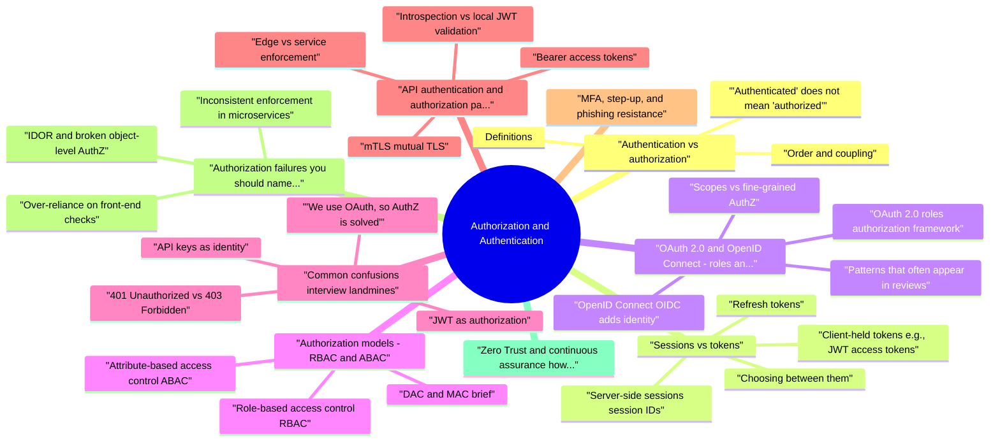

# Authorization and Authentication revision map

I keep this Authorization and Authentication map for the night before a screen, when five markdown files is too many clicks. Built from Critical Clarification Authorization and Authentic.md, Authorization and Authentication - Comprehensive G.md, Authorization and Authentication - Interview Quest.md, Authorization and Authentication - Quick Reference.md. Twenty minutes. Then I close the laptop.

## Authentication vs authorization

### Definitions
- See the source section `Definitions` for the worked example.

### Order and coupling
- Logical order: authenticate (or identify the workload), then authorize.

### "Authenticated" does not mean "authorized"
- See the source section `"Authenticated" does not mean "authorized"` for the worked example.

## Sessions vs tokens
- Both are vehicles for continuity after initial AuthN. The security trade-offs differ in where state lives, how revocation works, and what attackers can steal.

### Server-side sessions (session IDs)
- How it works: After AuthN, the server creates a random session identifier and stores session state server-side (memory, Redis, DB). The client holds only the opaque ID-classically in an HttpOnly, Secure, SameSite cookie.
- Instant server-side revocation (delete or blacklist session record).
- Opaque to the client-no self-describing claims for users to tamper with.
- Easy to rotate session ID on privilege change.
- Session fixation: always issue a new session ID after successful login.
- Theft: if the session cookie leaks (XSS without HttpOnly, malware, physical access), the attacker is the user until revocation.
- Scale: session store must be highly available; sticky sessions alone are a fragile substitute.

### Client-held tokens (e.g., JWT access tokens)
- Horizontal scalability and microservice-friendly validation (signature + issuer metadata).
- Useful for machine-to-machine flows with OAuth client credentials.
- XSS + localStorage is a common anti-pattern; prefer HttpOnly cookies for browser-held tokens when you control the front end, or tight CSP and no token in JS-accessible storage.
- Algorithm/key confusion and weak signing are classic JWT pitfalls-pin algorithms, use modern libraries, rotate keys (JWKS).
- Revocation: short TTL, refresh tokens with rotation, denylists for compromise, or accept that until expiry the token is valid (replay window).

### Choosing between them
- Web apps with a first-party backend: server sessions or opaque tokens backed by server store are often simpler to revoke.
- SPAs calling multiple APIs, mobile apps, microservices: signed access tokens + centralized token introspection or JWKS validation patterns are common-pair with short lifetimes and explicit AuthZ at services.

### Refresh tokens
- See the source section `Refresh tokens` for the worked example.

## OAuth 2.0 and OpenID Connect: roles and trust boundaries

### OAuth 2.0 roles (authorization framework)
- Resource owner: the user (or entity) who can grant access to protected resources.
- Client: the application requesting access (web app, SPA, mobile app, backend service). Split into confidential (can keep a secret) vs public (cannot-use PKCE).
- Authorization server (AS): issues tokens after authenticating the resource owner and obtaining authorization; performs consent.
- Resource server (RS): hosts protected APIs; validates tokens and enforces access policies (often with scopes as a coarse gate).

### OpenID Connect (OIDC) adds identity
- OIDC layers identity tokens (id_token) and a UserInfo endpoint on top of OAuth. Actors:
- Identity Provider (IdP): issues id_token and tokens; authenticates users.
- Relying Party (RP): your application that consumes identity assertions.

### Scopes vs fine-grained AuthZ
- Scopes/consent express coarse delegation ("can read calendar") between user, client, and AS.
- Application AuthZ ("may edit this record") still belongs in your services, often via RBAC/ABAC and object-level checks.

### Patterns that often appear in reviews
- Authorization Code + PKCE for public clients; avoid legacy implicit flow for new browser apps.
- Audience (aud) and issuer (iss) validation on access tokens at every resource server.
- Redirect URI exactness and state parameter for CSRF protection in the OAuth front channel.
- Confused deputy: ensure tokens minted for client A are not accepted by API B unless that was intended-bind tokens to the right audience.

## Authorization models: RBAC and ABAC

### Role-based access control (RBAC)
- Users receive roles; roles map to permissions on resource types.
- Pros: simple to explain, works well for admin consoles and stable job functions.
- Cons: role explosion (combinations of duties), weak context ("same role, different data"), tempting overly broad roles like admin.

### Attribute-based access control (ABAC)
- Decisions use attributes of subject, resource, action, and environment (department, data classification, ownership, IP, time, device posture).
- Pros: expressive policies, strong data-centric and contextual control.
- Cons: harder to reason about, needs policy testing, observability, and governance.

### DAC and MAC (brief)
- DAC: resource owners grant access (shared drives, mailbox delegation)-flexible, risky if owners misunderstand sensitivity.
- MAC: labels and lattice policies (common in government/high assurance)-users cannot override policy.

## Common confusions (interview landmines)

### 401 Unauthorized vs 403 Forbidden
- 401: not authenticated or authentication is invalid/expired-WWW-Authenticate may apply.
- 403: authenticated but not permitted-do not leak whether a resource exists; still avoid verbose errors.

### "We use OAuth, so AuthZ is solved"
- OAuth solves delegation and token issuance, not your object-level rules.

### JWT as authorization
- A JWT may carry claims (roles, scopes), but trust the signature, not the client-and still implement server-side checks against fresh data where needed (subscription status, suspension, tenant membership).

### API keys as identity
- API keys usually identify a project or integration. Treat them as secrets with scopes, rotation, and rate limits-they are weak user AuthN on their own.

### SSO login vs API access
- Logging users in via SAML/OIDC is AuthN at the edge. Your services still need token validation, audience checks, and AuthZ.

## API authentication and authorization patterns

### Edge vs service enforcement
- Gateway: TLS termination, coarse AuthN (JWT validation, API key), rate limiting, WAF, sometimes scope checks.
- Service: domain AuthZ (ownership, state transitions), policy engines, database predicates (tenant filters).

### Bearer access tokens
- Authorization: Bearer . Validate issuer, audience, signature, exp, nbf, and intended use (access vs ID). Prefer short TTL and scoped claims.

### mTLS (mutual TLS)
- Strong workload identity between services. Combine with SPIFFE/SPIRE-style identities in cloud-native systems. Still requires application-level AuthZ-mTLS says which service connected, not which rows it may read.

### Introspection vs local JWT validation
- Local JWKS validation: fast, offline-capable; watch key rotation.
- Introspection endpoint: authoritative for revocation; adds latency and coupling-sometimes used at the edge only.

### First-party vs third-party
- First-party: you own client and APIs-simpler cookie strategies and token binding.
- Third-party: consent, scoped tokens, per-client rate limits, and B2B tenant isolation dominate threat modeling.

### Browser SPAs and the backend-for-frontend (BFF)
- Single-page applications struggle to keep tokens out of JavaScript. Common mitigations:
- BFF or dedicated API layer holds HttpOnly cookies and exchanges them for upstream access tokens server-side, so the browser never stores bearer tokens in localStorage.
- Strict CSP, Subresource Integrity, and minimal third-party scripts reduce XSS blast radius-XSS against a cookie-based session is still catastrophic, but JS-readable tokens make exfiltration trivial.

### Service-to-service: workload identity beyond API keys
- See the source section `Service-to-service: workload identity beyond API keys` for the worked example.

### Introspection, token exchange, and delegation depth
- See the source section `Introspection, token exchange, and delegation depth` for the worked example.

### SAML, OIDC, and enterprise federation (orientation)
- See the source section `SAML, OIDC, and enterprise federation (orientation)` for the worked example.

## MFA, step-up, and phishing resistance
- Passwords alone rarely meet organizational risk appetite. MFA combines categories (know/have/are). Interview-ready points:
- TOTP apps and push approvals improve baseline posture but can be phished with real-time relay attacks-education and risk signals still matter.
- WebAuthn / FIDO2 security keys provide phishing-resistant possession factors because credentials are origin-bound.
- Step-up authentication: re-verify with a stronger factor before high-impact actions (changing MFA, wiring money, deleting production data), even if the session is valid.

## Authorization failures you should name in interviews

### IDOR and broken object-level AuthZ
- See the source section `IDOR and broken object-level AuthZ` for the worked example.

### Inconsistent enforcement in microservices
- If only some services validate audience or scopes, attackers route through the weak hop. Contract tests, shared middleware, and policy-as-code reviews reduce drift.

### Over-reliance on front-end checks
- UI hiding of buttons is not authorization. Every mutating and data endpoint must enforce policy server-side.

## Zero Trust and continuous assurance (how it maps to AuthN/AuthZ)
- Zero Trust is not a single product; it is an architecture stance: do not trust the network; verify explicitly; assume breach. Operationally it reinforces patterns you already want:
- Strong identity for users (MFA, device signals) and workloads (certs, SPIFFE IDs).
- Least privilege and just-in-time elevation for admin paths.
- Segmentation so a compromised laptop cannot freely reach production data planes.
- Continuous evaluation where risk scores or policy can shorten sessions or force step-up when context changes.

## Logging, auditing, and accountability
- Security and compliance teams depend on tamper-evident logs of authentication events (success/failure, MFA challenges) and authorization decisions for sensitive actions. Effective practice:
- Use stable identifiers (user id, tenant id, API client id) rather than only email addresses.
- Log denials at sensible volume-throttled and sampled for noisy endpoints-to detect probing without drowning storage.
- Correlate gateway decisions with service-level outcomes to catch policy drift.

## Optional hardening: proof-of-possession and binding
- Bearer tokens are bearer-whoever holds them wins. Emerging patterns reduce theft impact:
- DPoP (Demonstrating Proof-of-Possession): sender proves control of a key bound to the token, limiting replay from passive eavesdropping scenarios where TLS is terminated early.
- Token binding strategies (cookies with SameSite, TLS client constraints, mTLS for services) narrow the environments where a stolen secret is usable.

## Threat-aware checklist (condensed)
- MFA for humans on sensitive accounts; phishing-resistant factors where stakes are high.
- Credential storage: modern password hashing (Argon2 family) where passwords exist; breach detection and rate limits on login.
- Session hygiene: regenerate IDs on login, idle + absolute timeouts, secure cookie attributes.
- Deny by default; centralize policy where possible, test negative cases.
- Object-level checks: every ID from the client is suspect-verify tenant and ownership.
- Audit sensitive decisions with correlation IDs.
- PKCE for public clients; tight redirect URI lists; validate aud/iss; rotate refresh tokens; monitor reuse.
- Never treat id_token as an API access token.

## Cheat sheet bits

## Key Concepts

## Authentication vs Authorization

## Authentication Factors

## Authorization Models

## Security Checklist
- Strong password policies and hashing (bcrypt, Argon2)
- Multi-factor authentication (MFA) for sensitive accounts
- Secure session management (cryptographically random tokens)
- Session timeout (absolute and idle)
- Secure session storage (server-side or secure client-side)
- HTTPS only for authentication
- HttpOnly and Secure cookies
- Principle of least privilege for authorization

## Common Vulnerabilities

## Best Practices
- Authentication before authorization
- Use MFA for sensitive operations
- Principle of least privilege
- Secure session management
- Regular security audits

## Other notes sitting in the folder

## Fundamental concepts

### What is the difference between authentication and authorization?
- See the source section `What is the difference between authentication and authorization?` for the worked example.

### Why is "the user is logged in" not enough for security?
- See the source section `Why is "the user is logged in" not enough for security?` for the worked example.

### Explain authentication factors and when to combine them.
- See the source section `Explain authentication factors and when to combine them.` for the worked example.

## Sessions, tokens, and browser apps

### Compare server-side sessions with signed tokens such as JWTs.
- See the source section `Compare server-side sessions with signed tokens such as JWTs.` for the worked example.

### How do you implement secure session management for a web application?
- See the source section `How do you implement secure session management for a web application?` for the worked example.

### What mistakes do teams make with JWTs?
- See the source section `What mistakes do teams make with JWTs?` for the worked example.

## OAuth 2.0 and OpenID Connect

### Name the OAuth 2.0 roles and what each is responsible for.
- See the source section `Name the OAuth 2.0 roles and what each is responsible for.` for the worked example.

### What is OpenID Connect, and how does it relate to OAuth 2.0?
- See the source section `What is OpenID Connect, and how does it relate to OAuth 2.0?` for the worked example.

### What is PKCE, and why does it matter?
- See the source section `What is PKCE, and why does it matter?` for the worked example.

## Authorization models and design

### Explain RBAC and its operational downsides.
- See the source section `Explain RBAC and its operational downsides.` for the worked example.

### When would you choose ABAC over RBAC?
- See the source section `When would you choose ABAC over RBAC?` for the worked example.

### What is least privilege, and how do you apply it in practice?
- See the source section `What is least privilege, and how do you apply it in practice?` for the worked example.

## APIs, HTTP semantics, and enforcement

### How do you use 401 and 403 in APIs?
- See the source section `How do you use 401 and 403 in APIs?` for the worked example.

### How would you secure authentication for public APIs?
- See the source section `How would you secure authentication for public APIs?` for the worked example.

### Where should authorization be enforced in a microservice architecture?
- See the source section `Where should authorization be enforced in a microservice architecture?` for the worked example.

## Threats, testing, and behaviorals

### Name common authentication attacks and mitigations.
- See the source section `Name common authentication attacks and mitigations.` for the worked example.

### How do you test authorization beyond "happy path"?
- See the source section `How do you test authorization beyond "happy path"?` for the worked example.

### Describe balancing stronger authentication with usability.
- See the source section `Describe balancing stronger authentication with usability.` for the worked example.

## Depth: Interview follow-ups - Authorization and Authentication
- Authoritative references: OWASP Authentication Cheat Sheet; OWASP Authorization Cheat Sheet; CWE-285 (Improper Authorization).
- Follow-ups: AuthN once vs AuthZ every request in microservices; IDOR as failed object-level AuthZ; policy engines and when ABAC pays off; audience validation on tokens across services.

## Depth: Interview follow-ups - AuthN vs AuthZ (Critical Clarifications)
- Authoritative references: OWASP Authentication CS; OWASP Authorization CS.
- Follow-ups: session vs token-where identity is proved vs where permissions are enforced; 401 vs 403 semantics in APIs you have shipped; federated identity trust boundaries between IdP and apps.

## Traps that dump interviews

## ️ Common Misconceptions

### "Authentication and Authorization are the same thing"
- Truth: Authentication and authorization are completely different concepts, though they work together.
- Verifies "Who you are" - identity verification
- Answers: "Are you who you claim to be?"
- Examples: Username/password, biometrics, tokens
- Happens before authorization
- Determines "What you can do" - permission/access control
- Answers: "What resources and actions are you allowed to access?"
- Examples: Role-based access control (RBAC), permissions

### "Strong passwords are sufficient for authentication"
- Truth: While strong passwords are important, they alone are not sufficient for secure authentication in modern applications.
- Vulnerable to phishing attacks
- Subject to credential stuffing
- Can be stolen or leaked
- Users often reuse passwords
- Multi-factor authentication (MFA)
- Passwordless authentication (biometrics, hardware keys)
- Adaptive authentication based on risk

### "Authorization is only about user roles"
- Truth: Authorization is much more complex than simple role-based access.
- RBAC (Role-Based Access Control): Permissions based on roles
- ABAC (Attribute-Based Access Control): Permissions based on attributes
- DAC (Discretionary Access Control): Resource owners control access
- MAC (Mandatory Access Control): System-enforced access policies

### "Session management is separate from authentication"
- Truth: Session management is closely integrated with authentication and is critical for security.
- Authentication creates a session
- Session management maintains authenticated state
- Session security directly impacts authentication security
- Secure session token generation
- Session timeout and expiration
- Session fixation prevention
- Secure session storage (server-side vs. client-side tokens)

### "API keys are the same as authentication tokens"
- Truth: API keys and authentication tokens serve different purposes and have different security properties.
- Typically static, long-lived
- Often used for service-to-service authentication
- Higher risk if compromised (longer exposure window)
- Often time-limited (access tokens, refresh tokens)
- Used for user authentication
- Can be scoped to specific permissions
- Typically shorter-lived with refresh mechanisms

## Key Takeaways
- Authentication ≠ Authorization: Authentication verifies identity, authorization controls access
- Multi-Factor Authentication: Passwords alone are insufficient; use MFA
- Multiple Authorization Models: Choose the right model (RBAC, ABAC, etc.) for your use case
- Session Management Matters: Proper session management is critical for authentication security
- Right Tool for Right Job: Use appropriate authentication mechanisms (tokens vs. API keys) based on context

## Sibling folders

- Stay inside this folder for the long guide. Jump only when a section names a sibling topic.
- Cookie Security, CSRF, XSS, JWT, OAuth, and TLS show up as neighbors on a lot of these maps.
