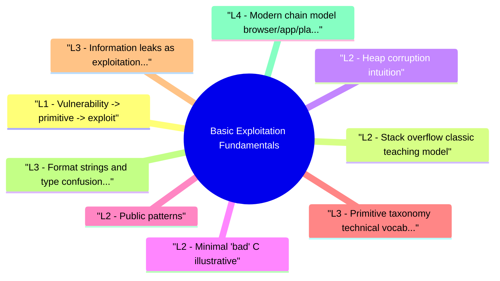

# Basic Exploitation Fundamentals revision map

Last mock I bounced around the Basic Exploitation Fundamentals folder. This file is the stop that. Drawn from Critical Clarification Basic Exploitation Fundamentals Misconceptions.md, Basic Exploitation Fundamentals - Comprehensive Guide.md, Basic Exploitation Fundamentals - Interview Questions & Answers.md, Basic Exploitation Fundamentals - Quick Reference.md, Basic Exploitation Fundamentals - VAPT Methodology.md. Skim the mermaid, then the outline.

## L1 - Vulnerability -> primitive -> exploit
- Vulnerability: mistake enabling undefined behavior or violation of policy.
- Primitive: bounded capability (arbitrary read N bytes, write what where).
- Exploit: composed primitives + knowledge of memory layout + mitigation bypass.

## L2 - Stack overflow (classic teaching model)
- Pre-mitigation model: overwrite saved return address -> jump to shellcode on executable stack (historical).
- With DEP (NX): stack not executable -> use ROP to call VirtualProtect/mprotect or return to existing code gadgets.

## L2 - Heap corruption (intuition)
- Use-after-free: object freed, pointer dangling, reallocated with attacker data.
- Double free: allocator metadata corruption.

## L2 - Minimal "bad" C (illustrative)
- Fix: strncpy/strlcpy patterns or memcpy with explicit length + validation; better: safe language for new code.

## L2 - Public patterns
- EternalBlue-class remote kernel bugs show wormable primitives-patch velocity matters.
- Browser chains combine multiple bugs-interviews may ask why single bug rarely wins today.

## L3 - Primitive taxonomy (technical vocabulary)
- Interviewers often evaluate whether you can classify capabilities precisely:
- Control-flow primitives: instruction pointer control, vtable/function pointer overwrite.
- Read primitives: arbitrary/relative read for pointer disclosure and secret extraction.
- Write primitives: constrained or arbitrary write (what/where control quality matters).
- Type primitives: type confusion enabling reinterpretation of object memory.
- Logic primitives: authorization/state bypass that enables privileged operations without memory corruption.

## L3 - Information leaks as exploitation enablers
- ASLR bypass: leaked module/heap/stack pointers restore address predictability.
- Canary bypass: leaked stack cookie values can neutralize stack protections.
- Heap grooming guidance: leak of allocator metadata helps stabilize target object placement.

## L3 - Format strings and type confusion (conceptual)
- Format string flaws: attacker-controlled format specifiers can create read/write side effects in unsafe contexts.
- Type confusion: runtime treats data as wrong type/class, opening memory safety violations without classic overflow patterns.

## L4 - Modern chain model (browser/app/platform)
- In hardened environments, practical impact usually requires chaining:
- Initial bug (renderer/app process compromise or logic foothold).
- Sandbox/containment escape or privilege pivot.
- High-value target action (credential theft, sensitive file access, lateral movement).
- Persistence or repeatability strategy.

## L4 - Reliability engineering and defender economics
- Exploitability in the wild depends on reliability constraints:
- Heap nondeterminism, race timing, and platform fragmentation reduce attacker success rate.
- Rapid patch rollout and kill-switch controls often outperform niche detection signatures.
- Telemetry-driven hardening (crash clustering + patch SLA + canary deployment) shrinks attacker window.

## Detection (defender view)
- Crash telemetry with exploit markers (repeated faults, weird PC).
- EMET/legacy vs modern ETW events for ROP-like detections (noisy).

## Mitigations (tier order)
- Remove bug class (safe languages, bounds checks).
- Compiler mitigations: stack canaries, FORTIFY, CFI variants.
- OS: ASLR, DEP, CFG, CET.
- Sandbox blast radius (browser, PDF viewers).

## Labs (authorized)
- CTF pwn intro challenges with provided binaries.
- PortSwigger is web-focused; pair with pwn college for memory.

## Toolchain
- gdb/pwndbg, checksec, objdump, ROPgadget (Linux); WinDbg (Windows).

## Interview clusters

## Authoritative references
- CWE-121 (Stack-based buffer overflow), CWE-416 (UAF).
- Intel CET / Microsoft CFG documentation.

## Cross-links
- Exploit Development · Exploit Development Learning Path · Shellcode Fundamentals and Detection · Crash Analysis

## Verification checklist
- [ ] Draw stack with buffer above/below return addr (platform-aware caveat).
- [ ] Explain why ASLR needs a leak for many exploits.
- [ ] Classify one bug into primitive(s) and map likely mitigation layers.
- [ ] Describe a modern multi-bug exploit chain at a conceptual level.

## Flags I check in 90 seconds

## Chain
- Bug -> primitive -> compose -> goal (exec / leak / bypass)

## Classics
- Stack overflow · UAF · type confusion (adjacent topic)

## Mitigations

## Tools
- gdb/pwndbg · checksec · WinDbg · ROPgadget (Linux)

## Cross-read
- Exploit Development · Shellcode Fundamentals · Windows Exploit Mitigations

## One-liner

## Misreads that still sneak in

## "Every crash is exploitable."
- Reality: Many are DoS only; triage proves control and reachability.

## "Stack smashing still means shellcode on stack."
- Reality: DEP breaks executable stack models for most modern OSes.

## "One bug = full compromise."
- Reality: Modern targets often need chains across components.

## "CTF exploits port directly to prod."
- Reality: Hardening, monitoring, and variants differ massively.

## "Heap is just like stack but slower."
- Reality: Different invariants; exploit techniques differ.

## "Mitigations are a substitute for fixes."
- Reality: Mitigations reduce probability; bugs still need patches.

## "Exploitation is only memory corruption."
- Reality: Logic, crypto, race, and deserialization bugs also enable impact.

## "Reading writeups is enough."
- Reality: Debugging discipline and tool fluency come from hands-on labs.

## Lab methodology

## Objective
- Create a repeatable assessment workflow for Basic Exploitation Fundamentals that produces reproducible evidence and actionable remediation guidance.

## Phase 1 - Scope and preparation
- Confirm in-scope assets, test windows, and prohibited actions.
- Identify critical user journeys and trust boundaries.
- Define severity rubric and evidence requirements before testing.

## Phase 2 - Recon and attack-surface mapping
- Enumerate relevant endpoints, flows, and data paths.
- Document where security checks are expected to happen.
- Mark high-value assets and high-impact paths.

## Phase 3 - Hypothesis-driven testing
- Start with low-risk probes and baseline behavior.
- Test failure hypotheses systematically (one variable at a time).
- Capture request/response artifacts for each finding candidate.

## Phase 4 - Validation and impact proof
- Reproduce findings with clean-state retests.
- Confirm exploitability and practical impact.
- Eliminate false positives; record confidence level.

## Phase 5 - Remediation and verification
- Provide immediate containment + structural fix recommendations.
- Define post-fix verification tests and telemetry checks.
- Re-test after remediation and close with evidence.

## Evidence template
- Asset / endpoint:
- Preconditions:
- Reproduction steps:
- Observed behavior:
- Security impact:
- Business impact:
- Recommended fix:
- Verification result:

## Interview drill
- In 3 minutes, explain how you would run this VAPT workflow for one production-like service and what evidence you need before escalating severity.

## Clusters from the Q&A file

- Q: What is a "primitive" in exploitation?
- Q: Why is heap exploitation "harder" in interviews?
- Q: Order these by era: ASLR, CET, stack canary.
- Q: Boss asks you to "weaponize" a finding for a rival.

## 60-second answer
- Q: What are exploitation fundamentals every AppSec engineer should know?

## Primitives

### Q: What is a "primitive" in exploitation?
- A: A repeatable capability derived from a bug-e.g., write what where once, arbitrary read 8 bytes-composed into full exploits.

### Q: Why is heap exploitation "harder" in interviews?
- A: Non-deterministic layout, allocator specifics, and more primitives needed than textbook stack examples.

## Mitigations

## Ethics

### Q: Boss asks you to "weaponize" a finding for a rival.
- A: Decline; legal and policy violation-provide patch guidance only.

## Mock ladder

## Cross-links I actually follow

- Stay inside this folder for the long guide. Jump only when a section names a sibling topic.
- Cookie Security, CSRF, XSS, JWT, OAuth, and TLS show up as neighbors on a lot of these maps.
