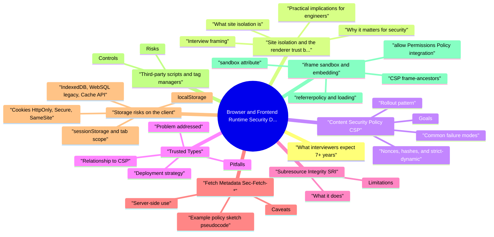

# Browser and Frontend Runtime Security Deep Dive revision map

I keep this Browser and Frontend Runtime Security Deep Dive map for the night before a screen, when five markdown files is too many clicks. Built from Critical Clarification Browser and Frontend Runtime Security Deep Dive Misconceptions.md, Browser and Frontend Runtime Security Deep Dive - Comprehensive Guide.md, Browser and Frontend Runtime Security Deep Dive - Interview Questions & Answers.md, Browser and Frontend Runtime Security Deep Dive - Quick Reference.md. Twenty minutes. Then I close the laptop.

## What interviewers expect (7+ years)

## Site isolation and the renderer trust boundary

### What site isolation is
- See the source section `What site isolation is` for the worked example.

### Why it matters for security
- Not XSS prevention: If attacker script executes in your origin (XSS), it already shares your origin's privileges-site isolation does not save you from token theft in that tab, fetch to your APIs, or DOM abuse.

### Practical implications for engineers
- Treat cross-origin iframes as separate trust boundaries at the OS/browser level, but still validate all postMessage traffic-process isolation does not authenticate messages.

### Interview framing
- Site isolation reduces blast radius for browser bugs and certain cross-site attacks; CSP + encoding + safe DOM reduce same-origin script injection risk. Use both narratives without conflating them.

### Related hardening (often grouped in interviews)
- Cross-Origin Opener Policy (COOP) - same-origin severs cross-origin window.opener references where applicable, reducing tab-nabbing and certain cross-window attacks after navigations.
- Cross-Origin Resource Policy (CORP) - same-site / same-origin on responses signals whether cross-origin embedding or consumption is intended-pairs with COEP and Fetch Metadata-driven server logic.

## Content Security Policy (CSP)

### Goals
- Restrict script execution to known sources and approved inline (via nonces or hashes).
- Limit exfiltration and gadget chains via connect-src, img-src, frame-src, base-uri, form-action, and object-src.
- Reduce plugin risk (object-src 'none' is a common baseline).

### Nonces, hashes, and strict-dynamic
- Hash-based script-src: Useful for small static inline snippets; brittle for anything that changes frequently.

### Common failure modes
- unsafe-inline "temporarily" becomes permanent and neutralizes CSP against XSS.
- Over-broad script-src hosts that host AngularJS-sandbox escapes, JSONP, or uploaded .js under user paths.
- Missing base-uri allows to retarget relative script URLs.
- Weak object-src / default-src leaves Flash-era or unexpected plugin vectors.

### Rollout pattern
- Content-Security-Policy-Report-Only with report-to / report-uri (legacy).
- Fix violations by removing inline, moving JSON out of application/json endpoints interpreted as JS, and shrinking third-party lists.
- Enforce on high-value routes first (sign-in, payments, admin).
- Track violation volume, unique endpoints, and regressions per release.

## Trusted Types

### Problem addressed
- See the source section `Problem addressed` for the worked example.

### Deployment strategy
- Enable report-only first: browsers report where string sinks would have violated policy.
- Create small, reviewed policies-not one giant "allow everything" policy.
- Prefer framework-native patterns (e.g., template systems that bind text safely) over ad hoc HTML assembly.

### Relationship to CSP
- See the source section `Relationship to CSP` for the worked example.

### Pitfalls
- Custom sanitizers with incomplete tag/attribute allowlists.
- Third-party libraries that require unsafe patterns-may need forks, wrappers, or vendor fixes.

## Subresource Integrity (SRI)

### What it does
- See the source section `What it does` for the worked example.

### Limitations
- Dynamic third-party scripts that change daily break integrity unless you re-pin on every release.
- JSONP and server-generated script cannot be integrity-pinned meaningfully if content varies per user.
- SRI does not help if you inline the attacker's script via XSS.

## Fetch Metadata (Sec-Fetch-*)
- Browsers send Fetch Metadata request headers on navigations and many subresource requests:
- Sec-Fetch-Site: same-origin, same-site, cross-site, none (user-initiated contexts).
- Sec-Fetch-Mode: navigate, cors, no-cors, websocket, etc.
- Sec-Fetch-Dest: document, iframe, script, image, ...
- Sec-Fetch-User: ?1 when associated with a user gesture (navigations).

### Server-side use
- Reject sensitive state-changing requests when Sec-Fetch-Site is cross-site and Sec-Fetch-Mode is cors unless you intend cross-site API use-this is a defense-in-depth layer next to CSRF tokens and SameSite cookies.
- Block "unexpected" embedding patterns by combining Fetch Metadata with Cross-Origin-Resource-Policy and frame-ancestors (CSP or X-Frame-Options).

### Caveats
- Not all clients send identical sets; bots and older user agents exist-treat as signal, not sole authorization.
- Same-site vs cross-site depends on schemeful same-site rules-subdomains and ports matter.

### Example policy sketch (pseudocode)
- For a JSON API that must only be called from same-site XHR/fetch and not from random cross-site pages:
- Allow state-changing POST when Sec-Fetch-Site is same-origin or same-site, or when a valid CSRF token is present.
- For Sec-Fetch-Mode: navigate and Sec-Fetch-Dest: document, apply different rules (HTML forms vs XHR).
- Log and alert on unexpected combinations (e.g., cross-site + cors + sensitive routes) for bot and attack triage.

## Storage risks on the client

### Cookies (HttpOnly, Secure, SameSite)
- HttpOnly: Not readable from JavaScript-strong against XSS exfiltration; still sent on requests-pair with CSRF controls.
- Secure: Sent only over HTTPS-baseline for session cookies.
- SameSite=Lax or Strict: Reduces cross-site cookie inclusion; None requires Secure and is common for embedded flows-document the trade-off.

### sessionStorage and tab scope
- Tab-scoped; cleared when the tab closes (implementation nuances exist). Still fully readable under XSS.

### localStorage
- Persists; convenient for non-secret preferences. Avoid high-value long-lived tokens if XSS is in threat model-any script in origin reads it.

### IndexedDB, WebSQL legacy, Cache API
- See the source section `IndexedDB, WebSQL legacy, Cache API` for the worked example.

### Partitioning and third-party context (brief)
- See the source section `Partitioning and third-party context (brief)` for the worked example.

### "Memory-only" tokens in SPAs
- Smaller theft window than localStorage-but still stolen under XSS while the tab is open. Combine with short TTL, refresh rotation, binding (device signals on server-not client secrets), and CSP.

## Third-party scripts and tag managers

### Risks
- Full DOM and network access within your origin-equivalent to deploying their engineers' credentials into your page.
- Supply-chain drift: vendor updates, compromised tags, geo-specific loading.
- Data exfiltration via fetch, sendBeacon, image pixels, and DOM scraping.

### Controls
- Inventory every script by owner, data class, and surface (marketing vs authenticated app).
- Segment: never load analytics on admin or PCI flows unless legally and contractually required.
- Prefer first-party proxies for analytics where policy allows.
- Contractual DPIAs, subprocessor lists, and incident notification.
- CSP allowlists as narrow as possible; monitor violation reports for new domains.

## iframe sandbox and embedding

### sandbox attribute
- The sandbox attribute on restricts capabilities unless allowlisted:
- Default: no scripts, no forms, no popups, same-origin treats the frame as unique opaque origin (cannot access parent).
- allow-scripts: enables JS-often paired with allow-same-origin only when necessary-that combination can escape some sandbox assumptions; treat as high risk.

### allow (Permissions Policy integration)
- Use allow="camera 'none'; microphone 'none'" style directives to disable powerful features inside embeds.

### referrerpolicy and loading
- Reduce data leakage via Referer on third-party embeds; lazy loading is performance-related but reduces accidental early third-party execution.

### CSP frame-ancestors
- Prefer CSP frame-ancestors 'none' or allowlists instead of relying solely on legacy X-Frame-Options-frame-ancestors is more expressive.

## postMessage and cross-origin communication

### The vulnerability pattern
- window.postMessage(data, targetOrigin) is easy to misuse:
- **targetOrigin: * leaks data to any** embedder or child listening.
- Missing origin checks on message events accepts messages from attackers' windows opened or navigated into relationships (window.opener, named windows, nested iframes).

### Safe patterns
- Always specify an explicit targetOrigin (never * for sensitive data).
- On receive: verify event.origin against an allowlist; verify event.source if you expect a particular window reference.
- Use versioned message schemas ({ type: 'PAYMENT_RESULT', version: 1, ... }) and ignore unknown types.

### Pair with CSP
- frame-ancestors controls who embeds you; postMessage policies control what you say once embedded.

## Workers: dedicated, shared, and service

### Dedicated workers
- Separate thread, same-origin as the creating document (subject to file/URL origin). No DOM-but can fetch with cookies depending on settings and importScripts. Compromise via XSS can still create workers and exfiltrate.

### Shared workers
- Shared across same-origin contexts-larger attack surface for state bugs; rarely needed in modern apps.

### Service workers
- Intercept network events; persist until upgraded. A malicious SW is a persistent insider in the origin.
- Protect registration endpoints; use CSP to block unexpected script; monitor navigator.serviceWorker.getRegistrations() in diagnostics; prefer short-lived caches for sensitive data.

### Security notes
- Workers do not magically sandbox third-party code you import. Third-party scripts running in the page can still fetch() credentials unless forbidden by SameSite, CORS, and cookie attributes.

### importScripts and credentials
- See the source section `importScripts and credentials` for the worked example.

### Message passing (worker.postMessage)
- Structured cloning applies-do not pass live DOM nodes. Treat messages like postMessage: validate shape and intent; never eval string payloads inside workers.

## Browser extensions risk

### Consumer extensions
- See the source section `Consumer extensions` for the worked example.

### Enterprise angle
- Managed browsers can force-allowlist extensions; block inline installation.
- Sensitive operations should rely on server-side step-up and device posture where available-not on "the browser is clean."

### Product security response
- Never assume client integrity; rate-limit and detect anomalous admin patterns.
- Document that CSP may be weakened by user extensions-support should know incognito with extensions disabled as a troubleshooting step, not a security control.

## How defenses fail (war stories)
- CSP bypass via JSONP endpoints, AngularJS templates, open redirects that reflect into script contexts, or base-uri gaps.
- Trusted Types stuck forever in report-only with thousands of noisy reports and no owner.
- SRI breaking production every deploy because third-party assets change silently.
- postMessage handlers that check substring origins or trust data without schema.
- Service worker poisoning via XSS once, persisting until users clear site data.

## Verification and metrics
- CSP reports: counts by directive, URI, route, release; SLO for new violations.
- Trusted Types reports trending to zero on critical surfaces before enforce.
- Third-party inventory reviewed quarterly; diff on script URLs per release.
- E2E smoke tests for login, checkout, and embedded partner flows with headers enabled.

## Operational reality
- Marketing stacks (CMS, tag managers) and app stacks (SPA shell) diverge-align on a single baseline document even if enforcement timing differs.
- Platform (CDN/edge) + frontend + security must co-own CSP; otherwise production hotfixes weaken policy.

## Interview clusters
- Fundamentals: SOP vs CSP; why site isolation ≠ XSS defense.
- Senior: CSP rollout for a large React app; safe postMessage; Fetch Metadata for CSRF defense-in-depth.
- Staff: Standardize frontend security across many teams; extension-aware threat modeling for admin consoles.

## Cross-links
- XSS, CSRF, CORS, Security Headers, Cookie Security, Software Supply Chain Security, Third-Party Integration Security, Security Observability.

## Cheat sheet bits

## Core defenses (layered)
- CSP - default-src, nonces or hashes, frame-ancestors, restrict script-src
- Cookie flags - HttpOnly, Secure, SameSite (pair with CSRF tokens / double submit where needed)
- Subresource Integrity - on third-party script/link when not self-hosted
- Fetch metadata / isolation - Cross-Origin-Opener-Policy, Cross-Origin-Resource-Policy where applicable

## Dangerous sinks (spot in code review)
- dangerouslySetInnerHTML · v-html · innerHTML assignment · document.write · URL handlers feeding javascript: / data: · unsanitized postMessage

## Token storage rule of thumb
- Prefer HttpOnly session or BFF pattern; avoid long-lived secrets in localStorage/sessionStorage (XSS = game over).

## Third-party script governance
- Inventory tags · contract SRI/CSP · sandbox payment/support widgets · kill switch for compromised vendor

## CORS quick check
- Never Access-Control-Allow-Origin: * with Allow-Credentials: true. Reflect specific origins; avoid wildcard subdomains without proof.

## Specs / references
- CSP - W3C CSP Level 3 · Cookies - RFC 6265bis (evolving) · Fetch metadata patterns - MDN + OWASP cheat sheets

## Cross-read
- XSS · CSRF · TLS · OAuth / JWT (token handling)

## One-liner

## Traps that dump interviews

## "React/Vue/Svelte prevents XSS."
- Reality: Unsafe sinks (dangerouslySetInnerHTML, v-html, URL handlers), third-party scripts, and DOM API misuse reintroduce XSS.

## "We can add CSP later."
- Reality: Retrofit CSP without nonces/hashes often breaks ads/analytics; early design (no inline handlers, bundle discipline) cheapens rollout.

## "HttpOnly cookies remove frontend risk."
- Reality: HttpOnly helps session theft via JS; CSRF, subresource integrity gaps, postMessage bugs, and open redirects remain.

## "Subresource Integrity is optional for first-party JS."
- Reality: CDN compromise and build tampering justify SRI or first-party hosting with integrity checks on critical paths.

## "localStorage is fine for tokens if we minify."
- Reality: Any secret readable by JS is stealable via XSS-prefer HttpOnly cookies with CSRF defenses or BFF patterns.

## "postMessage is safe with *."
- Reality: Wildcard origins enable cross-site data exfil; always validate event.origin and structure messages.

## "Third-party tags are marketing's problem."
- Reality: Supply chain XSS from tags is AppSec scope-inventory, CSP, sandbox iframes, contracts.

## "Browser extensions don't affect our threat model."
- Reality: Enterprise users with malicious or vulnerable extensions alter DOM and steal sessions-policy and DLP considerations apply.

## "CORS misconfig is only a small bug."
- Reality: Broken CORS with credentials can enable cross-origin data theft-treat as high impact when sensitive APIs are involved.

## "Feature policy / Permissions-Policy is redundant."
- Reality: Disabling geolocation, camera, payment, and sync-xhr reduces attack surface for XSS chains.

## Prompts I drill out loud

- Does site isolation stop XSS?
- How is CSP different from the Same-Origin Policy?
- Walk me through rolling out CSP on a large React SPA safely.
- What is Trusted Types, and when do you enforce it?
- What does strict-dynamic buy you in CSP?
- When would you use Subresource Integrity (SRI), and what are the limits?
- How would you use Fetch Metadata (Sec-Fetch-*) on the server?
- Compare HttpOnly cookies, memory tokens, and localStorage for session data.
- How do you govern third-party scripts and tag managers?
- What mistakes do teams make with iframe sandbox?
- How should postMessage be implemented securely?
- What is the security concern with service workers?
- Do workers "sandbox" untrusted code?
- Why would you set COOP / COEP / CORP, and what breaks?
- Name realistic CSP bypass patterns you watch for.
- How do browser extensions affect your threat model for a web app?
- What storage is exposed if there is an XSS bug?
- How would you standardize frontend runtime security across many teams?
- How do third-party cookie and storage changes affect your app security testing?
- Why is frame-ancestors preferred over only X-Frame-Options?
- Depth: Interview follow-ups

## Do workers "sandbox" untrusted code?

## Sibling folders

- Stay inside this folder for the long guide. Jump only when a section names a sibling topic.
- Cookie Security, CSRF, XSS, JWT, OAuth, and TLS show up as neighbors on a lot of these maps.
