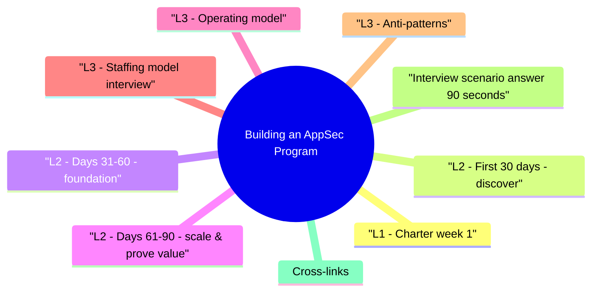

# Building an AppSec Program revision map

This is the Building an AppSec Program spine I actually use. Types, failures, fixes, traps. Sources: Critical Clarification Building an AppSec Program Misconceptions.md, Building an AppSec Program - Comprehensive Guide.md, Building an AppSec Program - Interview Questions & Answers.md, Building an AppSec Program - Quick Reference.md. I do not treat it as a second textbook.

## L1 - Charter (week 1)
- Mission: Reduce material risk to customer data and business continuity through embedded security in SDLC.
- Scope: Web/mobile APIs, cloud infra owned by product eng, third-party integrations.
- Critical vulns in prod trending down
- MTTR for validated High+
- % Tier-1 services with threat models
- Developer NPS for security consults

## L2 - First 30 days: discover
- Avoid: Mandating five new scanners before baseline inventory.

## L2 - Days 31-60: foundation
- Risk tiers for applications (Tier 1 = customer PII + internet-facing).
- Secure SDLC policy lightweight-link to Secure SDLC Walkthrough.
- Threat modeling office hours for Tier 1 features.
- CI baseline: SCA + secret scan + container scan on default branch.
- Champions program: 1 champion per 8-12 engineers-office hours, early access to policy drafts.
- Vulnerability intake single front door (Jira label, Slack channel with SLA).

## L2 - Days 61-90: scale & prove value
- Pen test or bug bounty pilot on highest-risk app.
- Release gate pilot on one Tier 1 team-not org-wide big bang.
- Executive readout: risk reduced, metrics, roadmap, asks (headcount, tooling budget).
- False positive tuning on SAST-see dedicated module.

## L3 - Operating model

## L3 - Staffing model (interview)
- Ratio heuristic: 1 AppSec per 50-150 devs varies by industry and automation-state assumptions.

## L3 - Anti-patterns
- Security team as bottleneck for every PR.
- Shame-based culture from pen test dumps.
- Metrics gaming (close tickets without fix).
- Buying tools without ownership for tuning.

## Interview scenario answer (90 seconds)

## Cross-links
- Secure SDLC Walkthrough · Risk Prioritization and Security Metrics · Agile Security Compliance · Story Library Template - Behavioral Interviews

## The one-pager, exploded

## 30 / 60 / 90

## Charter elements
- Mission · Scope · Stakeholders · Metrics · Escalation

## Operating cadence
- Design reviews · Consult SLAs · Champion sync · Monthly metrics

## Ratios (state assumptions)

## Cross-reads
- Secure SDLC Walkthrough · False Positive Management · Risk Prioritization

## What people get wrong

## "Buy SAST/DAST day one."
- Wrong. Inventory and quick wins first; tools without tuning owners become shelfware.

## "AppSec reviews every PR."
- Wrong. Automate broad coverage; human review on high-risk paths and tiers.

## "Compliance is the program."
- Wrong. Compliance is one input; exploitability and business risk drive priorities.

## "Headcount before process."
- Wrong. Charter, intake, metrics make the case for headcount with evidence.

## "Pen test once = program."
- Wrong. Program is continuous SDLC integration, not annual audit.

## "Developers are the enemy."
- Wrong. Partnership model wins; punitive gates fail at scale.

## Questions that showed up in mocks

- How do you measure program success?
- Security champions-worth it?
- Build vs buy for tooling?

## 60-second answer
- Q: You're the first AppSec hire-first 90 days?

### Security champions-worth it?
- A: Yes-1 per squad as force multiplier for triage, standards feedback, and local coaching; AppSec retains policy and deep reviews.

## STAR prompt

## If I only open two more topics

- Stay inside this folder for the long guide. Jump only when a section names a sibling topic.
- Cookie Security, CSRF, XSS, JWT, OAuth, and TLS show up as neighbors on a lot of these maps.
