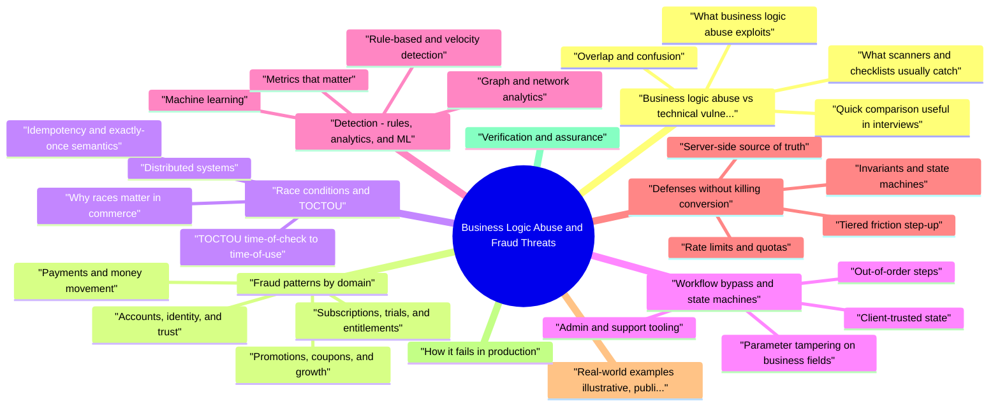

# Business Logic Abuse and Fraud Threats revision map

Last mock I bounced around the Business Logic Abuse and Fraud Threats folder. This file is the stop that. Drawn from Critical Clarification Business Logic Abuse and Fraud Threats Misconceptions.md, Business Logic Abuse and Fraud Threats - Comprehensive Guide.md, Business Logic Abuse and Fraud Threats - Interview Questions & Answers.md, Business Logic Abuse and Fraud Threats - Quick Reference.md. Skim the mermaid, then the outline.

## Business logic abuse vs technical vulnerabilities

### What scanners and checklists usually catch
- See the source section `What scanners and checklists usually catch` for the worked example.

### What business logic abuse exploits
- Using two devices to redeem the same one-time benefit because redemption is not atomic with inventory.
- Walking a refund and fulfillment state machine in an order that real customers never choose but the API permits.
- Creating thousands of accounts to farm referral credits where each account is "real enough" to pass weak checks.

### Overlap and confusion
- See the source section `Overlap and confusion` for the worked example.

### Quick comparison (useful in interviews)
- See the source section `Quick comparison (useful in interviews)` for the worked example.

## Fraud patterns by domain

### Payments and money movement
- Card testing: Stolen PANs are run against your payment or add-card flow at high velocity; small authorizations validate which cards work. Signals: spike in declines, new accounts with many cards, BIN and geo mismatch.

### Promotions, coupons, and growth
- Stacking and sequencing: Combining exclusive offers because each service applies discounts independently. Controls: single promotion engine with precedence rules, server-side basket recomputation.
- Code enumeration and resale: Weak entropy on codes; rate limits only per IP while attackers rotate residential proxies. Controls: per-account attempt budgets, delay after failures, monitoring of redemption velocity.

### Accounts, identity, and trust
- Synthetic and duplicate accounts: Same person, many accounts to bypass per-user limits. Controls: instrument uniqueness (card hash, bank account), behavioral similarity, appeals for false positives.
- Chargeback and friendly fraud: Customer receives goods then disputes; overlaps with policy and support more than pure security, but risk scoring and evidence capture are shared.

### Subscriptions, trials, and entitlements
- Seat and license abuse: Shared credentials for SaaS; API keys embedded in public apps. Controls: tenant-scoped keys, rotatable secrets, usage baselines, anomaly detection on impossible travel or parallel sessions.

### Support, refunds, and policy edges
- Social engineering of support: Attacker convinces agent to bypass verification. Controls: guided workflows in CRM, MFA for agents on override actions, session recording of high-risk tools.

## Race conditions and TOCTOU

### Why races matter in commerce
- See the source section `Why races matter in commerce` for the worked example.

### TOCTOU (time-of-check to time-of-use)
- Pattern: Check a condition (balance, stock, eligibility), then later perform the action without guaranteeing nothing changed in between.
- Database transactions with correct isolation (SERIALIZABLE or explicit locking) for the check+act pair.
- Conditional updates: UPDATE inventory SET qty = qty - 1 WHERE id = ? AND qty > 0 and verify rows affected.
- Serializable workflows via state machines with legal transitions only.
- Pessimistic locks or queues for hot resources (limited SKU drops).

### Idempotency and exactly-once semantics
- See the source section `Idempotency and exactly-once semantics` for the worked example.

### Distributed systems
- Under retries and split brains, two tabs, or mobile + web, assume at-least-once delivery. Interview point: "We fixed the race in the app" is insufficient if APIs remain unsafe under concurrency.

## Workflow bypass and state machines

### Client-trusted state
- If the UI hides the "Cancel" button but the API still accepts POST /orders/{id}/cancel, attackers skip the UI. All transitions must be enforced server-side with role, state, and time rules.

### Out-of-order steps
- See the source section `Out-of-order steps` for the worked example.

### Parameter tampering on business fields
- Users set price=0.01 or discountPercent=100 because fields are accepted from the client. Mitigation: server recomputes prices from catalog and entitlements; client sends selections, not economics.

### Admin and support tooling
- See the source section `Admin and support tooling` for the worked example.

## Detection: rules, analytics, and ML

### Rule-based and velocity detection
- Velocity features: events per account, device, IP, card fingerprint, ASN, and global velocity (same promo code across accounts). Rules encode known scams (e.g., same shipping address, dozens of new accounts).
- Near-miss signals: Many failed redemptions then success; many login failures then password reset then payout change.

### Graph and network analytics
- Link accounts sharing devices, bank accounts, shipping addresses, referral chains, or mule patterns. Graph methods help find rings that evade per-account limits.

### Machine learning
- See the source section `Machine learning` for the worked example.

### Metrics that matter
- Precision/recall for rules; time-to-detect new patterns; loss prevented vs revenue blocked; review queue depth and SLA. Security and fraud teams should share definitions of incidents and false positives.

## Defenses (without killing conversion)

### Server-side source of truth
- Prices, inventory, eligibility, and limits live on the server. The client is a view.

### Invariants and state machines
- Document legal states and transitions for orders, subscriptions, payouts, and disputes. Tests should include abuse sequences and concurrent calls.

### Tiered friction (step-up)
- Low risk: smooth path. High risk (new device, large amount, changed bank): MFA, delay, manual review. Tune using labeled outcomes-not security intuition alone.

### Rate limits and quotas
- Per user, per IP, per key, and global budgets on expensive operations (signup, send SMS, redeem, export). Pair with CAPTCHA or proof-of-work only when needed to avoid broad annoyance.

### Kill switches and configuration
- Ability to disable a promo, tighten a rule, or require review without redeploying the whole app. Feature flags and remote config are operational controls.

### Cross-functional governance
- See the source section `Cross-functional governance` for the worked example.

## Real-world examples (illustrative, public patterns)
- Marketplace collusion: Buyer and seller cooperate to wash money or extract platform subsidies through sham orders. Detection leans on graph analytics and velocity of circular flows.

## How it fails in production
- Rules without telemetry: Discover losses via chargebacks or finance weeks later.
- Friction everywhere: Product disables controls; security loses trust.
- Siloed fraud and engineering: Models score events the application never emits.
- "Fixed" races: Still fails under load due to wrong isolation or cache staleness.

## Verification and assurance
- Abuse-focused test cases in CI: concurrent scripts for redemption, checkout, and transfers.
- Red-team scenarios framed as profit, not only data theft.
- Tabletop exercises with payments and support on rollback and customer comms.

## Instrumentation and data contracts
- Sampling pitfalls: Heavy sampling on high-volume low-value events can hide rare high-loss paths (for example payout changes). Prefer 100% logging on money-moving transitions even if browse events are sampled.

## Incident response (fraud-flavored)
- When abuse spikes, response parallels security IR but adds finance and customer dimensions:
- Contain: disable promo, tighten rule, pause instant payouts, route risky actions to manual review.
- Measure: estimate exposure (orders, accounts, dollars) from immutable logs and ledger balances.
- Eradicate: ship invariant fixes (atomicity, idempotency), not only blocklists.
- Recover: make-good policy for false positives; brief support with talk tracks.
- Learn: add regression tests and dashboards; update the threat model for the flow.

## Regulatory and ethics (practical framing)
- Accessibility: Aggressive step-up can exclude users without smartphones. Design fallbacks (backup codes, human verification) where regulation or organizational values require it.

## Interview clusters
- Fundamental: "How is this different from SQL injection?"
- Mid-level: "Where do you put idempotency keys in a checkout API?"
- Senior: "Design promo + payout abuse controls for a global marketplace."
- Staff: "How do you run shadow-mode fraud models without adding PII to the wrong logs?"

## Cross-links
- Rate Limiting and Abuse Prevention, Security Observability, OAuth/JWT/session hardening, IDOR, Third-Party Integration Security, Product Security Assessment Design (this repo).

## Flags I check in 90 seconds

## Mental model
- Valid requests, malicious intent - not only malformed input
- Invariants missing: one-time use, cooldowns, idempotency, state machine gaps
- Distributed attacks - single-request rules rarely enough

## OWASP framing (high level)
- Broken access control / insecure design often underpin logic flaws
- Software/data integrity failures matter for promo and update channels (2021 Top 10 categories) - see OWASP Top Ten for current structure

## Detection signals
- Journey velocity (signup -> cashout)
- Velocity per IP / device / account / payment instrument
- Graph clusters (shared devices, mule accounts)
- Near-miss -> success patterns
- Peer / segment anomalies

## Controls (design)
- Server-side truth; never trust client-only checks
- Idempotency keys, rate limits, cooldowns
- Monotonic state (e.g., non-decreasing balances where applicable)
- Step-up / delay for high-risk jurisdictions or amounts
- Kill-switch + playbooks

## Metrics
- Estimated loss · false positive rate · time-to-detect new pattern · MTTR for rule fixes · appeal volume

## One-liner
- Fraud is product logic: model the business invariants, then instrument and enforce them server-side.

## Misreads that still sneak in

## "No OWASP Top 10 finding means no fraud risk."
- Reality: Business logic abuse (coupon stacking, negative quantities, race refunds, partner API misuse) often passes scanners; it needs threat modeling and abuse cases.

## "Fraud is only the fraud team's problem."
- Reality: Product and AppSec own secure workflow design, rate limits, idempotency, and instrumentation before rules engines see losses.

## "CAPTCHA stops scripted abuse."
- Reality: Farms, solver APIs, and human click workflows adapt; layer device signals, velocity checks, and post-auth authorization.

## "Strong auth eliminates account abuse."
- Reality: ATO (account takeover), session theft, and insider misuse still execute legitimate APIs maliciously.

## "We'll fix abuse after launch if it spikes."
- Reality: Retrofitting idempotency keys, ledger integrity, and state machines is expensive; design invariants early.

## "Pen tests always find logic bugs."
- Reality: Time-boxed tests miss deep domain rules; pair with code review, property-based tests, and purple scenarios.

## "Refunds and credits are low risk."
- Reality: Refund races, duplicate claims, and support tool bypasses drive real P0 losses.

## "B2B APIs are safe because clients are vetted."
- Reality: Compromised partners, over-scoped keys, and missing quotas cause large abuse events.

## "Machine learning fraud scores replace product design."
- Reality: Models lag novel abuse; invariants (balances never negative, one promo per household) anchor trust.

## Misread: legal status does not decide abuse
- The quote people use is "if it is not illegal, it is not abuse."
- Reality: ToS violations and gray hat automation still harm unit economics and user trust. Define abuse explicitly.

## Clusters from the Q&A file

- Fundamentals and framing
- How do you distinguish business logic abuse from a "normal" security vulnerability?
- Why do WAFs and SAST often miss business logic abuse?
- What is the difference between fraud and abuse in how teams respond?
- Threat modeling and design
- Walk through how you threat-model a promotion redemption API.
- How do you prevent workflow bypass when the UI is a multi-step wizard?
- What invariants would you enforce on a marketplace with buyer, seller, and platform fees?
- Concurrency, races, and payments
- Explain TOCTOU in a checkout flow and how you fix it.
- Where do idempotency keys belong for payment-like operations?
- How do cryptocurrency or wallet withdrawals change your logic-abuse posture?
- Detection: rules, graphs, and ML
- What signals would you use to detect referral or signup bonus farming?
- How do you roll out a new fraud model without harming good users?
- What is a "near-miss" signal in abuse detection?
- Prevention, operations, and collaboration
- How do you prioritize fixes among many abuse reports?
- Describe risk-tiered friction in one concrete user journey.
- How do you partner with Product and Data Science on abuse?
- Depth and curveballs
- Isn't this just an access control (IDOR) problem?
- How does OWASP relate-where does business logic show up?
- Give three real-world pattern examples you would cite in an interview (no vendor-specific claims required).

### How do you distinguish business logic abuse from a "normal" security vulnerability?
- See the source section `How do you distinguish business logic abuse from a "normal" security vulnerability?` for the worked example.

### What is a "near-miss" signal in abuse detection?
- See the source section `What is a "near-miss" signal in abuse detection?` for the worked example.

### Isn't this just an access control (IDOR) problem?
- See the source section `Isn't this just an access control (IDOR) problem?` for the worked example.

### How does OWASP relate-where does business logic show up?
- See the source section `How does OWASP relate-where does business logic show up?` for the worked example.

## Quick follow-up anchors
- WAF stops many generic attacks; domain rules stop valid-call abuse.
- Concurrency bugs need proof under load, not single-threaded manual tests.
- Fraud metrics (FP rate, review SLA) are product metrics-tune with labels.
- Cross-read: Rate Limiting and Abuse Prevention, Security Observability, IDOR, Product Security scenarios in this repo.

## Cross-links I actually follow

- Stay inside this folder for the long guide. Jump only when a section names a sibling topic.
- Cookie Security, CSRF, XSS, JWT, OAuth, and TLS show up as neighbors on a lot of these maps.
