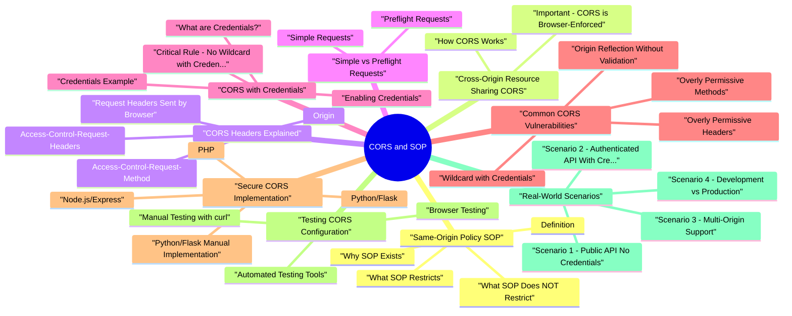

# CORS and SOP revision map

I keep this CORS and SOP map for the night before a screen, when five markdown files is too many clicks. Built from Critical Clarification CORS vs SOP.md, CORS and Same-Origin Policy.md, CORS and Same-Origin Policy Interview Questions &.md, CORS and Same-Origin Policy - Quick Reference Guid.md, CORS and SOP - VAPT Methodology.md. Twenty minutes. Then I close the laptop.

### What is an Origin?
- An origin is defined by three components:
- Scheme (Protocol): http:// or https://
- Host (Domain): example.com
- Port: 80 (HTTP) or 443 (HTTPS) - default ports are implicit

### Why Do We Need SOP and CORS?
- Modern web applications need to access resources from different origins
- APIs are often hosted on different domains
- Third-party services need to integrate
- But we need security to prevent unauthorized access
- SOP: Default security mechanism (restricts)
- CORS: Controlled relaxation (allows specific origins)

## Same-Origin Policy (SOP)

### Definition
- The Same-Origin Policy is a browser security mechanism that restricts how documents or scripts loaded from one origin can interact with resources from another origin.
- CORS is a mechanism that allows web servers to specify which origins are permitted to access their resources, thereby relaxing the Same-Origin Policy in a controlled manner.

### What SOP Restricts
- See the source section `What SOP Restricts` for the worked example.

### What SOP Does NOT Restrict
- See the source section `What SOP Does NOT Restrict` for the worked example.

### Why SOP Exists
- Prevents XSS attacks from accessing sensitive data
- Prevents cookie theft from other origins
- Prevents unauthorized data access
- Protects user privacy

### SOP Exceptions
- Server can allow specific origins via CORS headers
- Controlled relaxation of SOP
- Older technique using tags
- Limited to GET requests
- Security risks - not recommended
- Secure cross-origin communication
- Requires explicit message passing
- Server-side proxy to bypass CORS

## Cross-Origin Resource Sharing (CORS)

### How CORS Works
- Browser sends request with Origin header:
- Server responds with CORS headers:
- Browser checks CORS headers:
- If Origin is allowed -> Request proceeds
- If Origin is not allowed -> Request blocked

### Important: CORS is Browser-Enforced
- CORS is enforced by the browser, not the server
- Direct requests (curl, Postman) bypass CORS
- CORS only affects browser-based requests

## CORS Headers Explained

### Request Headers (Sent by Browser)
- See the source section `Request Headers (Sent by Browser)` for the worked example.

### Origin
- Automatically set by browser
- Cannot be modified by JavaScript
- Indicates the origin of the requesting page

### Access-Control-Request-Method
- Used in preflight requests
- Indicates the HTTP method of the actual request

### Access-Control-Request-Headers
- Used in preflight requests
- Lists custom headers that will be sent

### Response Headers (Sent by Server)
- See the source section `Response Headers (Sent by Server)` for the worked example.

### Access-Control-Allow-Origin
- Most important CORS header
- Specifies which origin(s) can access the resource
- Can be a specific origin or (wildcard)
- Cannot use multiple origins directly
- Must check Origin header and set dynamically
- Wildcard () cannot be used with credentials

### Access-Control-Allow-Methods
- Specifies which HTTP methods are allowed
- Used in preflight responses
- Comma-separated list

### Access-Control-Allow-Headers
- Specifies which request headers are allowed
- Used in preflight responses
- Comma-separated list

### Access-Control-Allow-Credentials
- Indicates whether credentials (cookies, auth headers) can be sent
- Must be true or omitted (defaults to false)
- Cannot use wildcard () with credentials

### Access-Control-Expose-Headers
- Specifies which response headers can be accessed by JavaScript
- By default, only simple headers are exposed
- Comma-separated list

### Access-Control-Max-Age
- Specifies how long preflight results can be cached (in seconds)
- Reduces number of preflight requests
- Default is 0 (no caching)

## Simple vs Preflight Requests

### Simple Requests
- Method: GET, POST, or HEAD
- Headers: Only simple headers allowed:
- Accept-Language
- Content-Language
- Content-Type (with restrictions)
- Content-Type restrictions:
- application/x-www-form-urlencoded
- multipart/form-data

### Preflight Requests
- Custom headers (e.g., X-Custom-Header)
- Non-simple methods (PUT, DELETE, PATCH)
- Content-Type other than simple types (e.g., application/json)
- Requests with credentials (if server requires preflight)
- Preflight requests are automatic (browser handles them)
- You don't need to manually send OPTIONS requests
- Preflight is a browser optimization to avoid sending unsafe requests

## CORS with Credentials

### What are Credentials?
- HTTP Authentication
- Client certificates

### Enabling Credentials
- See the source section `Enabling Credentials` for the worked example.

### Critical Rule: No Wildcard with Credentials
- Wildcard with credentials is a security risk
- Browsers enforce this rule
- Must specify exact origin when using credentials

### Credentials Example
- See the source section `Credentials Example` for the worked example.

## Common CORS Vulnerabilities

### Wildcard with Credentials
- Browsers should reject this (spec violation)
- But if misconfigured, any origin can access with credentials
- Sensitive data exposure

### Origin Reflection Without Validation
- See the source section `Origin Reflection Without Validation` for the worked example.

### Overly Permissive Methods
- Allows unnecessary HTTP methods
- Increases attack surface

### Overly Permissive Headers
- Allows any custom headers
- May bypass security controls

### Missing Preflight Validation
- Allows any origin to make any request
- Bypasses security controls

### Subdomain Wildcard Abuse
- See the source section `Subdomain Wildcard Abuse` for the worked example.

## Secure CORS Implementation

### Node.js/Express
- See the source section `Node.js/Express` for the worked example.

### Python/Flask
- See the source section `Python/Flask` for the worked example.

### Python/Flask (Manual Implementation)
- See the source section `Python/Flask (Manual Implementation)` for the worked example.

### PHP
- See the source section `PHP` for the worked example.

### Java/Spring Boot
- See the source section `Java/Spring Boot` for the worked example.

### C#/ASP.NET Core
- See the source section `C#/ASP.NET Core` for the worked example.

### Nginx Configuration
- See the source section `Nginx Configuration` for the worked example.

## Testing CORS Configuration

### Manual Testing with curl
- See the source section `Manual Testing with curl` for the worked example.

### Browser Testing
- Open Network tab
- Make request
- Check request headers (Origin)
- Check response headers (CORS headers)
- Look for CORS errors in console

### Automated Testing Tools
- Configure proxy
- Intercept request
- Modify Origin header
- Check response headers
- Automated CORS scanning
- Identifies misconfigurations

## Real-World Scenarios

### Scenario 1: Public API (No Credentials)
- Public API accessible from any origin
- No authentication required
- Read-only data

### Scenario 2: Authenticated API (With Credentials)
- API requires authentication
- Cookies or tokens sent with requests
- Specific origins only

### Scenario 3: Multi-Origin Support
- Support multiple trusted origins
- Dynamic origin validation
- Credentials enabled

### Scenario 4: Development vs Production
- Different CORS settings for dev/prod
- Local development support
- Production restrictions

### Scenario 5: Third-Party Widget Integration
- Widget embedded on third-party sites
- Needs to communicate with your API
- Secure communication

## Advanced CORS/SOP Edge Cases

### Cache poisoning via missing Vary: Origin
- If responses are cached but Vary: Origin is missing, one origin's CORS response can be reused for another origin.
- Add Vary: Origin when Access-Control-Allow-Origin is dynamic.
- Review CDN/proxy cache key configuration for origin-aware behavior.
- Avoid caching credentialed cross-origin responses when unnecessary.

### Private Network Access (PNA) implications
- Browsers are tightening controls for requests from public origins to private network targets. Misconfigured CORS at gateway layers can unintentionally expose internal APIs through browser-assisted pivots.
- Explicitly deny browser-originated cross-origin access to internal admin/private network routes.
- Separate public and private API hostnames and policy stacks.
- Monitor preflight failures/successes on sensitive internal paths.

### postMessage trust boundaries
- postMessage is often used as a workaround for cross-origin communication, but it has its own origin validation risks:
- Accepting messages from * or from loose suffix checks.
- Missing schema validation on message payloads.
- Trusting event.source without strict event.origin checks.
- Strict allowlist for event.origin.
- Versioned message schema validation.
- Minimal capability messages (avoid sending raw auth/session secrets).

### Key Takeaways
- SOP restricts, CORS allows
- SOP is the default security mechanism
- CORS is the controlled relaxation
- CORS is browser-enforced
- Direct requests bypass CORS
- Only affects browser requests
- Always validate Origin header
- Don't blindly reflect Origin

### Best Practices
- Use specific origins (whitelist)
- Validate Origin header server-side
- Limit allowed methods and headers
- Use credentials only when necessary
- Test CORS configuration thoroughly
- Use wildcard with credentials
- Blindly reflect Origin header
- Allow unnecessary methods/headers

### Remember
- SOP = Browser security (restricts)
- CORS = Controlled relaxation (allows)
- CORS headers = Server tells browser what to allow
- Browser = Enforces CORS based on server headers
- Direct requests = Bypass CORS entirely

## Next Steps
- Review Interview Questions & Answers for this topic for practice
- Check Quick Reference for quick lookup
- Test CORS configuration in your applications

## Cheat sheet bits

## ️ Critical Clarifications
- CORS is browser-enforced, not server-protected
- Direct requests (curl, Postman) bypass CORS
- CORS only affects browser requests
- CORS allows cross-origin requests
- CSRF attacks work by tricking browser
- Use SameSite or CSRF tokens for CSRF protection
- SOP: Default security (restricts)
- CORS: Controlled relaxation (allows)

## Origin Definition

## CORS Headers

### Request Headers (Browser Sends)
- See the source section `Request Headers (Browser Sends)` for the worked example.

### Response Headers (Server Sends)
- See the source section `Response Headers (Server Sends)` for the worked example.

## Simple vs Preflight Requests

### Simple Request Criteria
- Method: GET, POST, or HEAD
- Headers: Only simple headers
- Content-Type: application/x-www-form-urlencoded, multipart/form-data, or text/plain

### Preflight Triggered By
- Custom headers
- Non-simple methods (PUT, DELETE, PATCH)
- Non-simple Content-Type (e.g., application/json)
- Credentials (in some cases)

## CORS Configuration

### Secure Configuration
- See the source section `Secure Configuration` for the worked example.

### Vulnerable Configuration
- See the source section `Vulnerable Configuration` for the worked example.

## Common Vulnerabilities

## Implementation Snippets

### Node.js/Express
- See the source section `Node.js/Express` for the worked example.

### Python/Flask
- See the source section `Python/Flask` for the worked example.

## Testing CORS

### curl Test
- See the source section `curl Test` for the worked example.

### Browser Test
- See the source section `Browser Test` for the worked example.

## Security Checklist
- [ ] Use specific origins (whitelist)
- [ ] Validate Origin header
- [ ] Never use wildcard with credentials
- [ ] Limit allowed methods
- [ ] Limit allowed headers
- [ ] Handle preflight properly
- [ ] Test CORS configuration
- [ ] Use environment variables

## Common Mistakes

### Wrong: Wildcard with Credentials
- See the source section `Wrong: Wildcard with Credentials` for the worked example.

### Correct: Specific Origin
- See the source section `Correct: Specific Origin` for the worked example.

### Wrong: Blind Origin Reflection
- See the source section `Wrong: Blind Origin Reflection` for the worked example.

### Correct: Validate Origin
- See the source section `Correct: Validate Origin` for the worked example.

## Quick Decision Tree

## SOP vs CORS

## Common Interview Questions
- What is SOP?
- Browser security mechanism that restricts cross-origin access
- What is CORS?
- Mechanism that allows servers to specify which origins can access resources
- Does CORS protect your server?
- No, CORS is browser-enforced. Direct requests bypass CORS.
- Can you use wildcard with credentials?
- No, browsers will reject Access-Control-Allow-Origin: * with credentials.

## Best Practices
- Use specific origins (whitelist)
- Validate Origin header
- Limit methods and headers
- Handle preflight properly
- Test CORS configuration
- Use environment variables
- Use wildcard with credentials
- Blindly reflect Origin

## Remember
- SOP = Browser security (restricts)
- CORS = Controlled relaxation (allows)
- CORS headers = Server tells browser what to allow
- Browser = Enforces CORS based on server headers
- Direct requests = Bypass CORS entirely

## Summary Table
- Know SOP and CORS differences
- Understand origin definition
- Know CORS headers
- Understand simple vs preflight
- Know common vulnerabilities
- Understand security best practices

## Traps that dump interviews

## ️ Common Misconceptions

### "CORS is a security feature that protects my server"
- Reality: CORS is a relaxation of the Same-Origin Policy, not a security feature that protects your server. It allows controlled cross-origin access that would otherwise be blocked.
- SOP restricts cross-origin access (security)
- CORS allows cross-origin access (controlled relaxation)
- CORS is configured on the server to tell the browser what to allow
- CORS does NOT prevent direct server access (curl, Postman, etc.)

### "CORS protects against CSRF attacks"
- Reality: CORS does NOT protect against CSRF attacks. In fact, misconfigured CORS can make CSRF attacks easier.
- CORS only affects browser-enforced restrictions
- CSRF attacks work by tricking the browser into making requests
- If CORS allows the origin, the browser will send the request
- CORS headers are sent by the server, not validated by the server for CSRF protection
- CSRF tokens
- SameSite cookie attribute
- Custom headers (e.g., X-Requested-With)

### Misconception 3: "Access-Control-Allow-Origin: * is safe for public APIs"
- Reality: Using wildcard (*) with credentials is dangerous and violates the CORS specification.
- Browsers will reject this combination (spec violation)
- But if misconfigured, it can expose sensitive data
- Even without credentials, wildcard allows any origin to access resources
- Never use with credentials
- Use specific origins even for public APIs
- Consider using Access-Control-Allow-Origin: * only for truly public, non-sensitive resources

## Understanding the Relationship: SOP vs CORS

### Same-Origin Policy (SOP)
- A browser security mechanism that restricts how documents/scripts from one origin can interact with resources from another origin
- Enforced by the browser, not the server
- Default behavior: Block cross-origin requests
- Prevents malicious websites from accessing your data
- Prevents XSS attacks from stealing data from other origins
- Protects user's cookies and sensitive information

### Cross-Origin Resource Sharing (CORS)
- A mechanism that allows servers to specify which origins can access their resources
- Relaxes SOP in a controlled way
- Configured on the server, enforced by the browser
- Controlled cross-origin data sharing
- API access from web applications
- Third-party integrations

## Visual Comparison

### Without CORS (SOP Blocks)
- See the source section `Without CORS (SOP Blocks)` for the worked example.

### With CORS (SOP Relaxed)
- See the source section `With CORS (SOP Relaxed)` for the worked example.

## Key Differences

## Important Clarifications

### CORS Does NOT Protect Your Server
- Common mistake: "I've configured CORS, so my API is secure."
- CORS is enforced by the browser, not the server
- Direct requests (curl, Postman, scripts) bypass CORS
- CORS only affects browser-based requests
- You still need authentication, authorization, and other security measures

### CORS Headers Are Response Headers
- Common mistake: "I'll set CORS headers in my request."
- CORS headers are response headers sent by the server
- The browser reads these headers to decide whether to allow the request
- You cannot set CORS headers from client-side JavaScript

### Preflight Requests Are Automatic
- Common mistake: "I need to manually send OPTIONS requests."
- Browsers automatically send preflight requests when needed
- You don't need to handle OPTIONS requests manually in your JavaScript
- The browser handles the entire preflight flow
- Custom headers (e.g., X-Custom-Header)
- Non-simple methods (PUT, DELETE, PATCH)
- Content-Type other than simple types
- Requests with credentials

### Origin Header Cannot Be Forged by JavaScript
- Common mistake: "Attackers can fake the Origin header."
- The Origin header is set by the browser, not JavaScript
- JavaScript cannot modify the Origin header
- However, server must validate the Origin header
- If server blindly reflects Origin, it's vulnerable

### Key Takeaways
- SOP restricts, CORS allows
- SOP is the security mechanism
- CORS is the controlled relaxation
- CORS is browser-enforced, not server-protected
- Direct requests bypass CORS
- CORS only affects browser requests
- CORS does NOT protect against CSRF
- Use CSRF tokens and SameSite cookies

### Remember
- SOP = Browser security mechanism (restricts)
- CORS = Controlled relaxation of SOP (allows)
- CORS headers = Server tells browser what to allow
- Browser = Enforces CORS based on server headers
- Direct requests = Bypass CORS entirely

## Common Interview Question
- Q: "Does CORS protect my server from attacks?"

## How I would test it

## Scope & Origin Model
- Understand origin relationships:
- Primary application origin(s) (scheme, host, port).
- Other first‑party origins (subdomains, separate apps, APIs).
- Third‑party or partner domains integrated via browser.
- Identify cross‑origin scenarios:
- Frontend calling backend APIs across origins.
- Embedded content (iframes, images, scripts).
- Cross‑site interactions (SSO, redirects, callbacks).

## Mapping CORS‑Relevant Endpoints
- Identify endpoints returning CORS headers:
- Access-Control-Allow-Origin
- Access-Control-Allow-Credentials
- Access-Control-Allow-Methods
- Access-Control-Allow-Headers
- Access-Control-Expose-Headers
- Distinguish:
- Public vs authenticated APIs.

## Assessment Strategy (Configuration Review)
- Allowed origins:
- Specific origin list vs wildcard (*).
- Behavior when different Origin headers are sent from the browser.
- Credentials:
- Whether Access-Control-Allow-Credentials: true is set.
- Interactions with Access-Control-Allow-Origin (no wildcard with credentials).
- Methods and headers:
- Methods allowed beyond safe defaults.

## Dynamic Testing - What to Observe
- Vary Origin headers (via tools/browsers able to simulate this):
- Same‑origin vs known first‑party vs clearly untrusted origins.
- Observe how CORS headers differ across these cases.
- Check browser‑side behavior:
- For allowed origins:
- Whether the browser exposes response data to calling scripts.
- For disallowed origins:
- Whether responses are still sent (they often are) but not accessible to scripts.

## High‑Risk Scenarios
- User‑specific data APIs with permissive CORS:
- Endpoints returning profile details, financial data, health data, etc.
- Credentialed CORS (Allow-Credentials: true):
- Combined with non‑specific or dynamically reflected Allow-Origin.
- Wildcard configurations in complex deployments:
- APIs shared across products, where some data should not be accessible cross‑origin.
- Dynamic origin reflection:
- Servers that reflect the Origin header into Access-Control-Allow-Origin without solid validation.

## Tooling & Aids
- Proxy tooling:
- Inspect CORS headers in responses.
- Replay requests with modified Origin values (within agreed scope).
- Browser dev tools:
- Observe actual CORS behavior and console logs in the browser.
- Configuration review:
- Server/framework CORS middleware configuration.
- Infrastructure or gateway‑level CORS settings (API gateways, load balancers).

## Verifying Misconfigurations Safely
- Conceptual proof with harmless data:
- Use test accounts and non‑sensitive resources.
- Show that a browser, when pointed at a non‑trusted origin, could in principle:
- Issue cross‑origin requests that include user credentials.
- Have scripts on that origin read user‑specific responses (as allowed by CORS).
- Do not build or host malicious sites targeting real users.
- Keep demonstrations in controlled test environments.

## Reporting & Risk Assessment
- Endpoint and data type involved.
- Exact CORS headers and patterns:
- Which origins are effectively trusted and under what conditions.
- Whether credentials are allowed.
- Application context:
- Whether data is user‑specific or sensitive.
- How likely cross‑origin calls are in real workflows.
- Possibility of unauthorized web origins reading user data.

## Remediation Guidance
- Restrictive, explicit origin lists:
- Allow only specific, known first‑party origins where needed.
- Avoid wildcard origins for sensitive APIs.
- Careful credentials handling:
- Use Access-Control-Allow-Credentials: true only where strictly necessary.
- Pair credentials with tightly scoped allowed origins.
- Least privilege on methods and headers:
- Restrict allowed methods and headers to those actually required.

## Re‑Testing Checklist
- [ ] Re‑check all CORS‑enabled endpoints:
- [ ] Allowed origins match the intended design.
- [ ] Sensitive endpoints are not broadly accessible.
- [ ] Credentialed cross‑origin requests are limited to trusted sites.
- [ ] Verify browser behavior:
- [ ] Disallowed origins cannot read protected data via scripts.
- [ ] Legitimate cross‑origin flows still work as expected.
- [ ] Update:

## Prompts I drill out loud

- Fundamental Questions
- What is the Same-Origin Policy (SOP) and why does it exist?
- What is CORS and how does it relate to SOP?
- What are the components that define an origin?
- What is the difference between simple requests and preflight requests?
- What are the main CORS headers and what do they do?
- Scenario-Based Questions
- How would you configure CORS to allow a trusted third-party domain to access your API while ensuring security?
- A user reports that their application can't make requests to your API. How do you troubleshoot CORS issues?
- Your API needs to support both web and mobile apps. How do you configure CORS?
- You discover that your CORS configuration allows any origin. What are the security implications?
- How do you handle CORS for a development environment vs production?
- Implementation Questions
- How do you implement CORS in Node.js/Express?
- How do you test CORS configuration?
- Security & Vulnerability Questions
- What is a CORS vulnerability and how can it be exploited?
- How do you prevent CORS vulnerabilities?
- Does CORS protect against CSRF attacks?
- Explain the preflight request flow in detail.
- What happens if you don't handle preflight requests properly?
- How does CORS work with credentials (cookies, authentication)?
- What is the difference between CORS and JSONP?
- How do you implement CORS for multiple environments (dev, staging, production)?

### A user reports that their application can't make requests to your API. How do you troubleshoot CORS issues?
- Check Browser Console:
- Check Request Headers:
- Check Response Headers:
- Test with curl:
- Common Issues:
- Missing CORS headers - Server not sending CORS headers
- Origin mismatch - Origin not in allowed list
- Wildcard with credentials - Invalid combination

## Advanced Questions

### What happens if you don't handle preflight requests properly?
- Requests Blocked:
- Inconsistent Behavior:
- Some requests work (simple requests)
- Some requests fail (non-simple requests)
- Difficult to debug
- Security Issues:
- If preflight is not validated, may allow unauthorized requests
- Overly permissive preflight responses

## Quick Reference Answers

### What is SOP?
- Answer: Browser security mechanism that restricts cross-origin access.

### What is CORS?
- Answer: Mechanism that allows servers to specify which origins can access resources.

### Does CORS protect your server?
- Answer: No, CORS is browser-enforced. Direct requests bypass CORS.

### Can you use wildcard with credentials?
- Answer: No, browsers will reject Access-Control-Allow-Origin: * with credentials.

### What triggers a preflight request?
- Answer: Custom headers, non-simple methods, non-simple Content-Type, or credentials.

## Depth: Interview follow-ups - CORS and Same-Origin Policy
- Authoritative references: MDN CORS; OWASP HTML5 Security Cheat Sheet (CORS section).
- CORS is not a replacement for authZ - it relaxes browser read access, not server trust.
- **Access-Control-Allow-Credentials: true + * origins** - invalid pattern.
- Preflight - when required; caching (Access-Control-Max-Age) risks.

## Sibling folders

- Stay inside this folder for the long guide. Jump only when a section names a sibling topic.
- Cookie Security, CSRF, XSS, JWT, OAuth, and TLS show up as neighbors on a lot of these maps.
