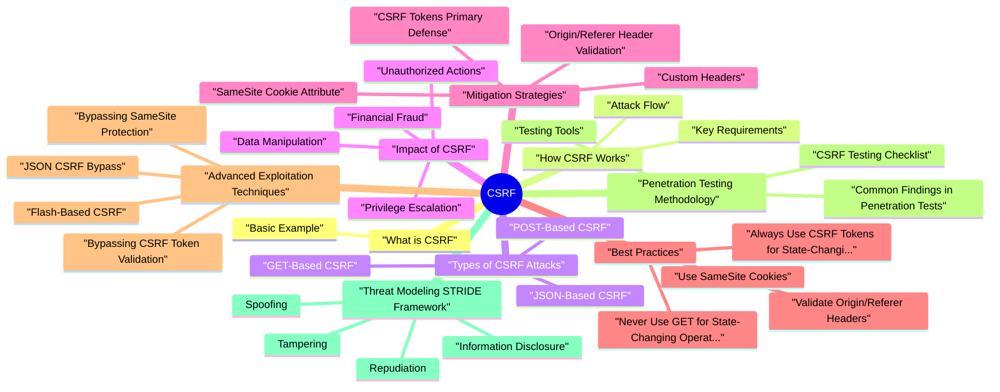

# CSRF revision map

I keep this CSRF map for the night before a screen, when five markdown files is too many clicks. Built from Critical Clarification CSRF Misconceptions.md, CSRF (Cross-Site Request Forgery) - Comprehensive.md, CSRF - Interview Questions & Answers.md, CSRF - Quick Reference.md, CSRF - VAPT Methodology.md. Twenty minutes. Then I close the laptop.

### What CSRF is Used For
- Perform unauthorized actions on behalf of authenticated users
- Change account settings without user consent
- Transfer funds or make purchases
- Delete data or modify records
- Escalate privileges or change permissions

### Why CSRF is Dangerous
- High Impact: Can lead to unauthorized actions
- Common: Found in many applications
- Hard to Detect: Victims may not notice
- Exploits Trust: Uses legitimate user sessions
- Widespread: Affects all state-changing operations

## What is CSRF
- CSRF (Cross-Site Request Forgery) is an attack that tricks a user's browser into making requests to a web application where the user is authenticated, causing the application to perform actions the user didn't intend.

### Basic Example
- Browser automatically includes session cookie
- Bank.com processes transfer as legitimate user request
- Attacker receives funds

## How CSRF Works

### Attack Flow
- User is Authenticated:
- User logs into target application (bank.com)
- Application sets session cookie
- Cookie stored in browser
- User Visits Attacker's Site:
- User visits malicious site (evil.com)
- While still logged into bank.com
- Malicious Request is Triggered:

### Key Requirements
- User must be authenticated
- Application must trust session cookies
- Attacker must know/can predict the request format
- No CSRF protection in place

## Types of CSRF Attacks

### GET-Based CSRF
- Description: State-changing operations via GET requests (violates REST principles but still common).
- Never use GET for state-changing operations
- Use POST/PUT/DELETE instead
- Implement CSRF tokens for all state-changing operations

### POST-Based CSRF
- Description: Most common type - form submission to POST endpoints.
- CSRF tokens in forms
- SameSite cookies
- Origin/Referer validation

### JSON-Based CSRF
- Description: CSRF via JSON requests (less common but possible).
- CSRF tokens in custom headers (X-CSRF-Token)
- Origin header validation
- Content-Type validation

## Impact of CSRF

### Unauthorized Actions
- Change email addresses
- Modify account settings
- Update security questions
- Change passwords (account takeover)

### Financial Fraud
- Transfer funds
- Make purchases
- Modify payment methods
- Change billing information

### Data Manipulation
- Delete data
- Modify records
- Change permissions
- Update configurations

### Privilege Escalation
- Grant admin permissions
- Add users to admin groups
- Change user roles
- Enable dangerous features

## Mitigation Strategies

### CSRF Tokens (Primary Defense)
- Server generates unique token per session
- Token included in forms/requests
- Server validates token before processing
- Use cryptographically random tokens
- Store tokens in server-side session
- Validate tokens on every state-changing request
- Regenerate tokens periodically

### SameSite Cookie Attribute
- Prevents cookies from being sent in cross-site requests
- SameSite=Strict: Never sent cross-site
- SameSite=Lax: Sent with top-level navigation
- Not supported by all browsers
- May break legitimate cross-site flows
- Use with CSRF tokens for maximum protection

### Origin/Referer Header Validation
- Validates that request comes from expected origin
- Rejects requests from unexpected origins
- Referer can be stripped by privacy tools
- Origin may not be present in all requests
- Use as additional layer, not primary defense

### Custom Headers
- Requires custom header (e.g., X-Requested-With)
- Browsers don't send custom headers cross-origin (same-origin policy)
- Only works for AJAX requests
- Can be bypassed with Flash/plugins
- Use with other controls

### Double Submit Cookie Pattern
- Cookie and form field contain same token
- Server compares cookie value with form value
- Must match for request to be valid

## Best Practices

### Always Use CSRF Tokens for State-Changing Operations
- Rule: Protect all POST, PUT, DELETE, and PATCH requests.

### Use SameSite Cookies
- Rule: Set SameSite attribute on session cookies.

### Validate Origin/Referer Headers
- Rule: Check Origin/Referer as additional layer.

### Never Use GET for State-Changing Operations
- Rule: Follow REST principles - GET should be idempotent and safe.

### Use Defense in Depth
- Rule: Combine multiple mitigation techniques.
- CSRF tokens (primary)
- SameSite cookies (secondary)
- Origin validation (tertiary)
- Custom headers (for AJAX)

## Advanced Exploitation Techniques

### Bypassing CSRF Token Validation
- Technique: Token in Cookie (Double Submit)

### Bypassing SameSite Protection
- Technique: Top-Level Navigation (SameSite=Lax)
- Never use GET for state-changing operations
- Use SameSite=Strict for sensitive operations

### JSON CSRF Bypass
- Validate Content-Type header
- Require CSRF token in custom header
- Use Origin validation

### Flash-Based CSRF
- Technique: Flash can send custom headers
- Flash is deprecated, but if used, validate tokens
- Don't rely solely on custom headers

## Penetration Testing Methodology

### CSRF Testing Checklist
- POST requests (forms, API calls)
- PUT/DELETE requests
- Any operation that modifies data
- Look for CSRF tokens in forms
- Check SameSite cookie attribute
- Verify Origin/Referer validation
- Test custom headers requirement
- Request succeeds without user interaction

### Testing Tools
- Generate CSRF PoC automatically
- Test for CSRF protection
- Validate token implementation
- Automated CSRF detection
- CSRF token analysis
- Origin/Referer validation testing

### Common Findings in Penetration Tests
- Finding: Forms/API endpoints without CSRF tokens
- Risk: High
- Evidence: POST request succeeds without token
- Finding: Predictable or reusable tokens
- Evidence: Token can be predicted or reused
- Finding: Session cookies without SameSite attribute
- Risk: Medium
- Evidence: Cookie sent with cross-site requests

## Threat Modeling (STRIDE Framework)

### Spoofing
- Threat: Attacker spoofs legitimate user requests.
- Cross-site form submission
- Image tag GET requests
- Fetch API requests
- Flash-based requests
- CSRF tokens
- SameSite cookies
- Origin validation

### Tampering
- Threat: Attacker modifies user data without authorization.
- Change email/password
- Modify account settings
- Update permissions
- CSRF tokens
- Request validation
- Audit logging

### Repudiation
- Threat: User denies performing actions (no audit trail).
- Actions performed via CSRF
- No proper logging
- User claims they didn't do it
- Comprehensive logging
- Request correlation
- User notifications

### Information Disclosure
- Threat: Attacker accesses sensitive information via CSRF.
- Change email to attacker's email
- Modify account to access data
- Change settings to expose information
- CSRF protection
- Access controls
- Data encryption

### Denial of Service
- Threat: Attacker causes service disruption via CSRF.
- Delete critical data
- Disable accounts
- Modify configurations
- CSRF protection
- Confirmation requirements
- Rate limiting

### Elevation of Privilege
- Threat: Attacker escalates privileges via CSRF.
- Grant admin permissions
- Add to admin groups
- Enable dangerous features
- CSRF protection
- Authorization checks
- Privilege validation

### Attack Tree: CSRF Account Takeover
- See the source section `Attack Tree: CSRF Account Takeover` for the worked example.

## Real-World Case Studies

### Case Study 1: CSRF in Password Change
- Background: During a penetration test, we discovered CSRF vulnerability in password change functionality.
- Confidentiality: Critical - Account takeover
- Integrity: Critical - Attacker controls account
- Availability: High - Original user locked out
- Business Impact: Critical - Complete account compromise
- No CSRF token validation
- No SameSite cookie protection
- No Origin/Referer validation

### Case Study 2: CSRF in Fund Transfer
- Background: Security assessment revealed CSRF in banking application transfer functionality.
- Financial: Critical - Direct monetary loss
- Integrity: Critical - Unauthorized transactions
- Business Impact: Critical - Financial fraud, regulatory violations

## Advanced Mitigations

### Defense in Depth Strategy
- See the source section `Defense in Depth Strategy` for the worked example.

## SAST/DAST Detection

### SAST (Static Application Security Testing)
- See the source section `SAST (Static Application Security Testing)` for the worked example.

### DAST (Dynamic Application Security Testing)
- Missing CSRF tokens in forms
- No SameSite cookie protection
- Origin/Referer not validated
- Weak token implementation
- GET requests for state-changing operations

## Risk Assessment

### Risk Matrix
- See the source section `Risk Matrix` for the worked example.

### Risk Calculation
- Common vulnerability
- Easy to exploit
- No protection in place
- Account takeover
- Financial fraud
- Data manipulation
- Unauthorized actions
- Financial: Direct monetary losses, fraud

### Risk Prioritization
- Missing CSRF protection on sensitive operations
- Password change without CSRF protection
- Fund transfer without CSRF protection
- Weak token implementation
- No SameSite protection
- GET for state-changing operations
- Missing Origin validation
- Incomplete CSRF protection

## Cheat sheet bits

## Common CSRF Attack Patterns

### GET-Based CSRF
- See the source section `GET-Based CSRF` for the worked example.

### POST-Based CSRF
- See the source section `POST-Based CSRF` for the worked example.

### JSON-Based CSRF
- See the source section `JSON-Based CSRF` for the worked example.

## CSRF Protection Checklist
- CSRF tokens in all state-changing operations
- SameSite cookies (Strict or Lax)
- Origin/Referer header validation
- Custom headers for AJAX (X-Requested-With)
- Never use GET for state-changing operations
- Cryptographically random token generation
- Server-side token validation
- Defense in depth (multiple layers)

## CSRF Token Implementation

## SameSite Cookie Settings

## Risk Levels

## Common Misconceptions
- HTTPS prevents CSRF
- HttpOnly prevents CSRF
- CSRF = XSS
- Only POST vulnerable
- Tokens alone sufficient
- SameSite=Strict sufficient

## Tools
- Burp Suite: CSRF PoC generation, manual testing
- OWASP ZAP: Automated CSRF detection
- Custom Scripts: Targeted testing
- Browser DevTools: Form/cookie analysis

## Traps that dump interviews

## ️ Common Misconceptions

### "CSRF and XSS are the same thing"
- Truth: CSRF and XSS are completely different attacks with different goals and mitigation strategies.
- Exploits trust that a server has in a user's browser
- Tricks user into submitting requests they didn't intend
- Requires user to be authenticated
- Targets actions (state-changing operations)
- Exploits trust that a web application has in user input
- Injects malicious scripts into web pages
- May not require authentication

### "HTTPS prevents CSRF"
- Truth: HTTPS does NOT prevent CSRF. HTTPS only encrypts the connection; it doesn't verify request origin.
- Key Point: HTTPS protects data in transit but doesn't verify that the request originated from the legitimate application.

### "HttpOnly cookies prevent CSRF"
- Truth: HttpOnly cookies do NOT prevent CSRF. HttpOnly only prevents JavaScript from accessing cookies (protects against XSS).
- Key Point: HttpOnly prevents JavaScript access (XSS protection), but browsers still automatically send HttpOnly cookies with requests (CSRF vulnerability remains).

### "Only POST requests can be CSRF vulnerable"
- Truth: Any state-changing operation can be vulnerable, regardless of HTTP method (GET, POST, PUT, DELETE).
- Best Practice: Never use GET for state-changing operations. However, POST/PUT/DELETE can also be vulnerable without CSRF protection.

### "CSRF tokens alone are sufficient"
- Truth: CSRF tokens are the primary defense, but defense in depth is recommended.
- SameSite cookies (Strict or Lax)
- Origin/Referer header validation
- Custom headers (X-Requested-With)
- CAPTCHA for sensitive operations

### "SameSite=Strict prevents all CSRF"
- Truth: SameSite=Strict significantly reduces CSRF risk but may not prevent all cases and has browser compatibility considerations.
- May break legitimate cross-site flows (OAuth redirects)
- Not supported by all browsers
- May be bypassed in certain edge cases

## Key Takeaways

### Understanding
- CSRF and XSS are different - Different attack vectors, different mitigations
- HTTPS doesn't prevent CSRF - Only encrypts, doesn't verify origin
- HttpOnly doesn't prevent CSRF - Only prevents JavaScript access
- Any state-changing operation can be vulnerable - Not just POST
- CSRF tokens are primary defense - But use defense in depth
- SameSite helps but isn't sufficient alone - Use with other controls

### Common Mistakes
- Confusing CSRF with XSS
- Relying on HTTPS alone
- Thinking HttpOnly prevents CSRF
- Only protecting POST requests
- Using only one mitigation technique
- Assuming SameSite is sufficient

## Summary Table
- Remember: CSRF is prevented by verifying request origin (CSRF tokens, SameSite cookies, Origin/Referer validation), not by HTTPS or HttpOnly alone!

## How I would test it

## Scope & Application Model
- Understand how the app performs state‑changing actions:
- HTTP methods for changes (POST, PUT, PATCH, sometimes GET).
- API vs traditional form submissions.
- Use of cookies vs tokens (session cookies, JWT, API keys).
- Identify sensitive operations:
- Account changes (email, password, MFA settings).
- Financial actions (payments, refunds, payouts).
- Permission changes (role/ACL updates, access grants).

## Mapping State‑Changing Endpoints
- Create an inventory of state‑changing endpoints:
- Use a proxy (e.g., ZAP/Burp) while:
- Browsing the app as different roles.
- Performing profile edits, resource creation, updates, and deletions.
- For each relevant request, record:
- HTTP method and URL.
- Whether the action changes server state.
- Authentication mechanism (session cookie, token in header, etc.).

## Anti‑CSRF Control Analysis
- For each critical state‑changing request, verify:
- Token presence & binding:
- Is there a unique per‑session or per‑request token?
- Is the token tied to:
- The user/session?
- The specific action or form?
- Token verification:
- Does the server reject requests missing or with invalid tokens?

## Dynamic Testing - High‑Level Approach
- Your goal is to determine whether an attacker's site could trigger a state‑changing request using only the victim's browser and existing credentials, without requiring explicit consent.
- Form‑based actions:
- Check if a state‑changing endpoint:
- Accepts requests without a CSRF token.
- Accepts tokens that are static or easily guessable.
- Evaluate whether a simple cross‑origin POST (e.g., via HTML form) would be accepted.
- API / AJAX actions:
- Determine whether:

## High‑Risk Scenarios to Prioritize
- Account management:
- Change email, phone, or password.
- Enable/disable MFA or backup methods.
- Manage API keys or access tokens.
- Authorization changes:
- Role assignments, group membership, sharing/invites.
- Changes in access level to important resources.
- Monetary operations:

## Tooling & Environment Controls
- Proxy / DAST:
- Use OWASP ZAP or Burp to:
- Identify candidate CSRF‑prone requests.
- Inspect cookies and headers for security attributes.
- Some tools can auto‑generate CSRF test templates - use these only against approved test environments.
- Browser tools:
- Developer tools for:
- Inspecting request headers and cookies.

## Verifying Exploitability Safely (Conceptual)
- To assess whether a CSRF attack is theoretically possible:
- Evaluate browser behavior:
- Would a normal cross‑origin request from an attacker's site:
- Include the victim's cookies?
- Satisfy HTTP method and header constraints (simple vs non‑simple requests)?
- Bypass CORS because no response data is needed (write‑only action)?
- Evaluate server‑side checks:
- Does the endpoint:

## Reporting & Risk Assessment
- Endpoint and HTTP method.
- Required conditions (victim logged in, specific role, path in UI).
- Anti‑CSRF protection gaps:
- Missing or weak tokens.
- Unsafe use of GET for state‑changing actions.
- Overreliance on incomplete SameSite protections.
- Potential impact in the app's context:
- Unauthorized changes attacker could trigger.

## Remediation Guidance
- solid anti‑CSRF tokens:
- Unique, unpredictable, per‑session or per‑request values.
- Required and validated for all state‑changing requests.
- Tied to user/session and (ideally) to specific action or form.
- Cookie hardening:
- Use SameSite=Lax or SameSite=Strict for session cookies where feasible.
- Always set Secure for cookies in HTTPS deployments.
- Safe method usage:

## Re‑Testing Checklist
- [ ] Confirm CSRF tokens are:
- [ ] Present, unique, and validated on all sensitive state‑changing actions.
- [ ] Rejected when missing, malformed, or not bound to the correct session.
- [ ] Verify cookies:
- [ ] Have appropriate SameSite values.
- [ ] Use Secure in HTTPS environments.
- [ ] Re‑check that no state‑changing GET endpoints remain.
- [ ] Validate that:

## Prompts I drill out loud

- Fundamental Questions
- What is CSRF and how does it work?
- What is the difference between CSRF and XSS?
- Why doesn't HTTPS prevent CSRF?
- Explain how a CSRF attack is performed step-by-step.
- Can CSRF work with GET requests?
- Mitigation Questions
- How do CSRF tokens prevent CSRF attacks?
- Explain SameSite cookie attribute and how it prevents CSRF.
- What is the difference between Origin and Referer headers in CSRF protection?
- What is the impact of CSRF vulnerabilities?
- Why doesn't HttpOnly prevent CSRF?
- Scenario-Based Questions
- You discover a form without CSRF protection. How would you exploit it?
- How would you test for CSRF vulnerabilities during a penetration test?
- How can you bypass CSRF protection?
- What is the Double Submit Cookie pattern?
- Penetration Testing Questions
- What tools would you use to test for CSRF?
- How would you report a CSRF vulnerability?
- Depth: Interview follow-ups - CSRF
- Flagship Mock Question Ladder - CSRF
- Junior (Fundamental clarity)
- Senior (Design and trade-offs)

## Attack Mechanisms

## Security Questions

## Advanced Questions

## Depth: Interview follow-ups - CSRF
- Authoritative references: OWASP CSRF; CSRF Prevention Cheat Sheet.
- Double-submit vs synchronizer token - trade-offs for SPAs.
- SameSite as defense-in-depth-browser coverage caveats.
- Login CSRF - often forgotten.

## Flagship Mock Question Ladder - CSRF
- Primary competency axis: cross-site request trust abuse and anti-CSRF architecture.

### Staff (Strategy and scale)
- How do you build default CSRF protection into platform frameworks?
- How do you test CSRF posture in multi-origin product suites?
- Which legacy exceptions are acceptable and how are they governed?

### 10-minute mock drill format
- 3 min: Pick one Junior prompt and answer with definition, mechanism, and one mitigation.
- 4 min: Pick one Senior prompt and answer with trade-offs and implementation caveats.
- 3 min: Pick one Staff prompt and answer with architecture/policy plus measurement plan.

### Answer quality rubric (quick score)
- Accuracy (facts and mechanism)
- Depth (trade-offs and failure modes)
- Practicality (implementable controls)
- Verification (tests/telemetry proving success)

## Sibling folders

- Stay inside this folder for the long guide. Jump only when a section names a sibling topic.
- Cookie Security, CSRF, XSS, JWT, OAuth, and TLS show up as neighbors on a lot of these maps.
