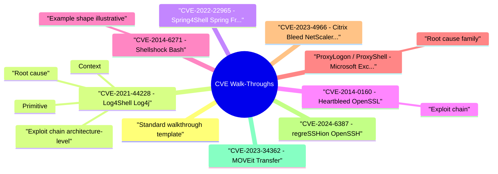

# CVE Walk-Throughs revision map

CVE Walk-Throughs in one sitting. That is the deal. I mined Critical Clarification CVE Walk-Throughs Misconceptions.md, CVE Walk-Throughs - Comprehensive Guide.md, CVE Walk-Throughs - Interview Questions & Answers.md, CVE Walk-Throughs - Quick Reference.md. The outline keeps every H2 I cared about from those files.

## Standard walkthrough template
- Use this shape in interviews and postmortems:
- Context - Product, default exposure, typical deployment.
- Root cause - Code/config/trust-boundary failure (one sentence).
- Primitive - RCE, auth bypass, memory leak, privilege escalation.
- Exploit chain - Preconditions -> trigger -> outcome.
- Detection - Logs, network, EDR, scan signatures.
- Remediation - Patch version + compensating controls + secret rotation.
- Lessons - What program/process change prevents recurrence.

## CVE-2021-44228 - Log4Shell (Log4j)

### Context
- Apache Log4j 2 logging library embedded in Java apps, frameworks (Spring, Solr, Struts ecosystems), and vendor products. Ubiquitous on internet-facing services.
- Spring MVC / Spring WebFlux on JDK 9+, deployed as WAR on Tomcat (specific combination-verify advisories for your stack).
- OpenSSL 1.0.1 TLS heartbeat extension on any service using affected builds (HTTPS, VPN, email).
- GNU Bash invoked via CGI, DHCP clients, OpenSSH forced commands, legacy web stacks.
- On-prem Exchange with Outlook Web App exposed to internet.
- Citrix NetScaler ADC/Gateway appliances-VPN and load balancing at enterprise edge.
- OpenSSH server (sshd) on glibc Linux-race condition in signal handler / SIGALRM handling (regression of old CVE-2006-5051 class).
- Progress MOVEit managed file transfer-common in finance/healthcare B2B.

### Root cause
- Log4j Message Lookup substituted ${...} in log messages with JNDI lookups, resolving attacker-controlled URLs.
- Data binding / access rules on class loader properties under certain deployment patterns allowed attacker to write access log valve paths -> JSP webshell in some configs.
- Missing bounds check on TLS heartbeat response-server returned up to 64KB of heap memory per request.
- Bash exported function definitions in environment variables were parsed as trailing commands.
- Buffer overread in session token handling leaked memory including valid session tokens.
- Race condition in sshd on 32-bit and some 64-bit configurations-timing-dependent RCE as root in vulnerable versions (verify NVD for affected version ranges).
- SQL injection in web layer -> ASP.NET webshell deployment -> data exfiltration (Cl0p ransomware affiliate campaign).

### Primitive
- JNDI injection -> remote class loading or LDAP reference -> RCE in vulnerable configurations.
- Remote code execution via manipulated request parameters binding to sensitive object graphs.
- Memory disclosure (not RCE directly)-may leak private keys, session cookies, credentials from process memory.
- Remote code execution when attacker controls environment passed to Bash.
- Pre-auth -> RCE as SYSTEM on Exchange server in worst case.
- Session hijack without credentials-bypass MFA for hijacked sessions.
- Local/network-adjacent RCE depending on deployment-high media visibility in 2024.
- SQLi -> RCE -> mass data theft-not novel primitive but high-impact supply chain to partners.

### Exploit chain (architecture-level)
- See the source section `Exploit chain (architecture-level)` for the worked example.

### Detection
- Outbound LDAP/RMI/DNS from app subnets to unknown hosts.
- Log4j lookup patterns in WAF logs.
- Vendor IOC lists; Nuclei templates (authorized scanning only).
- Unexpected POST parameters with class.* patterns.
- New JSP or web shell files on disk.
- Tomcat access log anomalies.
- IDS signatures for heartbeat payload size anomalies.
- Difficult at scale-assume compromise if exposed; rotate keys.

### Remediation
- Upgrade Log4j to 2.17.1+ (verify current vendor guidance).
- Emergency: log4j2.formatMsgNoLookups=true, remove JndiLookup class (temporary).
- Block egress to unexpected LDAP/RMI; WAF rules (secondary).
- Rotate secrets on compromised hosts; hunt persistence.
- Patch Spring Framework to fixed versions per vendor matrix.
- Upgrade JDK/Tomcat combinations per advisory.
- WAF rules for suspicious parameter names (temporary).
- Patch OpenSSL; reissue certificates and rotate keys (mandatory-patch alone insufficient if keys leaked).

### Lessons
- Dependency inventory (SBOM) speed is incident response.
- Never evaluate untrusted data in lookup/rendering paths.
- Egress control limits JNDI class of bugs.
- Framework defaults + deployment mode matter-test your stack, not blog posts.
- Separate RCE from Log4Shell in interviews-different mechanism.
- Crypto library bugs require key rotation, not only binary patch.
- Memory-safe language doesn't help if linked to C crypto.
- Shell in request path is a recurring RCE theme-ban for internet-facing apps.

## CVE-2022-22965 - Spring4Shell (Spring Framework)

## CVE-2014-0160 - Heartbleed (OpenSSL)

### Exploit chain
- Attacker sends malformed heartbeat -> server responds with adjacent heap bytes -> repeat to sweep memory.

## CVE-2014-6271 - Shellshock (Bash)

### Example shape (illustrative)
- See the source section `Example shape (illustrative)` for the worked example.

## ProxyLogon / ProxyShell - Microsoft Exchange

### Root cause (family)
- Chained flaws: SSRF to internal Exchange PowerShell endpoints, authentication bypass, arbitrary file write (ProxyLogon); later ProxyShell variants on patched-but-misconfigured systems.

## CVE-2023-4966 - Citrix Bleed (NetScaler ADC/Gateway)

## CVE-2024-6387 - regreSSHion (OpenSSH)

## CVE-2023-34362 - MOVEit Transfer

## Prioritization during active exploitation
- Cross-read Vulnerability Management Lifecycle, Risk Prioritization and Security Metrics.

## Interview clusters

## Hands-on (authorized)
- Nuclei templates in lab for detection validation (not prod without approval).
- Build local Log4j test harness in isolated VM.
- Vendor advisories and CISA alerts as primary sources.

## Cross-links
- Remote Code Execution (RCE) · Vulnerability Management Lifecycle · Production Security Incident Response · Software Supply Chain Security

## Pocket list

## Template
- Context -> Root cause -> Primitive -> Chain -> Detection -> Remediation -> Lessons

## High-signal CVEs (study set)

## Prioritization
- KEV + exposure + EPSS -> patch/isolate -> hunt -> rotate secrets

## Interview trap
- Don't confuse root cause with full kill chain or vendor marketing name.

## Cross-reads
- RCE · Vulnerability Management Lifecycle · Production Security Incident Response

## The clarification file, compressed

## "Knowing CVE names equals depth."
- Reality: Interview depth is mechanism + mitigation reasoning, not name recall.

## "Patching ends the incident."
- Reality: You may still need key/cert/session rotation and threat hunt validation.

## "CVSS alone is enough for priority."
- Reality: Exposure and active exploitation evidence often dominate urgency.

## "Only RCE CVEs matter."
- Reality: Auth bypass and data disclosure flaws can be equally business-critical.

## "Public PoC means immediate compromise."
- Reality: Reachability and environment controls still matter.

## "WAF virtual patch is permanent."
- Reality: It is temporary risk reduction; root fix remains required.

## "Old CVEs are irrelevant."
- Reality: Old classes reappear in modern stacks under new packaging.

## "CVE response is only security team's job."
- Reality: Engineering, infra, product, and incident response must coordinate.

## Oral prompts worth repeating

- Heartbleed-why rotate keys after patch?
- Log4Shell vs Spring4Shell?
- How prioritize ProxyShell during active exploitation?
- Citrix Bleed impact in one line?
- What is regreSSHion?
- Staff-CVE response program?
- Authoritative references

## 60-second answer

### Heartbleed-why rotate keys after patch?
- A: Patch stops future leaks; past memory disclosure may have captured private keys and sessions. Rotation assumes compromise of key material.

### Staff-CVE response program?
- A: SBOM + asset inventory, KEV/EPSS triage SLAs, compensating control expiry, detection rules, comms template, postmortem to SSDF improvements.

## Depth follow-ups
- Map Log4Shell to MITRE ATT&CK techniques (Initial Access -> Execution).
- When is WAF acceptable as temporary control?
- EPSS vs CVSS for prioritization debate.

## What sits next to this topic

- Stay inside this folder for the long guide. Jump only when a section names a sibling topic.
- Cookie Security, CSRF, XSS, JWT, OAuth, and TLS show up as neighbors on a lot of these maps.
