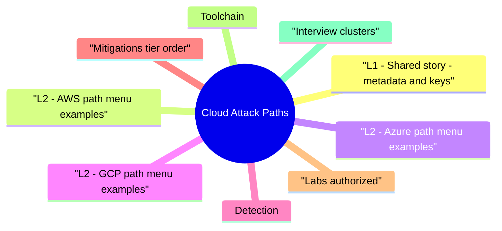

# Cloud Attack Paths revision map

Cloud Attack Paths in one sitting. That is the deal. I mined Critical Clarification Cloud Attack Paths Misconceptions.md, Cloud Attack Paths - Comprehensive Guide.md, Cloud Attack Paths - Interview Questions & Answers.md, Cloud Attack Paths - Quick Reference.md. The outline keeps every H2 I cared about from those files.

## L1 - Shared story: metadata and keys
- Instance metadata services issue short-lived credentials to workloads-precisely why they're high-value targets.

## L2 - AWS path menu (examples)

## L2 - Azure path menu (examples)

## L2 - GCP path menu (examples)

## Detection
- CloudTrail/Activity Log/Audit Logs: GetSessionToken, AssumeRole, CreateAccessKey, SetIamPolicy.
- Anomaly: new region, data egress spikes, S3 public ACL changes.
- SSRF WAF hits toward 169.254.169.254 or metadata hosts.

## Mitigations (tier order)
- No long-lived cloud keys in CI or repos-OIDC federation.
- IMDS hardening and network egress controls for workloads.
- Org guardrails (SCP, Org policies, Azure MG deny assignments).
- Break-glass without standing cloud admin.
- CSPM + CIEM for effective permissions analysis.

## Labs (authorized)
- CloudGoat (RhinoSecurityLabs) · IAM privesc workshops · vendor well-architected security labs

## Toolchain
- Prowler, ScoutSuite, Pacu (AWS offensive awareness), Steampipe/CloudQuery for inventory, native CLI queries

## Interview clusters

## Authoritative references
- MITRE ATT&CK Cloud matrices and infrastructure techniques.
- AWS/Azure/GCP security benchmarks (CIS-aligned).
- OWASP SSRF guidance (cloud metadata sections).

## Cross-links
- Cloud Security Architecture · SSRF · Secrets Management · MITRE ATTACK Interview Fluency

## Verification checklist
- [ ] Explain IMDSv2 vs v1 in one sentence.
- [ ] Name two high-signal audit events for IAM abuse.

## Pocket list

## Universal chain
- App bug -> metadata/keys -> API abuse -> persist (roles, keys, Lambdas) -> exfil

## AWS hot buttons
- IMDSv1 · PassRole · AssumeRole trust chaining · public S3 · long-lived AKIA

## Azure hot buttons
- ARM RBAC over scope · automation accounts · hybrid token theft · Key Vault policy gaps

## GCP hot buttons
- Default SA scopes · actAs chains · exported SA keys · org policy missing

## Detections (patterns)
- SetIamPolicy · CreateAccessKey · AssumeRole from new IP · mass GetObject

## Cross-read
- Cloud Security Architecture · SSRF · Secrets Management

## One-liner

## The clarification file, compressed

## "Cloud shifts all risk to the provider."
- Reality: IAM, app bugs, and data exposure remain customer responsibility in IaaS/PaaS.

## "Private VPC means no SSRF to metadata."
- Reality: Internal SSRF from compromised workloads still reaches link-local addresses-layer controls.

## "MFA stops cloud privilege escalation."
- Reality: API keys and compromised workload identities bypass interactive MFA.

## "CSPM green means secure."
- Reality: CSPM misses app-layer authZ and insider paths-combine with pentest and CIEM.

## "Multi-cloud eliminates blast radius."
- Reality: Federated identity and reused pipelines correlate failures across clouds.

## "Serverless has no metadata attacks."
- Reality: Execution roles and environment variables with secrets remain targets.

## "Encryption at rest stops data theft."
- Reality: Stolen IAM creds decrypt via normal APIs-identity is king.

## "Kubernetes is separate from cloud IAM."
- Reality: IRSA/Workload Identity bridges pods to cloud roles-one graph.

## "Pen test scope 'cloud-only' is realistic."
- Reality: Hybrid AD and CI pipelines bridge on-prem to cloud-scope full.

## "IMDSv2 is a silver bullet."
- Reality: Strong mitigation for classic SSRF; doesn't fix RCE with local code already on instance.

## Oral prompts worth repeating

- Q: Why is iam:PassRole sensitive?
- Q: SCP vs IAM policy?
- Azure / GCP (spot checks)
- Q: Azure Contributor on RG-risk?
- Q: GCP default compute service account?

## 60-second answer
- Q: Give an example cloud attack path and how you'd break it.

## AWS

### Q: Azure Contributor on RG-risk?
- A: Often enough to pivot via automation, runbooks, or managed identities-treat as high blast radius, not "not Owner"**.

## Mock ladder

## What sits next to this topic

- Stay inside this folder for the long guide. Jump only when a section names a sibling topic.
- Cookie Security, CSRF, XSS, JWT, OAuth, and TLS show up as neighbors on a lot of these maps.
