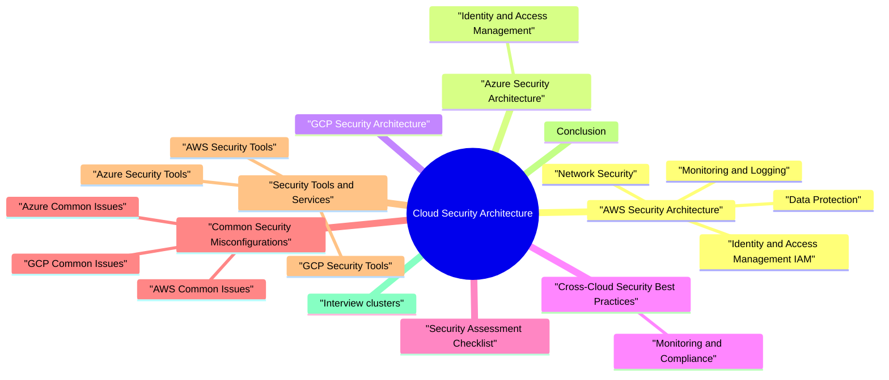

# Cloud Security Architecture revision map

This is the Cloud Security Architecture spine I actually use. Types, failures, fixes, traps. Sources: Critical Clarification Cloud Security Architecture Misconceptions.md, Cloud Security Architecture - Comprehensive Guide.md, Cloud Security Architecture - Interview Questions.md, Cloud Security Architecture - Quick Reference.md. I do not treat it as a second textbook.

### What is Cloud Security Architecture?
- See the source section `What is Cloud Security Architecture?` for the worked example.

### Shared Responsibility Model
- Understanding the shared responsibility model is fundamental to cloud security:
- Physical infrastructure security
- Network infrastructure
- Hypervisor and virtualization layer
- Cloud services security
- Data classification and protection
- Identity and access management
- Application security

## AWS Security Architecture

### Identity and Access Management (IAM)
- IAM Users
- Individual identities with credentials
- Best practice: Use IAM roles instead of users when possible
- Enable MFA for all users
- IAM Roles
- Temporary credentials for services and applications
- No long-term credentials stored
- Supports cross-account access

### Network Security
- Isolated network environment
- Custom IP address ranges
- Subnet configuration (public/private)
- Route tables and internet gateways
- Stateful virtual firewalls
- Control inbound and outbound traffic
- Applied at instance level
- Default deny all inbound traffic

### Data Protection
- Centralized key management
- Hardware Security Modules (HSM)
- Key rotation support
- Integration with AWS services
- Encryption at Rest:
- S3: Server-side encryption (SSE-S3, SSE-KMS, SSE-C)
- EBS: Encryption by default option
- RDS: Encryption at rest with KMS

### Monitoring and Logging
- Logs all API calls
- Tracks who, what, when, where
- Enables compliance auditing
- Integrates with CloudWatch and S3
- Metrics and monitoring
- Log aggregation
- Alarms and notifications
- Dashboards

## Azure Security Architecture

### Identity and Access Management
- Identity and access management service
- Single sign-on (SSO)
- Multi-factor authentication (MFA)
- Conditional access policies
- Fine-grained access control
- Built-in roles (Owner, Contributor, Reader)
- Custom roles support
- Resource-level permissions

## GCP Security Architecture

## Cross-Cloud Security Best Practices

### Monitoring and Compliance
- Logging:
- Enable audit logging for all services
- Centralize logs
- Retain logs per compliance requirements
- Monitor for suspicious activity
- Monitoring:
- Set up alerts for security events
- Monitor access patterns

## Security Assessment Checklist

## Common Security Misconfigurations

### AWS Common Issues
- Public S3 Buckets:
- Issue: Buckets accessible to public
- Risk: Data exposure
- Fix: Use bucket policies, enable Block Public Access
- Overly Permissive Security Groups:
- Issue: 0.0.0.0/0 allowed
- Risk: Unauthorized access
- Fix: Use specific IP ranges

### Azure Common Issues
- Public Storage Accounts:
- Issue: Storage accounts publicly accessible
- Risk: Data exposure
- Fix: Use private endpoints, network rules
- NSG Rules Too Permissive:
- Issue: Allow all traffic
- Risk: Unauthorized access
- Fix: Use specific rules

### GCP Common Issues
- Public Cloud Storage Buckets:
- Issue: Buckets publicly readable
- Risk: Data exposure
- Fix: Use IAM policies, remove public access
- Firewall Rules Too Open:
- Issue: 0.0.0.0/0 allowed
- Risk: Unauthorized access
- Fix: Use specific source IPs

## Security Tools and Services

### AWS Security Tools
- AWS Security Hub: Centralized security findings
- Amazon Inspector: Automated security assessments
- AWS Config: Configuration compliance
- Amazon GuardDuty: Threat detection
- AWS WAF: Web application firewall
- AWS Shield: DDoS protection

### Azure Security Tools
- Azure Security Center: Security posture management
- Azure Sentinel: SIEM solution
- Azure Firewall: Managed firewall
- Azure DDoS Protection: DDoS mitigation
- Azure Application Gateway WAF: Web application firewall
- Azure Policy: Policy enforcement

### GCP Security Tools
- Security Command Center: Security and risk management
- Cloud Armor: DDoS protection and WAF
- VPC Service Controls: Service perimeter
- Binary Authorization: Container image security
- Cloud Asset Inventory: Resource discovery
- Event Threat Detection: Threat detection

## Conclusion
- Security is a shared responsibility
- Implement defense in depth
- Follow least privilege principle
- Enable encryption by default
- Monitor and audit continuously
- Regular security assessments
- Stay updated with provider security features

## Interview clusters
- Fundamentals: "What is the shared responsibility model?" "Who patches the hypervisor?"
- Senior: "How do you segment prod from non-prod in cloud accounts?" "Encryption keys-who manages them?"
- Staff: "Design landing zone for multi-business-unit cloud with centralized security."

## Cross-links
- Zero Trust, IAM, IaC Security, Container Security, DDoS and Resilience, Compliance topics.

## The one-pager, exploded

## Shared Responsibility Model

## AWS Security Services

## Azure Security Services

## GCP Security Services

## IAM Best Practices

### AWS IAM
- See the source section `AWS IAM` for the worked example.

### Azure RBAC
- See the source section `Azure RBAC` for the worked example.

### GCP IAM
- See the source section `GCP IAM` for the worked example.

## Network Security Comparison

## Encryption Services

## Security Checklist

### Identity & Access
- [ ] MFA enabled for all users
- [ ] IAM policies follow least privilege
- [ ] Regular access reviews
- [ ] No hardcoded credentials
- [ ] Service accounts use workload identity

### Network Security
- [ ] VPC/VNet properly configured
- [ ] Security groups/firewalls follow least privilege
- [ ] No public access to databases
- [ ] DDoS protection enabled
- [ ] Network segmentation implemented

### Data Protection
- [ ] Encryption at rest enabled
- [ ] TLS 1.2+ for all connections
- [ ] Key management service used
- [ ] Key rotation implemented
- [ ] Data classification completed

### Monitoring
- [ ] Audit logging enabled
- [ ] Logs centralized
- [ ] Security alerts configured
- [ ] Incident response plan
- [ ] Regular security assessments

## Common Misconfigurations

### AWS
- Public S3 buckets
- Security groups with 0.0.0.0/0
- IAM policies with "*"
- Missing MFA
- Unencrypted EBS volumes

### Azure
- Public storage accounts
- NSG rules too permissive
- Missing MFA
- Unencrypted disks
- Exposed Key Vault

### GCP
- Public Cloud Storage buckets
- Firewall rules with 0.0.0.0/0
- Service account keys in code
- Missing organization policies
- Unencrypted persistent disks

## Security Tools Matrix

## Network Segmentation Patterns

### AWS VPC
- See the source section `AWS VPC` for the worked example.

### Azure VNet
- See the source section `Azure VNet` for the worked example.

### GCP VPC
- See the source section `GCP VPC` for the worked example.

## Quick Commands

## Security Metrics

## Incident Response Steps
- Detect - Identify security event
- Contain - Isolate affected resources
- Investigate - Analyze logs and evidence
- Remediate - Fix vulnerabilities
- Recover - Restore services
- Lessons Learned - Document and improve

## Compliance Frameworks

## Key Takeaways
- Shared Responsibility - Understand provider vs customer responsibilities
- Least Privilege - Grant minimum necessary permissions
- Defense in Depth - Multiple security layers
- Encryption - Encrypt data at rest and in transit
- Monitoring - Continuous security monitoring
- Compliance - Regular compliance assessments
- Automation - Automate security controls

## What people get wrong

## ️ Common Misconceptions

### "The cloud provider is responsible for all security"
- Truth: Cloud security follows a shared responsibility model. The provider secures the infrastructure, but you're responsible for your data, applications, and configurations.
- Physical infrastructure security
- Network infrastructure
- Hypervisor and virtualization layer
- Cloud services security
- Data classification and protection
- Identity and access management (IAM)
- Application security

### "Encryption at rest is enough for cloud security"
- Truth: Encryption at rest is necessary but not sufficient. You need defense in depth with multiple security layers.
- Encryption at Rest:
- Database encryption
- Storage encryption (S3, EBS)
- Key management (KMS)
- Encryption in Transit:
- TLS/SSL for all communications
- VPN for private connections

### "IAM roles are more secure than IAM users"
- Truth: IAM roles are generally better for service-to-service access, but both can be secure or insecure depending on implementation.
- Long-term credentials (access keys)
- Can be rotated but often aren't
- Risk of credential leakage
- Harder to manage at scale
- Temporary credentials (STS tokens)
- Automatic rotation
- No long-term secrets

### "VPC isolation is enough for network security"
- Truth: VPC isolation is one layer of network security, but you need additional controls like security groups, NACLs, and network segmentation.
- VPC Isolation:
- Separate network environments
- Private IP ranges
- Isolated from other VPCs
- Security Groups (Stateful):
- Instance-level firewall
- Allow rules only

### "Cloud security is the same across all providers"
- Truth: While concepts are similar, each cloud provider (AWS, Azure, GCP) has different services, tools, and best practices.
- IAM, Security Groups, VPC
- CloudTrail, GuardDuty, Macie
- KMS for key management
- Azure AD, NSGs, VNets
- Azure Monitor, Security Center
- Azure Key Vault
- Cloud IAM, Firewall Rules, VPC

### "Default security settings are secure"
- Truth: Default settings are often permissive for ease of use. You must review and harden configurations.
- S3 Buckets:
- Default: Private
- But: Easy to accidentally make public
- Fix: Enable Block Public Access
- Security Groups:
- Default: Deny all inbound
- But: Outbound often allows all

### "Multi-factor authentication (MFA) is optional for cloud access"
- Truth: MFA should be mandatory for all privileged cloud access, especially root/admin accounts.
- Credential Theft Protection:
- Stolen password alone is insufficient
- Requires physical device or app
- Compliance Requirements:
- Many standards require MFA
- PCI-DSS, HIPAA, SOC 2
- Privileged Access:

### "Cloud security is only about infrastructure"
- Truth: Cloud security encompasses infrastructure, applications, data, identity, and operations.
- Infrastructure Security:
- Network security
- Compute security
- Storage security
- Application Security:
- Secure coding
- Dependency management

### "Cloud security tools are enough - no need for custom solutions"
- Truth: Cloud security tools are essential but may need to be supplemented with custom solutions for specific requirements.
- AWS Security Hub, GuardDuty, Macie
- Azure Security Center, Sentinel
- GCP Security Command Center
- Specific compliance requirements
- Integration with existing tools
- Custom threat detection
- Business-specific security policies

### "Once configured, cloud security is set and forget"
- Truth: Cloud security requires continuous monitoring, review, and updates as threats and configurations evolve.
- Continuous Monitoring:
- Security alerts
- Anomaly detection
- Threat intelligence
- Regular Audits:
- IAM policy reviews
- Configuration audits

## Key Takeaways
- Shared responsibility - Provider and customer both have security responsibilities
- Defense in depth - Multiple security layers required
- IAM roles preferred - But both roles and users can be secure
- Network segmentation - VPC + Security Groups + NACLs
- Provider differences - Understand AWS vs Azure vs GCP specifics
- Review defaults - Never assume defaults are secure
- MFA mandatory - Especially for privileged access
- full approach - Infrastructure, apps, data, identity, operations

## Questions that showed up in mocks

- Fundamental Questions
- Explain the shared responsibility model in cloud security.
- How do you implement least privilege in cloud IAM?
- Compare security groups and network ACLs in AWS.
- How do you secure data at rest and in transit in cloud?
- How do you implement network segmentation in cloud?
- AWS-Specific Questions
- How do you secure an S3 bucket?
- Explain AWS IAM roles vs users.
- Azure-Specific Questions
- How do you implement conditional access in Azure AD?
- How do you secure Azure Key Vault?
- GCP-Specific Questions
- How do you secure GCP service accounts?
- Cross-Cloud Questions
- How do you detect and respond to security incidents in cloud?
- How do you ensure compliance in cloud environments?
- Scenario-Based Questions
- You discover a public S3 bucket with sensitive data. What do you do?
- How would you design a secure multi-account AWS architecture?
- How do you secure a containerized application in cloud?
- Explain zero trust architecture in cloud context.
- How do you implement defense in depth in cloud?
- Depth: Interview follow-ups - Cloud Security Architecture

## Advanced Questions

## Conclusion

## Depth: Interview follow-ups - Cloud Security Architecture
- Authoritative references: CSA CCM (controls matrix-high level); AWS/Azure/GCP Well-Architected security pillars (pick the provider you discuss); NIST SP 800-144 (general cloud guidance-older but foundational concepts).
- Share responsibility model - where your org's obligation starts/ends.
- Data plane vs control plane attacks-IAM as the perimeter.
- Landing zone / guardrails - org-level policies vs team autonomy.

## If I only open two more topics

- Stay inside this folder for the long guide. Jump only when a section names a sibling topic.
- Cookie Security, CSRF, XSS, JWT, OAuth, and TLS show up as neighbors on a lot of these maps.
