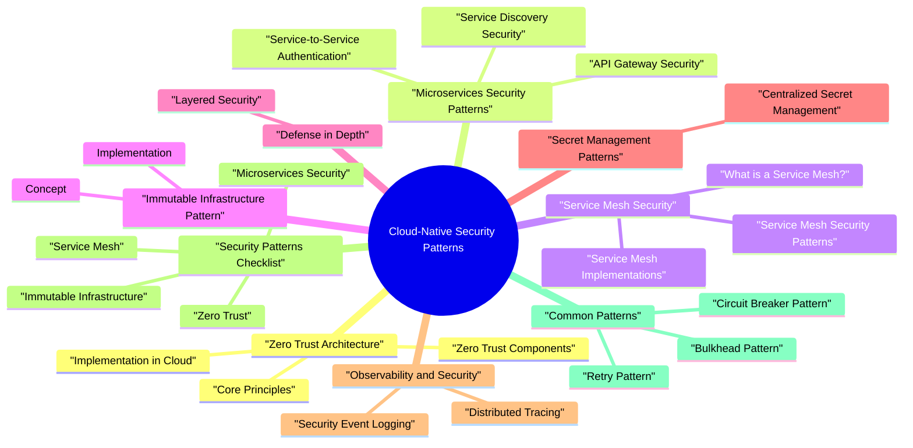

# Cloud-Native Security Patterns revision map

Cloud-Native Security Patterns in one sitting. That is the deal. I mined Critical Clarification Cloud-Native Security Patterns Misconceptions.md, Cloud-Native Security Patterns - Comprehensive Guide.md, Cloud-Native Security Patterns - Interview Questions.md, Cloud-Native Security Patterns - Quick Reference.md. The outline keeps every H2 I cared about from those files.

### What are Cloud-Native Security Patterns?
- See the source section `What are Cloud-Native Security Patterns?` for the worked example.

### Key Characteristics of Cloud-Native Applications
- Microservices Architecture: Loosely coupled, independently deployable services
- Containerization: Applications packaged in containers
- Dynamic Orchestration: Kubernetes or similar orchestration platforms
- API-Driven: Services communicate via APIs
- DevOps Culture: Continuous integration and deployment
- Cloud-Native Services: use managed cloud services

## Zero Trust Architecture

### Core Principles
- Zero Trust assumes no entity is trusted by default, regardless of location or network.
- Verify Explicitly:
- Authenticate and authorize every access
- Use identity as the perimeter
- No implicit trust
- Use Least Privilege:
- Grant minimum access
- Just-in-time access

### Implementation in Cloud
- See the source section `Implementation in Cloud` for the worked example.

### Zero Trust Components
- Identity Provider:
- Single sign-on (SSO)
- Multi-factor authentication (MFA)
- Identity federation
- Device Trust:
- Device compliance
- Certificate-based authentication
- Device management

## Microservices Security Patterns

### Service-to-Service Authentication
- Encrypts all service-to-service traffic
- Certificate-based authentication
- Automatic certificate management
- Simple authentication for external APIs
- Rate limiting per key
- Key rotation
- Token-based authentication
- Stateless validation

### Service Discovery Security
- Encrypted service registry
- Authenticated service registration
- Service identity verification

### API Gateway Security
- Authentication:
- Validate tokens
- OAuth 2.0 / JWT validation
- API key validation
- Authorization:
- Role-based access control
- Policy enforcement
- Rate limiting

## Service Mesh Security

### What is a Service Mesh?
- A service mesh is a dedicated infrastructure layer for managing service-to-service communication, providing security, observability, and traffic management.
- Security:
- Mutual TLS (mTLS)
- Access control policies
- Automatic certificate management
- Observability:
- Request tracing
- Metrics collection

### Service Mesh Implementations
- See the source section `Service Mesh Implementations` for the worked example.

### Service Mesh Security Patterns
- See the source section `Service Mesh Security Patterns` for the worked example.

## Immutable Infrastructure Pattern

### Concept
- Immutable infrastructure treats infrastructure components as immutable-they are replaced rather than modified.
- Consistency:
- Eliminates configuration drift
- Predictable deployments
- Reproducible environments
- Security:
- No runtime modifications
- Reduced attack surface

### Implementation
- Build new image for each change
- Deploy new containers
- Terminate old containers
- Deploy new infrastructure
- Switch traffic
- Decommission old infrastructure

## Defense in Depth

### Layered Security
- Defense in depth uses multiple security layers to protect systems.
- Identity:
- Strong authentication
- Access reviews
- Network:
- Network segmentation
- Firewalls
- DDoS protection

## Secret Management Patterns

### Centralized Secret Management
- AWS Secrets Manager
- Azure Key Vault
- GCP Secret Manager

## Observability and Security

### Distributed Tracing
- Request flow visibility
- Performance monitoring
- Security event correlation

### Security Event Logging
- Centralized logging
- Security event correlation
- Real-time alerting

## Security Patterns Checklist

### Zero Trust
- [ ] Identity-based access control
- [ ] No implicit trust
- [ ] Network segmentation
- [ ] Continuous verification
- [ ] Least privilege

### Microservices Security
- [ ] Service-to-service mTLS
- [ ] API gateway security
- [ ] Service discovery security
- [ ] Rate limiting
- [ ] Circuit breakers

### Service Mesh
- [ ] mTLS enabled
- [ ] Access control policies
- [ ] Traffic encryption
- [ ] Observability enabled
- [ ] Certificate management

### Immutable Infrastructure
- [ ] No runtime modifications
- [ ] Version-controlled images
- [ ] Automated deployments
- [ ] Rollback capability
- [ ] Configuration as code

### Defense in Depth
- [ ] Multiple security layers
- [ ] Identity security
- [ ] Network security
- [ ] Application security
- [ ] Data protection
- [ ] Monitoring

## Common Patterns

### Circuit Breaker Pattern
- Prevents cascading failures by stopping requests to failing services.

### Bulkhead Pattern
- Isolates resources to prevent one service from consuming all resources.

### Retry Pattern
- Handles transient failures with exponential backoff.

## Conclusion
- Implement zero trust architecture
- Secure microservices communication
- Use service mesh for mTLS
- Adopt immutable infrastructure
- Implement defense in depth
- Centralize secret management
- Enable comprehensive observability

## Interview clusters
- Fundamentals: "What changes vs three-tier app security?" "What is service mesh for security?"
- Senior: "mTLS everywhere-what breaks operationally?" "How do you do authZ between 50 microservices?"
- Staff: "Progressive rollout of zero trust for internal east-west traffic."

## Cross-links
- Container Security, Cloud Security Architecture, Zero Trust, gRPC/mTLS topics, Rate Limiting.

## Pocket list

## Zero Trust Principles

## Microservices Security Patterns

## Service Mesh Security

### Istio mTLS
- See the source section `Istio mTLS` for the worked example.

### Access Control
- See the source section `Access Control` for the worked example.

## Immutable Infrastructure

## Defense in Depth Layers

## Secret Management

## Service Mesh Comparison

## Security Patterns Checklist

### Zero Trust
- [ ] Identity-based access
- [ ] No implicit trust
- [ ] Network segmentation
- [ ] Continuous verification

### Microservices
- [ ] Service-to-service mTLS
- [ ] API gateway security
- [ ] Service discovery security
- [ ] Rate limiting

### Service Mesh
- [ ] mTLS enabled
- [ ] Access control policies
- [ ] Traffic encryption
- [ ] Observability

### Immutable Infrastructure
- [ ] No runtime modifications
- [ ] Version-controlled images
- [ ] Automated deployments
- [ ] Rollback capability

## Common Patterns

### Circuit Breaker
- See the source section `Circuit Breaker` for the worked example.

### Retry
- See the source section `Retry` for the worked example.

### Bulkhead
- See the source section `Bulkhead` for the worked example.

## Key Takeaways
- Zero Trust - Verify explicitly, least privilege
- Service Mesh - mTLS, access control
- Immutable Infrastructure - Replace, don't modify
- Defense in Depth - Multiple security layers
- Secret Management - External secrets, workload identity
- Observability - Distributed tracing, centralized logging

## The clarification file, compressed

## ️ Common Misconceptions

### "Zero Trust means no trust at all"
- Truth: Zero Trust means "never trust, always verify" - not that you don't trust anyone, but that you verify every access request.
- Verify Explicitly: Authenticate and authorize every access
- Use Least Privilege: Grant minimum necessary access
- Assume Breach: Design for detection and response
- No trust in employees
- No trust in partners
- Complete isolation
- Verify identity for every request

### "Service mesh automatically implements Zero Trust"
- Truth: Service mesh provides mTLS and traffic management but doesn't automatically implement Zero Trust. You need additional configuration.
- mTLS between services
- Traffic encryption
- Service discovery
- Load balancing
- Identity verification
- Authorization policies
- Access control

### "Microservices are inherently more secure than monoliths"
- Truth: Microservices can be more or less secure depending on implementation. They introduce new attack surfaces and complexity.
- Increased Attack Surface:
- More services = more endpoints
- More network communication
- More potential vulnerabilities
- Complexity:
- Service-to-service communication
- Distributed authentication

### "API Gateway handles all API security"
- Truth: API Gateway provides some security but doesn't replace application-level security controls.
- Authentication
- Rate limiting
- Request validation
- SSL termination
- Authorization logic
- Business logic security
- Input validation

### "Serverless functions are automatically secure"
- Truth: Serverless functions require explicit security configuration. Default settings may be insecure.
- Permissions:
- IAM roles and policies
- Least privilege principle
- Resource access controls
- Secrets Management:
- Environment variables (not secure)
- Secret management services

### "Cloud-native means cloud-only"
- Truth: Cloud-native patterns can be applied on-premises, hybrid, or multi-cloud. It's about architecture, not location.
- Containerization
- Microservices
- API-driven
- DevOps practices
- Dynamic orchestration
- Public cloud (AWS, Azure, GCP)
- Private cloud (on-premises)

### "Service mesh replaces API security"
- Truth: Service mesh and API security serve different purposes and are complementary, not replacements.
- Service-to-service communication
- mTLS between services
- Traffic management
- Observability
- External API protection
- Authentication/authorization
- Rate limiting

### "Cloud-native security is only about containers"
- Truth: Cloud-native security encompasses containers, orchestration, services, and practices across the entire stack.
- Container Security:
- Image security
- Runtime security
- Container isolation
- Orchestration Security:
- Kubernetes security
- Network policies

### "Observability is optional for cloud-native security"
- Truth: Observability is essential for cloud-native security. You can't secure what you can't see.
- Threat Detection:
- Anomaly detection
- Attack pattern recognition
- Security event correlation
- Incident Response:
- Rapid detection
- Forensic analysis

### "Cloud-native security patterns are one-size-fits-all"
- Truth: Cloud-native security patterns must be adapted to your specific requirements, compliance needs, and risk profile.
- Compliance Requirements:
- Industry-specific (HIPAA, PCI-DSS)
- Regional (GDPR, CCPA)
- Organizational policies
- Risk Profile:
- Data sensitivity
- Threat landscape

## Key Takeaways
- Zero Trust = Verify, don't isolate - Continuous verification, not no trust
- Service mesh ≠ Zero Trust - Need identity, authorization, monitoring
- Microservices need more security - Not inherently more secure
- API Gateway + app security - Both layers needed
- Serverless needs configuration - Don't assume defaults are secure
- Cloud-native = patterns, not location - Can be on-prem or cloud
- Service mesh + API security - Complementary, not replacements
- full security - Containers, orchestration, services, practices

## Oral prompts worth repeating

- Kubernetes, network, mesh, secrets, and zero trust
- How does "zero trust" apply differently in cloud-native systems than behind a corporate perimeter?
- What is a sensible default-deny story for Kubernetes NetworkPolicy, and what does it not protect?
- How do you design egress controls so workloads can function but not "phone home" arbitrarily?
- What is the role of Kubernetes RBAC, and how do you keep it least-privilege in practice?
- What should you set in securityContext and Pod Security (Standards) to reduce container breakout risk?
- What is a service mesh, and what security problems does it address that NetworkPolicy alone does not?
- How do you roll out strict mTLS in a mesh without taking down production?
- Give an example of mesh L7 authorization thinking (without relying on network location).
- Sidecar mesh vs ambient / shared-proxy models-what security and operations tradeoffs matter?
- Why are Kubernetes Secret resources insufficient by themselves, and what patterns do you use with cloud secret managers?
- What is workload identity, and why prefer it over long-lived cloud keys in pods?
- How do you protect the Kubernetes control plane and audit plane in a zero-trust style?
- Scenario: two teams share a cluster-how do you segment them safely?
- Scenario: a pod is compromised-what cloud-native controls limit blast radius?
- How do admission controllers and image policies fit into defense-in-depth?
- What is "east-west" vs "north-south" traffic in Kubernetes, and how do you secure each?
- How do you validate that security policies actually work (not just exist in Git)?
- Name common failure modes when combining netpol, mesh, and DNS-and how you avoid outages.
- Depth: Interview follow-ups - Cloud-Native Security Patterns

### How does "zero trust" apply differently in cloud-native systems than behind a corporate perimeter?
- See the source section `How does "zero trust" apply differently in cloud-native systems than behind a corporate perimeter?` for the worked example.

### How do you design egress controls so workloads can function but not "phone home" arbitrarily?
- See the source section `How do you design egress controls so workloads can function but not "phone home" arbitrarily?` for the worked example.

### Sidecar mesh vs ambient / shared-proxy models-what security and operations tradeoffs matter?
- See the source section `Sidecar mesh vs ambient / shared-proxy models-what security and operations tradeoffs matter?` for the worked example.

### Scenario: two teams share a cluster-how do you segment them safely?
- See the source section `Scenario: two teams share a cluster-how do you segment them safely?` for the worked example.

### Scenario: a pod is compromised-what cloud-native controls limit blast radius?
- See the source section `Scenario: a pod is compromised-what cloud-native controls limit blast radius?` for the worked example.

### What is "east-west" vs "north-south" traffic in Kubernetes, and how do you secure each?
- See the source section `What is "east-west" vs "north-south" traffic in Kubernetes, and how do you secure each?` for the worked example.

### Name common failure modes when combining netpol, mesh, and DNS-and how you avoid outages.
- See the source section `Name common failure modes when combining netpol, mesh, and DNS-and how you avoid outages.` for the worked example.

## Depth: Interview follow-ups - Cloud-Native Security Patterns
- Authoritative references: CNCF TAG Security materials; mesh vendor docs for mTLS and authorization; Kubernetes documentation for NetworkPolicy and Pod Security.
- Follow-ups: immutable nodes versus in-place patching; mesh data plane as policy enforcement point; using traces and access logs for incident reconstruction.

## What sits next to this topic

- Stay inside this folder for the long guide. Jump only when a section names a sibling topic.
- Cookie Security, CSRF, XSS, JWT, OAuth, and TLS show up as neighbors on a lot of these maps.
