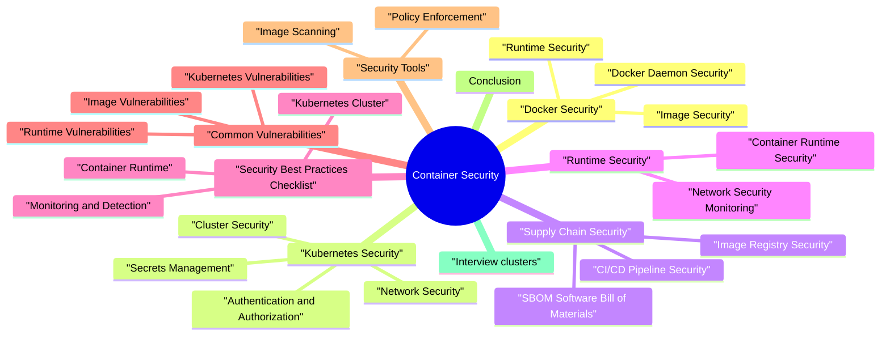

# Container Security revision map

I keep this Container Security map for the night before a screen, when five markdown files is too many clicks. Built from Critical Clarification Container Security Misconceptions.md, Container Security - Comprehensive Guide.md, Container Security - Interview Questions.md, Container Security - Quick Reference.md. Twenty minutes. Then I close the laptop.

### What is Container Security?
- See the source section `What is Container Security?` for the worked example.

### The 4 C's of Cloud-Native Security
- Code - Application code security
- Container - Container image and runtime security
- Cluster - Kubernetes/orchestration security
- Cloud - Infrastructure security

## Docker Security

### Image Security
- Use official, minimal base images
- Prefer Alpine Linux for smaller attack surface
- Avoid images with known vulnerabilities
- Regularly update base images
- Scan images before deployment
- Use tools: Trivy, Clair, Snyk, Docker Scout
- Integrate into CI/CD pipeline
- Block deployment of vulnerable images

### Runtime Security
- Never run containers as root
- Use non-root users
- Set USER directive in Dockerfile
- Use numeric UIDs/GIDs
- Set CPU and memory limits
- Prevent resource exhaustion attacks
- Use cgroups for isolation
- Mount root filesystem as read-only

### Docker Daemon Security
- Enable TLS for Docker daemon
- Use certificates for authentication
- Restrict daemon access
- Enable user namespace remapping
- Isolate container UIDs from host
- Prevents privilege escalation
- Run Docker without root privileges
- Uses user namespaces

## Kubernetes Security

### Cluster Security
- Enable RBAC
- Use TLS for API server
- Restrict network access
- Enable audit logging
- Encrypt etcd data at rest
- Use TLS for etcd communication
- Restrict etcd access
- Regular backups

### Authentication and Authorization
- Define roles and role bindings
- Use least privilege
- Separate cluster and namespace roles
- Regular access reviews
- Use dedicated service accounts
- Don't use default service account
- Limit service account permissions
- Use workload identity (cloud providers)

### Network Security
- Control pod-to-pod communication
- Default deny all traffic
- Allow only necessary communication
- Use namespace isolation
- Use Istio, Linkerd, or Consul
- Mutual TLS (mTLS) for service-to-service communication
- Traffic policies and access control
- Observability and security

### Secrets Management
- Store sensitive data
- Base64 encoded (not encrypted by default)
- Use external secret management for production
- HashiCorp Vault
- AWS Secrets Manager
- Azure Key Vault
- GCP Secret Manager
- [ ] Don't hardcode secrets

### Pod Security
- Define security context at pod and container level
- Run as non-root
- Drop all capabilities
- Use read-only root filesystem
- Set CPU and memory requests/limits
- Prevent resource exhaustion
- Enable resource quotas
- Use specific tags, not "latest"

## Supply Chain Security

### Image Registry Security
- Use private registries for production
- Implement access controls
- Scan images in registry
- Enable image signing
- Authenticate before pull/push
- Use image pull secrets
- Implement registry scanning
- Monitor registry access

### CI/CD Pipeline Security
- Use trusted base images
- Scan dependencies
- Sign artifacts
- Secure build secrets
- Scan application dependencies
- Use Snyk, OWASP Dependency-Check
- Block vulnerable dependencies
- Update dependencies regularly

### SBOM (Software Bill of Materials)
- Generate SBOM for containers
- Track all dependencies
- Use SPDX or CycloneDX format
- Store with images

## Runtime Security

### Container Runtime Security
- Monitor container behavior
- Detect anomalies
- Use Falco, Aqua, or Sysdig
- Alert on suspicious activity
- Validate and mutate resources
- Use OPA Gatekeeper, Kyverno
- Enforce policies
- Block non-compliant resources

### Network Security Monitoring
- Monitor pod-to-pod communication
- Detect lateral movement
- Use Cilium, Calico network policies
- Implement network segmentation
- Track service-to-service calls
- Monitor mTLS connections
- Detect policy violations
- Use Istio, Linkerd telemetry

## Security Best Practices Checklist

### Container Runtime
- [ ] Run containers as non-root
- [ ] Set resource limits
- [ ] Use read-only root filesystem
- [ ] Drop unnecessary capabilities
- [ ] Use security profiles (AppArmor/SELinux)
- [ ] Implement seccomp profiles
- [ ] Limit exposed ports

### Kubernetes Cluster
- [ ] Enable RBAC
- [ ] Use Pod Security Standards
- [ ] Implement network policies
- [ ] Enable audit logging
- [ ] Secure etcd
- [ ] Use TLS for all communication
- [ ] Regularly update Kubernetes

### Monitoring and Detection
- [ ] Enable runtime security monitoring
- [ ] Monitor container behavior
- [ ] Set up alerts for anomalies
- [ ] Log all security events
- [ ] Use SIEM for correlation
- [ ] Regular security assessments

## Common Vulnerabilities

### Image Vulnerabilities
- Outdated Base Images:
- Risk: Known vulnerabilities
- Fix: Regular updates, automated scanning
- Included Secrets:
- Risk: Credential exposure
- Fix: Use secret management, scan images
- Excessive Permissions:
- Risk: Privilege escalation

### Runtime Vulnerabilities
- Container Escape:
- Risk: Host system compromise
- Fix: Use user namespaces, security profiles
- Resource Exhaustion:
- Risk: DoS attacks
- Fix: Set resource limits, quotas
- Network Exposure:
- Risk: Unauthorized access

### Kubernetes Vulnerabilities
- Overly Permissive RBAC:
- Risk: Unauthorized access
- Fix: Least privilege, regular reviews
- Missing Network Policies:
- Risk: Lateral movement
- Fix: Default deny, explicit allow
- Unencrypted Secrets:
- Risk: Data exposure

## Security Tools

### Image Scanning
- Trivy: Fast, comprehensive scanning
- Clair: Open-source vulnerability scanner
- Snyk: Dependency and container scanning
- Docker Scout: Docker's scanning tool

### Policy Enforcement
- OPA Gatekeeper: Policy engine for Kubernetes
- Kyverno: Kubernetes policy engine
- Pod Security Standards: Built-in Kubernetes security

## Conclusion
- Secure images from the start
- Run containers with least privilege
- Implement network segmentation
- Manage secrets securely
- Monitor runtime behavior
- Enforce policies automatically
- Regular security assessments

## Interview clusters
- Fundamentals: "Why non-root in containers?" "Image vs runtime security?"
- Senior: "Admission control-what would you enforce first?" "How do secrets reach pods safely?"
- Staff: "Design Kubernetes security for multi-tenant platform team serving 200 apps."

## Cross-links
- Cloud-Native Security Patterns, Software Supply Chain Security, IAM, Zero Trust, Secure CI/CD.

## Cheat sheet bits

## The 4 C's of Cloud-Native Security

## Docker Security Checklist

### Image Security
- [ ] Use minimal base images (Alpine)
- [ ] Scan images for vulnerabilities
- [ ] Sign images cryptographically
- [ ] Use specific tags (not "latest")
- [ ] Remove unnecessary packages
- [ ] Multi-stage builds

### Runtime Security
- [ ] Run as non-root user
- [ ] Set resource limits
- [ ] Read-only root filesystem
- [ ] Drop unnecessary capabilities
- [ ] Use security profiles
- [ ] Limit exposed ports

## Kubernetes Security Checklist

### Cluster Security
- [ ] Enable RBAC
- [ ] Use Pod Security Standards
- [ ] Implement network policies
- [ ] Enable audit logging
- [ ] Secure etcd
- [ ] Use TLS for all communication

### Pod Security
- [ ] Run as non-root
- [ ] Drop all capabilities
- [ ] Read-only root filesystem
- [ ] Set resource limits
- [ ] Use security contexts
- [ ] Image pull secrets

### Secrets Management
- [ ] Use external secret management
- [ ] Don't hardcode secrets
- [ ] Rotate secrets regularly
- [ ] Use service accounts
- [ ] Encrypt etcd at rest

## Dockerfile Best Practices

## Kubernetes Security Context

## Network Policy Examples

### Default Deny All
- See the source section `Default Deny All` for the worked example.

### Allow Specific Traffic
- See the source section `Allow Specific Traffic` for the worked example.

## RBAC Examples

### Role
- See the source section `Role` for the worked example.

### RoleBinding
- See the source section `RoleBinding` for the worked example.

## Pod Security Standards

## Security Tools

### Image Scanning
- See the source section `Image Scanning` for the worked example.

### Policy Enforcement
- See the source section `Policy Enforcement` for the worked example.

## Common Vulnerabilities

## Quick Commands

### Docker
- See the source section `Docker` for the worked example.

### Kubernetes
- See the source section `Kubernetes` for the worked example.

## Security Metrics

## Incident Response
- Detect - Identify security event
- Contain - Isolate affected pods
- Investigate - Analyze logs, Falco events
- Remediate - Fix vulnerabilities
- Recover - Redeploy secure containers
- Lessons Learned - Update policies

## Key Takeaways
- Defense in Depth - Secure each layer
- Least Privilege - Run as non-root, minimal permissions
- Network Segmentation - Use network policies
- Secrets Management - External secret management
- Continuous Monitoring - Runtime threat detection
- Supply Chain Security - Scan and sign images
- Policy Enforcement - Automated security policies

## Traps that dump interviews

## ️ Common Misconceptions

### "Containers are inherently secure because they're isolated"
- Truth: Containers provide isolation but not complete security. They share the host kernel and can be compromised if not properly configured.
- Process isolation (namespaces)
- Filesystem isolation
- Network isolation
- Resource limits (cgroups)
- Complete security (shared kernel)
- Protection from kernel vulnerabilities
- Automatic security hardening

### "Running as root in containers is safe because it's isolated"
- Truth: Running containers as root is dangerous even with isolation. Root in container = root on host if container escapes.
- Container Escape:
- Kernel vulnerabilities can allow escape
- Root in container = root on host
- Full system compromise
- Privilege Escalation:
- Exploiting container runtime
- Accessing host resources

### "Image scanning is enough for container security"
- Truth: Image scanning is important but not sufficient. You need runtime security, network policies, and proper configuration.
- Image Security:
- Vulnerability scanning
- Base image selection
- Image signing
- Runtime Security:
- Non-root execution
- Resource limits

### "Kubernetes security is handled by the platform"
- Truth: Kubernetes provides security features but you must configure and use them. Default settings are often permissive.
- RBAC (but not enabled by default in older versions)
- Network policies (but not enforced by default)
- Pod Security Standards (but not applied by default)
- Secrets management (but secrets are base64 encoded, not encrypted)
- Enable RBAC
- Implement network policies
- Apply Pod Security Standards

### "Secrets in Kubernetes are encrypted"
- Truth: Kubernetes secrets are base64 encoded, not encrypted by default. They need to be encrypted at rest.
- Secrets are base64 encoded (not encryption)
- Anyone with cluster access can decode them
- Stored in etcd (may not be encrypted)
- Enable encryption at rest for etcd
- Use external secret management (Vault, AWS Secrets Manager)
- Limit access to secrets via RBAC
- Rotate secrets regularly

### "Container images from official repositories are always safe"
- Truth: Official images can have vulnerabilities and may not follow security best practices. Always scan and review.
- Vulnerabilities:
- Base images may have known CVEs
- Dependencies may be outdated
- Need regular updates
- Size and Attack Surface:
- Official images often large
- Include unnecessary packages

### "Container security is only about the image"
- Truth: Container security spans the entire lifecycle: build, registry, deployment, runtime, and orchestration.
- Build Time:
- Secure base images
- Minimal dependencies
- Non-root users
- Image signing
- Registry:
- Access control

### "Resource limits prevent all DoS attacks"
- Truth: Resource limits help prevent DoS but don't prevent all attacks. You need additional controls.
- CPU exhaustion
- Memory exhaustion
- Resource starvation
- Application-level DoS
- Network-based attacks
- Slowloris attacks
- Application logic flaws

### "Service mesh automatically secures all communication"
- Truth: Service mesh provides mTLS and traffic management but requires proper configuration and doesn't replace application security.
- mTLS between services
- Traffic management
- Observability
- Policy enforcement
- Application-level security
- Input validation
- Authorization logic

### "Container security is the same as VM security"
- Truth: Containers and VMs have different security models and require different security approaches.
- Containers: Shared kernel = kernel vulnerabilities affect all
- VMs: Separate kernels = better isolation
- Containers: Faster deployment = faster patching
- VMs: More isolation = better for multi-tenancy

## Key Takeaways
- Containers need explicit security - Isolation alone is not enough
- Never run as root - Root in container = root on host if escaped
- Defense in depth - Image scanning + runtime + network + orchestration
- Configure Kubernetes security - Defaults are often permissive
- Secrets need encryption - Base64 encoding is not encryption
- Scan all images - Even official images can have vulnerabilities
- Lifecycle security - Secure at build, registry, deployment, runtime
- Multiple DoS protections - Resource limits + rate limiting + policies

## Prompts I drill out loud

- Fundamental Questions
- Explain the 4 C's of cloud-native security.
- How do you secure a Docker image?
- What are the security risks of running containers as root?
- How do you implement network security in Kubernetes?
- Explain RBAC in Kubernetes.
- Docker-Specific Questions
- How do you secure the Docker daemon?
- What is Docker Content Trust and how does it work?
- Kubernetes-Specific Questions
- How do you manage secrets in Kubernetes?
- What are Pod Security Standards?
- How do you implement admission control in Kubernetes?
- Runtime Security Questions
- How do you detect container runtime threats?
- What is a service mesh and how does it improve security?
- Supply Chain Security
- How do you secure the container supply chain?
- Scenario-Based Questions
- You discover a container running as root. What do you do?
- How would you design a secure Kubernetes cluster?
- Depth: Interview follow-ups - Container Security

## Conclusion

## Depth: Interview follow-ups - Container Security
- Authoritative references: NIST SP 800-190 (container security guide); CIS Docker Benchmark / CIS Kubernetes Benchmark (verify access).
- Root in container / privileged flags - escape risk.
- Image provenance & scanning - supply chain tie-in.
- Network policies - default deny between pods/namespaces.

## Sibling folders

- Stay inside this folder for the long guide. Jump only when a section names a sibling topic.
- Cookie Security, CSRF, XSS, JWT, OAuth, and TLS show up as neighbors on a lot of these maps.
