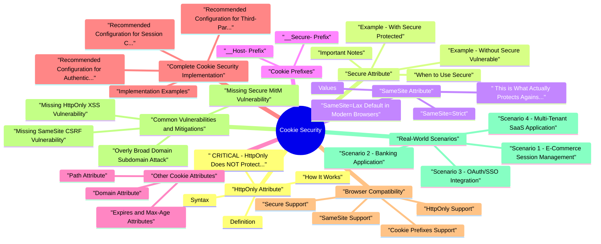

# Cookie Security revision map

Last mock I bounced around the Cookie Security folder. This file is the stop that. Drawn from Critical Clarification HttpOnly vs CSRF Protection.md, HttpOnly and Secure cookies.md, HttpOnly and Secure Cookies Interview Questions &.md, Cookie Security - Quick Reference Guide.md, Cookie Security - VAPT Methodology.md. Skim the mermaid, then the outline.

### What are Cookies?
- Cookies are name-value pairs sent by the server via the Set-Cookie header and automatically included by the browser in subsequent requests via the Cookie header. They are commonly used for:
- Session management
- User authentication
- Personalization
- Tracking and analytics

### Why Cookie Security Matters
- Improperly configured cookies can lead to:
- Session hijacking: Attackers stealing session tokens
- Cross-Site Scripting (XSS): Malicious scripts accessing sensitive cookies
- Cross-Site Request Forgery (CSRF): Unauthorized actions using user's cookies
- Man-in-the-Middle (MitM) attacks: Interception of cookies over insecure connections

## HttpOnly Attribute

### Definition
- The HttpOnly attribute prevents client-side JavaScript from accessing the cookie through document.cookie or other DOM APIs. This attribute is important for protecting sensitive cookies from XSS attacks.
- The Secure attribute ensures cookies are only transmitted over HTTPS connections. Browsers will refuse to send Secure cookies over unencrypted HTTP connections.
- The SameSite attribute controls whether cookies are sent with cross-site requests, providing protection against CSRF attacks. It's one of the most important modern cookie security features.

### ️ CRITICAL: HttpOnly Does NOT Protect Against CSRF
- HttpOnly protects against XSS (Cross-Site Scripting)
- HttpOnly does NOT protect against CSRF (Cross-Site Request Forgery)

### How It Works
- The cookie is sent with HTTP requests automatically
- Server-side code can read and write the cookie
- JavaScript cannot access the cookie via document.cookie
- Browser extensions cannot access the cookie (in most cases)
- Cookie is sent only over HTTPS
- Cookie is sent only over secure WebSocket connections (wss://)
- Cookie is NOT sent over HTTP
- Cookie is NOT sent over insecure WebSocket connections (ws://)

### Syntax
- See the source section `Syntax` for the worked example.

### Example: Without HttpOnly (Vulnerable to XSS)
- See the source section `Example: Without HttpOnly (Vulnerable to XSS)` for the worked example.

### Example: With HttpOnly (Protected from XSS)
- See the source section `Example: With HttpOnly (Protected from XSS)` for the worked example.

### Example: HttpOnly Does NOT Prevent CSRF
- See the source section `Example: HttpOnly Does NOT Prevent CSRF` for the worked example.

### When to Use HttpOnly
- Session tokens
- Authentication cookies
- CSRF tokens (to prevent XSS from stealing them)
- Any sensitive data stored in cookies
- Client-side only cookies (e.g., UI preferences)
- Cookies that need JavaScript access (use with caution)

### Limitations
- Does not protect against CSRF attacks (use SameSite or CSRF tokens)
- Does not encrypt the cookie value
- Does not prevent server-side vulnerabilities
- Does not protect against browser extensions with elevated privileges

## Secure Attribute

### Example: Without Secure (Vulnerable)
- See the source section `Example: Without Secure (Vulnerable)` for the worked example.

### Example: With Secure (Protected)
- See the source section `Example: With Secure (Protected)` for the worked example.

### When to Use Secure
- All cookies containing sensitive data
- Session cookies
- Authentication tokens
- Any cookie in production environments
- Cookies with SameSite=None (required by modern browsers)
- Development environments using HTTP (but use HTTPS in production)

### Important Notes
- Secure does NOT encrypt the cookie value itself
- Secure relies on HTTPS/TLS for encryption
- Cookies without Secure can be intercepted over HTTP
- Modern browsers require Secure for SameSite=None cookies

### Browser Behavior
- Chrome/Edge: Requires Secure for SameSite=None cookies
- Firefox: Requires Secure for SameSite=None cookies
- Safari: Requires Secure for SameSite=None cookies
- All browsers: Will not send Secure cookies over HTTP

## SameSite Attribute

### ️ This is What Actually Protects Against CSRF
- Unlike HttpOnly, the SameSite attribute does protect against CSRF attacks by controlling when cookies are sent with requests.

### Values
- See the source section `Values` for the worked example.

### SameSite=Strict
- Cookie is sent ONLY with same-site requests
- Cookie is NOT sent with any cross-site requests, including top-level navigations
- Maximum CSRF protection
- Banking applications
- Administrative panels
- High-security applications
- When user experience allows for re-authentication

### SameSite=Lax (Default in Modern Browsers)
- Cookie is sent with same-site requests
- Cookie is sent with top-level GET navigations (e.g., clicking a link)
- Cookie is NOT sent with cross-site POST requests, iframes, images, or AJAX calls
- Good balance between security and usability
- Most web applications (recommended default)
- E-commerce sites
- Social media platforms
- When you want CSRF protection without breaking external links

### SameSite=None
- Cookie is sent with both same-site and cross-site requests
- REQUIRES the Secure attribute
- Used for third-party integrations
- Embedded widgets (e.g., payment processors)
- OAuth flows
- Cross-origin API calls
- Third-party authentication
- Must be used with Secure attribute

### SameSite Default Behavior
- Chrome 80+, Edge 80+, Firefox 69+, Safari 13+
- Default to SameSite=Lax if not specified
- Legacy behavior was SameSite=None
- Treat missing SameSite as None
- May send cookies with all requests

### SameSite and CSRF Protection
- Strict Mode:
- Lax Mode:
- None Mode:

## Cookie Prefixes
- Cookie prefixes (__Secure- and __Host-) provide additional security by enforcing constraints at the browser level.

### __Secure- Prefix
- Cookie name must start with __Secure-
- Must have Secure attribute
- Must be set from secure (HTTPS) origin
- Prevents accidental insecure cookie setting
- Enforces secure transmission

### __Host- Prefix
- Cookie name must start with __Host-
- Must have Secure attribute
- Must have Path=/
- Must NOT have Domain attribute
- Must be set from secure (HTTPS) origin
- Prevents subdomain cookie access
- Prevents path-based cookie scope issues
- Maximum isolation

## Other Cookie Attributes

### Domain Attribute
- Controls which domains can receive the cookie.
- If Domain is set to example.com, cookie is sent to:
- example.com
- www.example.com
- api.example.com
- Any subdomain of example.com
- If Domain is NOT set, cookie is sent only to:
- The exact host that set it

### Path Attribute
- Controls which URL paths can access the cookie.
- Cookie is sent only for requests to paths matching the specified path
- Path matching is prefix-based
- Use most restrictive path possible
- Default is the path of the document setting the cookie
- For session cookies, typically use Path=/

### Expires and Max-Age Attributes
- Control when the cookie expires and is deleted.
- Absolute expiration date/time
- Must be in GMT format
- If not set, cookie is a "session cookie" (deleted when browser closes)
- Relative expiration in seconds
- More convenient than Expires
- If both are set, Max-Age takes precedence
- Set short expiration times for sensitive cookies

## Complete Cookie Security Implementation

### Recommended Configuration for Session Cookies
- __Host- prefix: Prevents subdomain access
- Secure: Only over HTTPS
- HttpOnly: No JavaScript access (XSS protection)
- SameSite=Strict: Maximum CSRF protection
- Path=/: Available site-wide
- Max-Age=3600: Expires in 1 hour

### Recommended Configuration for Authentication Cookies
- __Secure- prefix: Enforces secure transmission
- Secure: Only over HTTPS
- HttpOnly: No JavaScript access (XSS protection)
- SameSite=Lax: Balance of CSRF protection and usability
- Path=/: Available site-wide
- Max-Age=86400: Expires in 24 hours

### Recommended Configuration for Third-Party Cookies
- __Secure- prefix: Enforces secure transmission
- Secure: Required for SameSite=None
- HttpOnly: No JavaScript access (XSS protection)
- SameSite=None: Allows cross-site requests (no CSRF protection, use tokens)
- Path=/: Available site-wide
- Max-Age=1800: Expires in 30 minutes

### Implementation Examples
- See the source section `Implementation Examples` for the worked example.

### Node.js (Express)
- See the source section `Node.js (Express)` for the worked example.

### Python (Flask)
- See the source section `Python (Flask)` for the worked example.

### PHP
- See the source section `PHP` for the worked example.

### Java (Spring Boot)
- See the source section `Java (Spring Boot)` for the worked example.

### C# (ASP.NET Core)
- See the source section `C# (ASP.NET Core)` for the worked example.

## Browser Compatibility

### HttpOnly Support
- All modern browsers: Full support
- IE 6+: Supported
- Mobile browsers: Full support

### Secure Support
- All modern browsers: Full support
- IE 6+: Supported
- Mobile browsers: Full support

### SameSite Support
- Chrome 51+: Full support
- Firefox 60+: Full support
- Safari 12+: Full support (with some quirks in older versions)
- Edge 79+: Full support
- ️ IE 11: Not supported
- ️ Older browsers: Not supported (default to None behavior)

### Cookie Prefixes Support
- Chrome 49+: __Secure- and __Host- support
- Firefox 50+: __Secure- and __Host- support
- Safari 12+: __Secure- and __Host- support
- Edge 79+: __Secure- and __Host- support
- ️ IE 11: Not supported (prefixes ignored, but cookies still work)

### Testing Cookie Attributes
- Open DevTools (F12)
- Go to Application/Storage tab
- Click Cookies
- View cookie attributes
- SecurityHeaders.com
- Cookie-Editor browser extension
- Browser DevTools Network tab

## Common Vulnerabilities and Mitigations

### Missing HttpOnly (XSS Vulnerability)
- See the source section `Missing HttpOnly (XSS Vulnerability)` for the worked example.

### Missing Secure (MitM Vulnerability)
- See the source section `Missing Secure (MitM Vulnerability)` for the worked example.

### Missing SameSite (CSRF Vulnerability)
- Note: HttpOnly does NOT prevent this CSRF attack. Only SameSite (or CSRF tokens) can prevent it.

### Overly Broad Domain (Subdomain Attack)
- See the source section `Overly Broad Domain (Subdomain Attack)` for the worked example.

### Long-Lived Cookies (Session Fixation)
- See the source section `Long-Lived Cookies (Session Fixation)` for the worked example.

### SameSite=None Without Secure
- See the source section `SameSite=None Without Secure` for the worked example.

### Cookie Theft via Document.cookie
- See the source section `Cookie Theft via Document.cookie` for the worked example.

## Real-World Scenarios

### Scenario 1: E-Commerce Session Management
- User stays logged in while browsing
- Session persists across page navigations
- Protection against XSS and CSRF
- Good user experience
- __Secure- prefix: Enforces secure transmission
- Secure: HTTPS only
- HttpOnly: XSS protection
- SameSite=Lax: CSRF protection while allowing external links

### Scenario 2: Banking Application
- Maximum security
- No cross-site cookie transmission
- User can re-authenticate if needed
- __Host- prefix: Maximum isolation, no subdomain access
- SameSite=Strict: No cross-site requests (CSRF protection)
- Max-Age=1800: 30-minute session (shorter for security)

### Scenario 3: OAuth/SSO Integration
- Cross-origin cookie transmission
- Third-party authentication
- Secure transmission
- SameSite=None: Allows cross-origin requests
- Secure: Required for SameSite=None
- Max-Age=600: Short-lived (10 minutes) for OAuth state
- Note: No CSRF protection from SameSite, must use CSRF tokens

### Scenario 4: Multi-Tenant SaaS Application
- Cookies scoped to specific tenant
- No cross-tenant cookie access
- Subdomain isolation
- __Host- prefix: Prevents subdomain access
- Each tenant gets isolated cookies
- No Domain attribute ensures host-specific scope

### Scenario 5: API Authentication
- RESTful API authentication
- Mobile app and web app support
- Token-based authentication
- Path=/api: Scoped to API endpoints
- SameSite=Strict: Maximum security for API
- Consider using Bearer tokens instead for APIs

### Scenario 6: Remember Me Functionality
- Long-lived authentication
- Persistent login
- Secure storage
- Separate tokens for different purposes
- Remember token can be longer-lived
- Session token should be short-lived
- Both should be HttpOnly and Secure

## Advanced Cookie Topics (Interview Depth)

### Partitioned cookies (CHIPS) for embedded contexts
- Modern browsers support partitioned cookies for some third-party scenarios so state is isolated per top-level site.
- Reduces cross-site tracking and cross-tenant state bleed for embedded widgets
- Safer than unrestricted third-party cookie behavior
- Still requires strict server-side authZ and origin checks

### Cookie tossing and scope confusion
- Even with good flags, scope mistakes create risk:
- Over-broad Domain=.example.com allows sibling subdomain influence
- Multiple cookies with same name but different path/domain create precedence ambiguity
- Reverse proxies/apps may parse duplicate cookies differently
- Prefer __Host- for primary session cookie
- Keep one authoritative session cookie name/path
- Reject requests with duplicate security-sensitive cookie names

### Rotation and replay-aware session architecture
- Cookie flags protect transport and script access, but incident resilience needs rotation logic:
- Rotate session IDs after login, privilege change, and sensitive account events
- Rotate remember-me artifacts independently from active session cookie
- Track token family and invalidate on suspicious reuse

### Essential Cookie Security Checklist
- HttpOnly: Prevents JavaScript access (XSS protection)
- Secure: HTTPS only transmission
- SameSite: CSRF protection (Strict or Lax)
- __Host- or __Secure- prefix: Additional security enforcement
- Short Max-Age: Limit exposure window
- Restrictive Path: Minimize scope
- Setting Domain unless necessary
- Long expiration times

### Quick Reference
- See the source section `Quick Reference` for the worked example.

### Final Recommendations
- Default Configuration:
- High Security Configuration:
- Third-Party Configuration:

### Key Takeaways
- HttpOnly protects against XSS, NOT CSRF
- SameSite protects against CSRF
- Secure ensures HTTPS-only transmission
- Use all three together for maximum security
- Cookie prefixes add additional enforcement

## Flags I check in 90 seconds

## ️ Critical Clarification
- HttpOnly protects against XSS, NOT CSRF!
- HttpOnly = XSS protection
- SameSite = CSRF protection
- Secure = HTTPS-only transmission

## Cookie Attributes Cheat Sheet

## Recommended Configurations

### Standard Web Application
- See the source section `Standard Web Application` for the worked example.

### High-Security Application (Banking)
- See the source section `High-Security Application (Banking)` for the worked example.

### Third-Party Integration
- See the source section `Third-Party Integration` for the worked example.

## Attack Protection Matrix
- With __Host- prefix

## Common Mistakes

### Wrong: HttpOnly protects against CSRF
- See the source section `Wrong: HttpOnly protects against CSRF` for the worked example.

### Correct: Use SameSite for CSRF protection
- See the source section `Correct: Use SameSite for CSRF protection` for the worked example.

### Wrong: SameSite=None without Secure
- See the source section `Wrong: SameSite=None without Secure` for the worked example.

### Correct: SameSite=None with Secure
- See the source section `Correct: SameSite=None with Secure` for the worked example.

### Wrong: __Host- with Domain
- See the source section `Wrong: __Host- with Domain` for the worked example.

### Correct: __Host- without Domain
- See the source section `Correct: __Host- without Domain` for the worked example.

## Implementation Snippets

### Node.js/Express
- See the source section `Node.js/Express` for the worked example.

### Python/Flask
- See the source section `Python/Flask` for the worked example.

### PHP
- See the source section `PHP` for the worked example.

## Testing Checklist
- [ ] Cookies have HttpOnly attribute
- [ ] Cookies have Secure attribute (production)
- [ ] Cookies have SameSite attribute (Strict or Lax)
- [ ] [ ] SameSite=None cookies have Secure
- [ ] [ ] __Host- cookies don't have Domain
- [ ] [ ] __Host- cookies have Path=/
- [ ] Expiration times are reasonable
- [ ] Cookies not accessible via document.cookie

## Browser Compatibility

## Quick Decision Tree

## Common Interview Questions
- Does HttpOnly protect against CSRF?
- No, HttpOnly protects against XSS. Use SameSite for CSRF.
- What's the difference between SameSite=Strict and Lax?
- Strict: No cross-site requests. Lax: Allows top-level GET navigations.
- Why does SameSite=None require Secure?
- Modern browsers enforce this to prevent insecure cross-site cookies.
- What's the purpose of __Host- prefix?
- Prevents subdomain access and enforces Path=/ and no Domain.

## Security Best Practices
- Always use HttpOnly for sensitive cookies
- Always use Secure in production
- Always set SameSite (Strict or Lax)
- Use short expiration times
- Use cookie prefixes when possible
- Don't set Domain unless necessary
- Use Path=/ for site-wide cookies
- Implement server-side session validation

## Remember
- HttpOnly = XSS protection (JavaScript cannot access)
- Secure = HTTPS-only (prevents interception)
- SameSite = CSRF protection (controls when cookie sent)
- Use all three together for maximum security

## Misreads that still sneak in

## ️ Common Misconception
- Question: "If HttpOnly can only be used for CSRF tokens, then it is not protecting against CSRF attacks?"
- Answer: This question reveals a common misunderstanding. Let me clarify:

## The Truth

### HttpOnly Does NOT Protect Against CSRF Attacks
- HttpOnly protects against XSS (Cross-Site Scripting), NOT CSRF (Cross-Site Request Forgery).
- These are two completely different attack vectors:

## Understanding the Attacks

### XSS Attack (What HttpOnly Protects Against)
- Prevents JavaScript from accessing cookies
- Protects against XSS cookie theft
- Does NOT protect against CSRF

### CSRF Attack (What HttpOnly Does NOT Protect Against)
- See the source section `CSRF Attack (What HttpOnly Does NOT Protect Against)` for the worked example.

## What Actually Protects Against CSRF?

### SameSite Attribute (Cookie-Level Protection)
- See the source section `SameSite Attribute (Cookie-Level Protection)` for the worked example.

### CSRF Tokens (Application-Level Protection)
- See the source section `CSRF Tokens (Application-Level Protection)` for the worked example.

## Complete Picture

### HttpOnly + CSRF Token = Defense in Depth
- HttpOnly on Session Cookie:
- Prevents XSS from stealing session cookie
- Does NOT prevent CSRF (browser still sends cookie)
- HttpOnly on CSRF Token:
- Prevents XSS from stealing CSRF token
- Token validation prevents CSRF (server checks token)
- SameSite on Session Cookie:
- Prevents browser from sending cookie with cross-site requests

## Visual Comparison

### Attack Scenario 1: XSS (HttpOnly Protects)
- See the source section `Attack Scenario 1: XSS (HttpOnly Protects)` for the worked example.

### Attack Scenario 2: CSRF (HttpOnly Does NOT Protect)
- See the source section `Attack Scenario 2: CSRF (HttpOnly Does NOT Protect)` for the worked example.

## Key Takeaways

### HttpOnly
- Protects against: XSS cookie theft
- Does NOT protect against: CSRF attacks
- Purpose: Prevent JavaScript from accessing cookies

### SameSite
- Protects against: CSRF attacks
- Purpose: Control when cookies are sent with requests

### CSRF Tokens
- Protects against: CSRF attacks
- Should be HttpOnly: To prevent XSS from stealing them
- Purpose: Validate that request came from legitimate form

### Best Practice
- See the source section `Best Practice` for the worked example.

## Common Interview Question
- Q: "Does HttpOnly protect against CSRF attacks?"

## Summary Table

## Real-World Example

### Vulnerable Configuration (CSRF Attack Succeeds)
- See the source section `Vulnerable Configuration (CSRF Attack Succeeds)` for the worked example.

### Protected Configuration (CSRF Attack Fails)
- Remember: HttpOnly protects against XSS, not CSRF. Use SameSite or CSRF tokens to protect against CSRF.

## Lab methodology

## Scope & Cookie Model
- Identify what cookies are used for:
- Session identification (auth cookies, JWTs in cookies).
- "Remember me" or persistent login.
- CSRF protection (tokens, SameSite behavior).
- Feature flags, preferences, analytics (lower risk but still relevant).
- Understand trust and sensitivity:
- Which cookies grant access to authenticated sessions or elevated privileges.
- Which cookies carry identifiers that tie to sensitive server‑side state.

## Mapping Cookies & Attributes
- Enumerate all cookies for the application domain(s):
- Name, value shape (do not log real values in shared artifacts).
- Domain and Path.
- Secure, HttpOnly, SameSite attributes.
- Expiration (session vs persistent).
- Associate cookies with functionality:
- Login / authenticated navigation.
- Multi‑factor authentication flows.

## Assessment Strategy (Configuration & Behavior)
- Transport security:
- Are sensitive cookies (auth, session) set with Secure and delivered only over HTTPS?
- Is HTTP access redirected to HTTPS consistently?
- Script access:
- Are authentication cookies marked HttpOnly where feasible?
- Are any sensitive tokens stored in JavaScript‑accessible storage (local/session storage) instead of HttpOnly cookies?
- Cross‑site handling:
- SameSite configuration:

## Dynamic Testing - What to Observe
- Login and logout flows:
- Which cookies appear on login and disappear on logout.
- Whether old authentication cookies remain valid after logout or password change.
- HTTP vs HTTPS:
- Behavior when accessing the app over plain HTTP (if allowed by scope):
- Are sensitive cookies ever sent over HTTP?
- Are there redirects to HTTPS before cookies are set or used?
- Cross‑origin behavior:

## High‑Risk Scenarios
- Primary authentication cookies:
- Session cookies tied to account access.
- "Remember me" cookies that can re‑establish sessions.
- Admin / privileged session cookies:
- Management consoles, admin dashboards, support tools.
- Cookies spanning multiple applications:
- Shared authentication across subdomains or related products.
- CSRF‑related cookies:

## Tooling & Aids
- Browser dev tools:
- Inspect cookies, attributes, and their changes in real time.
- Simulate navigation scenarios (same‑site, cross‑site, different schemes).
- Proxy tooling:
- Observe Set-Cookie and Cookie headers at the HTTP level.
- Compare behavior under different paths, subdomains, and schemes.
- Configuration / code review (if available):
- Framework‑level cookie/session configuration.

## Verifying Risk Safely
- Rather than attempting to "steal" cookies, focus on:
- Evidence of weak configuration:
- Sensitive cookies lacking Secure or HttpOnly attributes.
- Overscoped domain/path that exposes cookies to additional surfaces.
- Misaligned SameSite that weakens CSRF defenses.
- Session lifecycle behavior:
- Sessions that remain valid longer than intended.
- Cookies not invalidated when account security changes (password reset, MFA changes).

## Reporting & Risk Assessment
- For each cookie‑related issue, document:
- Affected cookie(s) (by name, without exposing real values).
- Attributes and observed behavior (Secure, HttpOnly, SameSite, Domain, Path).
- Functional context:
- What the cookie enables (authentication, CSRF protection, preferences).
- Potential impact:
- Risk of exposure over insecure transport.
- Increased susceptibility to client‑side attack surface (e.g., from XSS).

## Remediation Guidance
- Strengthen cookie attributes:
- Secure on all sensitive cookies in HTTPS deployments.
- HttpOnly for authentication/session cookies where practical.
- Appropriate SameSite values aligned with CSRF and SSO design.
- Tighten scope:
- Restrict Domain and Path to the minimum required.
- Avoid setting cookies at high‑level domains without clear need.
- Improve lifecycle management:

## Re‑Testing Checklist
- [ ] Confirm all sensitive cookies:
- [ ] Are marked Secure in HTTPS environments.
- [ ] Use HttpOnly where applicable.
- [ ] Have appropriate SameSite and scoped Domain/Path.
- [ ] Re‑exercise login, logout, and key flows:
- [ ] Sessions behave correctly and securely.
- [ ] No unintended regressions in SSO or cross‑site features.
- [ ] Update:

## Clusters from the Q&A file

- Fundamental Questions
- What is the HttpOnly attribute and what does it protect against?
- What is the Secure attribute and why is it important?
- Does HttpOnly protect against CSRF attacks?
- What is the SameSite attribute and how does it protect against CSRF?
- What are cookie prefixes (__Secure- and __Host-)?
- Scenario-Based Questions
- How would you configure cookies to prevent both XSS and CSRF attacks?
- A user reports that they get logged out when clicking links from email. What could be the cause?
- Your application needs to work with third-party widgets. How do you configure cookies?
- You discover that your session cookies are being sent over HTTP. What's wrong?
- An attacker successfully performs a CSRF attack even though your cookies have HttpOnly. Why?
- Your multi-tenant SaaS application has cookies accessible across subdomains. How do you fix this?
- Your CSRF tokens are being stolen via XSS. How do you protect them?
- Implementation Questions
- How do you set secure cookies in Node.js/Express?
- How do you set secure cookies in Python/Flask?
- How do you verify that cookies are set correctly?
- Troubleshooting Questions
- Cookies are not being set. What could be wrong?
- Users are getting logged out unexpectedly. What could cause this?
- Explain the difference between HttpOnly, Secure, and SameSite attributes.
- How do you implement "Remember Me" functionality securely?
- How do cookie security attributes work together in a defense-in-depth strategy?

## Advanced Questions

## Quick Reference Answers

### What protects against XSS?
- See the source section `What protects against XSS?` for the worked example.

### What protects against CSRF?
- Answer: SameSite attribute (Strict or Lax) or CSRF tokens

### What protects against MitM attacks?
- See the source section `What protects against MitM attacks?` for the worked example.

### What is the recommended cookie configuration?
- Answer: __Secure-sessionId=token; Secure; HttpOnly; SameSite=Lax; Path=/; Max-Age=3600

### Does HttpOnly protect against CSRF?
- Answer: No, HttpOnly only protects against XSS. Use SameSite or CSRF tokens for CSRF protection.

## Depth: Interview follow-ups - Cookie Security
- Authoritative references: RFC 6265 (HTTP cookies); SameSite cookies (MDN-browser behavior); OWASP Session Management.
- SameSite=Lax vs Strict vs None - when is None required and what else is mandatory?
- Prefix cookies (__Host-, __Secure-) - deployment constraints.
- Domain / Path scope - minimizing blast radius.

## Depth: Interview follow-ups - HttpOnly & Secure Cookies
- Authoritative references: MDN Set-Cookie; OWASP Session Management CS; SameSite (browser enforcement).
- HttpOnly stops JS read-not CSRF - why browsers still attach cookies on cross-site requests per policy.
- SameSite=None requires Secure - deployment gotchas.
- Subdomain cookie scope - Domain= attribute risks.

## Cross-links I actually follow

- Stay inside this folder for the long guide. Jump only when a section names a sibling topic.
- Cookie Security, CSRF, XSS, JWT, OAuth, and TLS show up as neighbors on a lot of these maps.
