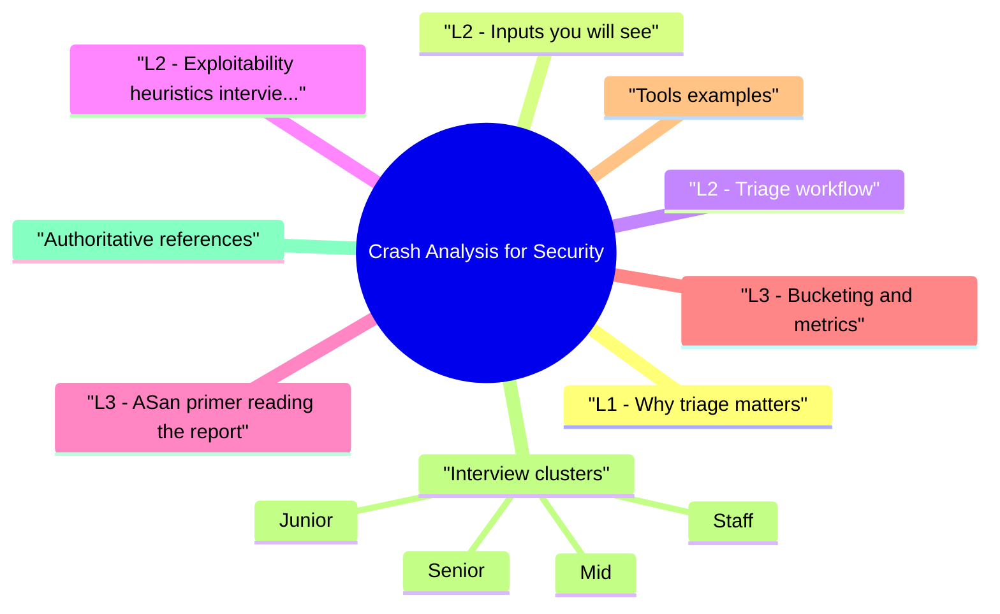

# Crash Analysis for Security revision map

This is the Crash Analysis for Security spine I actually use. Types, failures, fixes, traps. Sources: Critical Clarification Crash Analysis for Security Misconceptions.md, Crash Analysis for Security - Comprehensive Guide.md, Crash Analysis for Security - Interview Questions & Answers.md, Crash Analysis for Security - Quick Reference.md. I do not treat it as a second textbook.

## L1 - Why triage matters
- Fuzzing produces thousands of unique crashes-many duplicates or benign.
- Production crashes may hide memory safety regressions or DoS.
- Consistent rubric prevents alert fatigue and wrong SLAs.

## L2 - Inputs you will see

## L2 - Triage workflow
- Reproduce on known build (commit hash / symbol server).
- Minimize input (delta debugging, creduce).
- Root cause: which line / allocator state?
- Security impact: control of size / pointer? User reachable?
- Dedupe: same root cause as existing bug?
- Route: CVE? internal severity? duplicate report?

## L2 - Exploitability heuristics (interview-safe)
- Attacker controls length and content of overflow.
- Write primitive with controlled value and target.
- UAF with victim object under attacker influence.
- Fixed null deref without user input path.
- Debug-only assert in unreachable config.

## L3 - ASan primer (reading the report)
- ERROR: type (heap-buffer-overflow, stack-buffer-overflow, use-after-free, double-free).
- Shadow bytes show redzone violations.
- Stack trace of allocation and free sites for UAF.

## L3 - Bucketing and metrics
- Bucket by top N frames + fault type-not only hash of input.
- Track new regressions vs known noise.
- SLA: security crash class vs quality crash.

## Tools (examples)
- gdb, lldb, WinDbg, rr (record/replay), creduce, Bugzilla/Jira automation

## Interview clusters

### Junior
- Why minimize crash inputs?

### Mid
- ASan vs Valgrind (speed vs coverage themes).

### Senior
- How do you prevent duplicate CVEs from same root cause?

### Staff
- Org dashboard: crash -> exploitability -> MTTR

## Authoritative references
- LLVM Sanitizer documentation
- Microsoft WinDbg docs
- GDB user manual
- CERT vulnerability analysis practices

## Cross-links
- Fuzzing · Exploit Development · Rapid Security Triage · Vulnerability Management

## Verification checklist
- [ ] Walk one ASan report verbally.
- [ ] Explain dedupe strategy.
- [ ] One example of overrated vs underrated crash.

## The one-pager, exploded

## Workflow
- Repro -> minimize -> root cause -> security impact -> dedupe -> route

## Fault types (keywords)
- OOB read/write · UAF · double free · stack smash · null deref

## Signals
- ASan/UBSan · gdb/lldb bt · WinDbg !analyze · symbolicated mobile stacks

## Exploitability (quick)
- User control? Primitive strength? Reachable? Mitigations?

## Dedupe
- Stack signature + component + fault class - verify same fix

## Tools
- creduce · rr · symbol servers · issue tracker automation

## Cross-read
- Fuzzing · Exploit Development · Rapid Triage · Vuln Management

## One-liner

## What people get wrong

## "If ASan says heap overflow, it's always exploitable."
- Reality: Sanitizer finds undefined behavior; exploitability needs control and reachability analysis.

## "All crashes from fuzzing are security bugs."
- Reality: OOM, timeouts, and logic asserts may be quality only-classify before CVE.

## "Stack trace alone is enough to close as duplicate."
- Reality: Different inputs can hit same frame via different paths-verify root cause.

## "Production crashes are too noisy to use."
- Reality: Sampling + symbolication + clustering surfaces real regressions-especially after releases.

## "Minimization is optional."
- Reality: Without minimal repro, engineers can't fix fast and regressions recur.

## "Debug build crash equals release crash."
- Reality: Optimizations change layout; repro on release symbols when possible.

## "If we can't exploit it, severity is Low."
- Reality: DoS or privacy leaks may still be High; exploitability ≠ only metric.

## "Automated triage replaces humans."
- Reality: Automation routes and clusters; judgment remains for edge cases.

## Questions that showed up in mocks

- Q: What is crash minimization?
- Q: How do you dedupe fuzzer findings?
- Q: When is a heap buffer overflow not Critical?
- Q: What tools help prove exploitability?
- Q: Who owns crash triage in a large org?

## 60-second answer
- Q: How do you analyze crashes for security impact?

## Triage

## Exploitability

## Process

## Depth: Follow-ups
- Production crash rate vs security sampling.
- False positive ASan in optimized builds?
- Symbolic execution in triage (when worth it).

## Mock ladder

## If I only open two more topics

- Stay inside this folder for the long guide. Jump only when a section names a sibling topic.
- Cookie Security, CSRF, XSS, JWT, OAuth, and TLS show up as neighbors on a lot of these maps.
