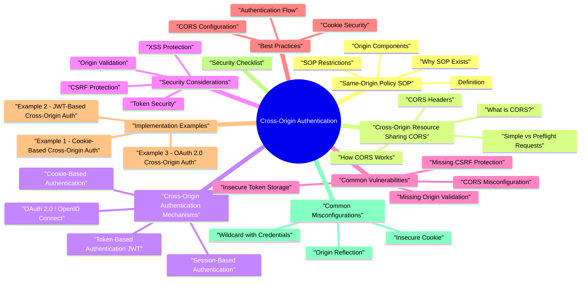

# Cross-Origin Authentication revision map

I keep this Cross-Origin Authentication map for the night before a screen, when five markdown files is too many clicks. Built from Critical Clarification Cross-Origin Authentication Misconceptions.md, Cross-Origin Authentication - Comprehensive Guide.md, Cross-Origin Authentication - Interview Questions.md, Cross-Origin Authentication - Quick Reference.md. Twenty minutes. Then I close the laptop.

### What is Cross-Origin Authentication?
- See the source section `What is Cross-Origin Authentication?` for the worked example.

### Why Cross-Origin Authentication Matters
- Modern Web Architecture: Applications often use separate domains for frontend and backend
- SSO Requirements: Users need to authenticate once across multiple services
- Third-Party Integration: Applications integrate with external authentication providers
- Microservices: Services communicate across different origins

## Same-Origin Policy (SOP)

### Definition
- Same-Origin Policy is a browser security mechanism that restricts how documents or scripts from one origin can interact with resources from another origin.

### Origin Components
- An origin is defined by three components:
- Scheme (Protocol): http, https
- Host (Domain): example.com
- Port: 80, 443, 8080, etc.

### SOP Restrictions
- Reading data from different origins
- Making certain cross-origin requests
- Accessing cookies from different origins
- Accessing localStorage from different origins
- Embedding resources (images, scripts, iframes)
- Form submissions (but can't read response)
- Links to different origins

### Why SOP Exists
- Prevents malicious websites from accessing your data
- Protects against XSS attacks stealing data
- Prevents unauthorized access to cookies and tokens
- Maintains user privacy and security

## Cross-Origin Resource Sharing (CORS)

### What is CORS?
- CORS is a mechanism that allows servers to specify which origins can access their resources, relaxing SOP restrictions in a controlled way.

### How CORS Works
- Browser sends request with Origin header
- Server responds with CORS headers
- Browser checks if origin is allowed
- Browser allows or blocks the request

### CORS Headers
- Origin: The origin making the request
- Access-Control-Request-Method: Method for preflight
- Access-Control-Request-Headers: Headers for preflight
- Access-Control-Allow-Origin: Allowed origins
- Access-Control-Allow-Methods: Allowed HTTP methods
- Access-Control-Allow-Headers: Allowed request headers
- Access-Control-Allow-Credentials: Whether credentials are allowed
- Access-Control-Max-Age: Cache duration for preflight

### Simple vs Preflight Requests
- GET, HEAD, POST
- Simple headers (Accept, Content-Language, Content-Type)
- Content-Type: application/x-www-form-urlencoded, multipart/form-data, text/plain
- No preflight needed
- Custom methods (PUT, DELETE, PATCH)
- Custom headers
- Content-Type: application/json
- Requires OPTIONS request first

## Cross-Origin Authentication Mechanisms

### Cookie-Based Authentication
- User authenticates on auth.example.com
- Server sets cookie with authentication token
- App on app.example.com needs to use this cookie
- Requires CORS with credentials
- Use SameSite attribute on cookies
- Use Secure flag (HTTPS only)
- Use HttpOnly flag (prevent JavaScript access)
- Validate origin on server

### Token-Based Authentication (JWT)
- User authenticates, receives JWT
- JWT stored in localStorage or memory
- JWT sent in Authorization header
- No cookies needed
- Validate JWT signature
- Check expiration
- Use HTTPS for token transmission
- Consider token storage security (XSS risk with localStorage)

### OAuth 2.0 / OpenID Connect
- User redirected to authorization server
- User authenticates and grants consent
- Authorization code returned to app
- App exchanges code for tokens
- Tokens used for API access
- Use Authorization Code flow (not Implicit)
- Validate redirect_uri
- Use PKCE for public clients

### Session-Based Authentication
- User authenticates, server creates session
- Session ID stored in cookie
- Cookie sent with each request
- Server validates session
- Use secure, HttpOnly cookies
- Implement CSRF protection
- Use SameSite attribute appropriately
- Validate session on server

## Security Considerations

### CSRF Protection
- Malicious site makes authenticated request
- Browser sends cookies automatically
- Action performed without user consent

### XSS Protection
- Malicious script steals authentication tokens
- Access to localStorage/sessionStorage
- Cookie theft
- Use HttpOnly cookies (prevents JavaScript access)
- Sanitize user input
- Use Content Security Policy (CSP)
- Avoid storing tokens in localStorage if possible

### Origin Validation
- CORS misconfiguration allows unauthorized origins
- Credential theft
- Unauthorized access

### Token Security
- Use strong signing algorithm (RS256, not HS256 for public APIs)
- Validate signature
- Check expiration
- Validate issuer and audience
- Use short-lived tokens
- Implement token refresh
- Use strong signing algorithms
- Implement refresh tokens

## Common Vulnerabilities

### CORS Misconfiguration
- See the source section `CORS Misconfiguration` for the worked example.

### Missing CSRF Protection
- See the source section `Missing CSRF Protection` for the worked example.

### Insecure Token Storage
- See the source section `Insecure Token Storage` for the worked example.

### Missing Origin Validation
- See the source section `Missing Origin Validation` for the worked example.

## Best Practices

### CORS Configuration
- Use specific origins (whitelist)
- Validate Origin header
- Limit allowed methods
- Limit allowed headers
- Use credentials only when necessary
- Set appropriate Max-Age
- Use wildcard with credentials
- Reflect Origin without validation

### Cookie Security
- Use HttpOnly flag
- Use Secure flag (HTTPS)
- Set appropriate SameSite
- Use short expiration
- Validate on server
- Store sensitive data in cookies
- Use SameSite: none without Secure
- Use long expiration times

### Authentication Flow
- Use HTTPS for all communication
- Implement proper error handling
- Log authentication events
- Monitor for anomalies
- Use secure redirects
- Validate all inputs
- Send credentials over HTTP
- Expose sensitive error messages

## Implementation Examples

### Example 1: Cookie-Based Cross-Origin Auth
- See the source section `Example 1: Cookie-Based Cross-Origin Auth` for the worked example.

### Example 2: JWT-Based Cross-Origin Auth
- See the source section `Example 2: JWT-Based Cross-Origin Auth` for the worked example.

### Example 3: OAuth 2.0 Cross-Origin Auth
- See the source section `Example 3: OAuth 2.0 Cross-Origin Auth` for the worked example.

## Security Checklist

## Common Misconfigurations

### Wildcard with Credentials
- See the source section `Wildcard with Credentials` for the worked example.

### Origin Reflection
- See the source section `Origin Reflection` for the worked example.

### Insecure Cookie
- See the source section `Insecure Cookie` for the worked example.

## Testing Cross-Origin Authentication

### Manual Testing
- See the source section `Manual Testing` for the worked example.

### Automated Testing
- See the source section `Automated Testing` for the worked example.

## Conclusion
- Understand SOP and CORS relationship
- Configure CORS securely (whitelist origins)
- Use secure cookies (HttpOnly, Secure, SameSite)
- Implement CSRF protection
- Validate tokens properly
- Use HTTPS for all communication
- Test authentication flows thoroughly

## Interview clusters
- Fundamentals: "Why is SameSite important?" "Credentialed CORS-what's risky?"
- Senior: "SPA with OAuth-token storage trade-offs?" "BFF pattern-when?"
- Staff: "Multiple products, one IdP, different TLDs-session and CSRF strategy."

## Cross-links
- CORS and SOP, CSRF, Cookie Security, OAuth/OIDC, JWT, XSS (token theft).

## Cheat sheet bits

## Same-Origin Policy (SOP)
- Reading data from different origins
- Making certain cross-origin requests
- Accessing cookies from different origins
- Embedding resources (images, scripts)
- Form submissions (can't read response)
- Links to different origins

## CORS Headers

### Request Headers (Browser sends)
- See the source section `Request Headers (Browser sends)` for the worked example.

### Response Headers (Server sends)
- See the source section `Response Headers (Server sends)` for the worked example.

## Simple vs Preflight Requests

## Authentication Mechanisms

### Cookie-Based
- See the source section `Cookie-Based` for the worked example.

### Token-Based (JWT)
- See the source section `Token-Based (JWT)` for the worked example.

### OAuth 2.0
- See the source section `OAuth 2.0` for the worked example.

## CORS Configuration

### Secure Configuration
- See the source section `Secure Configuration` for the worked example.

### Common Mistakes
- See the source section `Common Mistakes` for the worked example.

## Cookie Security
- strict: No cross-origin cookies
- lax: Cross-origin for GET requests
- none: Always cross-origin (requires secure: true)

## Token Security

### JWT Validation Checklist
- [ ] Signature validated
- [ ] Expiration checked
- [ ] Issuer validated
- [ ] Audience validated
- [ ] Algorithm verified
- [ ] Strong algorithm (RS256)

### Token Storage
- See the source section `Token Storage` for the worked example.

## CSRF Protection

## Security Checklist

### CORS
- [ ] Specific origins (no wildcard with credentials)
- [ ] Origin validated
- [ ] Methods limited
- [ ] Headers limited
- [ ] Credentials only when needed

### Cookies
- [ ] HttpOnly flag
- [ ] Secure flag
- [ ] SameSite appropriate
- [ ] Domain scoped
- [ ] Expiration set

### Tokens
- [ ] Strong algorithm
- [ ] Signature validated
- [ ] Expiration checked
- [ ] Issuer validated
- [ ] Secure storage

### Authentication Flow
- [ ] HTTPS used
- [ ] CSRF protection
- [ ] Input validation
- [ ] Error handling secure
- [ ] Logging enabled

## Common Vulnerabilities

## Quick Decision Tree

## CORS Configuration Examples

### Express.js
- See the source section `Express.js` for the worked example.

### Node.js (Manual)
- See the source section `Node.js (Manual)` for the worked example.

## Key Takeaways
- SOP blocks, CORS allows - CORS relaxes SOP restrictions
- No wildcard with credentials - Browser rejects this
- Always validate origin - Whitelist specific origins
- Use HttpOnly cookies - Prevents XSS
- Implement CSRF protection - SameSite or tokens
- Validate tokens properly - Signature, expiration, issuer
- Use HTTPS - Encrypt all communication

## Quick Commands

### Test CORS
- See the source section `Test CORS` for the worked example.

### Test Cookie Transmission
- See the source section `Test Cookie Transmission` for the worked example.

## Remember
- CORS doesn't protect your server - It's browser-enforced
- Direct requests bypass CORS - curl, Postman, scripts
- Always validate on server - Don't trust CORS alone
- Use specific origins - Never wildcard with credentials
- Secure cookies - HttpOnly, Secure, SameSite
- Validate tokens - Signature, expiration, claims

## Traps that dump interviews

## ️ Common Misconceptions

### "CORS and Same-Origin Policy are the same thing"
- Truth: CORS and Same-Origin Policy are different mechanisms that work together but serve different purposes.
- Browser security mechanism
- Restricts cross-origin access
- Default behavior: Block cross-origin requests
- Protects user data
- Mechanism to relax SOP
- Server-controlled access
- Allows specific cross-origin requests

### "CORS protects against CSRF attacks"
- Truth: CORS does NOT protect against CSRF. In fact, misconfigured CORS can make CSRF easier.
- CORS only affects browser-enforced restrictions
- CSRF works by tricking browser into making requests
- If CORS allows origin, browser sends the request
- CORS headers don't validate request legitimacy
- CSRF tokens
- SameSite cookie attribute
- Custom headers (X-Requested-With)

### "Cross-origin authentication always requires CORS"
- Truth: Cross-origin authentication can use multiple mechanisms, not just CORS.
- CORS with Credentials:
- JSONP (Legacy):
- PostMessage API:
- OAuth 2.0 Redirects:

### "SameSite cookies prevent all cross-origin issues"
- Truth: SameSite cookies help but don't solve all cross-origin authentication challenges.
- CSRF attacks (when set to Strict)
- Unintended cookie sending
- Cross-site cookie access
- Cross-origin API calls (still need CORS)
- Token-based authentication
- OAuth flows
- Service-to-service authentication

### Misconception 5: "Access-Control-Allow-Origin: * is safe for APIs"
- Truth: Using wildcard (*) is dangerous when credentials are involved and can expose sensitive data.
- Wildcard allows any origin
- No origin validation
- Potential data exposure

### "Preflight requests are optional"
- Truth: Preflight requests are mandatory for certain request types. Browsers automatically send them.
- Custom headers
- Content-Type other than simple types
- Methods other than GET, POST, HEAD
- Credentials included

### "CORS only affects browsers"
- Truth: CORS is a browser-enforced mechanism. Server-side requests (curl, Postman, scripts) are not affected.
- CORS is checked by browser
- Browser blocks requests if CORS fails
- Server still receives request (in some cases)
- curl, wget, Postman
- Server-to-server requests
- Mobile app API calls (if not using browser)
- Backend services

### "OAuth 2.0 solves all cross-origin authentication problems"
- Truth: OAuth 2.0 is a framework that addresses authorization, but you still need to handle cross-origin issues properly.
- Authorization framework
- Token-based access
- Delegated access
- Standardized flow
- CORS configuration (for API calls)
- Token validation
- Secure token storage

### "Cross-origin authentication is always insecure"
- Truth: Cross-origin authentication can be secure when properly implemented with appropriate controls.
- Proper CORS Configuration:
- Specific origins (not wildcard)
- Credentials only when needed
- Proper headers
- Token Security:
- Secure token storage
- Token expiration

### "You can't have secure authentication across different domains"
- Truth: Secure cross-origin authentication is possible and common in modern web applications.
- OAuth 2.0 / OpenID Connect:
- Industry standard
- Secure token exchange
- Widely supported
- JWT with CORS:
- Stateless tokens
- CORS for API access

## Key Takeaways
- CORS ≠ SOP - Different mechanisms, work together
- CORS ≠ CSRF protection - Separate security controls
- Multiple methods - CORS, OAuth, PostMessage, etc.
- SameSite helps but not enough - May still need CORS/tokens
- Avoid wildcard - Specify origins explicitly
- Preflight is automatic - Server must handle OPTIONS
- Browser-only - Doesn't affect server-to-server
- OAuth + CORS - OAuth doesn't replace CORS

## Prompts I drill out loud

- Fundamental Questions
- What is cross-origin authentication and why is it needed?
- Explain the relationship between Same-Origin Policy and CORS.
- How does CORS work with credentials (cookies)?
- What is a preflight request and when is it triggered?
- Compare cookie-based vs token-based cross-origin authentication.
- CORS-Specific Questions
- What are common CORS misconfigurations and their security implications?
- How do you securely configure CORS for authentication endpoints?
- Authentication Mechanism Questions
- How do you implement cookie-based cross-origin authentication securely?
- How do you implement JWT-based cross-origin authentication?
- How does OAuth 2.0 work for cross-origin authentication?
- How do you protect against CSRF in cross-origin authentication?
- How do you protect tokens from XSS attacks in cross-origin scenarios?
- Implementation Questions
- How would you implement cross-origin authentication for a microservices architecture?
- How do you handle token refresh in cross-origin scenarios?
- Scenario-Based Questions
- You discover a CORS misconfiguration allowing any origin. What do you do?
- Depth: Interview follow-ups - Cross-Origin Authentication

## Security Questions

## Conclusion

## Depth: Interview follow-ups - Cross-Origin Authentication
- Authoritative references: OAuth 2.0 RFC 6749; RFC 9700 (OAuth security BCP); OIDC (identity layer-high level).
- Browser same-site rules vs OAuth redirects - subtle breakage modes.
- PKCE - why required for public OAuth clients.
- Front-channel vs back-channel logout - session consistency.

## Sibling folders

- Stay inside this folder for the long guide. Jump only when a section names a sibling topic.
- Cookie Security, CSRF, XSS, JWT, OAuth, and TLS show up as neighbors on a lot of these maps.
