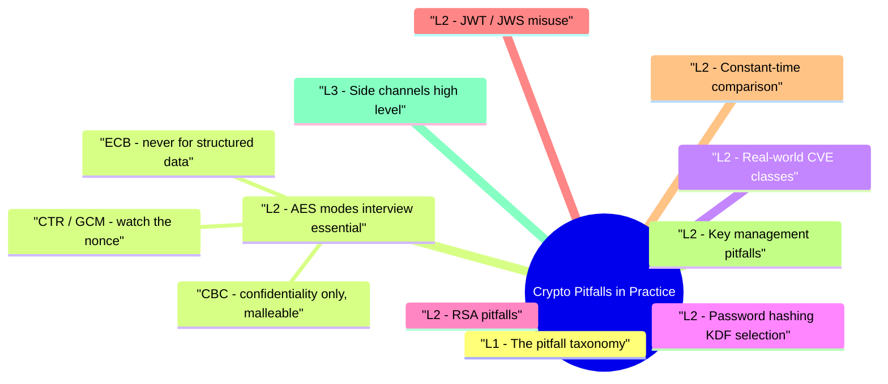

# Crypto Pitfalls in Practice revision map

I keep this Crypto Pitfalls in Practice map for the night before a screen, when five markdown files is too many clicks. Built from Critical Clarification Crypto Pitfalls in Practice Misconceptions.md, Crypto Pitfalls in Practice - Comprehensive Guide.md, Crypto Pitfalls in Practice - Interview Questions & Answers.md, Crypto Pitfalls in Practice - Quick Reference.md. Twenty minutes. Then I close the laptop.

## L1 - The pitfall taxonomy

## L2 - AES modes (interview essential)

### ECB - never for structured data
- Problem: Identical plaintext blocks -> identical ciphertext blocks (penguin logo demo). No integrity.

### CBC - confidentiality only, malleable
- Problem: Bit-flipping attacks on ciphertext alter plaintext blocks predictably. Padding oracle (Bleichenbacher-style on CBC padding) if attacker can observe padding error vs MAC error differences.
- Mitigation: Use AEAD (GCM, ChaCha20-Poly1305). If legacy CBC required: Encrypt-then-MAC with HMAC-SHA256 over IV+ciphertext, constant-time MAC compare.

### CTR / GCM - watch the nonce
- CTR: Counter must never repeat for a given key.
- GCM: 96-bit nonce standard; nonce reuse with same key leaks authentication key and enables forgery (Catastrophic).

## L2 - Real-world CVE classes

## L2 - Password hashing (KDF selection)
- Never: MD5, SHA-1, SHA-256 alone for passwords.
- Always: unique salt per user; optional pepper in HSM/KMS; constant-time comparison on verify.

## L2 - RSA pitfalls
- PKCS#1 v1.5 encryption: padding oracle history-prefer RSA-OAEP for encryption.
- Small exponent / weak keys: RSA <2048 deprecated.
- Signing vs encryption key confusion in custom protocols.

## L2 - JWT / JWS misuse
- Fix: Use mature library defaults; allowlist algorithms; JWKS with key rotation; validate all standard claims.

## L2 - Constant-time comparison
- Prevents timing side channels on MAC/password verify (within practical bounds).

## L2 - Key management pitfalls
- Hardcoded keys in source/mobile apps.
- Same key for encryption and signing.
- No rotation plan-versioned keys in KMS with envelope encryption.
- Logging ciphertext keys or IVs with secrets.

## L3 - Side channels (high level)
- Timing attacks on RSA decrypt, cache attacks (Spectre class), power analysis on embedded-awareness for interviews. Mitigations: constant-time libs, HSM, masking in high-threat hardware.

## L3 - Migration stories (senior)
- Legacy PBKDF2 -> Argon2id: re-hash on successful login; dual-verify window; force reset for dormant accounts.
- CBC -> GCM: parallel read old/new during rollout; strict key separation-don't reuse CBC key as GCM key without analysis.

## Detection in code review
- Grep: AES/ECB, MODE_ECB, MD5, SHA1 + password, pickle (different vuln but often co-located).
- Semgrep crypto rules; GitHub secret scanning.
- JWT libraries with verify_signature=False.

## Interview clusters

## Cross-links
- Encryption vs Hashing · Digital Signatures · TLS · Secrets Management and Key Lifecycle

## Cheat sheet bits

## Safe defaults
- Prefer AEAD: AES-GCM or ChaCha20-Poly1305
- Passwords: Argon2id (or tuned bcrypt/scrypt)
- Signatures: strict algorithm allow-lists

## Red flags
- ECB mode · GCM nonce reuse · static IVs · hardcoded keys · SHA256(password)

## Operational controls
- KMS key versioning · rotation runbook · dual-decrypt migration · crypto lint checks

## Cross-read
- Encryption vs Hashing · TLS · Secrets Management and Key Lifecycle

## Traps that dump interviews

## "Using AES means we are secure."
- Reality: Mode, nonce/IV handling, and key lifecycle determine real security.

## "SHA-256 is fine for passwords."
- Reality: Passwords need adaptive/memory-hard KDFs, not fast digests.

## "Nonce reuse is a minor issue."
- Reality: In AEAD modes like GCM, nonce reuse can be catastrophic.

## "Custom crypto is okay if code-reviewed."
- Reality: Bespoke crypto protocols fail in subtle ways; use vetted standards.

## "Rotation once a year is enough."
- Reality: Rotation cadence should match risk and support emergency revocation.

## "TLS means app crypto decisions do not matter."
- Reality: TLS protects transport; stored data and token logic still need correct crypto.

## "JWT signatures are always validated by libraries."
- Reality: Misconfiguration and unsafe options can bypass verification.

## "Pepper replaces salt."
- Reality: Salt and pepper serve different purposes; both may be needed.

## Prompts I drill out loud

- Q: Why is GCM nonce reuse dangerous?
- Q: Is SHA-256 okay for password storage?
- Q: CBC + HMAC still acceptable?
- Q: How do you roll keys safely?

## 60-second answer
- Q: What crypto mistakes do you watch for first?
- A: I check for AEAD misuse (especially nonce reuse), weak password hashing choices, key material in code/logs, and unsafe signature verification logic. Most incidents are implementation failures, not broken primitives.

## Core questions

## Mock ladder

## Sibling folders

- Stay inside this folder for the long guide. Jump only when a section names a sibling topic.
- Cookie Security, CSRF, XSS, JWT, OAuth, and TLS show up as neighbors on a lot of these maps.
