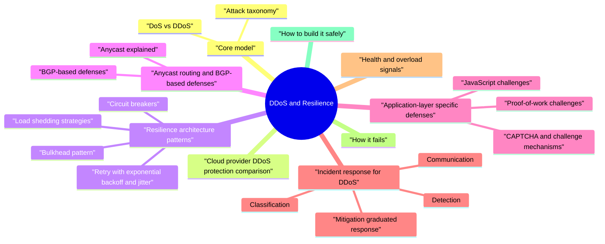

# DDoS and Resilience revision map

When a DDoS and Resilience follow-up lands, I want one page that still has the misconception and the VAPT step. I pulled headings from Critical Clarification DDoS and Resilience Misconceptions.md, DDoS and Resilience - Comprehensive Guide.md, DDoS and Resilience - Interview Questions & Answers.md, DDoS and Resilience - Quick Reference.md. If a heading is here, the guide still owns the detail.

## Core model

### DoS vs DDoS
- See the source section `DoS vs DDoS` for the worked example.

### Attack taxonomy
- DDoS attacks are classified by which layer of the stack they target and what resource they aim to exhaust.

#### Volumetric attacks (L3/L4) - flooding the pipe
- See the source section `Volumetric attacks (L3/L4) - flooding the pipe` for the worked example.

#### Amplification factor table
- See the source section `Amplification factor table` for the worked example.

#### Protocol attacks - exhausting state tables
- Protocol attacks exploit weaknesses in Layer 3/4 protocol handling to exhaust state tables on firewalls, load balancers, and servers.

#### Application-layer attacks (L7) - the hardest to defend
- See the source section `Application-layer attacks (L7) - the hardest to defend` for the worked example.

#### Economic / application-logic DoS
- Storage inflation: Uploading large files, creating accounts (with associated storage provisioning), or triggering log generation that fills storage volumes.

## Cloud provider DDoS protection comparison
- AWS Shield Advanced is the best fit when you are already AWS-native, need the DDoS Response Team (DRT) for hands-on assistance, and want cost protection guarantees that cover your autoscaling bill during an attack.
- Google Cloud Armor excels when running on GKE or Cloud Run with its Adaptive Protection ML model that automatically tunes rules based on traffic patterns.
- Azure DDoS Protection integrates tightly with Azure Virtual Networks and Azure Front Door, making it natural for Azure-native deployments.

## Resilience architecture patterns

### Circuit breakers
- A circuit breaker prevents a service from repeatedly calling a failing downstream dependency, which would waste resources, increase latency, and potentially cascade the failure.
- Configure thresholds per dependency, not globally. A database with a 99.99% SLA should trip at a lower failure rate than a third-party enrichment API with a 99% SLA.
- Track failure rates over sliding windows (e.g., 10 seconds), not cumulative counts, to avoid tripping on transient blips.
- Expose circuit state as a metric-an open circuit is a high-signal alert.
- Combine with timeouts: the circuit breaker handles sustained failures; timeouts handle individual slow requests.
- Libraries: Hystrix (Netflix, now in maintenance), resilience4j (Java), Polly (.NET), gobreaker (Go).

### Bulkhead pattern
- Tenant isolation bulkheads: In multi-tenant systems, use separate queues, connection pools, or even separate database instances for different tenants. A noisy neighbor cannot degrade service for other tenants.

### Retry with exponential backoff and jitter
- When a request fails due to a transient error (network blip, momentary overload), retrying makes sense-but naive retrying creates thundering herds that amplify the original problem.
- Full jitter: random(0, backoff) - maximum spread, best for reducing contention.
- Equal jitter: backoff/2 + random(0, backoff/2) - guarantees some minimum wait while adding spread.
- Decorrelated jitter: min(max_delay, random(base_delay, previous_wait * 3)) - each retry's wait is independent of the attempt number, based on the previous wait.

### Load shedding strategies
- Load shedding is the deliberate rejection of requests when a system approaches overload, preserving capacity for the remaining requests rather than degrading service for everyone.
- Priority-based shedding: Classify requests by business importance. Under load, shed low-priority work first. For example:
- P0 (never shed): Authentication, payment processing, safety-critical operations.
- P1 (shed last): Primary read paths, user-facing features.
- P2 (shed early): Analytics events, background sync, prefetching.
- P3 (shed first): Speculative requests, non-essential enrichment, telemetry.

### Backpressure
- Backpressure is the mechanism by which a system signals to its upstream callers that it is at capacity, slowing the rate of incoming work rather than accepting it and failing.
- Queue-based backpressure: Bounded queues reject or block new items when full. The producer must either slow down, drop messages, or apply its own backpressure upstream.

## Anycast routing and BGP-based defenses

### Anycast explained
- No single chokepoint: There is no single ingress point that an attacker can overwhelm. Even if one PoP is saturated, traffic to other PoPs is unaffected.
- Proximity-based filtering: Scrubbing centers at each anycast PoP can filter attack traffic close to its source, preventing it from traversing expensive long-haul links.
- Automatic failover: If a PoP goes down (due to attack or other failure), BGP withdraws its route announcement, and traffic is automatically rerouted to the next-closest PoP.

### BGP-based defenses
- See the source section `BGP-based defenses` for the worked example.

## Application-layer specific defenses

### CAPTCHA and challenge mechanisms
- CAPTCHA (Completely Automated Public Turing test to tell Computers and Humans Apart):
- Traditional CAPTCHAs (distorted text, image selection) are increasingly ineffective against sophisticated bots using ML-based solvers and CAPTCHA farms. Modern approaches:
- hCaptcha: Privacy-focused alternative that does not feed data to Google. Often required for compliance in privacy-sensitive markets.
- Turnstile (Cloudflare): Non-interactive challenge that verifies browser behavior without presenting visual puzzles.

### Proof-of-work challenges
- Trade-offs: Penalizes users on slow devices (mobile, older hardware). Not suitable for API endpoints called by other services. Effective as a graduated response-increase difficulty as suspected attack traffic increases.

### JavaScript challenges
- See the source section `JavaScript challenges` for the worked example.

## Incident response for DDoS

### Detection
- Static thresholds are the simplest but require maintenance and generate false positives during legitimate spikes (product launches, marketing campaigns, viral events).
- Dynamic baselines use historical data to compute expected ranges per time-of-day, day-of-week. Alerts fire when current values exceed the expected range by a configurable number of standard deviations.

### Classification
- Once an anomaly is detected, classify it before responding:
- What type of attack? Volumetric (bandwidth saturated), protocol (connection tables full), or application-layer (CPU/DB saturated with valid requests)?
- What is the attack vector? Specific endpoints targeted, source IP distribution, request characteristics (headers, payloads, patterns).
- What is the impact? Which services are affected? What is the blast radius? Are SLOs being violated? Are revenue-generating flows impacted?

### Mitigation (graduated response)
- Cloud provider L3/L4 scrubbing activates automatically.
- WAF rate limits engage.
- CDN absorbs cacheable request floods.
- Autoscaling triggers (with cost caps).
- On-call engineer validates attack and activates DDoS playbook.
- Enable more aggressive WAF rules (tighter rate limits, geographic restrictions, challenge pages).
- Activate on-demand scrubbing service if not always-on.
- Enable application-level load shedding for non-critical features.

### Communication
- Incident channel (Slack/Teams) with standardized updates every 15 minutes.
- Status: attack vector, current impact, mitigation status, ETA to resolution.
- Clear incident commander, communications lead, and technical lead roles.
- Status page update acknowledging degraded performance (avoid detailing attack specifics publicly during the incident).
- Customer support briefing with approved messaging.
- For significant attacks: executive notification, legal/compliance notification, potential law enforcement notification.
- Timeline of attack: detection time, classification time, mitigation time, resolution time.
- What worked, what did not, what was missing.

## Health and overload signals
- Distinguish liveness ("process up") from readiness ("can serve traffic"). Misconfigured health checks worsen incidents by flapping or routing to unhealthy shards.

## How it fails
- Uncached authenticated routes: attackers force origin hits-CDN cannot help. Every authenticated API endpoint is a potential L7 target.
- Autoscale runaway: attacker triggers scale-out -> bill shock; need max instances, budget alerts, and automatic scaling policy suspension at threshold.
- Thundering herd after recovery: retry storms from clients and load balancers when a recovered service comes back online. All queued/retried requests arrive simultaneously, re-triggering the failure.
- Dependency collapse: one slow dependency blocks all threads-bulkheads missing. A payment service timeout causes the product page to be unavailable.
- Misread incident: viral marketing vs attack-response differs (scale vs block). Blocking a viral event is worse than the DDoS itself.
- Cascading circuit breaker trips: if circuit breakers are tuned too aggressively, normal load after a brief spike can keep circuits open in a self-reinforcing loop.
- DNS-layer attack ignored: teams focus on HTTP-layer defenses while attackers target the DNS infrastructure, making the service unreachable regardless of origin server health.

## How to build it safely
- Design for overload early: timeouts, retries with jitter, bulkheads, caches. Overload is a normal operating condition, not an exceptional case.
- Edge + origin strategy: what can be anonymous cached vs must be authenticated at origin. Push as much as possible to the edge.
- Defense in depth:
- Edge layer: CDN/anycast absorbs volumetric attacks, WAF filters known patterns.
- Network layer: Cloud provider scrubbing, security groups, NACLs restrict traffic.
- Application layer: Rate limiting, authentication, input validation, load shedding.
- Data layer: Connection pooling, read replicas, query timeouts, circuit breakers to databases.
- Runbooks that distinguish attack vs misconfig vs legitimate spikes; communication plan with pre-drafted templates.

## Cost analysis: always-on vs on-demand protection

### Always-on protection
- Model: Continuous traffic scrubbing and mitigation. All traffic flows through the mitigation infrastructure at all times.
- Monthly subscription: $3,000-$10,000/month for cloud provider premium tiers.
- Bandwidth charges: typically per-GB for scrubbed traffic (often waived or included in premium tiers).
- Additional WAF rule costs.
- Zero-second mitigation for known attack vectors-traffic is already flowing through scrubbing.
- No ramp-up delay during attack onset.
- Continuous baseline learning for anomaly detection.
- Better for services where even seconds of downtime have significant revenue impact.

### On-demand protection
- Model: Mitigation activates only when an attack is detected. During normal operation, traffic flows directly to origin.
- Lower monthly base fee.
- Per-event or per-hour charges during mitigation.
- May require manual activation or detection delay.
- Lower steady-state cost for services that are rarely attacked.
- No latency overhead during normal operation.
- Detection and ramp-up delay (seconds to minutes) during which the attack impacts service.
- BGP route convergence takes 30-90 seconds for redirect-based scrubbing.

### Autoscale cost controls
- Even with DDoS protection, some attack traffic reaches the origin. Without cost controls, autoscaling can multiply costs:
- Max instance limits: Hard cap on the number of instances per auto-scaling group.
- Budget alerts: CloudWatch/Azure Monitor alerts at 150%, 200%, 300% of daily baseline spend.
- Scaling policy suspension: Automatically pause scale-out when budget thresholds are breached; alert the incident team.
- Reserved capacity: Pre-purchase reserved instances for baseline load; use on-demand only for legitimate bursts.
- Spot/preemptible instances: Use for burst capacity to reduce cost exposure, accepting the risk of interruption.

## Real-world case studies

### GitHub Memcached attack (February 28, 2018)
- Impact: GitHub was unavailable for approximately 5 minutes, then intermittently available for another 4 minutes.
- Even the largest internet properties cannot absorb attacks of this magnitude without upstream scrubbing.
- Memcached servers should never be exposed to the public internet. After this attack, ISPs and hosting providers aggressively blocked UDP port 11211.
- The amplification factor (51,000x) meant that the attacker needed only ~26 Mbps of outbound bandwidth to generate 1.35 Tbps.
- Pre-established relationships with scrubbing providers and pre-tested failover procedures enabled fast response.

### Dyn DNS attack (October 21, 2016)
- Attack: The Mirai botnet (primarily compromised IoT devices-cameras, DVRs, routers) launched a series of massive DDoS attacks against Dyn, a major DNS provider. The attack peaked at approximately 1.2 Tbps.
- IoT botnets represent a massive threat surface. The Mirai botnet exploited default credentials on consumer IoT devices-a supply chain security failure with infrastructure-level consequences.
- The blast radius of infrastructure attacks is enormous. Attacking one DNS provider took down dozens of major services simultaneously.
- This attack accelerated the industry move toward DNS diversity and anycast DNS architectures.

### AWS Shield case study pattern
- Scenario: A financial services customer on AWS experienced a multi-vector attack combining SYN floods (L4) with HTTP floods (L7) targeting their authentication endpoints.
- Shield Standard automatically mitigated the SYN flood component.
- Shield Advanced's ML-based detection identified the L7 component within 2 minutes.
- The AWS DDoS Response Team (DRT) engaged and deployed custom WAF rules targeting the specific attack pattern (fixed User-Agent rotation, sequential source ports).
- The customer's autoscaling handled the residual legitimate traffic increase.
- Post-incident, AWS Shield Advanced provided cost protection, crediting the customer for the scaling charges incurred during the attack.

## Monitoring and alerting

### Metrics to watch
- Ingress/egress bandwidth (bps) per availability zone and per service.
- Packets per second (pps)-important because small-packet floods can overwhelm NIC processing before saturating bandwidth.
- SYN/ACK ratio-a skewed ratio indicates SYN flood.
- DNS query rate and NXDOMAIN rate.
- Requests per second per endpoint (normalized by historical patterns).
- Error rates (4xx and 5xx) per endpoint.
- Latency percentiles (p50, p95, p99) per endpoint.
- Cache hit ratio at CDN and application cache layers.

### Baseline establishment
- Collect at least 4 weeks of data to capture weekly patterns.
- Account for known events (deployments, marketing campaigns, seasonal patterns).
- Compute per-metric baselines at multiple time granularities: hourly, daily, weekly.
- Use percentile-based baselines (p95, p99) rather than averages-averages hide spikes.
- Revisit baselines quarterly or after significant architecture changes.

### Alerting strategy
- P1 (page): Revenue-impacting SLO violations, sustained error rate above 1%, bandwidth above 200% of baseline.
- P2 (urgent notification): Elevated error rate (0.5-1%), latency SLO at risk, unusual geographic traffic patterns.
- P3 (ticket): Cache hit ratio degradation, single-endpoint anomalies, elevated bot traffic.

## Verification
- Load and soak tests with realistic mixes; include worst-case authenticated paths. Test at 2-3x expected peak to verify graceful degradation.
- Tabletops for DDoS + customer comms + finance (cloud spend). Quarterly tabletop exercises that include engineering, customer support, communications, and finance.
- Chaos engineering: Use tools like Chaos Monkey, Gremlin, or Litmus to inject failures: kill instances, saturate CPU, introduce network latency, partition availability zones.
- Monitor: error rate, latency p99, queue depth, saturation, origin hit ratio.

## Operational reality
- Cost vs security: always-on premium DDoS protection vs reactive-business decision tied to SLAs, revenue impact, and risk tolerance.
- False positives: aggressive bot fight blocks real users-measure conversion impact. A 0.1% false positive rate at 10M daily users means 10,000 blocked legitimate users.
- Global: attacks may target DNS or BGP-understand provider SLAs and failover DNS. Use multiple DNS providers.
- Compliance: logging during attacks-retention and privacy still apply. Attack traffic logs may contain personal data (IPs, headers); ensure logging infrastructure can handle the volume without dropping non-attack logs.
- Insurance: Cyber insurance policies may cover DDoS-related losses (business interruption, emergency mitigation costs). Understand your policy's notification requirements-late notification can void coverage.

## Game day planning
- A DDoS game day is a structured exercise that tests your organization's ability to detect, classify, mitigate, and communicate during a DDoS event.
- Define scope: which services, which attack vectors, which teams participate.
- Notify all stakeholders (including cloud providers, if simulating actual traffic).
- Prepare inject scenarios with realistic attack progressions.
- Establish safety controls: kill switch to stop the exercise, clear escalation path for real incidents during the game day.
- Start with a simple volumetric attack to test detection and initial response.
- Escalate to a multi-vector attack (L4 + L7) to test classification and graduated response.
- Inject communication challenges: customer complaints, executive inquiries, press questions.

## Interview clusters
- Fundamentals: "SYN flood at L4 vs HTTP flood at L7?" "What is amplification?" "DoS vs DDoS?"
- Intermediate: "How do you distinguish legitimate traffic spikes from attacks?" "How do CDNs help with DDoS?" "What is anycast?"
- Senior: "How do you protect an expensive report endpoint?" "What's in your health check?" "Design rate limiting for an API under DDoS."
- Staff: "Design resilience for multi-region with shared dependency X." "How do you avoid autoscale bankruptcy?" "Design DDoS protection for a multi-tenant SaaS platform." "How do you handle DNS-level attacks?"

## Cross-links
- Rate Limiting and Abuse Prevention, Cloud Security Architecture, Security Observability, Product Security Real-World Scenarios, OSI Layer, MITM (path control), DNS Security, BGP Security.

## Recall list from Quick Reference

## Layers (sound bite)

## Resilience patterns
- CDN + cache; anycast absorption
- Autoscale with max cost guardrails
- Circuit breakers, bulkheads, backpressure
- Health: liveness vs readiness

## Economic DoS
- Same as "slow" attack: force DB/export work-rate limits + tenant fairness.

## Interview phrases
- "Attack vs viral traffic vs misconfig" - different runbooks.
- "Graceful degradation" - drop non-core features under load.

## Checklist
- [ ] Load / game-day includes authenticated worst-case paths.
- [ ] Runbook distinguishes provider vs app vs cost explosion.

## Cross-links
- Rate Limiting, Cloud Architecture, Security Observability, OSI Layer.

## Corrections I keep repeating

## "Our autoscaler fixes DDoS"
- Truth: Autoscaling can amplify cost and destabilize dependencies. You need edge controls, quotas, and financial guardrails-not only more instances.

## "DDoS is only volumetric"
- Truth: Application-layer and economic DoS (expensive queries, account creation floods) can hurt without huge packet volume.

## "TLS stops DDoS"
- Truth: TLS protects confidentiality/integrity of data in transit-not availability against floods of legitimate-looking TLS handshakes or L7 requests.

## What I answer in 90 seconds

- What is a DDoS attack, and how does it differ from a DoS attack?
- What are the main types of DDoS attacks?
- What is amplification in the context of DDoS, and why is it dangerous?
- What is a SYN flood, and how do SYN cookies defend against it?
- What is the difference between a WAF and DDoS protection?
- How do you distinguish a legitimate traffic spike from a DDoS attack?
- How would you design DDoS defenses for a critical API endpoint?
- What is anycast, and how does it help defend against DDoS?
- How do CDNs help mitigate DDoS attacks?
- What is the difference between rate limiting and DDoS protection?
- How would you design multi-region resilience for a service with shared dependencies?
- What is economic denial of service, and how do you defend against it?
- How would you design autoscale cost controls that work during a DDoS attack?
- How would you design a DDoS response runbook?
- How do you plan and execute a DDoS game day?
- Staff / Architecture
- Design DDoS protection for a multi-tenant SaaS platform.
- How do you balance false positive risk with DDoS protection aggressiveness?
- How would you defend against DNS-level attacks and BGP hijacking?
- How do you handle a multi-vector DDoS attack that combines L3/L4 flooding with L7 application attacks?
- What architectural patterns would you use to survive a sustained, week-long DDoS campaign?
- Depth: Interview follow-ups - DDoS and Resilience

## Beginner

## Intermediate

## Advanced

## Depth: Interview follow-ups - DDoS and Resilience
- L7 vs volumetric: Different edges, different runbooks-how you triage an incident.
- Economic DoS: Protecting wallet and data tier from expensive queries.
- Autoscale traps: Cost runaway during attack-max instances and budget alerts.
- Multi-vector: How to respond to simultaneous L3/L4 + L7 attacks with limited team capacity.
- Sustained campaigns: Operational endurance, shift rotation, adaptive defense over days.
- Multi-tenant isolation: Preventing noisy-neighbor DDoS cascades in SaaS platforms.
- DNS resilience: Multi-provider DNS, DNSSEC trade-offs, BGP hijacking defenses.

## Nearby reading in this repo

- Stay inside this folder for the long guide. Jump only when a section names a sibling topic.
- Cookie Security, CSRF, XSS, JWT, OAuth, and TLS show up as neighbors on a lot of these maps.
