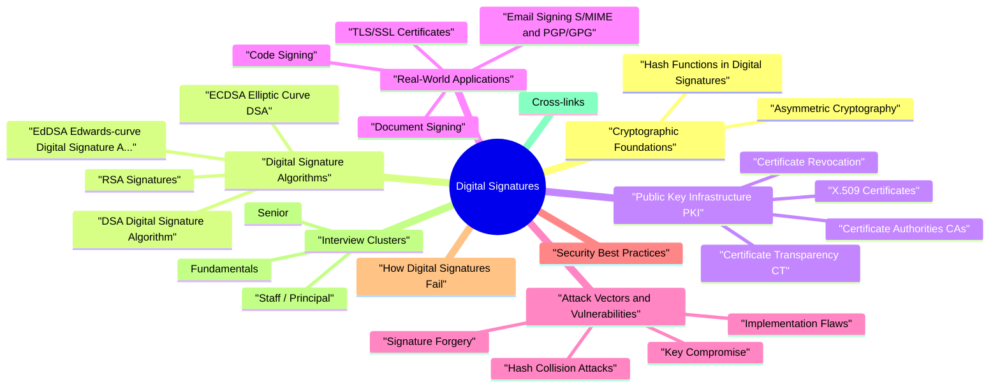

# Digital Signatures revision map

Last mock I bounced around the Digital Signatures folder. This file is the stop that. Drawn from Critical Clarification Digital Signatures.md, Digital Signatures Interview Questions & Answers.md, Digital Signature - Quick Reference Guide.md, Digital Signatures - Comprehensive Guide.md. Skim the mermaid, then the outline.

### Relationship to Public Key Infrastructure
- See the source section `Relationship to Public Key Infrastructure` for the worked example.

### Legal Standing
- Digital signatures carry legal weight in most jurisdictions:
- ESIGN Act (US, 2000) - Grants electronic signatures the same legal standing as handwritten signatures in interstate and foreign commerce.
- UETA (US, 1999) - Adopted by most US states, provides the legal framework for electronic records and signatures.
- IT Act (India, 2000) - Recognizes digital signatures using asymmetric cryptography as legally valid.

## Cryptographic Foundations

### Asymmetric Cryptography
- Digital signatures rely on asymmetric (public-key) cryptography, where each participant possesses a mathematically linked key pair:
- A cryptographic algorithm generates two keys simultaneously - a private key (kept secret) and a public key (shared freely).
- The keys are mathematically related through trapdoor functions - operations that are easy to compute in one direction but computationally infeasible to reverse.
- In RSA, the keys are derived from the product of two large prime numbers. Multiplying primes is trivial; factoring their product back into the original primes is computationally infeasible for sufficiently large numbers.
- In DSA, the hardness relies on the discrete logarithm problem in a finite field.

### Hash Functions in Digital Signatures
- Required properties of hash functions for signatures:
- Deterministic - The same input always produces the same hash. Without this, verification would be impossible.
- Fixed output size - Regardless of input size, the output is always the same length (e.g., SHA-256 always produces 256 bits).
- Avalanche effect - A single-bit change in the input produces a dramatically different hash. This ensures that even tiny modifications to the signed document are detected.
- Preimage resistance - Given a hash value h, it is computationally infeasible to find any input m such that hash(m) = h. This prevents an attacker from crafting a document that matches an existing signature.
- Second preimage resistance - Given an input m₁, it is infeasible to find a different input m₂ such that hash(m₁) = hash(m₂). This prevents substituting a different document under an existing signature.
- Collision resistance - It is infeasible to find any two different inputs m₁ and m₂ that produce the same hash. This is the strongest property and the hardest to maintain as computing power grows.

## Digital Signature Algorithms

### RSA Signatures
- RSA (Rivest-Shamir-Adleman) is the oldest widely-used public-key signature algorithm, first described in 1977. Its security is based on the difficulty of factoring large integers.
- Signing: Hash the message to get digest H(m). Apply padding scheme. Compute signature s = padded_hash^d mod n (exponentiation with the private key).
- Verification: Compute padded_hash' = s^e mod n (exponentiation with the public key). Remove padding and extract hash. Compare with independently computed H(m). If they match, the signature is valid.
- Key generation is slow (generating large primes).
- Signing is moderately slow (private key operation uses the larger exponent).
- Verification is fast (public exponent e is typically small - 65537).
- Signatures are large: same size as the key (e.g., 256 bytes for RSA-2048).

### DSA (Digital Signature Algorithm)
- DSA was specified in FIPS 186 by NIST in 1991, specifically designed for digital signatures (unlike RSA, which can also encrypt). Its security is based on the discrete logarithm problem.
- DSA can only sign, not encrypt. RSA can do both.
- DSA signatures are smaller relative to their security level.
- DSA requires a random value k (nonce) during signing. RSA (with deterministic PKCS#1 v1.5) does not.
- DSA key generation involves domain parameters that can be shared among users.
- Choose a prime p (1024-3072 bits) - the field modulus.
- Choose a prime q (160-256 bits) - the subgroup order, where q divides p-1.
- Choose generator g - an element of order q in the multiplicative group mod p.

### ECDSA (Elliptic Curve DSA)
- ECDSA applies the DSA algorithm over elliptic curve groups instead of multiplicative groups of integers. The primary advantage is dramatically smaller keys for equivalent security.
- The Elliptic Curve Discrete Logarithm Problem (ECDLP) is harder than the integer DLP or factoring for equivalent key sizes. This means ECC achieves the same security level with much smaller keys, resulting in:
- Smaller signatures
- Faster computation
- Less bandwidth and storage
- Better suited for constrained environments (IoT, smart cards)
- IOTA cryptocurrency (2017): Custom hash function (Curl) had collision vulnerabilities that could be exploited in their signature scheme.

### EdDSA (Edwards-curve Digital Signature Algorithm)
- EdDSA is a modern signature scheme designed to address ECDSA's operational pitfalls. Specified in RFC 8032, it uses twisted Edwards curves.
- Uses Curve25519 in Edwards form (Edwards25519).
- 256-bit keys, 512-bit signatures.
- Provides ~128-bit security.
- The most widely adopted EdDSA variant.
- Uses Edwards448 ("Goldilocks" curve).
- 448-bit keys, larger signatures.
- Provides ~224-bit security.

### Post-Quantum Signature Schemes
- NIST Post-Quantum Cryptography (PQC) standardization:
- NIST selected the following signature schemes after a multi-year evaluation:
- ML-DSA (Dilithium) is the primary recommendation for general use. It offers good performance and reasonable sizes, based on the hardness of Module Learning With Errors (MLWE).
- FN-DSA (FALCON) offers the smallest signatures among lattice-based schemes but has more complex implementation requirements (requires careful floating-point arithmetic or emulation).
- Provides protection against quantum attacks without depending solely on newer, less-analyzed PQC schemes.
- Maintains backward compatibility with systems that don't yet support PQC.
- Is recommended by NIST, BSI (German federal security office), and ANSSI (French national cybersecurity agency).

## Public Key Infrastructure (PKI)

### Certificate Authorities (CAs)
- End-entity certificates are issued to specific servers, services, users, or devices. These are what TLS servers present during the handshake.
- Server presents its certificate chain during TLS handshake.
- Browser verifies each certificate's signature up the chain to a trusted root in its trust store.
- Browser checks that no certificate in the chain has expired.
- Browser checks revocation status (CRL/OCSP).
- Browser verifies the domain name matches the certificate's Subject Alternative Name (SAN).
- Browser checks Certificate Transparency logs for SCTs.
- Comodo (2011): An affiliate RA (Registration Authority) was compromised, leading to fraudulent certificate issuance for major domains including mail.google.com, login.yahoo.com, and addons.mozilla.org.

### X.509 Certificates
- X.509 is the ITU-T standard that defines the format of public key certificates used in TLS, code signing, email signing, and most other PKI applications.
- Subject Alternative Name (SAN): Lists all domain names and IPs the certificate is valid for. This is now the primary way domains are specified (the Subject CN field is deprecated for this purpose).
- Key Usage: Constrains what the key can be used for (e.g., digitalSignature, keyEncipherment, keyCertSign).
- Extended Key Usage: Further constrains use (e.g., serverAuth, clientAuth, codeSigning).
- Basic Constraints: Indicates whether the certificate is a CA certificate and the maximum chain depth.
- Authority Information Access (AIA): Points to the issuer's certificate and OCSP responder.
- CRL Distribution Points: Where to find the CRL.
- Generation: Create key pair and CSR.

### Certificate Revocation
- When a private key is compromised or a certificate is mis-issued, it must be revoked before its natural expiration. This is one of the hardest problems in PKI.
- The CA publishes a signed list of revoked certificate serial numbers.
- Clients download the CRL and check if the certificate is listed.
- Client sends a query for a specific certificate's status to the CA's OCSP responder.
- Responder returns a signed response: "good," "revoked," or "unknown."
- Advantages over CRL: Real-time, per-certificate queries.
- Disadvantages: Privacy concern (the CA sees which sites you visit), availability dependency (if the OCSP responder is down, what do you do?), latency (additional network round-trip during TLS handshake).
- The server periodically fetches its own OCSP response and "staples" it to the TLS handshake.

### Certificate Transparency (CT)
- Certificate Transparency is a framework (RFC 6962) for publicly logging all issued certificates, making it possible to detect mis-issued or unauthorized certificates.
- When a CA issues a certificate, it submits the certificate (or a pre-certificate) to one or more CT logs.
- The CT log returns a Signed Certificate Timestamp (SCT) - a promise that the certificate will be included in the log within a maximum merge delay (typically 24 hours).
- The SCT is embedded in the certificate, delivered via a TLS extension, or stapled with OCSP.
- Browsers (Chrome requires CT since 2018) verify that certificates have valid SCTs from multiple independent logs.
- Domain owners can monitor CT logs for any certificate issued for their domains - detecting unauthorized issuance within hours rather than never.
- Security researchers can audit CA behavior at scale.
- The existence of CT makes CA misbehavior detectable and provable, creating accountability.

## Real-World Applications

### Code Signing
- Executable files (.exe, .dll, .msi on Windows)
- macOS application bundles (.app), disk images (.dmg), kernel extensions
- Linux packages (RPM signatures, APT repository signing, kernel modules)
- Mobile apps (Android APK/AAB signing, iOS code signing)
- Scripts, drivers, firmware, browser extensions
- Container images (Docker Content Trust, Sigstore/cosign)
- Linux: Package managers verify GPG signatures on packages and repository metadata. Kernel module signing verifies that only trusted modules are loaded.
- ASUS Live Update (2019, Operation ShadowHammer): Attackers compromised ASUS's update mechanism and pushed malware signed with legitimate ASUS certificates to approximately one million users.

### TLS/SSL Certificates
- TLS (Transport Layer Security) is the most visible application of digital signatures. Every HTTPS connection involves signature verification.
- Client connects and sends ClientHello with supported cipher suites.
- Server responds with ServerHello and its certificate chain.
- Client verifies the certificate chain up to a trusted root.
- Server proves possession of the private key by signing a handshake transcript (in TLS 1.3, the server signs a hash of all handshake messages with CertificateVerify).
- Both parties derive session keys and begin encrypted communication.
- Service-to-service communication in microservice architectures
- Zero-trust network architectures (e.g., Google's BeyondCorp)

### Email Signing (S/MIME and PGP/GPG)
- Email signatures prove that an email genuinely came from the claimed sender and hasn't been altered in transit.
- S/MIME (Secure/Multipurpose Internet Mail Extensions):
- Uses X.509 certificates issued by CAs (the same PKI infrastructure as TLS).
- Trust model: hierarchical CA-based trust. You trust a signed email if you trust the CA that issued the sender's certificate.
- Integrated into major email clients (Outlook, Apple Mail, Thunderbird).
- Certificates bind an email address to a public key.
- Widely used in enterprise and government environments.
- Uses the Web of Trust model instead of centralized CAs.

### Document Signing
- Digital signatures on documents provide legal evidence of signing intent, signer identity, and document integrity.
- PDF supports embedded digital signatures using X.509 certificates.
- Adobe Acrobat and Reader can verify signatures against the Adobe Approved Trust List (AATL).
- The signature covers a specific byte range of the PDF, and any modification outside the signed range invalidates it.
- Incremental saves can add content after signing without invalidating the signature, which has been exploited in "shadow attacks" to change the visible content while the signature remains valid.
- A timestamp authority (TSA) provides a signed timestamp proving that data existed at a specific point in time.
- Critical for non-repudiation: without a timestamp, a signer could claim their key was compromised before the signing time and repudiate the signature.
- Timestamps are embedded in the signature or attached separately.

### Blockchain and Cryptocurrency
- Digital signatures are the fundamental authentication mechanism in blockchain networks. There is no username/password - your private key is your identity.
- A user constructs a transaction (e.g., "send 1 BTC from address A to address B").
- The transaction is signed with the user's private key using ECDSA (Bitcoin uses secp256k1) or EdDSA (some newer chains).
- Network nodes verify the signature against the public key derived from the sending address.
- Valid signed transactions are included in blocks.
- If you lose your private key, you lose access to your funds permanently. There is no "forgot password" recovery.
- If your private key is stolen, the attacker can sign transactions as you - and blockchain transactions are irreversible.
- Hardware wallets (Ledger, Trezor) store private keys in secure elements and sign transactions on-device, never exposing the raw key.

## Attack Vectors and Vulnerabilities

### Key Compromise
- Private key compromise is the most fundamental attack against digital signatures - if an attacker has the private key, they can forge arbitrary signatures.
- Software extraction: Private keys stored in files on disk, in environment variables, or in application memory can be extracted by malware, insider access, or exploitation of application vulnerabilities.
- Side-channel attacks: Timing analysis, power analysis, electromagnetic emanation analysis, or cache-timing attacks on signing implementations can leak key material.
- Memory dumps: Keys in process memory can be extracted through core dumps, cold boot attacks, or via /proc/[pid]/mem on Linux.
- Backup and logging exposure: Keys accidentally included in backups, log files, source code repositories, or error messages.
- Keys are generated inside the HSM and cannot be exported in plaintext.
- Signing operations happen inside the HSM.
- Physical tamper protection: the HSM destroys keys if physical intrusion is detected.

### Signature Forgery
- Types of forgery (in increasing severity):
- Existential forgery: The attacker produces a valid signature for some message, but cannot control which message. Even this weakest form of forgery is considered a break of the scheme.
- Selective forgery: The attacker chooses a specific message and produces a valid signature for it. This is a serious practical attack.
- Universal forgery: The attacker can produce valid signatures for any arbitrary message, equivalent to having the private key.
- Decrypt the signature with the public key.
- Check that the result starts with 0x00 0x01.
- Skip the 0xFF padding bytes.
- Find the 0x00 separator.

### Hash Collision Attacks
- Due to the birthday paradox, finding a collision in a hash function with n-bit output requires approximately 2^(n/2) operations, not 2^n. This means:
- MD5 (128-bit): collision in ~2^64 operations (feasible)
- SHA-1 (160-bit): collision in ~2^80 operations (once considered infeasible, now demonstrated at ~2^63)
- SHA-256 (256-bit): collision in ~2^128 operations (infeasible with current and foreseeable technology)
- Rogue CA certificate (2008): Researchers created a rogue CA certificate with the same MD5 hash as a legitimate end-entity certificate, allowing them to issue trusted certificates for any domain.

### Implementation Flaws
- As detailed in the DSA and ECDSA sections, nonce reuse allows private key recovery. Beyond the PS3 and Android Bitcoin wallet examples, this class of vulnerability has appeared in:
- Hardware cryptocurrency wallets with faulty random number generators.
- IoT devices with insufficient entropy at boot time.
- Embedded systems using deterministic "random" seeds.
- Non-constant-time comparison: If hash comparison returns early on the first mismatched byte, timing differences reveal the correct hash byte-by-byte.
- Non-constant-time modular exponentiation: Variable-time big integer operations can leak private key bits through cache timing or execution time.
- Mitigation: Use constant-time implementations for all operations involving secret data. Libraries like libsodium and BoringSSL are designed with constant-time guarantees.
- Accepting self-signed certificates: Without proper CA validation, an attacker can create their own certificate for any domain.

### Supply Chain Attacks on Signing
- The signing infrastructure itself is an increasingly attractive target:
- Open-source package repositories (malicious maintainers or credential theft)
- Codecov (2021) - compromised bash uploader script
- ua-parser-js, coa, rc (2021) - npm packages compromised via maintainer account takeover
- NVIDIA's code signing certificate was leaked by the Lapsus$ group (2022), allowing anyone to sign malicious drivers that Windows would trust.
- D-Link, Realtek, and other hardware vendors' certificates have been found signing malware, likely stolen or obtained through compromised development environments.

## Security Best Practices
- Use Ed25519 for new systems where possible - it's fast, simple, and eliminates nonce-reuse risks.
- Use ECDSA P-256 when Ed25519 isn't supported (older TLS implementations, certain HSMs, regulatory requirements).
- Use RSA-PSS with ≥ 3072-bit keys when RSA is required for compatibility. Avoid PKCS#1 v1.5 for new implementations.
- Avoid DSA (deprecated in FIPS 186-5), MD5 (broken), and SHA-1 (deprecated) for any purpose.
- Store signing keys in HSMs or secure enclaves (TPMs, Apple Secure Enclave, ARM TrustZone) for high-value signing operations.
- For developer keys (SSH, Git signing), use hardware security keys (YubiKey) or OS-level key stores.
- Never store private keys in source code, environment variables, CI/CD configurations, or unencrypted files.
- Implement key access logging and alerting.

## How Digital Signatures Fail
- Understanding common failure modes is as important as understanding the technology:
- Trusting self-signed certificates without verification:

## Interview Clusters

### Fundamentals
- "How does a digital signature provide non-repudiation?"
- "What's the difference between signing and encryption?"
- "Why do we hash the message before signing it?"
- Efficiency (sign a fixed-size digest rather than arbitrarily large data) and security (the hash function provides the collision resistance needed for the signature's integrity guarantee).
- "What happens if two documents have the same hash?"
- A collision means a signature on one document is valid for the other. This is why collision-resistant hash functions are essential for signature security.
- "Why is SHA-1 no longer considered safe for signatures?"
- The SHAttered attack demonstrated practical SHA-1 collisions, meaning an attacker could create two documents with the same SHA-1 hash and get a signature on the benign one that validates for the malicious one.

### Senior
- "How would you design a code signing pipeline for your CI/CD?"
- "What happens when a Certificate Authority is compromised?"
- "Compare RSA-PSS and ECDSA P-256 - when would you choose each?"
- "How does OCSP stapling work and why is it preferred?"

### Staff / Principal
- "Design a certificate lifecycle management system for 500 microservices."
- "How do you prepare an organization for post-quantum cryptography migration?"
- "A critical vulnerability is discovered in the signature algorithm used across your infrastructure. Walk me through the response."

## Cross-links
- Encryption vs Hashing - Digital signatures combine both: hashing the data and then applying asymmetric cryptography to the hash.
- TLS - Server certificates use digital signatures for authentication; TLS 1.3 handshake includes server signature on transcript.
- PKI / Certificate Management - The trust infrastructure that makes digital signature verification meaningful.
- Code Signing - Applying digital signatures to software for supply chain integrity.
- JWT (JSON Web Tokens) - JWTs use digital signatures (RS256, ES256, EdDSA) or MACs (HS256) to protect claims.
- OAuth / OIDC - Token signing ensures authorization grants and identity tokens are authentic.
- Threat Modeling - Key compromise, CA compromise, and algorithm deprecation are threat scenarios.
- XSS vs CSRF - Signed tokens (anti-CSRF tokens with HMAC, signed cookies) use related cryptographic principles.

## Flags I check in 90 seconds

## Digital Signature Process

### Creation (Sender)
- See the source section `Creation (Sender)` for the worked example.

### Verification (Receiver)
- See the source section `Verification (Receiver)` for the worked example.

## Key Concepts

## Security Properties

## Common Algorithms

## Hash Functions

## Digital Signature vs Encryption

## Implementation Snippets

### Python
- See the source section `Python` for the worked example.

### Node.js
- See the source section `Node.js` for the worked example.

### OpenSSL
- See the source section `OpenSSL` for the worked example.

## Applications

## Security Checklist
- [ ] Use strong hash functions (SHA-256 minimum)
- [ ] Protect private keys
- [ ] Use appropriate key sizes
- [ ] Implement key management
- [ ] Verify certificates
- [ ] Use timestamping for long-term validity
- [ ] Implement key rotation
- [ ] Monitor for compromise

## Common Mistakes

### Wrong: Signing entire document
- See the source section `Wrong: Signing entire document` for the worked example.

### Correct: Hash then sign
- See the source section `Correct: Hash then sign` for the worked example.

### Wrong: Using weak hash functions
- See the source section `Wrong: Using weak hash functions` for the worked example.

### Correct: Use strong hash functions
- See the source section `Correct: Use strong hash functions` for the worked example.

### Wrong: Sharing private keys
- See the source section `Wrong: Sharing private keys` for the worked example.

### Correct: Keep private key secret
- See the source section `Correct: Keep private key secret` for the worked example.

## Key Management

### Private Key Protection
- Use Hardware Security Modules (HSM)
- Encrypt at rest
- Implement access controls
- Use key management systems
- Regular key rotation

### Public Key Distribution
- Use digital certificates
- Verify certificate chain
- Check revocation status
- Use trusted CAs

## Troubleshooting

### Signature Verification Fails
- Document was modified
- Signature is forged
- Wrong public key used
- Algorithm mismatch
- Hash function mismatch
- Verify document integrity
- Check public key source
- Ensure algorithm compatibility

### Private Key Compromised
- Revoke key immediately
- Generate new key pair
- Re-sign critical documents
- Notify all parties
- Update certificates

## Quick Decision Tree

## Common Interview Questions
- What does a digital signature provide?
- Authentication, integrity, non-repudiation
- What key is used to create a signature?
- Private key
- What key is used to verify a signature?
- Public key
- Why hash before signing?
- Efficiency, fixed length, same security

## Best Practices
- Use strong hash functions (SHA-256 minimum)
- Protect private keys
- Use appropriate key sizes
- Implement key management
- Verify certificates
- Use timestamping
- Implement key rotation
- Use weak hash functions (MD5, SHA-1)

## Remember
- Digital signature ≠ Encryption
- Hash is a step, not the signature
- Private key signs, public key verifies
- Certificates bind public keys to identities
- Security depends on private key protection

## Formula

## Key Sizes Comparison

## Summary Table
- Know the creation and verification process
- Understand security properties
- Be familiar with common algorithms
- Understand key management
- Know real-world applications

## Misreads that still sneak in

### "Digital signature encrypts the entire document"
- Reality: Digital signatures do NOT encrypt the document. They only sign (cryptographically bind) a hash of the document.
- Document is hashed (not encrypted)
- Hash is signed with private key (this creates the signature)
- Original document + signature are sent together
- Document remains readable (not encrypted)
- Digital signatures provide authentication and integrity, not confidentiality
- If you need confidentiality, use encryption separately
- The document itself is not encrypted in the signature process

### "Digital signature and encryption are the same"
- Reality: They are different cryptographic operations with different purposes.
- Purpose: Authentication, integrity, non-repudiation
- Uses: Private key to sign, public key to verify
- Result: Proves who sent it and that it wasn't modified
- Document: Remains readable
- Purpose: Confidentiality
- Uses: Public key to encrypt, private key to decrypt
- Result: Makes data unreadable to unauthorized parties

### "Hashing and signing are the same"
- Reality: Hashing is a step in creating a digital signature, not the signature itself.
- One-way function
- Creates fixed-length digest
- Cannot be reversed
- Used to detect changes
- Uses private key to sign the hash
- Creates the actual digital signature
- Can be verified with public key

### "Anyone can verify a digital signature"
- Reality: Verification requires the sender's public key. Without it, verification is impossible.
- The signed document
- The digital signature
- The sender's public key
- Trust in the public key (via certificate)
- Can be shared publicly
- Usually distributed via digital certificates
- Certificate Authority (CA) vouches for the binding

## Understanding the Process

### Creation Process (Sender's Side)
- Hash the document -> Creates fixed-length digest
- Sign the hash -> Encrypt hash with private key
- Attach signature -> Send document + signature

### Verification Process (Receiver's Side)
- Hash received document -> Compute hash independently
- Decrypt signature -> Use sender's public key
- Compare hashes -> If match, signature is valid

## Key Concepts Clarified

### Hash Function
- Takes input of any size
- Produces fixed-length output (digest)
- One-way function (cannot reverse)
- Deterministic (same input = same output)
- Detects any changes to document
- Efficient (small hash for large documents)
- Unique representation of content

### Private Key vs Public Key
- Kept secret by the signer
- Used to CREATE signatures
- Must be protected
- If compromised, signatures can be forged
- Shared with everyone
- Used to VERIFY signatures
- Can be distributed publicly
- No security risk if exposed

### Signing vs Encryption
- Proves authenticity
- Proves integrity
- Provides non-repudiation
- Document remains readable
- Provides confidentiality
- Makes data unreadable
- Requires private key to decrypt

### Digital Certificate
- Binds public key to identity
- Issued by Certificate Authority (CA)
- Contains:
- Public key
- Owner's identity
- CA's signature
- Validity period
- Verifies public key belongs to claimed owner

## Visual Comparison

### Digital Signature Process
- See the source section `Digital Signature Process` for the worked example.

### Encryption Process
- See the source section `Encryption Process` for the worked example.

### Combined (Sign + Encrypt)
- See the source section `Combined (Sign + Encrypt)` for the worked example.

## Important Distinctions

## Common Interview Question
- Q: "What's the difference between a digital signature and encryption?"

## Key Takeaways
- Digital signatures do NOT encrypt documents
- They sign a hash, not the document itself
- Document remains readable
- Hashing is a step, not the signature
- Hash function creates digest
- Private key signs the hash
- Result is the digital signature
- Public key is required for verification

## Clusters from the Q&A file

- Fundamental Questions
- What is a digital signature and what does it provide?
- How is a digital signature created?
- How is a digital signature verified?
- What is the difference between a digital signature and encryption?
- Why do we hash the document before signing instead of signing the entire document?
- Process and Implementation Questions
- Explain the role of hash functions in digital signatures.
- What is the difference between a private key and a public key in digital signatures?
- How would you implement digital signature creation in code?
- Security and Cryptography Questions
- What are the security properties provided by digital signatures?
- What happens if the private key is compromised?
- What digital signature algorithms are commonly used and what are their differences?
- Scenario-Based Questions
- How would you use digital signatures in a software distribution system?
- How do digital signatures work in email security?
- What is the role of digital certificates in digital signatures?
- Explain the concept of non-repudiation in digital signatures.
- What is timestamping and why is it important for digital signatures?
- How do you handle key rotation in a digital signature system?
- Quick Reference Answers
- What does a digital signature provide?
- What key is used to create a signature?

## Advanced Questions

### What key is used to verify a signature?
- See the source section `What key is used to verify a signature?` for the worked example.

### Why hash before signing?
- Answer: Efficiency, fixed length, same security guarantees.

### What happens if private key is compromised?
- Answer: All signatures become untrustworthy, must revoke and regenerate keys.

## Depth: Interview follow-ups - Digital Signatures
- Authoritative references: NIST FIPS 186-5 (Digital Signature Standard); high-level: NIST Cryptographic Standards.
- Integrity vs non-repudiation - who can repudiate if keys leak?
- Hash then sign - collision relevance (historic MD5/SHA-1 issues in certs).
- Key custody: HSM/KMS, separation of duties.

## Cross-links I actually follow

- Stay inside this folder for the long guide. Jump only when a section names a sibling topic.
- Cookie Security, CSRF, XSS, JWT, OAuth, and TLS show up as neighbors on a lot of these maps.
