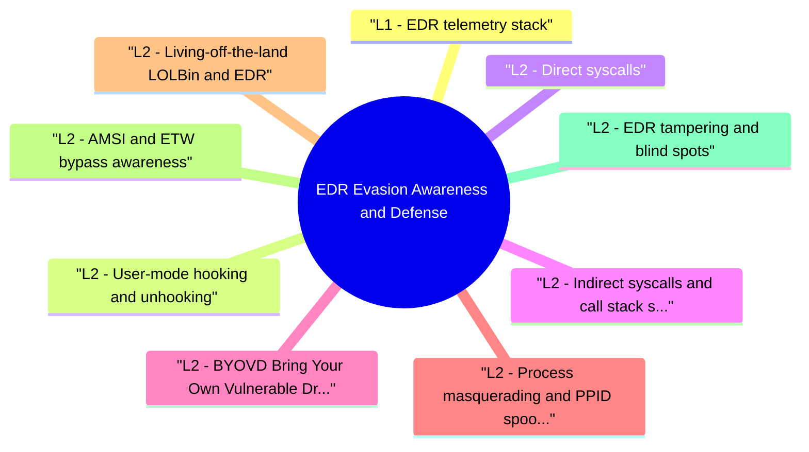

# EDR Evasion Awareness and Defense revision map

I keep this EDR Evasion Awareness and Defense map for the night before a screen, when five markdown files is too many clicks. Built from Critical Clarification EDR Evasion Awareness and Defense Misconceptions.md, EDR Evasion Awareness and Defense - Comprehensive Guide.md, EDR Evasion Awareness and Defense - Interview Questions & Answers.md, EDR Evasion Awareness and Defense - Quick Reference.md. Twenty minutes. Then I close the laptop.

## L1 - EDR telemetry stack
- Key insight: EDR visibility is layered. Defeating one layer (user hooks) does not automatically defeat kernel ETW or network/identity telemetry-design defense in depth.

## L2 - User-mode hooking and unhooking
- Many EDRs hook ntdll.dll exports (NtAllocateVirtualMemory, NtCreateThreadEx, etc.) to inspect calls before kernel transition.
- Unhooking: Malware restores clean syscall stubs from a fresh copy of ntdll (disk or suspended process) over the hooked in-memory .text section.

## L2 - Direct syscalls
- Direct syscalls invoke syscall instruction with manually constructed syscall numbers, bypassing hooked ntdll exports.
- HellsGate/Halo's Gate (names only): dynamic SSN resolution when hooks hide syscall numbers-interviewers test conceptual awareness, not implementation.

## L2 - Indirect syscalls and call stack spoofing
- Newer evasion uses indirect syscalls (jump to legitimate syscall in ntdll) plus synthetic call stacks to mimic benign threads.
- Detection: Kernel visibility + behavioral sequences (allocate RWX -> write -> execute) still suspicious even if stack looks clean.

## L2 - BYOVD (Bring Your Own Vulnerable Driver)
- Load legitimately signed but vulnerable kernel driver.
- Exploit driver IOCTL to gain arbitrary kernel read/write.
- Disable EDR kernel callbacks, clear notification routines, or patch kernel structures.
- HVCI / Memory Integrity - restricts unsigned/k vulnerable code paths.
- WDAC - allow-list drivers by publisher/hash.
- Driver blocklist updates via Windows Update.
- Monitor DriverLoad events (Sysmon Event ID 6) for new or rare drivers.

## L2 - Process masquerading and PPID spoofing
- PPID spoofing: Create process appearing parented by explorer.exe or svchost instead of malicious parent.
- Detection: Creator/process chain inconsistencies-e.g., powershell.exe parented by winword.exe is rare; spoofed PPID may contradict kernel creation time ordering or ETW fields.

## L2 - Living-off-the-land (LOLBin) and EDR
- Attackers avoid dropping binaries-use powershell.exe, rundll32, mshta, wmic, certutil for download/execution.
- Command-line logging (Sysmon ID 1, Script Block Logging 4104).
- AMSI for PowerShell (bypasses exist-still valuable signal).
- Application control (WDAC/AppLocker) for high-risk hosts.
- Rare command-line baselines and ATT&CK mapping (T1059).

## L2 - AMSI and ETW bypass (awareness)
- AMSI bypass: Patch amsi.dll in memory, force AmsiScanBuffer to return clean-detect integrity changes and .NET / PowerShell load anomalies.
- ETW patching: Disable ETW provider registration in process-detect EtwEventWrite patches (Microsoft Defender ATP research topics).

## L2 - EDR tampering and blind spots
- Tamper protection on modern EDR raises cost of service stop/uninstall.

## L3 - Detection engineering for evasion
- ntdll unhook indicators + subsequent RWX allocation
- New kernel driver from non-standard publisher
- Direct syscall patterns with anomalous stacks (platform-dependent)
- PowerShell with encoded command + network in same minute
- Credential access (LSASS) from unexpected parent

## L3 - Mitigations (tiered)
- Keep OS + EDR current; enable tamper protection.
- HVCI where compatible; WDAC for servers and high-value workstations.
- Least privilege-evasion often needs admin for drivers/service stop.
- Complement EDR with identity (Conditional Access), network (NDR), email controls.
- Assume breach-segment tier-0; no permanent local admin.

## L3 - Linux/macOS note (interview breadth)
- eBPF sensors vs LD_PRELOAD hook evasion.
- Auditd, Falco, osquery for cross-platform parity.
- EDR evasion framing applies to any user-space sensor-kernel visibility helps.

## Toolchain
- Sysmon, OSQuery, Velociraptor, Pe-sieve/Moneta (hook detection concepts), vendor advanced hunting (KQL, Splunk), Atomic Red Team

## Interview clusters

## Cross-links
- Windows Security Boundaries · Shellcode Fundamentals and Detection · Windows Exploit Mitigations · Security Observability and Detection Engineering

## Verification checklist
- [ ] Explain user hook vs kernel callback visibility
- [ ] Name three non-hook telemetry sources
- [ ] Describe BYOVD at architecture level
- [ ] List two detections for unhooking/syscall abuse

## Cheat sheet bits

## Telemetry
- User hooks · ETW · kernel callbacks · network off-box

## Evasion (know names)
- Unhook · direct/indirect syscalls · BYOVD · PPID spoof · LOLBins

## Defense
- HVCI · WDAC drivers · sensor tamper protection · kernel visibility · assume gaps

## Hunt ideas
- ntdll integrity · new drivers · impossible parent edges · rare CLI chains

## Cross-read
- Windows Security Boundaries · Shellcode Fundamentals and Detection

## One-liner

## Traps that dump interviews

## "EDR sees everything on the endpoint."
- Reality: Kernel attacks, encryption, and sensor blind spots exist.

## "More user-mode hooks = better security."
- Reality: Performance/stability limits and easy unhook targets.

## "BYOVD is theoretical."
- Reality: Abused in real intrusions; driver policy matters.

## "Linux endpoints don't need EDR-like thinking."
- Reality: eBPF/auditd/Falco fill similar roles with different mechanics.

## "If malware is signed, it's safe."
- Reality: Stolen certs and repurposed tools break that assumption.

## "Disabling EDR improves performance without risk."
- Reality: Attackers also disable sensors-tamper alerts should fire.

## "Kernel telemetry solves all syscall evasion."
- Reality: Volume, privacy, and compat constrain what ships by default.

## "Studying evasion is only for attackers."
- Reality: Defenders must understand blind spots to engineer detections.

## Prompts I drill out loud

- Q: Direct syscalls vs indirect syscalls (high level)?
- Q: What is BYOVD?
- Q: Purple team test without harming prod?

## 60-second answer
- Q: How does EDR get evaded, and how do you defend against that?

## Technical

## Process

## Mock ladder

## Sibling folders

- Stay inside this folder for the long guide. Jump only when a section names a sibling topic.
- Cookie Security, CSRF, XSS, JWT, OAuth, and TLS show up as neighbors on a lot of these maps.
