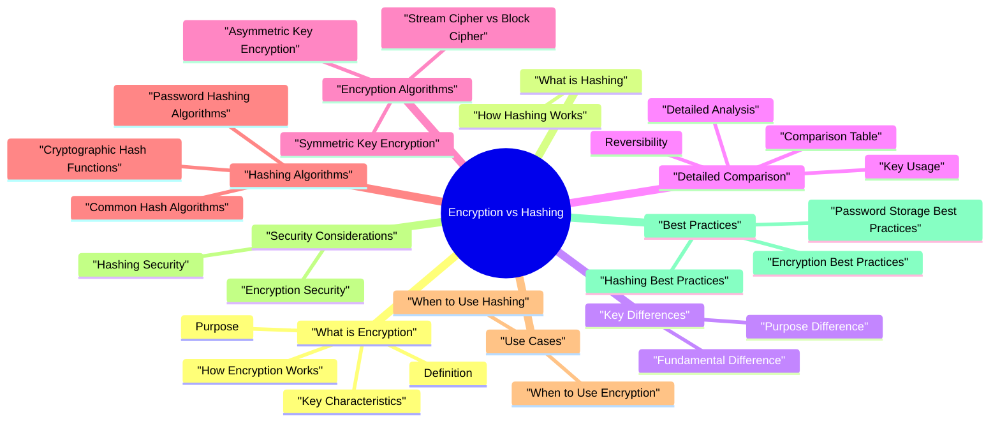

# Encryption vs Hashing revision map

I keep this Encryption vs Hashing map for the night before a screen, when five markdown files is too many clicks. Built from Critical Clarification Encryption vs Hashing Misco.md, Encryption vs Hashing - Comprehensive Guide.md, Encryption vs Hashing - Interview Questions & Answ.md, Encryption vs Hashing - Quick Reference Guide.md. Twenty minutes. Then I close the laptop.

## What is Encryption

### Definition
- See the source section `Definition` for the worked example.

### Key Characteristics
- Reversible: Can decrypt back to original data
- Requires key: Secret key needed for encryption/decryption
- Confidentiality: Protects data secrecy
- Two-way process: Encrypt -> Decrypt
- Irreversible: Cannot reverse to get original data
- ️ No key required: Traditional hashing doesn't use keys (HMAC uses keys)
- Fixed length: Always produces same-length output
- Deterministic: Same input always produces same hash

### Purpose
- Primary Purpose: Protect the confidentiality of data.
- Makes data unreadable to unauthorized parties
- Ensures only authorized parties with the key can read data
- Protects data in transit and at rest
- Primary Purpose: Verify data integrity and create unique fingerprints.
- Creates unique fingerprint of data
- Verifies data hasn't been modified
- Used for password storage (one-way)

### How Encryption Works
- See the source section `How Encryption Works` for the worked example.

## What is Hashing

### How Hashing Works
- See the source section `How Hashing Works` for the worked example.

## Key Differences

### Fundamental Difference
- See the source section `Fundamental Difference` for the worked example.

### Purpose Difference
- Answers: "How do I hide data from unauthorized access?"
- Focus: Confidentiality and secrecy
- Use when: You need to retrieve original data
- Answers: "How do I verify data hasn't changed?"
- Focus: Integrity and verification
- Use when: You don't need original data back

## Detailed Comparison

### Comparison Table
- See the source section `Comparison Table` for the worked example.

### Detailed Analysis
- See the source section `Detailed Analysis` for the worked example.

### Reversibility
- See the source section `Reversibility` for the worked example.

### Key Usage
- Always requires a key
- Key used for both encryption and decryption
- Key must be kept secret
- ️ Traditional hashing: No key
- HMAC: Uses key for authentication (still one-way)
- Key in HMAC is for authentication, not decryption

### Output Characteristics
- Output length ≈ input length
- Output is random-looking
- Different plaintexts produce different ciphertexts
- Fixed output length (e.g., SHA-256 = 256 bits)
- Deterministic (same input = same output)
- Small input change = completely different hash

## Encryption Algorithms

### Symmetric Key Encryption
- Definition: Uses the same key for encryption and decryption.
- Efficient for large data
- ️ Key distribution challenge
- ️ Key must be shared securely
- Most widely used
- Key sizes: 128, 192, 256 bits
- Block size: 128 bits
- Modes: CBC, GCM, CTR

### Asymmetric Key Encryption
- Definition: Uses different keys for encryption and decryption (public/private key pair).
- Solves key distribution problem
- ️ Slower than symmetric
- Digital signatures possible
- ️ Limited data size
- Most common asymmetric algorithm
- Key sizes: 2048, 4096 bits
- Used for key exchange and digital signatures

### Stream Cipher vs Block Cipher
- Encrypts data bit by bit
- Generates stream of random numbers
- XOR with plaintext
- Example: RC4, ChaCha20
- Encrypts data in fixed-size blocks
- Processes blocks independently or chained
- Example: AES, DES

## Hashing Algorithms

### Cryptographic Hash Functions
- Deterministic (same input = same output)
- Fast computation
- Pre-image resistance (hard to find input from hash)
- Collision resistance (hard to find two inputs with same hash)
- Avalanche effect (small change = big hash change)

### Common Hash Algorithms
- Deprecated - Not secure
- 128-bit hash value
- Vulnerable to collision attacks
- Never use for security - only for non-security checksums
- 160-bit hash value
- Never use for security
- Secure (when used properly)
- 256-bit hash value

### Password Hashing Algorithms
- Specialized algorithms for password storage:
- Widely used
- Adaptive (can increase cost factor)
- Slow by design (resistant to brute force)
- Includes salt automatically
- Modern standard (winner of Password Hashing Competition)
- Memory-hard function
- Resistant to GPU/ASIC attacks

## Use Cases

### When to Use Encryption
- Protecting sensitive data (PII, credit cards, secrets)
- Data transmission (HTTPS/TLS)
- Data at rest (encrypted databases)
- Credit card processing (need to decrypt for transactions)
- Encrypted backups (need to restore)
- Encrypted messages (need to read)
- In-memory encryption
- Session data encryption

### When to Use Hashing
- User passwords (one-way, cannot reverse)
- Authentication tokens
- API keys (sometimes)
- File checksums
- Download verification
- Database integrity checks
- Hash document, then sign hash
- Message authentication

## Security Considerations

### Encryption Security
- Store keys securely (HSM, key management services)
- Rotate keys periodically
- Use strong keys (sufficient length, random)
- Never hardcode keys
- Use different keys for different purposes
- Use AES-256 for symmetric encryption
- Use RSA-2048+ or ECC for asymmetric encryption
- Use authenticated encryption (AES-GCM)

### Hashing Security
- Use bcrypt, Argon2, or scrypt
- Always use salt (included in bcrypt/Argon2)
- Use appropriate cost factors
- Never use MD5, SHA-1, or plain SHA-256 for passwords
- Use SHA-256 or SHA-512 for checksums
- Verify hashes after transmission
- Use HMAC for authenticated hashing
- Always use unique salt per password

## Best Practices

### Encryption Best Practices
- Use strong algorithms (AES-256, RSA-2048+)
- Secure key management (HSM, key vaults)
- Use authenticated encryption (AES-GCM)
- Rotate keys periodically
- Never reuse IVs/nonces
- Use HTTPS/TLS for data in transit
- Encrypt sensitive data at rest

### Hashing Best Practices
- Use proper algorithms (bcrypt/Argon2 for passwords)
- Always use salt (unique per password)
- Use appropriate cost factors (balance security vs performance)
- Never use MD5/SHA-1 for security purposes
- Verify hashes after transmission
- Use HMAC when authentication is needed

### Password Storage Best Practices
- Always hash passwords (never encrypt)
- Use bcrypt, Argon2, or scrypt
- Use unique salt per password
- Use appropriate cost factors
- Never store plaintext passwords
- Implement password policies (length, complexity)

## Common Mistakes

### Mistake 1: Encrypting Passwords
- See the source section `Mistake 1: Encrypting Passwords` for the worked example.

### Mistake 2: Using MD5/SHA-1 for Passwords
- See the source section `Mistake 2: Using MD5/SHA-1 for Passwords` for the worked example.

### Mistake 3: Hashing for Confidentiality
- See the source section `Mistake 3: Hashing for Confidentiality` for the worked example.

### Mistake 4: No Salt for Password Hashing
- See the source section `Mistake 4: No Salt for Password Hashing` for the worked example.

## Real-World Examples

### Example 1: Password Storage
- Scenario: Storing user passwords in database

### Example 2: Credit Card Storage
- Scenario: Storing credit card numbers for processing

### Example 3: File Integrity Verification
- Scenario: Verifying downloaded file hasn't been tampered with

### Key Points
- Encryption = Confidentiality (reversible, requires key)
- Hashing = Integrity (irreversible, no key needed)
- Passwords = Always hash (never encrypt)
- Sensitive data = Encrypt (when you need to retrieve it)
- Use proper algorithms (AES for encryption, bcrypt/Argon2 for passwords)
- Always use salt for password hashing
- Never use MD5/SHA-1 for security purposes

### Decision Tree
- Yes -> Use Encryption
- No -> Consider Hashing
- Always -> Use Hashing (bcrypt/Argon2)
- Use Encryption (AES)
- Use Hashing (SHA-256)

## Interview clusters
- Fundamentals: "Encrypt passwords in the database-yes or no?" "SHA-256 for passwords?"
- Senior: "When do you need AEAD vs plain AES?" "KDF vs hash for passwords?"
- Staff: "Design a key hierarchy for multi-tenant SaaS with customer-managed keys."

## Cross-links
- TLS, JWT signing, Secrets Management, Cloud KMS topics, CSRF/XSS (where crypto intersects browser).

## Cheat sheet bits

## ️ Critical Clarification
- Encryption and Hashing are NOT the same!
- Encryption = Reversible (confidentiality)
- Hashing = Irreversible (integrity)
- Passwords = Always hash (never encrypt)

## Quick Comparison

## Fundamental Difference

## When to Use What

### Use Encryption When
- Need to retrieve original data
- Protect data confidentiality
- Data transmission (HTTPS/TLS)
- Sensitive data storage

### Use Hashing When
- Password storage
- Data integrity verification
- Digital signatures
- Deduplication

## Encryption Algorithms
- Best Practice: Use AES-256 for symmetric, RSA-2048+ or ECC for asymmetric

## Hashing Algorithms
- Best Practice: Use bcrypt, Argon2, or scrypt for passwords

## Password Storage

### Wrong: Encrypting Passwords
- See the source section `Wrong: Encrypting Passwords` for the worked example.

### Correct: Hashing Passwords
- See the source section `Correct: Hashing Passwords` for the worked example.

## Common Mistakes

### Mistake 1: Encrypting Passwords
- See the source section `Mistake 1: Encrypting Passwords` for the worked example.

### Mistake 2: Using MD5/SHA-1 for Passwords
- See the source section `Mistake 2: Using MD5/SHA-1 for Passwords` for the worked example.

### Correct: Using Password Hashing Algorithms
- See the source section `Correct: Using Password Hashing Algorithms` for the worked example.

### Mistake 3: Hashing for Confidentiality
- See the source section `Mistake 3: Hashing for Confidentiality` for the worked example.

### Correct: Encryption for Confidentiality
- See the source section `Correct: Encryption for Confidentiality` for the worked example.

## Salt Usage

### Without Salt (Vulnerable)
- See the source section `Without Salt (Vulnerable)` for the worked example.

### With Salt (Secure)
- Unique salt per password
- Cryptographically random
- At least 16 bytes
- Store salt with hash
- bcrypt/Argon2 include salt automatically

## Decision Tree
- Always -> Use Hashing (bcrypt/Argon2)
- Yes -> Use Encryption (AES)
- No -> Consider Hashing
- Use Encryption (AES)
- Use Hashing (SHA-256)

## Key Takeaways
- Encryption = Confidentiality (reversible, requires key)
- Hashing = Integrity (irreversible, no key needed)
- Passwords = Always hash (never encrypt)
- Sensitive data = Encrypt (when you need to retrieve it)
- Use proper algorithms (AES for encryption, bcrypt/Argon2 for passwords)
- Always use salt for password hashing
- Never use MD5/SHA-1 for security purposes

## Traps that dump interviews

## ️ Common Misconceptions

### "Hashing is a form of encryption"
- Truth: Hashing and encryption are completely different cryptographic techniques that serve different purposes.
- Encryption: Reversible transformation (can decrypt back to original)
- Hashing: One-way transformation (cannot reverse to original)
- Never use encryption for password storage (can be decrypted)
- Always use hashing for password storage (one-way, cannot reverse)
- Never use hashing when you need to retrieve original data (irreversible)

### "Encrypted passwords are secure"
- Truth: Encrypted passwords are NOT secure for password storage because encryption is reversible. If the key is compromised, all passwords can be decrypted.
- One-way function (cannot reverse)
- Even with hash, cannot get original password
- Can only verify by hashing input and comparing
- Key compromise doesn't expose passwords (no key needed)
- Never for password storage
- Only for password transmission (HTTPS/TLS)
- Only for temporary password storage (in-memory, short-lived)

### "Hashing can be used to protect data confidentiality"
- Truth: Hashing does NOT protect confidentiality. It's designed for data integrity, not secrecy.
- Verifies data hasn't changed (integrity)
- Creates unique fingerprint of data
- Does NOT hide data (anyone can see the input)
- Hashing = Data integrity (verification)
- Encryption = Data confidentiality (secrecy)

### "You can decrypt a hash if you have the right key"
- Truth: Hashing does NOT use keys (in traditional sense) and cannot be reversed, even with a key.
- HMAC (Hash-based Message Authentication Code):
- Encryption key: Used to encrypt AND decrypt (reversible)
- Hashing: No key (or key used for authentication, not decryption)

### "MD5 and SHA-1 are secure for password hashing"
- Truth: MD5 and SHA-1 are NOT secure for password hashing. They're fast hash functions designed for data integrity, not password security.
- Too Fast:
- Designed for speed (data integrity checks)
- Easy to brute-force
- Can compute billions of hashes per second
- Vulnerable to Attacks:
- MD5: Completely broken (collision attacks)
- SHA-1: Deprecated (collision attacks found)

### "Encryption and hashing are interchangeable"
- Truth: Encryption and hashing are NOT interchangeable. They solve different problems and have different use cases.
- Protect data confidentiality (secrets, PII, credit cards)
- Need to retrieve original data
- Data transmission (HTTPS/TLS)
- Data at rest (encrypted databases)
- Temporary data protection
- Password storage (one-way, cannot reverse)
- Data integrity verification (file checksums)

### "Salted hashes can be decrypted"
- Truth: Salted hashes still cannot be decrypted. Salt makes hashing more secure, but it doesn't make it reversible.
- Prevents rainbow table attacks
- Makes same password produce different hashes
- Adds randomness to hashing process
- Does NOT make hashing reversible

## Key Takeaways

### Understanding
- Encryption = Reversible (can decrypt back to original)
- Hashing = Irreversible (cannot get original back)
- Encryption = Confidentiality (hides data)
- Hashing = Integrity (verifies data hasn't changed)
- Passwords = Always hash (never encrypt)
- Sensitive data = Encrypt (when you need to retrieve it)
- Use proper algorithms (bcrypt/Argon2 for passwords, AES for encryption)

### Common Mistakes
- Using encryption for password storage
- Using hashing for data confidentiality
- Using MD5/SHA-1 for password hashing
- Thinking hashing can be reversed with a key
- Thinking salted hashes can be decrypted
- Using encryption and hashing interchangeably

## Summary Table
- Remember: Encryption protects confidentiality (secrecy), Hashing protects integrity (verification). They're complementary, not interchangeable!

## Prompts I drill out loud

- Fundamental Questions
- What is the fundamental difference between encryption and hashing?
- Can you decrypt a hash?
- Why should you hash passwords instead of encrypting them?
- Comparison Questions
- Compare encryption and hashing in terms of reversibility.
- Compare encryption and hashing in terms of key usage.
- What are the output characteristics of encryption vs hashing?
- When should you use encryption vs hashing?
- Why can't you use encryption for password storage?
- Why are MD5 and SHA-1 not secure for password hashing?
- What is salt and why is it important for password hashing?
- Implementation Questions
- How would you implement secure password storage?
- How would you implement data encryption for sensitive information?
- Depth: Interview follow-ups - Encryption vs Hashing

## Use Case Questions

## Security Questions

## Depth: Interview follow-ups - Encryption vs Hashing
- When is hashing wrong for passwords? (fast hash, no salt, pepper mishandled.)
- Authenticated encryption: Why AES-GCM/ChaCha20-Poly1305 vs AES-CBC alone?
- MAC vs signature: Symmetric integrity vs asymmetric non-repudiation (tie to Digital Signatures topic).

## Sibling folders

- Stay inside this folder for the long guide. Jump only when a section names a sibling topic.
- Cookie Security, CSRF, XSS, JWT, OAuth, and TLS show up as neighbors on a lot of these maps.
