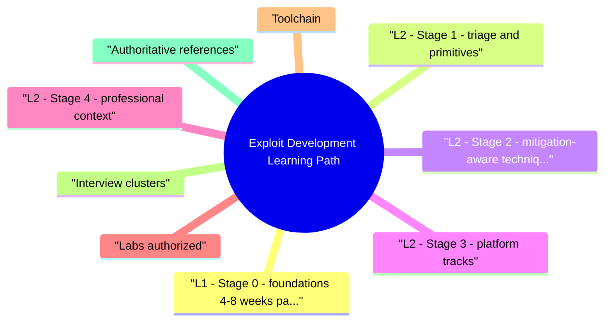

# Exploit Development Learning Path revision map

When a Exploit Development Learning Path follow-up lands, I want one page that still has the misconception and the VAPT step. I pulled headings from Critical Clarification Exploit Development Learning Path Misconceptions.md, Exploit Development Learning Path - Comprehensive Guide.md, Exploit Development Learning Path - Interview Questions & Answers.md, Exploit Development Learning Path - Quick Reference.md. If a heading is here, the guide still owns the detail.

## L1 - Stage 0: foundations (4-8 weeks part-time)
- C memory: stack vs heap, overflow, use-after-free patterns (distinct from deserialization bugs-different mechanism class).
- Assembly: calling conventions, registers, prologue/epilogue.
- Tools: debugger breakpoints, backtraces, disassembly fluency.
- Scripting: Python for automation (pwntools on Linux CTFs).

## L2 - Stage 1: triage and primitives
- Triage crashes: ASAN reports, registers at fault, control of PC?
- Primitives: write-what-where, relative read, type confusion-map to CWE.
- Fuzzing intro: Fuzzing Security Testing + Fuzzing Methodology.

## L2 - Stage 2: mitigation-aware techniques (conceptual)
- Do not memorize gadget chains; understand why each mitigation exists.

## L2 - Stage 3: platform tracks
- Linux CTF track: pwntools, libc leaks, heap basics.
- Windows track: WinDbg, Heap internals at high level, SEH history (legacy awareness), modern mitigations first.

## L2 - Stage 4: professional context
- Red team: opsec, authorization, scope letters.
- AppSec: threat model what attackers gain from a bug class; push mitigations.
- Vulnerability research: Coordinated disclosure, patch quality, regression tests.

## Labs (authorized)
- pwn.college, Nightmare-style curricula (check ToS).
- Flare-on for Windows reverse + exploit adjacent skills.
- VulnHub/isolated VMs-never target third parties.

## Toolchain
- gdb/lldb, WinDbg, pwntools, ROPgadget/similar (Linux), angr (symbolic, optional depth).

## Interview clusters

## Authoritative references
- Intel SDM / AMD APM (architecture)-reference, not first read.
- Microsoft mitigation docs (DEP, CFG, CET).
- CTF writeup corpora for pattern recognition (ethics: private labs).

## Cross-links
- Exploit Development · Basic Exploitation Fundamentals · Shellcode Fundamentals and Detection · Crash Analysis · Fuzzing Security Testing

## Verification checklist
- [ ] Explain DEP + ASLR interaction without gadget details.
- [ ] List three labs you'd use and why they're legal.

## Recall list from Quick Reference

## Stages
- C/asm -> debugger fluency -> triage -> mitigations -> platform track -> professional ethics

## Linux vs Windows
- Linux CTF density · Windows enterprise mitigations + WinDbg

## Exit checks
- Explain overflow + DEP · minimize crash · map bug to CWE · no rogue targets

## Tools
- gdb/lldb · WinDbg · pwntools · sanitizers · optional angr

## Cross-read
- Exploit Development · Basic Exploitation Fundamentals · Windows Exploit Mitigations · Shellcode Fundamentals and Detection

## One-liner

## Corrections I keep repeating

## "Learn exploits by attacking random sites."
- Reality: Illegal and unethical; use labs, CTFs, bounties with clear authorization.

## "Memorize ROP gadgets for interviews."
- Reality: Interviewers want mitigation reasoning and debugging discipline, not rote gadget lists.

## "Exploit dev == only shellcode."
- Reality: Heap, JIT, logic, kernel, and browser chains dominate modern research.

## "CTF skills transfer 1:1 to real targets."
- Reality: Real software has logging, variants, WAFs, and patch velocity-operational constraints differ.

## "You must master heap for year one."
- Reality: Foundations and triage first; heap is specialized depth.

## "Windows is 'harder,' so skip it."
- Reality: Enterprise AppSec interviews still expect WinDbg-level literacy at senior tiers sometimes.

## "Public exploit == safe to run."
- Reality: Malicious payloads and backdoors exist; audit in isolated VMs.

## "Offense knowledge means you can't do defense."
- Reality: Strong defenders often understand offense within ethical bounds.

## What I answer in 90 seconds

- Q: Linux or Windows first?
- Q: Do I need heap exploitation for AppSec interviews?
- Q: Interviewer asks for live target practice-response?
- Q: How does exploit learning help defense?

## 60-second answer
- Q: How would you learn exploit development responsibly for an interview?

## Sequencing

## Ethics

### Q: Interviewer asks for live target practice-response?
- A: Decline; only authorized scopes and bug bounty rules.

## Defense tie-in

## Mock ladder

## Nearby reading in this repo

- Stay inside this folder for the long guide. Jump only when a section names a sibling topic.
- Cookie Security, CSRF, XSS, JWT, OAuth, and TLS show up as neighbors on a lot of these maps.
