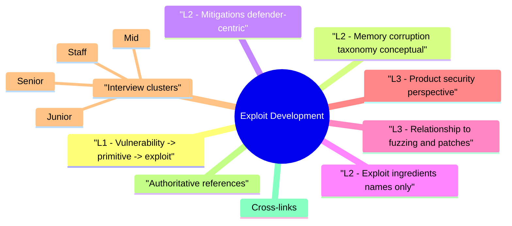

# Exploit Development revision map

Last mock I bounced around the Exploit Development folder. This file is the stop that. Drawn from Critical Clarification Exploit Development Misconceptions.md, Exploit Development - Comprehensive Guide.md, Exploit Development - Interview Questions & Answers.md, Exploit Development - Quick Reference.md. Skim the mermaid, then the outline.

## L1 - Vulnerability -> primitive -> exploit
- Bug: e.g., out-of-bounds write.
- Primitive: weak write, relative read, control of PC/IP (architecture-dependent).
- Exploit: chain primitives to achieve goals (code exec, sandbox escape) under ASLR, NX, etc.

## L2 - Memory corruption taxonomy (conceptual)

## L2 - Mitigations (defender-centric)
- Staff answer: "We assume memory bugs exist-defense is layers: safe languages, sandbox, least privilege, fast patching, exploit detection."

## L2 - Exploit ingredients (names only)
- ROP/JOP: Reuse existing code gadgets when NX blocks injected shellcode.
- Shellcode: handwritten machine code payload (covered in sibling Shellcode topic).
- Info leaks: defeat ASLR (address leak in bug or side channel).

## L3 - Relationship to fuzzing and patches
- Fuzzing finds crashes; exploit dev asks "is it weaponizable?"
- Vendor bulletins often rate severity using exploitability assessment-align with Crash Analysis.

## L3 - Product security perspective
- Prefer memory-safe languages for new surface area.
- Isolate parsers (sandbox, seccomp).
- Kill classes with compiler flags, auto updates, MTE/PAC on mobile.

## Interview clusters

### Junior
- What is ASLR?

### Mid
- NX vs ASLR-different roles?

### Senior
- Why type confusion matters in browser engines?

### Staff
- Org strategy when C/C++ legacy must live 20 years?

## Authoritative references
- MITRE ATT&CK (execution techniques-high level)
- Microsoft security features documentation (CFG, ACG, etc.)
- CERT secure coding (memory)
- Academic: "SoK: Eternal War in Memory"-class surveys (for depth reading)

## Cross-links
- Basic Exploitation Fundamentals · Shellcode Fundamentals · Windows Exploit Mitigations · Crash Analysis · Fuzzing Security Testing · RCE

## Verification checklist
- [ ] Explain why ASLR+NX together matters.
- [ ] One sentence on ROP purpose.
- [ ] No unsanctioned testing-legal line internalized.

## Flags I check in 90 seconds

## Pipeline
- Bug -> primitive -> chain (under mitigations) -> capability

## Memory bug classes (keywords)
- Stack overflow · heap corr · UAF · double free · type confusion

## Mitigations (memorize)
- ASLR · DEP/NX · canaries · CFG/CFI · PAC/MTE (ARM)

## Concepts
- ROP - reuse gadgets for NX bypass (high level)

## Defender actions
- Safe languages · sandbox · fuzz + fix · fast patch · least privilege

## Ethics
- Authorized labs only · no unsanctioned targets

## Cross-read
- Crash Analysis · Shellcode · Windows Mitigations · Fuzzing · RCE

## One-liner

## Misreads that still sneak in

## "Every crash is RCE."
- Reality: Many crashes are NULL derefs or asserts with no control. Triage determines exploitability.

## "ASLR means we're safe from memory bugs."
- Reality: ASLR is one layer; info leaks, partial overwrites, and logic bugs still defeat it.

## "Exploit dev is only for attackers."
- Reality: Defenders use exploitability analysis for patch priority, bug bounty triaging, and sandbox design.

## "Mitigations are bulletproof."
- Reality: Bypass research continues; assume breach and layer controls.

## "Writing shellcode is the main job."
- Reality: Modern exploits often reuse code (ROP) and chain multiple bugs; shellcode is one component.

## "Fuzzing replaces exploit analysis."
- Reality: Fuzzing finds signals; human analysis classifies security impact.

## "If it works on my VM, severity is Critical."
- Reality: Deployment context (privilege, exposure, mitigations) drives risk-repro ≠ max severity automatically.

## "Studying exploits encourages crime."
- Reality: Responsible security research improves defenses-ethics and law define boundaries.

## Clusters from the Q&A file

- Q: What is the difference between a crash and an exploitable bug?
- Q: What is ROP at a high level?
- Q: Can ASLR be "bypassed"?
- Q: Why do browsers have sandboxing if we have ASLR?
- Q: Should AppSec engineers write exploits daily?
- Q: How do you discuss exploit dev ethically in an interview?

## 60-second answer
- Q: What is exploit development in a product security context?

## Fundamentals

## Mitigations

### Q: Can ASLR be "bypassed"?
- A: Attackers often need an address leak, partial overwrite, or predictable layout bugs. Strong ASLR + no leaks raises cost-doesn't guarantee safety alone.

## Role alignment

## Ethics & legal

## Depth: Follow-ups
- JIT spray vs classic heap spray (conceptual).
- CFI bypass themes (high level).
- Memory-safe rewrite ROI vs sandbox.

## Mock ladder

## Cross-links I actually follow

- Stay inside this folder for the long guide. Jump only when a section names a sibling topic.
- Cookie Security, CSRF, XSS, JWT, OAuth, and TLS show up as neighbors on a lot of these maps.
