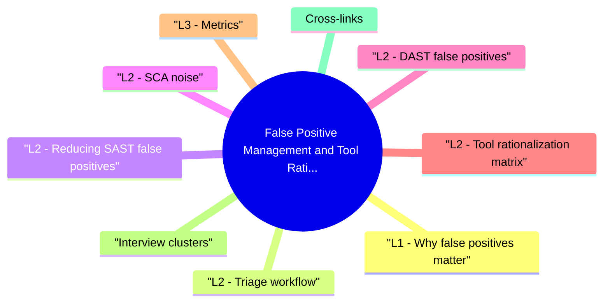

# False Positive Management and Tool Rationalization revision map

I keep this False Positive Management and Tool Rationalization map for the night before a screen, when five markdown files is too many clicks. Built from Critical Clarification False Positive Management Misconceptions.md, False Positive Management and Tool Rationalization - Comprehensive Guide.md, False Positive Management and Tool Rationalization - Interview Questions & Answers.md, False Positive Management and Tool Rationalization - Quick Reference.md. Twenty minutes. Then I close the laptop.

## L1 - Why false positives matter
- Definition: A false positive is a scanner finding that is not exploitable in your context (dead code, test-only path, framework-safe wrapper, wrong reachability).
- Cost: Developer hours, alert fatigue, gate bypass culture, missed real bugs (boy who cried wolf).

## L2 - Triage workflow
- Rule ID and tool version
- Rationale (with code link)
- Approver and expiry/review date
- Scope (repo, path, branch)-not global silence unless justified

## L2 - Reducing SAST false positives
- Interview answer: "Start with diff-based gating, tune top 10 noisy rules in week one, require reachability for Critical claims, and publish suppression policy with expiry."

## L2 - SCA noise
- One vulnerable version -> many tickets from different scanners -> dedupe on CVE + component + path.
- Transitive deps: prioritize reachable CVEs (function call graph) vs theoretical.
- Chronic won't-fix: document compensating controls or plan migration.

## L2 - DAST false positives
- Spider noise on logout CSRF tokens, cookie flags on third-party assets.
- Scope authenticated scans with test accounts; exclude static CDN paths.
- Correlate with manual confirmation before filing dev tickets.

## L2 - Tool rationalization matrix
- Principle: One primary tool per question; integrate in single dashboard (DefectDojo, GitHub Advanced Security, etc.).

## L3 - Metrics
- Signal ratio: confirmed vulns / total findings
- Time to triage per finding
- Suppression count with expired review backlog
- Repeat FP rate per rule (tune candidates)

## Interview clusters

## Cross-links
- Secure SDLC Walkthrough · Vulnerability Management Lifecycle · Secure Source Code Review

## Cheat sheet bits

## Triage outcomes
- Fix · Accept risk · False positive (documented)

## SAST noise reduction
- Diff-based gates · Rule tuning · Path excludes · Reachability · Baseline

## Dedupe key
- CVE + component + path · CWE + file + line

## Tool rationalization
- One primary per question: secrets · SCA · SAST · DAST · CSPM

## Metrics
- Signal ratio · Time to triage · Suppression expiry backlog

## Interview one-liner

## Traps that dump interviews

## "Zero false positives is the goal."
- Wrong. Goal is actionable signal; some FP cost is OK if triage is fast and gates are diff-based.

## "Developers should triage all SAST findings."
- Wrong. AppSec/champions tune rules; devs fix confirmed issues-don't dump raw scanner output.

## "Suppress = ignore forever."
- Wrong. Suppressions need expiry and re-review when code or rules change.

## "DAST finds everything SAST misses-skip SAST."
- Wrong. SAST catches secrets and dead paths early; DAST needs running app-complementary.

## "High finding count proves program maturity."
- Wrong. Confirmed vulns fixed and low repeat rate prove maturity-not raw counts.

## "Cloud CSPM replaces code review."
- Wrong. CSPM catches misconfig, not SQLi in app code.

## Prompts I drill out loud

- How do you prioritize findings from SAST, SCA, DAST, and CSPM?
- When is a suppression acceptable?
- Two SCA tools-keep both?
- Authoritative references

## 60-second answer
- Q: How do you reduce false positives in SAST?

### Two SCA tools-keep both?
- A: Usually no-pick primary by ecosystem coverage and CI integration; duplicate creates ticket spam.

## Sibling folders

- Stay inside this folder for the long guide. Jump only when a section names a sibling topic.
- Cookie Security, CSRF, XSS, JWT, OAuth, and TLS show up as neighbors on a lot of these maps.
