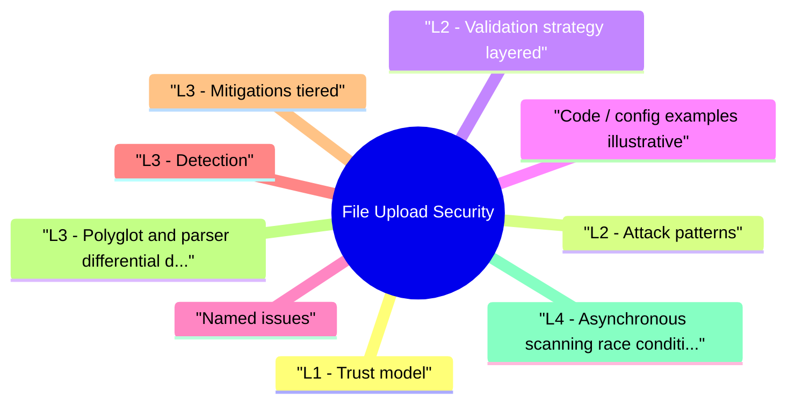

# File Upload Security revision map

When a File Upload Security follow-up lands, I want one page that still has the misconception and the VAPT step. I pulled headings from Critical Clarification File Upload Security Misconceptions.md, File Upload Security - Comprehensive Guide.md, File Upload Security - Interview Questions & Answers.md, File Upload Security - Quick Reference.md, File Upload Security - VAPT Methodology.md. If a heading is here, the guide still owns the detail.

## L1 - Trust model
- Never trust: filename, Content-Type from client, or "it's an image because ."
- Trust: re-encoded bytes from a known-safe pipeline, stored under non-executable paths, served with correct Content-Disposition and CSP for any HTML/SVG policy.

## L2 - Attack patterns

## L2 - Validation strategy (layered)
- Allowlist extensions and expected magic signatures for the declared class (PNG/JPEG/WebP-not "any image/*").
- Re-encode or transcode through a hardened library (strip metadata; output new bytes).
- Randomize stored names; never echo user filename in path.
- Store outside web root; serve via app or signed GET to object storage.
- Scan (AV, Cuckoo in high-risk) async; block publish until clean if policy requires.
- Size and rate limits; quota per user.

## Code / config examples (illustrative)
- Vulnerable: save request.FILES['f'] to /var/www/uploads/ with original name; nginx serves .php.
- Safer: write to s3://bucket/{uuid}; only CloudFront OAC with no executable MIME; app serves download as attachment.

## Named issues
- ImageTragick (ImageMagick delegate abuse)-study policy.xml hardening (disable coders).
- CVE classes on ffmpeg, Pillow, libvips-patch and pin versions in containers.

## L3 - Detection
- Unexpected extensions in upload dir; web server MIME mis-config.
- Outbound connections from image worker (SSRF).
- Spike in upload size or count (abuse).

## L3 - Mitigations (tiered)
- No execution in upload prefix (nginx location, IIS handlers).
- Allowlist + re-encode.
- Separate service account for processor; no shell access.
- WAF on upload routes (secondary).
- CSP + X-Content-Type-Options: nosniff for any user origin URLs.

## L3 - Polyglot and parser differential defense
- A file can be valid for multiple parsers at once (polyglot), or one layer may treat bytes differently than another:
- Browser sees SVG/HTML and executes script.
- CDN/origin infers MIME differently.
- AV scanner accepts file but downstream converter crashes/parses dangerous payloads.
- Identify every consumer (preview service, thumbnailer, OCR, AV, archive extractor, ML pipeline).
- Define a strict accepted format per consumer.
- Re-encode once in a hardened "normalization" tier and only pass normalized output downstream.
- Reject files that cannot be deterministically normalized.

## L4 - Asynchronous scanning race conditions (TOCTOU)
- Many systems upload first and scan later; this creates a publication race:
- Object is uploaded and immediately reachable via URL.
- Malware verdict arrives seconds later.
- Attack window exists for download/share before quarantine.
- Upload to quarantine bucket/prefix (non-public).
- Run AV/CDR and policy checks.
- Promote to published bucket/prefix only on clean verdict.
- Keep immutable verdict metadata with object version ID.

## L4 - Object storage and signed URL pitfalls
- In cloud-native systems, most failures are around policy, not extension checks:
- Over-broad bucket policy (GetObject public on upload prefix).
- Long-lived signed URLs that outlive business need.
- Missing response header controls (Content-Type, Content-Disposition) on signed responses.
- Direct browser upload keys allowing path traversal-like key prefixes.
- Strict key-prefix policy per tenant and per content class.
- Short URL TTL + one-time token when feasible.
- Force attachment download for untrusted file classes.

## Hands-on (authorized)
- PortSwigger file upload labs; OWASP WebGoat; DVWA.
- Build polyglot in lab; verify re-encoding neutralizes.

## Interview clusters

### Junior
- Why is client Content-Type untrusted?

### Mid
- Zip-slip mitigation (safe extract: canonical path prefix check).

### Senior
- Async AV vs sync UX; failure modes.

### Staff
- Global user-generated content CDN-XSS and malware program.

## Authoritative references
- OWASP - Unrestricted File Upload cheat sheet
- CWE-434 - Unrestricted Upload of Dangerous File Type
- CWE-22 - Path traversal (zip-slip)

## Cross-links
- RCE · XSS · SSRF · Container Security · WAF Bypass · Penetration Testing

## Verification checklist
- [ ] Allowlist + magic + re-encode explained without reading slides.
- [ ] One ImageMagick hardening knob named.
- [ ] Zip-slip safe extract algorithm sketched.
- [ ] Describe the quarantine -> scan -> publish flow and TOCTOU risk.
- [ ] Explain one signed URL policy failure and mitigation.

## Recall list from Quick Reference

## Golden rules
- Allowlist · magic verify · re-encode · random names · no webroot · least privilege processors

## Attack cheat sheet

## CWEs
- CWE-434 - dangerous file type
- CWE-22 - path traversal (archives)

## Headers / delivery
- Content-Disposition: attachment where appropriate · X-Content-Type-Options: nosniff · correct Content-Type

## Tools
- file / xxd · Burp · ImageMagick policy · container seccomp

## Cross-read

## Practice links
- Labs map: ../Practice & Exercises/Labs Mapping.md
- Payload references: ../Practice & Exercises/Payload References.md
- Code examples: ../examples/file-upload/

## 30-second pitch

## Corrections I keep repeating

## "We only allow images, so we check the extension."
- Reality: Extensions are trivially spoofed. Use magic bytes + re-encode + allowlist.

## "The browser sent image/jpeg, we're safe."
- Reality: Any client can send arbitrary Content-Type. Server must verify content.

## "Storing in S3 fixes everything."
- Reality: Misconfigured bucket policies (public list/get), hotlinking, and signed URL bugs still leak data. CSP and ACLs matter.

## "ClamAV clean means the file is safe."
- Reality: AV misses novel polyglots and non-malware abuse (SVG XSS, zip-slip). Layer defenses.

## "We validate size, so no DoS."
- Reality: Decompression bombs (zip), pixel floods, and CPU-heavy transcode still DoS workers. Limits on extracted size and timeouts.

## "SVG is fine if we serve it as image/svg+xml."
- Reality: Inline can still be dangerous depending on embedding and CSP. Many teams rasterize SVGs.

## "WAF blocks malicious uploads."
- Reality: WAF sees multipart bodies inconsistently; large files bypass inspection. App validation is primary.

## "Developers need original filenames for UX."
- Reality: Store display name separately from storage key; never build paths from raw user strings.

## Assessment order

## Objective
- Create a repeatable assessment workflow for File Upload Security that produces reproducible evidence and actionable remediation guidance.

## Phase 1 - Scope and preparation
- Confirm in-scope assets, test windows, and prohibited actions.
- Identify critical user journeys and trust boundaries.
- Define severity rubric and evidence requirements before testing.

## Phase 2 - Recon and attack-surface mapping
- Enumerate relevant endpoints, flows, and data paths.
- Document where security checks are expected to happen.
- Mark high-value assets and high-impact paths.

## Phase 3 - Hypothesis-driven testing
- Start with low-risk probes and baseline behavior.
- Test failure hypotheses systematically (one variable at a time).
- Capture request/response artifacts for each finding candidate.

## Phase 4 - Validation and impact proof
- Reproduce findings with clean-state retests.
- Confirm exploitability and practical impact.
- Eliminate false positives; record confidence level.

## Phase 5 - Remediation and verification
- Provide immediate containment + structural fix recommendations.
- Define post-fix verification tests and telemetry checks.
- Re-test after remediation and close with evidence.

## Evidence template
- Asset / endpoint:
- Preconditions:
- Reproduction steps:
- Observed behavior:
- Security impact:
- Business impact:
- Recommended fix:
- Verification result:

## Interview drill
- In 3 minutes, explain how you would run this VAPT workflow for one production-like service and what evidence you need before escalating severity.

## What I answer in 90 seconds

- Q: Extension vs Content-Type vs magic bytes-which do you trust?
- Q: What is zip-slip?
- Q: Can a "PNG" be XSS?
- Q: Where should uploads live?
- Q: ImageMagick in production-your stance?
- Incident / bug bounty
- Q: Researcher uploaded JSP and got RCE-what failed?

## 60-second answer

## Mechanics

### Q: Extension vs Content-Type vs magic bytes-which do you trust?
- A: Magic (file signature) is stronger than extension or client Content-Type, but attackers can craft polyglots. Best practice: allowlist expected signatures, then re-encode to strip dual interpretations.

### Q: Can a "PNG" be XSS?
- A: SVG is XML-if served as inline image or mislabeled as HTML, script runs. Policy: treat SVG as high risk-sanitize, strip, or convert to raster.

## Architecture

### Q: ImageMagick in production-your stance?
- A: Pin version; policy.xml disable dangerous coders (MVG, MSL, EPHEMERAL); run in isolated worker with no network if possible; input size caps.

### Q: Researcher uploaded JSP and got RCE-what failed?
- A: Likely executable extension in webroot, handler mapping, or deserialization in secondary step. IR: contain, rotate secrets, audit upload logs.

## Depth: Follow-ups
- Content-Type sniffing vs X-Content-Type-Options.
- Malware hosting liability and hash blocklists.
- ffmpeg SSRF via playlist / HLS.

## Mock ladder

## Nearby reading in this repo

- Stay inside this folder for the long guide. Jump only when a section names a sibling topic.
- Cookie Security, CSRF, XSS, JWT, OAuth, and TLS show up as neighbors on a lot of these maps.
