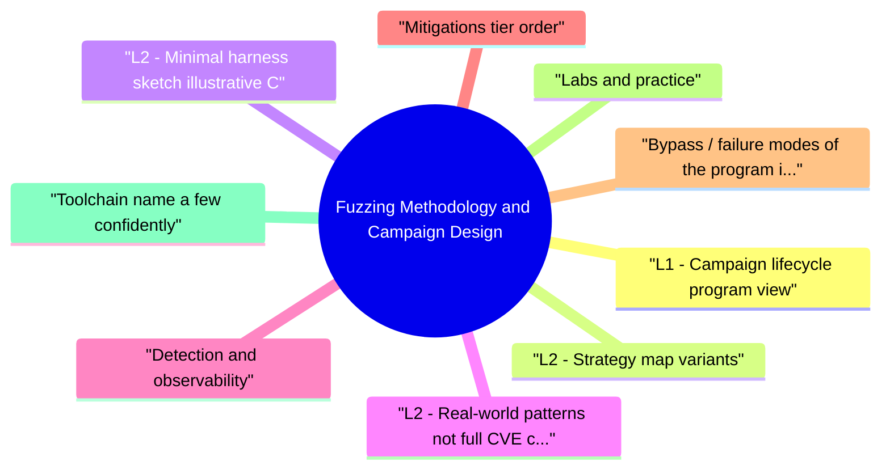

# Fuzzing Methodology and Campaign Design revision map

This is the Fuzzing Methodology and Campaign Design spine I actually use. Types, failures, fixes, traps. Sources: Critical Clarification Fuzzing Methodology and Campaign Design Misconceptions.md, Fuzzing Methodology and Campaign Design - Comprehensive Guide.md, Fuzzing Methodology and Campaign Design - Interview Questions & Answers.md, Fuzzing Methodology and Campaign Design - Quick Reference.md. I do not treat it as a second textbook.

## What people get wrong

## "Just leave the fuzzer running forever."
- Reality: Diminishing returns are normal. Stagnation means you should change inputs or strategy, not only add CPU hours.

## "Raw crash count is our KPI."
- Reality: Unique defects fixed, coverage growth, and regression prevention outperform duplicate crash totals.

## "Security owns fuzzing end-to-end."
- Reality: Engineering fixes code and often co-builds harnesses. Security sets risk priority, bar, and verification.

## "Fuzzing replaces code review."
- Reality: Complementary. Fuzzing finds many memory and parser issues; authorization, business logic, and race conditions still need human review and targeted tests.

## "We can fuzz production traffic captures as seeds."
- Reality: PII and contractual constraints often forbid this. Prefer scrubbed or synthetic corpora.

## "No crashes means we can stop fuzzing."
- Reality: New code, compiler changes, and config drift reopen surface. Campaigns should be continuous or regression-gated in CI.

## "One global job covers all products."
- Reality: Per-component harnesses and owners scale; monolithic jobs hide accountability and delay fixes.

## "Grammar fuzzers are set-and-forget."
- Reality: Specs evolve. Stale grammars miss new branches; they need versioning like production parsers.

## VAPT steps already in the folder

## L1 - Campaign lifecycle (program view)
- Inventory native parsers, decoders, CLI tools, and services with high exposure or high privilege.
- Prioritize using reachability (network, user uploads), blast radius, and historical defect density.
- Instrument with coverage feedback and at least one sanitizer build where feasible.
- Operate continuous or high-frequency batch jobs with alerts on sanitizer crashes.
- Govern: named owners, severity SLAs, and monthly program metrics-not raw crash counts alone.

## L2 - Strategy map (variants)
- Interview tip: say "input shape and oracle" before naming tools.

## L2 - Minimal harness sketch (illustrative C)
- Anti-pattern: parse untrusted bytes in production without a narrow API for fuzzing.
- Hardened pattern: isolated state per iteration, bounded allocations, explicit limits.

## L2 - Real-world patterns (not full CVE chain)
- OSS-Fuzz ecosystem: thousands of open-source projects under continuous fuzzing with public crash dashboards-useful case study for program scale.
- ClusterFuzz / internal equivalents: dedup, minimization, and bisection at org scale.
- Image and archive parsers historically yield memory corruption under malformed inputs; campaigns often combine libFuzzer + ASAN with seed corpora from real files.

## Detection and observability
- Sanitizer reports: ASAN heap-buffer-overflow, UBSAN shift exponent, MSAN uninitialized read.
- Coverage dashboards: new edges per day; stagnation signals stuck campaigns.
- Crash bucketing: stack hash + dedup to avoid 10k duplicates of one bug.
- CI signals: fuzz job failures on PRs when regression files reproduce.

## Mitigations (tier order)
- Design: minimize native attack surface; prefer memory-safe components for new parsers.
- Code: bounds checks, fuzz-friendly APIs, resettable state, explicit resource limits.
- Build: default sanitizer builds for fuzzing; hardened production builds separate.
- Process: SLAs for security crashes; regression tests from minimized inputs.
- Monitoring: alert on crash spikes in staging fuzz pools mirroring prod configs.

## Bypass / failure modes of the program itself
- No sanitizers -> silent corruption or flaky behavior without clear signals.
- Shallow seeds -> coverage plateaus; attackers still reach deep paths in prod.
- Orphan crashes -> no owner -> fixes never land; rot on backlog.
- PII in seeds -> compliance incidents; always scrub or synthesize.

## Labs and practice
- Google Fuzzing tutorials and libFuzzer docs - harness design.
- AFL++ crash triage workflows - mutation campaigns.
- OSS-Fuzz issue trackers - read minimized reproducers and fix patterns.

## Toolchain (name a few confidently)
- libFuzzer, AFL++, honggfuzz, ClusterFuzz-lite / OSS-Fuzz, valgrind (slower), coverage llvm-cov.

## Interview clusters

## Authoritative references
- CWE-20 (Input Validation) - umbrella for many parser failures uncovered by fuzzing.
- NIST SP 800-218 (SSDF) - secure SDLC practices including testing automation.
- LLVM SanitizerCoverage, libFuzzer documentation.

## Cross-links
- Fuzzing Security Testing · Crash Analysis for Security · Software Supply Chain Security · Risk Prioritization Framework

## Verification checklist
- [ ] Draft a one-page charter: scope, owners, metrics, SLAs.
- [ ] List three reasons a campaign might plateau and how you'd respond.

## 60-second answer
- Q: How do you run fuzzing as a program, not a one-off?

## Scoping and prioritization

### Q: What do you fuzz first in a large company?
- A: Internet-facing decoders (images, archives, media), authentication-adjacent native code, and anything running elevated privilege, weighted by ease of harnessing and past incident/CVE density in that component class.

### Q: How do you know a campaign is "stuck"?
- See the source section `Q: How do you know a campaign is "stuck"?` for the worked example.

## Operations

### Q: Who should triage fuzzer output?
- A: A joint model: security or fuzz infra owns dedup, severity, and noise filtering; service owners own fix and validation; PSIRT may gate external disclosure.

### Q: How do you avoid PII in corpora?
- A: Synthetic seeds first; if production-like data is needed, use scrubbed exports, allow-listed fields only, and legal review for retention.

## CI and scale

### Q: Should every PR run a full fuzz job?
- A: Usually no-full campaigns are too slow. Typical pattern: nightly full pools plus PR-gated smoke (short runs, regression corpus only, or affected-target subset).

## Staff / principal prompts

### Q: What OKRs would you set for year one?
- A: Examples: N critical components under continuous fuzz; X% reduction in open high-severity parser bugs; median days from first sanitizer report to verified fix; zero unowned fuzz targets in the inventory.

## Mock ladder

## Lifecycle
- inventory -> prioritize -> harness + seeds -> run (+sanitizer) -> dedup/triage -> fix -> regression seeds

## Pick targets
- Network exposure · user-controlled formats · privilege · historical bug density · harness cost

## Strategies

## Metrics that matter
- New edges/week · unique security bugs · MTTR for crashers · job uptime · open S0/S1

## Governance
- Owner per target · SLA · dashboards · no silent risk accept without named accountability

## Toolchain
- libFuzzer · AFL++ · honggfuzz · ClusterFuzz / OSS-Fuzz patterns · llvm-cov

## Cross-read
- Fuzzing Security Testing · Crash Analysis for Security · Secure CI CD Pipeline Security

## One-liner

## If I only open two more topics

- Stay inside this folder for the long guide. Jump only when a section names a sibling topic.
- Cookie Security, CSRF, XSS, JWT, OAuth, and TLS show up as neighbors on a lot of these maps.
