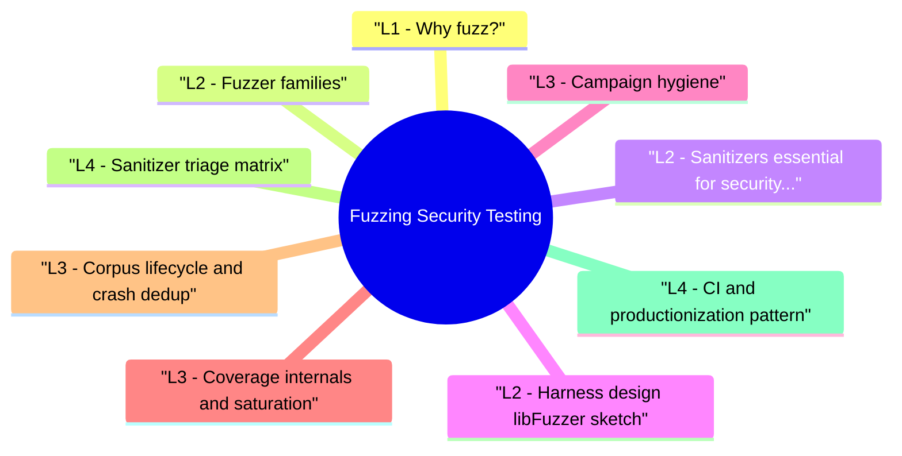

# Fuzzing Security Testing revision map

Last mock I bounced around the Fuzzing Security Testing folder. This file is the stop that. Drawn from Critical Clarification Fuzzing Security Testing Misconceptions.md, Fuzzing Security Testing - Comprehensive Guide.md, Fuzzing Security Testing - Interview Questions & Answers.md, Fuzzing Security Testing - Quick Reference.md, Fuzzing Security Testing - VAPT Methodology.md. Skim the mermaid, then the outline.

## L1 - Why fuzz?
- Parsers and protocol stacks are bug-dense.
- Hand-written tests miss corner cases fuzzers explore automatically.
- Coverage-guided fuzzing prioritizes inputs that reach new code.

## L2 - Fuzzer families
- Interview phrase: "Feedback loop: coverage bitmap drives which mutations to keep."

## L2 - Sanitizers (essential for security signal)
- ASan: out-of-bounds, UAF, double-free (overhead ~2×).
- UBSan: undefined behavior (shift, overflow where enabled).
- MSan: uninitialized memory (expensive; Linux focus).

## L2 - Harness design (libFuzzer sketch)
- Good harness: minimal surface, reset state each iteration, no global leaks across runs without cleanup.

## L3 - Campaign hygiene
- Seed corpus from valid samples (small, diverse).
- Timeout per run; detect hangs.
- Parallelize jobs; merge unique crashes.
- Track commit hash and dictionary version.

## L3 - Coverage internals and saturation
- Coverage-guided fuzzing keeps inputs that unlock new control-flow edges, but campaign quality depends on interpreting plateaus correctly.
- Early phase: rapid edge discovery from broad mutations.
- Middle phase: diminishing returns; dictionary and grammar hints matter more.
- Late phase: plateau can mean "high coverage" or "poor harness reachability."
- New edges/hour
- Unique crash signatures/hour
- Corpus growth rate
- Time since last meaningful coverage increase

## L3 - Corpus lifecycle and crash dedup
- Treat corpus management as engineering, not housekeeping:
- Seed curation: keep minimal, semantically diverse valid inputs.
- Minimization: prune redundant samples after each campaign.
- Regression corpus: preserve "interesting" non-crashing inputs that unlocked major coverage.
- Crash dedup: group by stack + faulting instruction + sanitizer class (single stack hash alone is often noisy).

## L4 - Sanitizer triage matrix
- Different sanitizer classes imply different validation urgency:
- Always retest without sanitizer to confirm reproducibility and avoid overfitting to instrumentation artifacts.

## L4 - CI and productionization pattern
- For interview-ready depth, describe a two-lane program:
- PR lane (short): smoke fuzz targets with tight time budget to catch regressions early.
- Nightly lane (deep): longer campaigns on critical parsers/protocol handlers.
- Governance lane: inventory targets, owner mapping, coverage SLOs, and stale-target alerts.
- Feedback lane: auto-create issues with minimized repro artifacts and symbolized traces.

## L3 - Limits and false sense of security
- Coverage ≠ all bugs (logic, crypto, timing).
- Closed-source without harness access fuzzes slower.
- API fuzzing (REST) differs from binary fuzzing (OpenAPI-based generators, RESTler-class tools).

## Toolchain (examples)
- AFL++, libFuzzer (LLVM), Honggfuzz, cargo fuzz, ClusterFuzz / OSS-Fuzz (service model)

## Interview clusters

### Junior
- What is coverage-guided fuzzing?

### Mid
- Why use ASan with libFuzzer?

### Senior
- How do you prevent fuzz jobs from flaking CI?

### Staff
- Org program: critical parsers inventory + SLO for fuzz uptime

## Authoritative references
- LLVM libFuzzer documentation
- AFL++ readme (mutation strategies)
- Google OSS-Fuzz practices (for scale patterns)

## Cross-links
- Crash Analysis · Fuzzing Methodology and Campaign Design · Exploit Development · Secure Source Code Review

## Verification checklist
- [ ] Write a one-paragraph harness design for a parser you know.
- [ ] Explain why seeds matter.
- [ ] Name two sanitizers and what they catch.
- [ ] Explain how you would detect coverage saturation in a campaign.
- [ ] Describe a PR lane vs nightly lane fuzzing strategy.

## Flags I check in 90 seconds

## Core idea
- Mutate inputs -> execute under instrumentation -> keep interesting cases -> triage crashes

## Types
- Dumb random · Mutation + corpus · Coverage-guided (AFL++, libFuzzer) · Grammar / generation

## Sanitizers
- ASan (heap/stack OOB, UAF) · UBSan · MSan (uninit)

## Harness tips
- Narrow API · reset state · timeouts · good seeds · dictionary (optional)

## Tools
- AFL++ · libFuzzer · Honggfuzz · cargo fuzz · ClusterFuzz pattern

## Output path
- Minimize -> bucket -> Crash Analysis -> severity

## Cross-read
- Fuzzing Methodology and Campaign Design · Crash Analysis · Secure Code Review

## One-liner

## Misreads that still sneak in

## "Fuzzing guarantees no bugs remain."
- Reality: Fuzzing explores stochastically; logic bugs, race conditions, and crypto issues often need other methods.

## "We can fuzz production APIs directly."
- Reality: Unauthorized load is illegal / out of scope; fuzz staging or isolated services with approval.

## "No crash means secure."
- Reality: Silent wrong behavior without a crash (pure logic flaws) may not be caught by crash-only oracles.

## "libFuzzer is only for C++."
- Reality: Clang toolchain supports C; other languages use FFI harnesses or language-specific fuzzers.

## "100% coverage means fuzzed enough."
- Reality: Coverage ≠ all states; correlations and orderings matter.

## "Fuzzing replaces pen testing."
- Reality: Different artifacts-fuzz finds implementation bugs; pentest tests whole systems and chains.

## "Sanitizers in production fix security."
- Reality: Sanitizers are for test builds-production uses hardening without full ASan overhead typically.

## "One seed is enough."
- Reality: Diverse small seeds dramatically speed reach of deep paths.

## Lab methodology

## Objective
- Create a repeatable assessment workflow for Fuzzing Security Testing that produces reproducible evidence and actionable remediation guidance.

## Phase 1 - Scope and preparation
- Confirm in-scope assets, test windows, and prohibited actions.
- Identify critical user journeys and trust boundaries.
- Define severity rubric and evidence requirements before testing.

## Phase 2 - Recon and attack-surface mapping
- Enumerate relevant endpoints, flows, and data paths.
- Document where security checks are expected to happen.
- Mark high-value assets and high-impact paths.

## Phase 3 - Hypothesis-driven testing
- Start with low-risk probes and baseline behavior.
- Test failure hypotheses systematically (one variable at a time).
- Capture request/response artifacts for each finding candidate.

## Phase 4 - Validation and impact proof
- Reproduce findings with clean-state retests.
- Confirm exploitability and practical impact.
- Eliminate false positives; record confidence level.

## Phase 5 - Remediation and verification
- Provide immediate containment + structural fix recommendations.
- Define post-fix verification tests and telemetry checks.
- Re-test after remediation and close with evidence.

## Evidence template
- Asset / endpoint:
- Preconditions:
- Reproduction steps:
- Observed behavior:
- Security impact:
- Business impact:
- Recommended fix:
- Verification result:

## Interview drill
- In 3 minutes, explain how you would run this VAPT workflow for one production-like service and what evidence you need before escalating severity.

## Clusters from the Q&A file

- Q: Dumb vs coverage-guided?
- Q: What makes a bad fuzz harness?
- Q: Where should fuzzing run?
- Q: OSS-Fuzz-what is it?

## 60-second answer
- Q: What is fuzzing and how is it used in security testing?

## Mechanics

## Operations

### Q: OSS-Fuzz-what is it?
- A: Google-operated service pattern for open source: maintainers submit projects with harnesses; continuous fuzzing finds bugs early.

## Depth: Follow-ups
- Grammar-based vs mutation for structured inputs
- Differential fuzzing (compare two implementations)
- Fuzzing WebAssembly or JIT edges (advanced)

## Mock ladder

## Cross-links I actually follow

- Stay inside this folder for the long guide. Jump only when a section names a sibling topic.
- Cookie Security, CSRF, XSS, JWT, OAuth, and TLS show up as neighbors on a lot of these maps.
