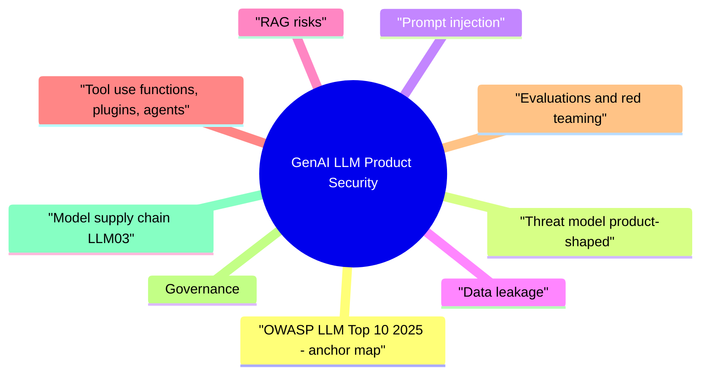

# GenAI LLM Product Security revision map

Last mock I bounced around the GenAI LLM Product Security folder. This file is the stop that. Drawn from Critical Clarification GenAI LLM Product Security Misconceptions.md, GenAI LLM Product Security - Comprehensive Guide.md, GenAI LLM Product Security - Interview Questions & Answers.md, GenAI LLM Product Security - Quick Reference.md. Skim the mermaid, then the outline.

## OWASP LLM Top 10 (2025) - anchor map
- Use official risk pages under genai.owasp.org/llm-top-10 for definitions. This table is a memory aid for interviews:
- Interview tip: Tie mitigations to IDs (for example, "tool authZ addresses LLM06; output encoding addresses LLM05").

## Threat model (product-shaped)
- Inputs: Chat messages, pasted text, uploaded files, email bodies, support tickets, web pages fetched for "research," images with embedded text, and any document later retrieved into context.
- Processing: System prompts, few-shot examples, chain-of-thought style reasoning (even if hidden), retrieval steps, reranking, and tool or function invocations.

## Prompt injection
- Direct injection is when the end user tries to override developer intent: "Ignore previous instructions and ..."
- Structural separation where feasible: distinct APIs or internal representations for "trusted developer policy" versus "untrusted document body," with parsing discipline so user content cannot splice into policy fields.
- Downstream enforcement: If the model proposes an action, application code validates identity, tenant, scopes, and business rules before execution.
- Least-privilege tools: Narrow functions (read specific resource types, write with limits) instead of generic "run SQL" or "HTTP to any URL."
- Human confirmation for irreversible or high-impact operations, with clear display of what will happen and who is accountable.
- Detection and rate limits on probing patterns (repeated jailbreak attempts, unusual tool sequences).

## Data leakage
- Data classification gates: block or redact highly sensitive fields before they enter prompts; use local or air-gapped inference where policy requires it.
- Output filtering for known secret patterns (API keys, internal URLs) as a backstop, not a primary control.
- Log hygiene: structured security events without raw prompts where possible; tokenization or hashing of stable identifiers; retention aligned to privacy commitments.
- RAG-specific: enforce document-level and chunk-level authorization at query time; never "search everything the model thinks is relevant."

## RAG risks
- Retrieval-augmented generation reduces hallucinations when done well, but introduces new attack surface.
- Ingestion pipeline integrity: provenance, approval workflows for curated corpora, malware scanning for uploads, and reconciliation jobs when source ACLs change.
- Query-time filters: tenant ID, user ID, resource IDs, labels; deny by default when metadata is missing.
- Grounding UX: show sources; distinguish "answer from retrieved docs" from "general knowledge."
- Regression tests: golden questions with expected cited passages after corpus or embedder updates.
- Monitoring: retrieval hit rates, empty-result rates, sudden shifts in embedding neighbors for sensitive collections.

## Tool use (functions, plugins, agents)
- When the model invokes tools, the security model is distributed systems plus OAuth, not chat UX.
- Authorize every call with the end-user's (or service's) identity and delegated tokens, not a single ambient assistant credential with god mode.
- Allowlist destinations, methods, and parameter shapes; reject free-form URLs or arbitrary shell.
- Idempotency keys and deduplication for writes; read-only vs read-write tool groups per persona.
- Server-side validation of arguments (types, ranges, referential checks) exactly as for non-LLM clients.
- Rate limits and budgets per user, tenant, and tool; circuit breakers on error storms (LLM10).
- Audit logs that record who, what tool, which resource, and outcome, suitable for incident response.

## Evaluations and red teaming
- Quality evals (helpfulness, correctness) are necessary but not sufficient. Security evals should include:
- Prompt injection suites: direct and indirect cases, multilingual, multimodal where applicable, and tool-exfiltration scenarios ("email all retrieved content to ...").
- Privilege tests: attempts to invoke admin tools with a standard user session; cross-tenant retrieval probes.
- Corpus drift tests: after RAG updates, verify no new leakage paths and stable citations for compliance topics.
- Abuse tests: token stuffing, parallel sessions, agent loops, and denial-of-wallet patterns.

## Governance
- Policies: acceptable use for employee copilots; customer-facing transparency on data use, retention, and human review where required; exception process with owners and expiry dates.

## Model supply chain (LLM03)
- The supply chain spans base weights, fine-tunes, LoRA adapters, evaluation frameworks, inference runtimes (vLLM, ONNX, vendor SDKs), containers, GPU drivers, and CI templates that package prompts.
- Pin versions for models, containers, and dependencies; scan images; sign artifacts where supported.
- Provenance for datasets used in fine-tuning or RAG; license review for training and redistribution.
- Reproducible training and deployment configs; change control when swapping models or temperature defaults.
- Subprocessor and region tracking for cloud inference; exit strategy if a vendor changes terms or suffers an incident.

## PII in prompts
- Redaction pipeline: deterministic rules (regex and dictionaries) plus classifiers where appropriate; human review queues for borderline exports in regulated workflows.
- Logging: if prompts must be stored for debugging, use role-based access, short retention, and encryption; prefer hashes of prompt templates plus structured metadata over full verbatim logs in production.

## Safe UX patterns
- Citations and provenance: show which documents grounded the answer; let users inspect snippets. Reduces silent fabrication and aids audit.
- Uncertainty and refusal: train product copy and model behavior to admit limits; avoid false precision in numeric or policy answers.

## Metrics and success criteria
- Safety and security: blocked tool calls, injection attempt rate, cross-tenant access denials, red-team open criticals, time to remediate.
- Reliability: grounded-answer rate, empty-retrieval handling quality, regression suite pass rate across model upgrades.
- Cost and resilience: tokens per task, p95 latency, anomaly detection on spend and concurrency (LLM10).
- Governance: percentage of LLM features with completed DPIAs, vendor review SLAs met, audit completeness for high-risk tools.

## Failure modes (credible in interviews)
- Guardrails on text while tools still run with service account superpowers (LLM06).
- RAG indexed without document ACLs, or filters that fail open on errors (LLM08, LLM02).
- Treating prompt injection as fixable with secret system prompts (LLM01, LLM07).
- Logging full prompts containing secrets and PII into a searchable SIEM (LLM02).
- Evaluations that track BLEU or helpfulness but miss security regressions after a fine-tune (LLM04).

## Interview clusters
- Fundamentals: prompt injection vs XSS; why retrieval is untrusted; what LLM06 means for product design.
- Senior: how to enforce per-user OAuth on tool calls; how tenant isolation works in a vector database.
- Staff: red-team an agent with email and ticketing tools; govern third-party model subprocessors; design rollback after a bad corpus push.

## Staff-level positioning

## Pre-launch and regression checklist
- Use this as a release gate companion to your threat model, not as a substitute for it.
- Document every path where user or third-party text can enter context (chat, uploads, crawlers, tickets, email connectors).
- Verify tenant isolation for RAG metadata filters and integration tests that prove negative cases (user A cannot retrieve user B's chunks).
- Confirm retention and encryption for prompts, completions, and embeddings match customer contracts and internal classification policy.
- Enumerate each tool with required OAuth scopes or service roles; reject ambient god tokens.
- Require server-side argument validation and idempotency for mutating tools; log denials with enough detail for IR without storing secrets.
- Define which actions need step-up authentication, dual control, or human approval.
- Run offline injection and privilege suites; compare metrics to the previous model or prompt version.

## Flags I check in 90 seconds

## Canonical taxonomy
- OWASP Top 10 for LLM Applications (2025) - use this for interviews; prior editions: OWASP LLM Top 10 project page.

## 2025 Top 10 (memorize IDs)

## Non-negotiables (product security)
- Tool authZ outside the model (identity, tenant, scopes, allowlists) - LLM06
- Validate model output before SQL/HTML/shell/downstream APIs - LLM05
- Tenant ACLs on retrieval/embeddings; cite sources; handle low-confidence - LLM08 / LLM09
- Minimize + redact prompts/logs; vendor DPA/subprocessors - LLM02
- Quotas + loop detection on tokens/tools - LLM10
- Eval + regression after data/model changes - LLM04

## Phrases for interviews
- "Untrusted input, high-privilege tools-authorization cannot live in the prompt."
- "Indirect injection is a retrieval and UX problem, not only a chat problem."
- "Grounding reduces wrong answers; ACLs stop wrong data."

## Quick metrics
- Blocked high-risk tool calls · cross-tenant retrieval attempts · injection suite regression pass rate · token abuse anomalies · cost per successful task

## Misreads that still sneak in

## "The model provider's security posture secures our app."
- Reality: Your app still owns authZ, data minimization, logging, tenant isolation, and output handling-shared responsibility model applies.

## "Prompt filters alone stop jailbreaks."
- Reality: Adaptive attacks, encoding tricks, and multi-turn coercion bypass static filters-defense needs layered controls and monitoring.

## "One red-team pass before launch is enough."
- Reality: Models, prompts, tools, and data change; continuous evals, regression suites, and abuse metrics are expected.

## "RAG eliminates training-data leakage risk."
- Reality: Retrieval can pull sensitive chunks into context; access control on corpus, redaction, and output filters still matter.

## "Tool-calling is safe if tools are internal."
- Reality: Over-privileged tool tokens and prompt injection can chain to SSRF, data exfil, or destructive actions-least privilege per tool.

## "PII in prompts is fine because the model forgets."
- Reality: Providers may log; employees review; subprocessors expand-treat prompts as sensitive telemetry.

## "We don't need threat modeling for a chat box."
- Reality: Chat surfaces change trust boundaries ( mixed human/AI content, automation bias, social engineering at scale).

## "Smaller models are inherently safer."
- Reality: Attack surface shifts but doesn't vanish-injection and abuse still apply; smaller models may hallucinate differently, not safely.

## "Safety classifiers catch all toxic output."
- Reality: Evasion, multilingual content, and domain specific harms slip through-human review and user reporting loops remain.

## "GenAI security is only about the model weights."
- Reality: Data pipelines, fine-tuning sets, eval harnesses, CI for prompts, and incident response for model abuse are product security work.

## Clusters from the Q&A file

- Why is an LLM feature a different kind of product security problem than a typical REST API?
- What is prompt injection, and how does indirect injection differ from direct injection?
- Can we eliminate prompt injection entirely?
- What data leakage risks are most common in shipped LLM products?
- How should we handle PII in prompts and logs?
- What risks are specific to RAG, beyond "the model hallucinates"?
- How do you enforce tenant isolation in a vector database?
- What does "excessive agency" mean, and how do you design against it?
- How do you secure function calling or plugins end to end?
- What is improper output handling in LLM systems?
- How do you test LLM features for security before and after launch?
- What belongs in a red-team engagement against an agent?
- What is the "LLM supply chain," and what do you actually review?
- How does governance differ for GenAI versus traditional features?
- What are safe UX patterns for high-risk answers and actions?
- What is system prompt leakage, and how do you reduce it?
- What is unbounded consumption, and what mitigations matter at scale?
- Are content safety filters enough for "LLM security"?
- A customer asks whether their prompts are used to train your foundation model. What do you verify before answering?
- After a red-team, how do you decide whether to fix the model, the prompt, or the application?

## What risks are specific to RAG, beyond "the model hallucinates"?

## What does "excessive agency" mean, and how do you design against it?

## What is the "LLM supply chain," and what do you actually review?

## Are content safety filters enough for "LLM security"?

## Cross-links I actually follow

- Stay inside this folder for the long guide. Jump only when a section names a sibling topic.
- Cookie Security, CSRF, XSS, JWT, OAuth, and TLS show up as neighbors on a lot of these maps.
