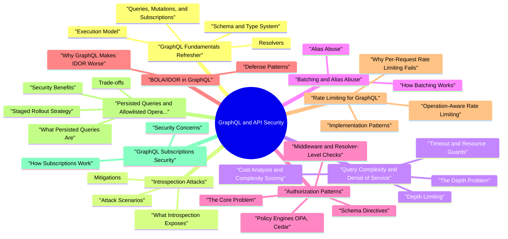

# GraphQL and API Security revision map

This is the GraphQL and API Security spine I actually use. Types, failures, fixes, traps. Sources: Critical Clarification GraphQL and API Security Misconceptions.md, GraphQL and API Security - Comprehensive Guide.md, GraphQL and API Security - Interview Questions & Answers.md, GraphQL and API Security - Quick Reference.md. I do not treat it as a second textbook.

## GraphQL Fundamentals Refresher

### Schema and Type System
- A GraphQL schema is the contract between client and server. It defines every type, field, relationship, and operation the API supports using the Schema Definition Language (SDL):

### Resolvers
- Each field in the schema is backed by a resolver - a function that fetches or computes the field's value. Resolvers are where the actual data access, business logic, and authorization decisions happen:

### Queries, Mutations, and Subscriptions
- Queries are read operations. They can nest arbitrarily deep following the type graph.
- Mutations are write operations. They execute sequentially (unlike queries, which can run in parallel), but can still return nested types that trigger resolver chains.
- Subscriptions open a persistent connection (typically WebSocket) for real-time data. They maintain server-side state and consume resources for the lifetime of the subscription.

### Execution Model
- When a GraphQL server receives an operation, it:
- Parses the query string into an AST (Abstract Syntax Tree).
- Validates the AST against the schema (type checking, field existence, argument types).
- Executes the operation by walking the AST and calling resolvers breadth-first, level by level.
- Serializes the result into the response shape matching the query.

## Introspection Attacks

### What Introspection Exposes
- GraphQL introspection is a built-in capability defined in the specification that allows clients to query the schema itself. The __schema and __type meta-fields return the complete type system:

### Attack Scenarios
- Identifying input types for injection: Introspection reveals argument types and input objects, helping an attacker craft malformed inputs targeting specific resolvers.

### Mitigations
- Schema registry / CI publishing: Publish the schema through CI/CD to internal documentation tools, developer portals, or schema registries (Apollo Studio, GraphQL Hive) instead of relying on runtime introspection.
- Limit batch size: Cap the number of operations per HTTP request (e.g., maximum 5 or 10). Reject requests exceeding the limit.
- Count aliases in cost analysis: Ensure the complexity scoring system treats each alias as a separate invocation. The cost of a1: login(...) a2: login(...) should be 2× the cost of a single login(...).

## Query Complexity and Denial of Service

### The Depth Problem
- Each level of nesting triggers a new set of resolver calls and database queries. A depth of 10 levels on a type graph with fan-out could trigger millions of resolver calls from a single HTTP request.

### Depth Limiting
- The simplest defense is a hard limit on query depth. Libraries like graphql-depth-limit reject queries exceeding a configured maximum before execution:

### Cost Analysis and Complexity Scoring
- Cost analysis assigns a numeric weight to each field and computes the total cost of a query before execution. If the cost exceeds a threshold, the query is rejected.
- The total cost is computed recursively. For a field with a list multiplier, the cost of its children is multiplied by the expected list size:
- items.name: 0
- items: 0 + (1 × 0) = 0
- orders: 5 + (50 × 0) = 5
- users: 10 + (100 × 5) = 510

### Timeout and Resource Guards
- Cost analysis operates before execution. Runtime guards protect against queries that pass static analysis but still consume excessive resources:
- Resolver-level timeouts: Kill individual resolver calls that exceed a duration threshold.
- Operation-level timeouts: Kill the entire operation if total execution time exceeds a limit (e.g., 30 seconds).
- Connection pool limits: Bound the number of concurrent database connections a single operation can consume.
- DataLoader batching: Use DataLoader to batch and deduplicate resolver calls within a single execution tick, preventing the N+1 query problem from amplifying into a DoS vector.

## Batching and Alias Abuse

### How Batching Works
- GraphQL servers commonly accept an array of operations in a single HTTP request:

### Alias Abuse
- Even without array batching, GraphQL aliases allow repeating the same field or operation under different names within a single query:

## Authorization Patterns

### The Core Problem
- If authorization is only checked at the query entry point (publicPost), the traversal to billingInfo is unauthorized but succeeds because the resolver trusts the parent context.

### Schema Directives
- Custom directives annotate the schema with authorization requirements, making the policy visible and declarative:

### Middleware and Resolver-Level Checks
- graphql-shield provides a rules engine that maps authorization logic to the type graph:
- The shield middleware intercepts resolver execution and evaluates rules before the resolver runs. The fallbackRule option provides deny-by-default behavior.

### Policy Engines (OPA, Cedar)
- For complex authorization requirements, external policy engines provide centralized, auditable policy management:
- Open Policy Agent (OPA): Policies written in Rego, evaluated against a JSON input (user, resource, action). The GraphQL middleware sends an authorization query to OPA before each resolver executes.
- AWS Cedar: A policy language designed for fine-grained authorization with built-in support for hierarchical resources, which maps well to GraphQL's type graph.

### Deny-by-Default
- The safest pattern is to deny access to all fields by default and explicitly grant access. This inverts the common failure mode where new fields are accidentally exposed because authorization was forgotten:
- When a developer adds a new field or type, it is inaccessible until an authorization rule is explicitly added. This creates a forcing function for security review.

## BOLA/IDOR in GraphQL

### Why GraphQL Makes IDOR Worse
- Broken Object-Level Authorization (BOLA) / Insecure Direct Object Reference (IDOR) is the #1 API security risk (OWASP API Security Top 10). GraphQL amplifies IDOR risk in several ways:
- Predictable IDs: Even without Relay, many GraphQL APIs use autoincrement database IDs as the ID scalar. Querying user(id: "1"), user(id: "2"), user(id: "3") is straightforward enumeration.

### Defense Patterns
- Authorization at the data-fetching layer: Enforce ownership/tenant checks where data is loaded, not just at the query entry point. Every resolver that fetches a resource by ID must verify the requesting user has access:
- Use opaque, non-sequential IDs: UUIDs or cryptographically random identifiers prevent enumeration. Even with Relay-style global IDs, the underlying identifier should be a UUID, not an autoincrement integer.

## Rate Limiting for GraphQL

### Why Per-Request Rate Limiting Fails
- Traditional API rate limiting counts HTTP requests per IP or per API key. In GraphQL, this is nearly useless because:
- One HTTP request can contain a batch of 100 operations.
- One operation can use aliases to invoke 500 resolvers.
- Two operations with identical HTTP characteristics can differ by 1000× in server-side cost.
- A query requesting { users { name } } and a query requesting { users { orders { items { reviews { author { orders { ... } } } } } } } are both one HTTP POST to /graphql.

### Operation-Aware Rate Limiting
- Effective GraphQL rate limiting must understand the operation being executed:
- Tenant and user-level quotas: Apply different rate limits based on the authenticated user's plan tier, organization, or role. Admins performing bulk operations may need higher limits than regular users.

### Implementation Patterns
- For cost-based rate limiting across requests, use a token bucket or sliding window algorithm keyed on the authenticated user, with the query's complexity score as the cost per request rather than a flat cost of 1.

## Persisted Queries and Allowlisted Operations

### What Persisted Queries Are
- Persisted queries replace arbitrary query strings with pre-registered query hashes or IDs. Instead of sending the full query text, the client sends a hash:

### Security Benefits
- Query complexity is known at registration time: Since every allowed query is pre-analyzed, the server knows the maximum cost of any operation before execution. There are no surprises.
- Reduced attack surface: Persisted queries effectively convert a flexible GraphQL API into a fixed set of operations, similar to REST endpoints but with GraphQL's type-safety and tooling advantages.

### Trade-offs
- Flexibility loss: Ad-hoc queries for debugging, admin tools, or internal dashboards require either a separate endpoint without persisted query enforcement or explicit registration of debugging queries.

### Staged Rollout Strategy
- Phase 1 - Monitoring: Deploy APQ in logging mode. Record all queries and their hashes. Identify the set of queries in active use.
- Phase 2 - Soft enforcement: Enable APQ with automatic registration. New queries are accepted and registered. Alert on unrecognized query patterns.
- Phase 3 - Strict enforcement for external clients: Mobile and public-facing clients must use persisted queries. Internal tools and admin interfaces may still use ad-hoc queries via a separate authenticated endpoint.
- Phase 4 - Full enforcement: All operations must be persisted. The query registry is managed as code, reviewed in PRs, and deployed alongside the schema.

## GraphQL Subscriptions Security

### How Subscriptions Work
- The server maintains the subscription in memory, listening for events and executing the subscription resolver whenever relevant data changes.

### Security Concerns
- WebSocket authentication: The initial WebSocket handshake does not carry HTTP headers in the same way as regular requests. Authentication must be handled during the connection initialization phase:
- Resource exhaustion through subscription flooding: An attacker can open thousands of subscriptions, each consuming server memory and event-processing capacity. Mitigations:
- Limit the number of concurrent subscriptions per connection and per user.
- Limit the total number of WebSocket connections per IP and per authenticated user.
- Implement backpressure: if the client cannot consume events fast enough, drop events or close the connection rather than buffering indefinitely.
- Set idle timeouts: close subscriptions that haven't received events within a configurable period.

## Federation and Subgraph Security

### What Federation Is
- GraphQL federation (Apollo Federation, GraphQL Mesh, or schema stitching) composes multiple GraphQL services (subgraphs) into a unified API served by a gateway (router). Each subgraph owns a portion of the schema:

### Authorization Consistency Across Subgraphs
- The central security challenge in federation is ensuring consistent authorization across independently developed and deployed subgraphs:
- Fields that override authorization directives from other subgraphs.
- Types that expose relationships bypassing another subgraph's access controls.
- Input types that accept arguments intended for internal use only.

### Mitigation Patterns
- Centralized policy service: All subgraphs call the same authorization service (e.g., OPA) with the same policy definitions. This ensures consistent authorization decisions regardless of which subgraph is resolving.
- End-to-end authorization tests: Integration tests that send queries traversing multiple subgraphs and verify authorization is enforced at each boundary.

## Error Handling and Information Leakage

### How GraphQL Errors Leak Information
- GraphQL's error response format is rich and structured, which aids debugging but can leak sensitive information in production:
- This error reveals: the file structure (/app/src/resolvers/user.js), the line number (42), the property name (organizationId), the framework and Node.js version, and that the user object can be null.

### Information Leakage Vectors
- Stack traces: Internal implementation details including file paths, line numbers, library versions, and database driver information.
- Field suggestions: Cannot query field "emai" on type "User". Did you mean "email"? - this confirms the existence of the email field even when introspection is disabled, enabling schema enumeration one field at a time.

### Hardening Error Responses
- Disable field suggestions: Suppress the "Did you mean" suggestions in production to prevent schema enumeration.
- Use structured error codes: Define a set of client-facing error codes (UNAUTHENTICATED, FORBIDDEN, NOT_FOUND, VALIDATION_ERROR, RATE_LIMITED) and map all errors to these codes. Never expose internal error messages.

## Comparison with REST API Security

### Where GraphQL Is Harder to Secure
- See the source section `Where GraphQL Is Harder to Secure` for the worked example.

### Where GraphQL Is Easier to Secure
- See the source section `Where GraphQL Is Easier to Secure` for the worked example.

### Security Parity
- See the source section `Security Parity` for the worked example.

## Real-World GraphQL Vulnerabilities and Case Studies

### GitLab GraphQL Information Disclosure (2020)
- See the source section `GitLab GraphQL Information Disclosure (2020)` for the worked example.

### Shopify GraphQL IDOR (2021)
- See the source section `Shopify GraphQL IDOR (2021)` for the worked example.

### HackerOne GraphQL Disclosure (2019)
- See the source section `HackerOne GraphQL Disclosure (2019)` for the worked example.

### GraphQL Batching for Brute Force
- See the source section `GraphQL Batching for Brute Force` for the worked example.

### GraphQL Introspection in Production APIs
- See the source section `GraphQL Introspection in Production APIs` for the worked example.

## Tools and Libraries

### Apollo Server Security Features
- Apollo Server, the most widely used GraphQL server for Node.js, includes several built-in security features:
- Introspection disabled by default in production (when NODE_ENV=production).
- CSRF prevention: Requires a Content-Type header or a custom Apollo-Require-Preflight header to prevent simple CORS requests from triggering mutations.
- Landing page controls: The Apollo Studio sandbox can be disabled or restricted in production.
- Plugin system: Lifecycle hooks for request validation, response formatting, and error masking.
- Automatic Persisted Queries (APQ): Built-in support for query hashing and caching.

### graphql-shield
- A permission layer for GraphQL servers that provides a declarative, composable authorization model:
- Caching modes (contextual, strict, no_cache) control when rule results are reused across fields, which is important for performance in deeply nested queries.

### graphql-depth-limit
- A simple validation rule that rejects queries exceeding a maximum depth:
- The ignore option allows introspection queries (which are naturally deep) to bypass the depth limit when introspection is enabled.

### graphql-query-complexity
- A more sophisticated cost analysis library that supports field-level cost annotations and multiplier-aware complexity calculation:

### Additional Tools
- graphql-armor: A comprehensive security middleware suite providing depth limiting, cost limiting, alias limiting, character limiting, and disabled introspection in a single package.
- Stellate (formerly GraphCDN): A GraphQL edge caching and rate limiting proxy that sits in front of your GraphQL server and provides operation-aware rate limiting, query caching, and analytics.
- InQL (Burp Suite extension): A security testing tool that performs GraphQL introspection, generates queries for every type and field, and identifies potential security issues.
- graphql-cop: A security auditing tool that checks for common GraphQL misconfigurations: introspection enabled, field suggestions, batching enabled, debug mode, and more.
- GraphQL Voyager: A schema visualization tool. While intended for developers, it's also used by attackers to understand API structure after obtaining the schema through introspection.

## Defenses Summary (Secure-by-Default Checklist)
- Disable introspection in production. Suppress field suggestions. Publish the schema through CI/CD for internal use.
- Enforce authorization at every resolver. Use deny-by-default with graphql-shield or schema directives. Never trust parent context for child authorization.
- Implement depth limits and cost analysis. Combine graphql-depth-limit with graphql-query-complexity. Tune thresholds using production query data.
- Limit batching and aliases. Cap batch size. Count aliases in complexity scoring. Consider disabling array batching if unused.
- Use operation-aware rate limiting. Rate limit by operation name, complexity cost, and authenticated user - not HTTP request count.
- Deploy persisted queries for public-facing APIs. Start with APQ in monitoring mode and progress to strict enforcement.
- Harden error responses. Mask stack traces, suppress field suggestions, use generic error codes. Log full errors server-side.
- Secure subscriptions. Authenticate WebSocket connections. Check authorization on each event delivery. Limit concurrent subscriptions.

## Verification
- Load tests with adversarial queries: Construct worst-case queries (maximum depth, maximum aliases, expensive fields) and verify that limits are enforced and the server remains stable.
- Schema review in PRs: Treat schema changes like API surface changes. Review new fields for authorization requirements. Check that directives are present.
- Logging policy: Verify that the gateway logs operation name, complexity score, execution time, and authenticated user. Verify that resolver-level logging does not capture PII, tokens, or passwords.
- Chaos testing: Simulate resolver dependency failures (database timeout, downstream service unavailable) and verify the server degrades gracefully without leaking internal errors.

## Advanced Production Pitfalls

### DataLoader and authorization cache bleed
- DataLoader improves performance but can accidentally mix trust boundaries if cache keys are too coarse:
- Caching by object ID without tenant/user scope can return cross-tenant data.
- Reusing DataLoader instances across requests can leak previously authorized results.
- Resolver-level auth checks that happen after cache fetch can return sensitive fields before redaction logic runs.

### Persisted query registry abuse
- Persisted queries reduce arbitrary-query risk, but the registry itself becomes security-critical:
- Unauthorized registration/update of query hashes can introduce privileged operations.
- APQ fallback that accepts full query on cache miss can re-open arbitrary query execution.
- Hash-only telemetry is weak for investigations if operation metadata is missing.

### Subscription auth lifecycle gaps
- WebSocket subscriptions are long-lived and can outlast auth assumptions:
- Token valid at connect time but expired/revoked later.
- Role changes not reflected for existing subscriptions.
- Tenant context swapped in reconnect flows without proper re-auth.

## Operational Reality

## Interview Clusters
- Fundamentals: "What is GraphQL introspection and why disable it?" "How does GraphQL authorization differ from REST?"
- Mid-level: "How do aliases bypass rate limits?" "What are persisted queries and when would you use them?"
- Senior: "How do you enforce authZ per field at scale in a federated graph?" "Design a rate limiting system for a public GraphQL API."

## Cross-links
- CORS, JWT/OAuth, IDOR/BOLA, SSRF, Business Logic Abuse, Rate Limiting and Abuse Prevention, API Security (REST), Security Observability, Threat Modeling, Web Application Security Vulnerabilities.

## The one-pager, exploded

## Why different from REST
- One URL, schema-driven, nested resolvers -> field-level authZ and cost matter.

## Top risks

## Rate limiting
- Per operation / cost, not only HTTP per IP.

## Interview sound bite

## Cross-links
- Rate Limiting, IDOR, SSRF, OAuth/JWT, Business Logic Abuse.

## What people get wrong

## "GraphQL is secure because it uses HTTPS"
- Truth: TLS protects transport. GraphQL-specific risks are schema abuse, resolver logic, authZ at field level, and resource exhaustion-HTTPS does not fix those.

## "We can use the same WAF rules as REST"
- Truth: A single endpoint and flexible queries need application-aware limits (depth/complexity, persisted queries, resolver budgets). Generic path rules often miss GraphQL abuse.

## "Introspection is fine in production for developers"
- Truth: Introspection exposes attack surface to everyone who can reach the endpoint. If enabled, strong auth, network controls, or separate dev/stage endpoints are required.

## "Our API gateway authenticates the user-so we're good"
- Truth: Authentication ≠ authorization. GraphQL requires consistent object-level checks-especially for nested fields and batch operations.

## "Rate limiting per IP is enough"
- Truth: Attackers may stay under IP limits while issuing expensive queries. You need query-aware throttles and cost controls.

## Questions that showed up in mocks

- How is securing GraphQL different from securing a REST API?
- What is GraphQL introspection, and how should it be handled in production?
- Explain the query depth and complexity problem in GraphQL. How do you prevent DoS through expensive queries?
- What are the security implications of GraphQL's single-endpoint design for WAFs and API gateways?
- Authorization and IDOR
- Where do GraphQL authorization bugs typically appear, and how do you prevent them?
- How does BOLA/IDOR manifest in GraphQL APIs, and why is it particularly dangerous?
- How do you handle the node(id: ID!) query pattern securely in a Relay-compatible GraphQL API?
- Batching, Aliases, and Rate Limiting
- How do aliases and batching bypass traditional rate limiting, and what's the fix?
- Design a rate limiting strategy for a public-facing GraphQL API. What dimensions do you limit on?
- Subscriptions and Real-Time
- What are the unique security challenges of GraphQL subscriptions?
- How do you authenticate and authorize WebSocket connections for GraphQL subscriptions?
- Federation and Architecture
- In a federated GraphQL architecture, how do you ensure consistent authorization across independently developed subgraphs?
- What are the schema composition risks in GraphQL federation, and how do you mitigate them?
- How do GraphQL error responses create information leakage, and what's your hardening strategy?
- Tooling and Implementation
- Walk me through how you'd use graphql-shield to implement deny-by-default authorization.
- Compare graphql-depth-limit and graphql-query-complexity. When do you use each, and are they sufficient alone?
- What is graphql-armor and when would you choose it over assembling individual security libraries?
- Real-World Scenarios
- A security audit reveals that your GraphQL API returns different error messages for "user not found" vs "user exists but you're unauthorized." How do you fix this and why does it matter?

## Fundamentals

## Error Handling

### Your organization is migrating from REST to GraphQL. What security risks does the transition introduce, and how do you mitigate them?
- See the source section `Your organization is migrating from REST to GraphQL. What security risks does the transition introduce, and how do you mitigate them?` for the worked example.

### Describe how you would investigate and respond to a suspected data exfiltration via a GraphQL API.
- See the source section `Describe how you would investigate and respond to a suspected data exfiltration via a GraphQL API.` for the worked example.

## Depth: Interview Follow-ups - GraphQL and API Security
- Field-level authZ: How do you prevent BOLA/IDOR when nested resolvers fetch related objects? What about the node interface?
- DoS: Depth/complexity limits vs product need for flexible queries - what's your operational compromise? How do you tune thresholds?
- Introspection: Prod policy and developer workflow alternative (schema registry/CI). What about field suggestion leakage?
- Batching: How do you detect and block alias-based brute force? What if the attacker uses legitimate-looking operation names?
- Federation: Where does authZ live in a federated graph - gateway, subgraph, or both? What if subgraph teams disagree on policy?
- Subscriptions: How do you handle token expiration on long-lived WebSocket connections? Event-level authorization?
- Migration: REST-to-GraphQL authorization parity - how do you verify you haven't introduced gaps?

## If I only open two more topics

- Stay inside this folder for the long guide. Jump only when a section names a sibling topic.
- Cookie Security, CSRF, XSS, JWT, OAuth, and TLS show up as neighbors on a lot of these maps.
