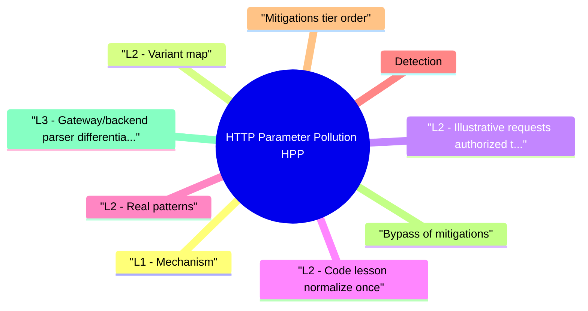

# HTTP Parameter Pollution (HPP) revision map

I keep this HTTP Parameter Pollution (HPP) map for the night before a screen, when five markdown files is too many clicks. Built from Critical Clarification HTTP Parameter Pollution Misconceptions.md, HTTP Parameter Pollution (HPP) - Comprehensive Guide.md, HTTP Parameter Pollution (HPP) - Interview Questions & Answers.md, HTTP Parameter Pollution (HPP) - Quick Reference.md, HTTP Parameter Pollution (HPP) - VAPT Methodology.md. Twenty minutes. Then I close the laptop.

## L1 - Mechanism
- No single HTTP standard mandates first/last/all for duplicates across all stacks-behavior is implementation-defined.
- Risk appears at trust boundaries between parsers.

## L2 - Variant map

## L2 - Illustrative requests (authorized testing)
- If edge uses first q for filtering but app uses last for render, XSS filters fail.
- Body duplicates in application/x-www-form-urlencoded follow similar logic splits.

## L2 - Code lesson (normalize once)
- Anti-pattern: ad-hoc request.GET.get("id") vs request.GET.getlist("id") mismatch across modules.
- Framework APIs differ-principle is one policy for duplicates.

## L2 - Real patterns
- WAF bypass write-ups frequently combine encoding + HPP-signature sees benign first token.
- Cache poisoning research (e.g., web cache deception adjacent) sometimes touches key canonicalization-overlaps with parameter routing.

## Detection
- Logs with multiple same-name keys reaching the app.
- WAF miss correlated with duplicate parameters in access logs.
- Tests that assert 400 on duplicate IDs for sensitive operations.

## Mitigations (tier order)
- Reject duplicates on sensitive parameters (IDs, redirect targets).
- Normalize at a single middleware layer; document behavior.
- Schema-validate APIs (OpenAPI strict).
- WAF rules aware of all duplicate representations (high maintenance-app fix preferred).

## Bypass of mitigations
- Different encodings (; style legacy param splitters in some stacks-know your framework).
- JSON bodies where duplicate keys parse unpredictably-reject dupes in parser config if supported.

## L3 - Gateway/backend parser differential matrix
- HPP often appears when API gateway, WAF, and app framework disagree:
- Interview framing: HPP is a distributed parsing bug, not just an app bug.

## L4 - JSON/body duplicate key edge cases
- Duplicate semantics are not limited to query strings:
- Some JSON parsers keep last key, others first, some reject.
- Transcoding layers (REST->RPC) can collapse duplicates differently.
- Signature/verification middleware may hash one representation while app executes another.
- Reject duplicate keys at body parser level for security-sensitive endpoints.
- Use canonical serialization before signature verification and business processing.
- Keep parser behavior uniform across gateway and application services.

## L4 - Engineering controls and regression testing
- Define parameter uniqueness in API contracts (OpenAPI/schema policy checks).
- Add unit/integration tests for duplicate-sensitive fields (id, tenant, redirect, role).
- Include HPP payloads in WAF/edge regression suites.
- Log and alarm on duplicate-key requests reaching sensitive handlers.

## Labs
- PortSwigger topics touching HTTP parameter pollution / routing anomalies.
- Custom Flask/Django mini-app to observe getlist behavior.

## Toolchain
- Burp Suite (parameter fuzzing), curl with repeated -d flags, framework docs.

## Interview clusters

## Authoritative references
- RFC 3875 - CGI environment variable conventions (historical context).
- OWASP testing guidance on duplicate parameters (check current edition).
- CWE-20 / CWE-444 (HTTP request smuggling adjacent-different root, similar parser theme).

## Cross-links
- WAF Bypass · HTTP Request Smuggling · Open Redirect · SSRF

## Verification checklist
- [ ] Document your framework's duplicate key behavior in two sentences.
- [ ] Add a test that sends two redirect parameters and expects 400.
- [ ] Explain one gateway/WAF/app parser mismatch chain.
- [ ] Define duplicate-key policy for query and JSON bodies.

## Cheat sheet bits

## Core idea
- Duplicate keys -> split parser behavior -> filter bypass / logic bugs

## Common behaviors
- First wins · last wins · concat · array - check your stack

## Fix
- One choke-point normalization · reject dupes on sensitive params · OpenAPI strict

## Test
- Burp repeat dupes · curl -d twice · assert 400 on return_url

## Cross-read
- WAF Bypass · HTTP Request Smuggling · Open Redirect

## One-liner

## Traps that dump interviews

## "HTTP defines duplicate parameter behavior."
- Reality: Practical behavior is framework and server specific-verify, don't assume.

## "HPP is only a WAF problem."
- Reality: Application logic and caches also split views.

## "JSON can't have duplicate keys."
- Reality: Many parsers accept dupes with last-wins-still dangerous if inconsistent across services.

## "URL encoding fixes HPP."
- Reality: Encoding affects tokenization, not the need for a single policy.

## "Browsers normalize duplicates away."
- Reality: XHR/fetch can send crafted bodies; server must be solid.

## "HPP equals HTTP smuggling."
- Reality: Different mechanisms-smuggling is message framing; HPP is duplicate key merging.

## "Rejecting all duplicates is always safe."
- Reality: Some legacy clients legitimately repeat keys-scope strictness to sensitive operations.

## "Cloud WAF solves HPP automatically."
- Reality: App must still canonicalize; WAF rules rot and miss variants.

## How I would test it

## Objective
- Create a repeatable assessment workflow for HTTP Parameter Pollution (HPP) that produces reproducible evidence and actionable remediation guidance.

## Phase 1 - Scope and preparation
- Confirm in-scope assets, test windows, and prohibited actions.
- Identify critical user journeys and trust boundaries.
- Define severity rubric and evidence requirements before testing.

## Phase 2 - Recon and attack-surface mapping
- Enumerate relevant endpoints, flows, and data paths.
- Document where security checks are expected to happen.
- Mark high-value assets and high-impact paths.

## Phase 3 - Hypothesis-driven testing
- Start with low-risk probes and baseline behavior.
- Test failure hypotheses systematically (one variable at a time).
- Capture request/response artifacts for each finding candidate.

## Phase 4 - Validation and impact proof
- Reproduce findings with clean-state retests.
- Confirm exploitability and practical impact.
- Eliminate false positives; record confidence level.

## Phase 5 - Remediation and verification
- Provide immediate containment + structural fix recommendations.
- Define post-fix verification tests and telemetry checks.
- Re-test after remediation and close with evidence.

## Evidence template
- Asset / endpoint:
- Preconditions:
- Reproduction steps:
- Observed behavior:
- Security impact:
- Business impact:
- Recommended fix:
- Verification result:

## Interview drill
- In 3 minutes, explain how you would run this VAPT workflow for one production-like service and what evidence you need before escalating severity.

## Prompts I drill out loud

- Q: GET vs POST for HPP?
- Q: Does HTTP/2 change this?
- Q: Quick policy for return_url?

## 60-second answer

## Mechanics

## Defense

## Mock ladder

## Sibling folders

- Stay inside this folder for the long guide. Jump only when a section names a sibling topic.
- Cookie Security, CSRF, XSS, JWT, OAuth, and TLS show up as neighbors on a lot of these maps.
