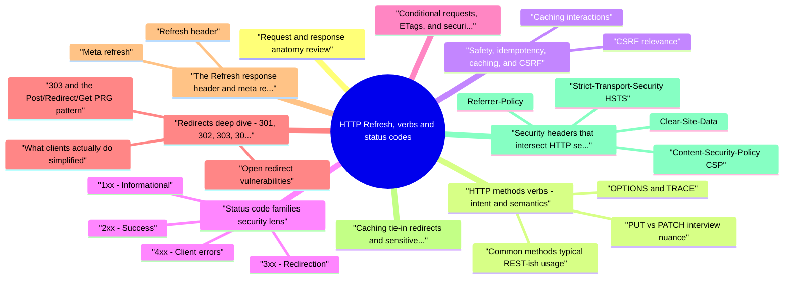

# HTTP Refresh, verbs and status codes revision map

HTTP Refresh, verbs and status codes in one sitting. That is the deal. I mined Critical Clarification HTTP Refresh Verbs and Status Codes Misconceptions.md, HTTP Refresh, verbs and status codes - Comprehensive Guide.md, HTTP - Interview Questions & Answers.md, HTTP Refresh Verbs and Status Codes - Quick Reference.md. The outline keeps every H2 I cared about from those files.

## Request and response anatomy (review)

## HTTP methods (verbs): intent and semantics
- RFC 9110 defines a method's semantics: what the request is trying to do to a resource. Frameworks and APIs sometimes diverge-test behavior, not names.

### Common methods (typical REST-ish usage)
- See the source section `Common methods (typical REST-ish usage)` for the worked example.

### PUT vs PATCH (interview nuance)
- See the source section `PUT vs PATCH (interview nuance)` for the worked example.

### OPTIONS and TRACE
- TRACE is uncommon in production; when enabled, it can assist cross-site tracing / header echo attacks in legacy stacks. Most hardening guides recommend disabling it.

## Safety, idempotency, caching, and CSRF

### Caching interactions
- Interview trap: teams treat 301 as "just a redirect" without noticing cache longevity-clients and CDNs may pin the redirect mapping for a long time, making rollback and incident response painful.

### CSRF relevance
- Design rule: GET/HEAD/OPTIONS must not alter protected state; state changes require explicit, intent-bearing requests and consistent authorization checks on every method.

## Status code families (security lens)
- Rather than memorizing every code, reviewers bucket by client vs server responsibility and information disclosure.

### 1xx - Informational
- Rare in many app stacks. 103 Early Hints can preload resources; ensure hints do not amplify tracking or leak authorization-gated assets to the wrong session.

### 2xx - Success
- Success responses still need authorization review: 200 with empty body vs 204, 201 with Location of created resource, and 206 partial content for range abuse (expensive byte serving, cache complexity).
- Leakage: verbose 200 bodies on "error" paths (inconsistent API design) train clients to scrape details attackers love.

### 3xx - Redirection
- High-value for security interviews: open redirects, header injection, cache pinning, and downgrade flows if http:// targets appear.

### 4xx - Client errors
- See the source section `4xx - Client errors` for the worked example.

### 5xx - Server errors
- See the source section `5xx - Server errors` for the worked example.

### 425 Too Early (replay-sensitive operations)
- See the source section `425 Too Early (replay-sensitive operations)` for the worked example.

## Conditional requests, ETags, and security reviews
- If-None-Match, If-Match, ETag, and Last-Modified enable efficient caching and optimistic concurrency. Security angles:
- ETag generation must not encode secrets (some frameworks accidentally fingerprint users or embed internal state).
- 412 Precondition Failed and 428 Precondition Required appear in concurrency and draft workflows-ensure authorization is evaluated after you know which resource version is targeted.
- Range requests (206) can amplify work if ranges are enormous or pathological-pair with limits and monitoring.

## Redirects deep dive: 301, 302, 303, 307, 308

### What clients actually do (simplified)
- Historically, some clients treated 302 like 303 for non-GET requests (follow-up with GET). That legacy behavior is why 307 and 308 exist: they clarify method preservation expectations in modern HTTP.

### Open redirect vulnerabilities
- An open redirect accepts user-controlled input (query parameter, path segment, returnUrl, next, continue) and reflects it into a Location header, Refresh header, or client-side redirect without validation.
- Allowlist exact redirect targets or signed, short-lived tokens mapping to destinations.
- Prefer relative redirects (Location: /app/home) when possible.
- Normalize URLs carefully: //evil.com is absolute; \evil tricks; https:evil.com parsing oddities-use a strict URL parser and scheme allowlist (https only).
- Log and alert on redirect parameter tampering spikes.

### 303 and the Post/Redirect/Get (PRG) pattern
- See the source section `303 and the Post/Redirect/Get (PRG) pattern` for the worked example.

## The Refresh response header and meta refresh

### Refresh header
- The Refresh header (non-standard but widely supported) can look like:
- Refresh: 5 - reload after 5 seconds
- Refresh: 0; url=https://example.com/ - immediate navigation
- Open redirect equivalent if url= is attacker-controlled.
- UX phishing timed hops that obscure the true destination.
- Interaction with caching and analytics that assume only Location redirects.

### Meta refresh ( )
- The browser parses HTML and may navigate without a full HTTP redirect. Abuse patterns mirror open redirects when url is user-controlled in profiles, themes, or CMS content.
- Note: CSP is not a universal "redirect firewall," but it reduces several client-side execution and navigation classes when rolled out carefully.

## Caching tie-in (redirects and sensitive responses)
- RFC 9111 governs caching behavior. Practical security takeaways:
- Private responses (Cache-Control: private) vs public-mis-tagging authenticated pages as public leaks data via shared proxies.
- Vary: incorrect Vary can cause cache mix-ups between users or content negotiation surprises.
- Heuristic caching of 200 responses without explicit Cache-Control still happens in some clients-set explicit Cache-Control on sensitive routes.
- 301 permanence can stick in caches-treat 301 as a long-lived commitment unless you control CDN purge and client behavior.

## Security headers that intersect HTTP semantics

### Strict-Transport-Security (HSTS)
- HSTS reduces sslstrip and mixed-content downgrade pressure. It does not replace correct redirect targets-you still must not redirect users to http:// first if avoidable.

### Content-Security-Policy (CSP)
- CSP primarily addresses content execution risks. It can still matter adjacent to meta refresh / inline navigation patterns and third-party script inclusion that manipulates location.

### Referrer-Policy
- Redirects and cross-site navigations leak Referer details unless constrained-useful when URLs contain tokens or PII in query strings (better: remove secrets from URLs entirely).

### Clear-Site-Data
- On logout or compromise recovery, selective Clear-Site-Data can reduce residual client state-orthogonal to status codes but often discussed alongside 401/403 session semantics.

## HTTP/2 and HTTP/3: what changes, what does not

### HTTP/2 framing (RFC 9113)
- HTTP/2 multiplexes many streams over one connection, compresses headers with HPACK, and uses binary frames. Semantically, methods, status codes, and header fields remain HTTP-RFC 9110 semantics still apply.
- HPACK history motivated compression attack research; implementations mitigated over time-still know the historical lesson: never compress secrets with attacker-controlled plaintext in the same context.
- Fingerprinting: request patterns differ from HTTP/1.1 pipelining; security tooling must parse HTTP/2 correctly.
- Server push: was touted for performance; many deployments disabled it due to complexity and cache interactions-interviews may mention it as a legacy HTTP/2 talking point.

### HTTP/3 (QUIC)
- Operational note: HTTP/3 can change IP attachment during migration; IP-based risk scoring and geo logic should treat session identity as application-layer (tokens, cookies) rather than assuming stable 5-tuples.

## Proxies, gateways, and status-code distortion
- Intermediaries may normalize status codes, strip headers, or replace bodies (compression, antivirus, "friendly error pages"). For APIs:
- Clients should not depend on exact reason phrases (HTTP/2+ often omits them on the wire anyway).
- 502/504 might mean origin failure or middlebox timeout-retry policies should be cautious on non-idempotent methods.
- Via, Forwarded, and **X-Forwarded-* influence URL reconstruction behind TLS terminators-open redirect and SSRF reviews should consider absolute URL** builders that trust these headers blindly.

## API design traps (401 vs 403 and consistency)
- 401 Unauthorized: "who are you?" - authentication missing/invalid.
- 403 Forbidden: "I know who you are; you may not" - authorization failure.
- Consistent mapping across endpoints (no 200 with error JSON on auth failures unless carefully designed).
- No sensitive payload differences that enable account enumeration (unless accepted risk).
- WWW-Authenticate for 401 in standards-forward APIs when using HTTP authentication schemes.

## Interview traps (quick list)
- "GET is always safe" - only true if your app honors semantics; GET that deletes data is CSRF bait.
- "302 is temporary so it's fine" - still powers open redirects; temporality ≠ trust.
- "301 and 308 are interchangeable" - method preservation and client ecosystems disagree; APIs often prefer 307/308 clarity.
- "Idempotent means identical response body" - idempotency is about effects, not byte-identical responses.
- "POST is never cached" - uncommon but not impossible; don't rely on "POST uncached" as an access control.
- "Redirects are server-side only" - meta refresh and Refresh reintroduce client-side redirect sinks.
- "HTTP/2 changes REST" - framing changes; semantic rules still apply.
- "404 is more secure than 403" - sometimes; but inconsistent timing and body differences can still enumerate.

## Production verification checklist
- Method policy: state-changing routes reject GET; OPTIONS responses accurate and minimal.
- Redirect endpoints: centralized validation; unit tests for //, unicode homoglyphs, and scheme tricks.
- Error hygiene: 4xx/5xx bodies scrubbed; correlation IDs instead of stack traces for clients.
- Cache headers: authenticated routes explicit Cache-Control: no-store (or justified exceptions).
- Legacy headers: Refresh absent or strictly controlled; HTML sanitization blocks meta refresh where untrusted content exists.

## Cross-reads in this repo
- Pair this topic with CORS, CSRF, Security Headers, TLS/HSTS, Rate Limiting, and REST/GraphQL API hardening notes-interviews love end-to-end stories from verb choice to browser policy to CDN behavior.

## Pocket list

## Safe vs unsafe (RFC 9110 mindset)

## Status codes (high-signal buckets)

## Redirect semantics (simplified)
- 301/308 - permanent; 308 preserves method
- 302 - historically ambiguous; many stacks treat like 303
- 303 - see other; GET follow-up after POST
- 307 - temporary; preserve method

## Headers to pair with redirects
- Location (absolute URI preferred) · Cache-Control on sensitive responses · SameSite cookies on cross-site flows

## Spec anchor
- RFC 9110 (HTTP semantics) obsoletes 7231 for method/status definitions (keep "check current RFC" habit).

## Cross-read
- Open Redirect · HTTP Request Smuggling · HTTP Parameter Pollution

## One-liner

## The clarification file, compressed

## "GET never changes server state."
- Reality: RFC semantics say GET should be safe, but bugs and side effects abound; defense uses authZ on every method.

## "302 and 303 are interchangeable."
- Reality: 303 See Other forces GET on redirect target after POST; 302 history is messier-use 303/307 intentionally.

## "204 means success like 200."
- Reality: 204 No Content must not include a body-clients and caches handle it differently than 200 with empty body.

## "401 vs 403 is pedantic."
- Reality: 401 Unauthorized (often authN missing/invalid) vs 403 Forbidden (authZ deny) guides client behavior and monitoring.

## "5xx always means retry."
- Reality: Blind retries amplify DoS; use idempotency keys and backoff only where safe.

## "Meta refresh and 301 are equivalent for security."
- Reality: Open redirect bugs appear in both patterns; Location header validation still matters.

## "HEAD can be skipped in security testing."
- Reality: Authorization bugs sometimes expose metadata via HEAD differently than GET.

## "PATCH is always partial JSON merge."
- Reality: Semantics are application-defined (JSON Merge Patch vs JSON Patch vs custom); don't assume idempotency.

## "HTTP/2 removed status code importance."
- Reality: Same codes, different framing; application meaning unchanged.

## "418 I'm a teapot matters in prod."
- Reality: Treat as easter egg in spec lore-not a control or interoperability requirement.

## Oral prompts worth repeating

- What are the main parts of an HTTP request and response?
- What does "safe" mean for an HTTP method? Which methods are safe?
- What is idempotency? Which methods are typically idempotent?
- Why must state-changing operations avoid GET?
- Compare PUT and PATCH from a security review perspective.
- What is OPTIONS used for, and why do interviewers bring it up?
- How do you explain 2xx, 3xx, 4xx, and 5xx in a security review?
- What is the practical difference between 401 and 403?
- Why do 301 vs 302 vs 307 vs 308 matter?
- What is an open redirect, and how do you fix it?
- How does 303 relate to POST submissions?
- What is risky about the Refresh header or ?
- How do caching headers interact with authenticated pages and redirects?
- Name security headers that complement good redirect hygiene.
- Does HTTP/2 change how methods or status codes work?
- When might you see 429, and what should accompany it?
- What goes wrong when APIs leak detail in 4xx/5xx bodies?
- How would you structure an HTTP API review for authorization bugs?
- What is 304 Not Modified, and why might it matter for security testing?
- When would you mention 425 Too Early in an HTTP security discussion?

### What does "safe" mean for an HTTP method? Which methods are safe?
- See the source section `What does "safe" mean for an HTTP method? Which methods are safe?` for the worked example.

## What sits next to this topic

- Stay inside this folder for the long guide. Jump only when a section names a sibling topic.
- Cookie Security, CSRF, XSS, JWT, OAuth, and TLS show up as neighbors on a lot of these maps.
