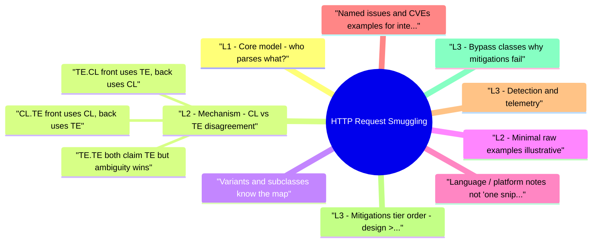

# HTTP Request Smuggling revision map

When a HTTP Request Smuggling follow-up lands, I want one page that still has the misconception and the VAPT step. I pulled headings from Critical Clarification HTTP Request Smuggling Misconceptions.md, HTTP Request Smuggling - Comprehensive Guide.md, HTTP Request Smuggling - Interview Questions & Answers.md, HTTP Request Smuggling - Quick Reference.md, HTTP Request Smuggling - VAPT Methodology.md. If a heading is here, the guide still owns the detail.

## L1 - Core model: who parses what?
- The front-end often normalizes requests (HTTP/2 -> HTTP/1, header folding, chunk extensions).
- The back-end sees a byte stream and must decide body boundaries before routing to the app.
- If front thinks request A consumed bytes 0-N and back thinks A consumed 0-M, leftover bytes become the start of the next logical request-possibly attacker-controlled.

## L2 - Mechanism: CL vs TE disagreement
- Content-Length - fixed byte count.
- Transfer-Encoding: chunked - chunked encoding (length prefixes + optional trailers).

### CL.TE (front uses CL, back uses TE)
- See the source section `CL.TE (front uses CL, back uses TE)` for the worked example.

### TE.CL (front uses TE, back uses CL)
- Front-end honors chunked encoding. Back-end uses Content-Length only and reads a fixed number of bytes-again desynchronizing.

### TE.TE (both claim TE but ambiguity wins)
- Interview tip: Say "parser disagreement on message boundaries" before acronym soup; then name CL.TE / TE.CL.

## Variants and subclasses (know the map)
- Research by James Kettle (PortSwigger) established the modern taxonomy and tooling; always cite parser differential, not "magic bytes."

## L2 - Minimal raw examples (illustrative)
- TE.CL sketch: Front reads chunked body; back reads Content-Length: 4 and treats the rest as next request:
- Exact byte counts and header ordering depend on lab/version-the interview point is conflicting framing and leftover prefix.

## Language / platform notes (not "one snippet fixes all")
- Reverse proxies (nginx, HAProxy, Envoy, cloud vendor LBs) each have their own HTTP parser and options (ignore_invalid_headers, merge_slashes, chunk handling).
- Application servers (Tomcat, Jetty, Node http-parser, Gunicorn, etc.) may differ from the proxy.
- "Disable HTTP/1.1 keep-alive to origin" or use HTTP/2 end-to-end are blunt but sometimes only reliable mitigations for legacy stacks.

## Named issues and CVEs (examples for interviews)
- Use these as illustrative-verify versions when discussing a specific employer stack.
- CWE: CWE-444 (Inconsistent Interpretation of HTTP Requests).

## L3 - Detection and telemetry
- 400/502 spikes on specific paths with chunked bodies.
- Duplicate or illegal combinations of CL + TE logged at edge.
- Request boundaries that don't match content-length accounting.
- Same keep-alive connection: response to request A contains data that matches smuggled prefix for B.
- Alert on multiple Content-Length, obfuscated Transfer-Encoding, or chunked on paths that normally use fixed bodies.

## L3 - Mitigations (tier order: design > config > code > runtime)
- Design: Prefer one parser family end-to-end or HTTP/2 with strict profiles; avoid blind downgrade to HTTP/1.1 with conflicting headers.
- Edge configuration: Reject ambiguous requests; normalize TE exactly per RFC; do not forward illegal CL+TE combinations.
- Disable unsafe reuse: Close connections after ambiguous requests; disable pipelining where not needed.
- Patch and align: Same vendor advisory fixes on both tiers.
- Regression tests: Automated desync probes in staging (Burp scanner / custom harness)-not in prod without approval.

## L3 - Bypass classes (why mitigations fail)
- Header obfuscation: Transfer-Encoding : chunked, duplicate TE headers, chunk extensions ignored by one parser only.
- HTTP/2 intermediary re-encodes to HTTP/1 incorrectly (pseudo-header vs Host, scheme confusion).
- WAF sees one framing; origin sees another-WAF bypass via smuggling.
- Normalization differences: lowercase vs preserve, multiple CL headers summed vs rejected.

## L3 - Queue poisoning chain anatomy
- A practical exploitation narrative often looks like:
- Desync is introduced on a reused front-end -> back-end connection.
- Attacker injects a prefix request that the back-end treats as the next victim request.
- Victim's legitimate request is partially interpreted as headers/body for attacker-controlled prefix.
- Result is credential/session confusion, cache poisoning, internal route access, or response queue desynchronization.

## L4 - HTTP/2 downgrade hardening checklist
- For edge stacks translating h2/h3 to h1:
- Drop ambiguous framing headers before translation.
- Generate a single authoritative framing model when forwarding to origin.
- Canonicalize Host/:authority mapping with strict validation.
- Disable legacy compatibility modes that accept malformed transfer encodings.
- Keep downgrade components version-aligned with security patches.

## L4 - Proof-of-fix methodology (what senior interviewers expect)
- Pre-fix reproducibility: controlled lab request pair that demonstrates parser disagreement.
- Patch intent: exact edge/origin config or version change and expected parser behavior.
- Post-fix negative test: same payload now rejected/normalized identically on both tiers.
- Regression suite: automated desync probes in staging for CL/TE ambiguity and duplicate header handling.
- Canary telemetry: monitor 4xx/5xx shifts and false-positive rate after strict rejection rollout.

## Hands-on labs and references
- PortSwigger Web Security Academy - HTTP request smuggling modules (CL.TE, TE.CL, TE.TE, HTTP/2).
- Burp Suite - HTTP Request Smuggler extension; Turbo Intruder for timing/reuse tests.

## Toolchain (what interviewers expect you to name)

## L4 - Interview clusters

### Junior (~60 seconds)
- Q: What is request smuggling?
- A: Two HTTP processors disagree on where the request body ends; leftover bytes become a new request. Usually involves CL vs chunked or HTTP/2 downgrade.

### Mid (~3 minutes)
- Explain CL.TE vs TE.CL with one diagram.
- Impact: cache poisoning, session confusion, routing bypass.
- Fix: strict parsing, reject ambiguity, align proxy and server versions.

### Senior (~8 minutes)
- HTTP/2 -> HTTP/1 translation risks; CDN vs origin ownership.
- Rollout: canary strict rules; monitor 4xx/5xx; feature flags for "reject ambiguous framing."
- Prove fix: reproduce pre-patch; fail post-patch in lab; connection-level tests.

### Staff scenario
- See the source section `Staff scenario` for the worked example.

## Authoritative references (re-check before interviews)
- RFC 9112 - HTTP/1.1 message syntax and routing (framing).
- RFC 7540 / 9113 - HTTP/2 (for downgrade discussions).
- CWE-444 - Inconsistent interpretation of HTTP requests.
- OWASP - Transport Layer Protection / general hardening cheat sheets (smuggling often cited under HTTP abuse).
- PortSwigger Research - Kettle's papers and blog posts on desync (primary modern source for variants).

## Cross-links (meaningful)
- SSRF - smuggling may bypass "internal only" routing to hit admin interfaces.
- HTTP Parameter Pollution (HPP)/) - different parser, same theme: duplicate semantics.
- WAF Bypass and Defense Evaluation - WAF/parser differentials.
- Threat Modeling - trust boundaries at reverse proxy.
- Security Headers - complementary; not a smuggling fix but part of edge hardening.
- Penetration Testing and Security Assessment - reporting and scope.

## Verification checklist (for your own study)
- [ ] Explain CL.TE and TE.CL with your own diagram.
- [ ] Name two concrete impacts (not just "RCE").
- [ ] List three edge controls (reject ambiguous, align parsers, connection hygiene).
- [ ] Complete one PortSwigger smuggling lab and document the parser difference.
- [ ] Trace who patches what in your target employer's architecture (CDN vs SRE vs app).
- [ ] Explain one queue-poisoning chain from desync to business impact.
- [ ] Describe a concrete pre-fix/post-fix validation workflow.

## Recall list from Quick Reference

## One-line definition
- Two HTTP parsers disagree on request body boundaries -> leftover bytes prefix the next request on a reused connection.

## Framing headers (HTTP/1.1)
- Safe behavior: Reject ambiguous messages per RFC 9112; no "guess."

## Taxonomy (memorize)

## High-signal indicators (ops)
- Duplicate Content-Length
- Transfer-Encoding + Content-Length together on sensitive routes
- Spikes in 400/502 with chunked bodies
- CDN log differs from origin log for same request_id (if correlated)

## Impacts (interview vocabulary)
- Cache poisoning · Session/header smuggling · ACL bypass · WAF bypass · (sometimes) chain to RCE

## Mitigations (priority order)
- Align proxy + origin versions (vendor advisories)
- Reject illegal/ambiguous framing at edge
- Avoid unsafe H2->H1 unless parsers proven consistent
- Regression tests (Burp Smuggler / CI harness) in staging
- Containment: reduce pipelining / risky reuse (trade-off: performance)

## Tools

## Labs & reading
- PortSwigger Web Security Academy - Request smuggling track
- CWE-444 - Inconsistent interpretation of HTTP requests
- RFC 9112 - HTTP/1.1 message framing
- Community payloads: PayloadsAllTheThings (verify before use)

## Cross-read
- SSRF · WAF Bypass · HPP · Threat Modeling (edge trust boundary)

## 90-second answer skeleton
- Problem: Parser desync on CL vs TE (or H2 downgrade).
- Mechanism: Leftover bytes -> smuggled prefix.
- Impact: Cache / session / ACL / WAF - not always RCE.
- Fix: Strict edge + patched stacks + tests.
- Proof: PoC fails after change; logs show rejections.

## Corrections I keep repeating

## "Smuggling always means RCE."

## "HTTP/2 eliminates request smuggling."
- Reality: HTTP/2 changes on-the-wire framing but HTTP/2 -> HTTP/1.1 translation at CDNs and gateways reintroduces CL/TE ambiguity. End-to-end HTTP/2 reduces classic classes; mixed stacks do not.

## "Duplicate Content-Length is invalid so nobody handles it badly."
- Reality: Historically, some stacks summed, picked first, or ignored duplicates-each behavior is exploitable in combination with another hop. Strict rejection is the safe behavior; assume others are strict until proven.

## "Transfer-Encoding: chunked is always obvious."

## "The WAF sees the same request the origin sees."
- Reality: The WAF and origin are different HTTP implementations. If they disagree on framing, the WAF may inspect request A while the origin executes smuggled request B. Parser parity beats more rules.

## "Disabling keep-alive fully fixes smuggling."
- Reality: It shrinks the cross-request attack surface on a single TCP connection but is costly and may not address all desync or pipeline edge cases. Use as containment, not the only fix.

## "This is only a pen-test finding, not product security."
- Reality: Product and platform teams choose proxy products, TLS termination, HTTP versions, and deployment topology. Smuggling is a design-time and SRE problem as much as an app bug.

## "RFC says X, so all servers do X."
- Reality: RFC 7230/9112 evolved; implementations lagged and differed. Always map advisories to exact vendor versions on both front and back tiers.

## Generic traps (still true)
- Tool trivia without mechanism loses interviews-explain byte boundaries first.
- One-off header patches without parser upgrades often fail against variant obfuscations.
- Skipping verification (no pre/post reproduction) weakens credibility.

## Assessment order

## Objective
- Create a repeatable assessment workflow for HTTP Request Smuggling that produces reproducible evidence and actionable remediation guidance.

## Phase 1 - Scope and preparation
- Confirm in-scope assets, test windows, and prohibited actions.
- Identify critical user journeys and trust boundaries.
- Define severity rubric and evidence requirements before testing.

## Phase 2 - Recon and attack-surface mapping
- Enumerate relevant endpoints, flows, and data paths.
- Document where security checks are expected to happen.
- Mark high-value assets and high-impact paths.

## Phase 3 - Hypothesis-driven testing
- Start with low-risk probes and baseline behavior.
- Test failure hypotheses systematically (one variable at a time).
- Capture request/response artifacts for each finding candidate.

## Phase 4 - Validation and impact proof
- Reproduce findings with clean-state retests.
- Confirm exploitability and practical impact.
- Eliminate false positives; record confidence level.

## Phase 5 - Remediation and verification
- Provide immediate containment + structural fix recommendations.
- Define post-fix verification tests and telemetry checks.
- Re-test after remediation and close with evidence.

## Evidence template
- Asset / endpoint:
- Preconditions:
- Reproduction steps:
- Observed behavior:
- Security impact:
- Business impact:
- Recommended fix:
- Verification result:

## Interview drill
- In 3 minutes, explain how you would run this VAPT workflow for one production-like service and what evidence you need before escalating severity.

## What I answer in 90 seconds

- 60-second elevator answer
- Mechanism and taxonomy
- Q: Explain CL.TE vs TE.CL in one minute.
- Q: What is TE.TE?
- Q: How does HTTP/2 relate to smuggling?
- Impact and exploitation
- Q: What can you actually achieve with smuggling?
- Q: Smuggling vs HTTP request splitting?
- Defense and architecture
- Q: How would you fix smuggling in production?
- Q: Who owns the fix-CDN or application team?
- Q: Is disabling keep-alive a valid mitigation?
- Testing and validation
- Q: How do you test for smuggling safely?
- Q: What proves remediation worked?
- Senior / staff traps
- Q: Our WAF blocks smuggling payloads. Are we safe?
- Q: How do you roll out stricter header validation without an outage?
- Depth: Interview follow-ups - HTTP Request Smuggling
- Flagship mock question ladder
- 10-minute mock drill
- Answer quality rubric (0-2 each)

### Q: Who owns the fix-CDN or application team?
- See the source section `Q: Who owns the fix-CDN or application team?` for the worked example.

## Depth: Interview follow-ups - HTTP Request Smuggling
- Authoritative references (re-verify): RFC 9112 (HTTP/1.1 framing); CWE-444; PortSwigger research (James Kettle).
- Walk through one CL.TE lab scenario verbally (headers + who consumes how many bytes).
- How would HTTP/2-only end-to-end change your threat model?
- What log lines would you hunt for in nginx vs application logs?
- How does smuggling interact with caching (CDN cache vs browser cache)?
- Name two reasons duplicate Content-Length is dangerous.

### Junior
- What two headers are most associated with classic smuggling?
- Why are keep-alive connections relevant?

### Mid
- Difference between CL.TE and TE.CL?
- Name two impacts other than RCE.

### Senior
- Describe H2 downgrade risk in your architecture.
- How do you prove parser alignment after a migration?

### Staff
- Program plan: eliminate desync class across multi-cloud edges in one quarter.
- How do you measure "smuggling risk" for leadership without false precision?

### Answer quality rubric (0-2 each)
- Accuracy · Depth · Practicality · Verification - aim for 7-8/8 before interviewing on this topic.

## Nearby reading in this repo

- Stay inside this folder for the long guide. Jump only when a section names a sibling topic.
- Cookie Security, CSRF, XSS, JWT, OAuth, and TLS show up as neighbors on a lot of these maps.
