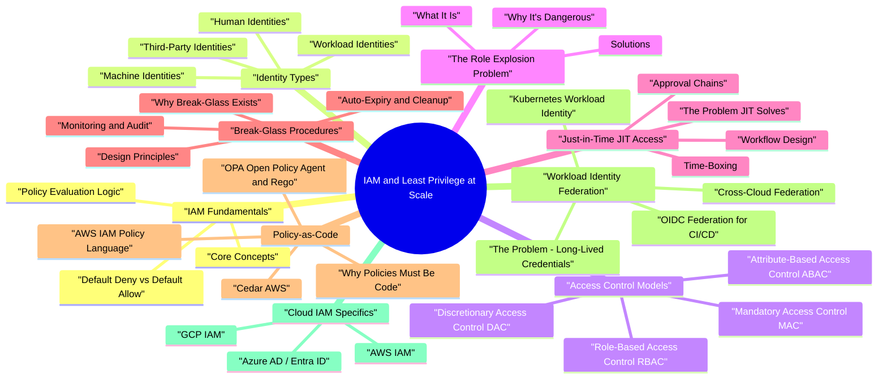

# IAM and Least Privilege at Scale revision map

This is the IAM and Least Privilege at Scale spine I actually use. Types, failures, fixes, traps. Sources: Critical Clarification IAM and Least Privilege at Scale Misconceptions.md, IAM and Least Privilege at Scale - Comprehensive Guide.md, IAM and Least Privilege at Scale - Interview Questions & Answers.md, IAM and Least Privilege at Scale - Quick Reference.md. I do not treat it as a second textbook.

## IAM Fundamentals

### Core Concepts
- Every IAM decision can be decomposed into five elements:
- Subject - The entity requesting access. Can be a human user, a service account, a workload (container, function), a device, or a third-party integration.
- Resource - The target being accessed. An S3 bucket, a database table, a Kubernetes namespace, an API endpoint, a secret in a vault.
- Action - The operation being performed. s3:GetObject, ec2:TerminateInstances, SELECT on a table, kubectl exec.
- Policy - The rule that connects subjects to actions on resources. Policies express who can do what to which resource, under what conditions, and whether the result is Allow or Deny.
- Condition - Contextual constraints that further restrict when a policy applies. Source IP, time of day, MFA status, device posture, resource tags, session age, requesting region.

### Policy Evaluation Logic
- Cloud providers evaluate access requests through a chain of policy types. Understanding evaluation order is essential for designing effective controls:
- Service Control Policies (SCPs) - Organization-wide guardrails. If an SCP denies an action, no IAM policy can override it.
- Resource-based policies - Policies attached to the resource itself (S3 bucket policy, KMS key policy).
- Permission boundaries - Maximum permission ceiling for an IAM entity. The effective permission is the intersection of the identity policy and the boundary.
- Session policies - Further restrict permissions for temporary sessions (AssumeRole).
- Identity-based policies - Policies attached to IAM users, groups, or roles.
- Explicit deny always wins - An explicit deny in any policy type overrides any allow.

### Default Deny vs Default Allow
- See the source section `Default Deny vs Default Allow` for the worked example.

## Identity Types

### Human Identities
- See the source section `Human Identities` for the worked example.

#### Employees
- Employee identities are managed through a centralized Identity Provider (IdP) - Okta, Azure AD/Entra ID, Google Workspace, or Ping Identity. The IdP is the source of truth for authentication and group membership.
- Authentication: SSO via SAML 2.0 or OIDC, backed by MFA (hardware keys for privileged users, push notification or TOTP for general population).
- Authorization: Group membership drives coarse-grained access (team-based RBAC). Fine-grained access (production admin, key management) requires JIT elevation.
- Lifecycle: Provisioned via SCIM from HR systems (Workday, BambooHR). Deprovisioned automatically on termination with target time-to-revoke under 1 hour for privileged access.

#### Contractors and Temporary Workers
- Contractors present unique IAM challenges: their access needs are often poorly defined, their tenure is ambiguous, and offboarding is frequently missed.
- Separate identity pool with mandatory expiration dates baked into the identity itself.
- Sponsor model: every contractor identity must have an employee sponsor who is accountable for access reviews.
- Automatic deprovisioning: contract end date triggers immediate access removal, regardless of whether HR notifies IT.
- Restricted scope: contractors should never receive broad roles. Prefer project-scoped, time-bound access grants.

#### Customers (External Identities)
- Tenant isolation is the primary IAM concern: a customer must never access another customer's data, even through subtle authorization flaws.
- Permission models are typically simpler (owner, admin, member, viewer) but must still enforce least privilege within each customer's tenant.

### Workload Identities
- Workload identities are the fastest-growing and most under-governed identity type. Every microservice, CI/CD pipeline, serverless function, and batch job needs an identity to access resources.

#### Service Accounts
- Cloud-native service accounts: AWS IAM Roles, GCP Service Accounts, Azure Managed Identities.
- Anti-pattern: shared service accounts used by multiple applications, making it impossible to audit which workload performed which action.
- Ownership rule: every service account must have a human owner (typically the team lead of the owning service), documented in a metadata tag or registry.

#### Managed Identities (Azure) / Instance Profiles (AWS)
- Managed identities eliminate the need for credential management entirely. The cloud platform automatically provisions, rotates, and injects credentials into the workload.
- Azure System-Assigned Managed Identity: tied to the lifecycle of the resource (VM, App Service, Function). When the resource is deleted, the identity is deleted.
- Azure User-Assigned Managed Identity: independent lifecycle, can be shared across resources (use sparingly - sharing dilutes accountability).

#### SPIFFE and SPIRE
- SPIFFE (Secure Production Identity Framework for Everyone) provides a standards-based framework for workload identity that works across heterogeneous environments (Kubernetes, VMs, bare metal, multiple clouds).
- SPIFFE ID: a URI-based identity (spiffe://trust-domain/workload-identifier) that uniquely identifies a workload regardless of where it runs.
- SVID (SPIFFE Verifiable Identity Document): a short-lived X.509 certificate or JWT that proves the workload's identity. SVIDs are automatically rotated (typically every hour).
- Why it matters: SPIFFE decouples workload identity from infrastructure. A service running in Kubernetes can authenticate to a service running on a VM, across cloud providers, without sharing secrets.

#### CI/CD Pipeline Identities
- CI/CD pipelines are high-value targets because they typically have write access to production infrastructure. Modern approaches eliminate long-lived credentials entirely:
- GitLab CI OIDC: similar model. The CI_JOB_JWT token can be exchanged for cloud provider credentials.
- Condition scoping: cloud IAM policies should restrict which repositories, branches, and workflows can assume which roles. A pipeline for a dev branch should not be able to assume a production deployment role.

### Machine Identities
- See the source section `Machine Identities` for the worked example.

### Third-Party Identities
- Vendor access, SaaS integrations, and partner connections all create identity relationships. Third-party identities should be:
- Time-bound: automatic expiration, not "until someone remembers to remove it."
- Least-privileged: scoped to the specific resources and actions the integration needs.
- Auditable: all actions performed by third-party identities should be logged and reviewed.
- Governed by external identity conditions: restrict by source IP, require specific audience claims, enforce session duration limits.

## Access Control Models

### Discretionary Access Control (DAC)
- The resource owner decides who can access it. File system permissions (Unix chmod, Windows ACLs) and Google Drive sharing are DAC implementations.
- Advantage: flexible, intuitive for end users.
- Disadvantage: no central governance. An employee can share a sensitive document with anyone. Permissions sprawl is uncontrollable at scale.
- When to use: file sharing, collaboration tools - but always with compensating controls (DLP, external sharing policies).

### Mandatory Access Control (MAC)
- Access decisions are enforced by a central authority based on security labels and clearances. Users cannot override or delegate access. SELinux and AppArmor are MAC implementations.
- Advantage: strong enforcement, prevents unauthorized information flow.
- Disadvantage: rigid, operationally expensive, requires careful label management.
- When to use: classified environments, multi-tenant isolation at the infrastructure level, container sandboxing.

### Role-Based Access Control (RBAC)
- Users are assigned to roles, and roles are granted permissions. Access decisions are based on the user's active role, not their individual identity.
- Advantage: conceptually simple, maps to organizational structure, easy to audit ("who has the DBA role?").
- Disadvantage: role explosion - as the organization grows, the number of roles proliferates to accommodate every unique combination of permissions. A 500-person engineering org can easily have 2,000+ roles.
- When to use: the default starting point for most organizations. Works well for coarse-grained access (team membership, environment access).

### Attribute-Based Access Control (ABAC)
- Access decisions are based on attributes of the subject, resource, action, and environment - not pre-defined roles. Policies are written as boolean expressions over these attributes.
- Advantage: scales without role explosion. A single policy like "engineers can read logs from services their team owns" replaces dozens of team-specific roles. Handles dynamic, contextual access well.
- When to use: when RBAC is producing too many roles, when access decisions depend on resource properties (environment, classification, ownership), when contextual conditions are important.

### Relationship-Based Access Control (ReBAC)
- Advantage: naturally models hierarchies (org -> team -> project -> resource) and sharing (user X is an editor of document Y). Handles transitive permissions well.
- Disadvantage: requires a relationship graph infrastructure. Complex to reason about at scale (transitive relationships can create unexpected access paths).
- When to use: multi-tenant SaaS applications, document sharing, organizational hierarchies, any domain where permissions flow through relationships.

### Policy-Based Access Control (PBAC)
- Advantage: maximum flexibility, policies are code (version-controlled, testable, reviewable).
- Disadvantage: complexity - policy languages have learning curves, and incorrect policies fail silently (allowing too much or too little).
- When to use: when you need a unified authorization layer that can express complex, evolving rules across multiple services.

### Choosing the Right Model
- See the source section `Choosing the Right Model` for the worked example.

## The Role Explosion Problem

### What It Is
- Role explosion occurs when the number of roles grows faster than the organization can manage. It typically happens when RBAC is the sole access model and every unique permission combination gets its own role:
- A 200-service, 50-team organization with 4 environments and 3 permission levels generates 200 × 50 × 4 × 3 = 120,000 potential roles. Nobody can audit that.

### Why It's Dangerous
- Unauditable: when nobody understands what roles exist or what they grant, security reviews become theater.
- Drift: abandoned roles accumulate. New roles are created because it's easier than finding the right existing one.
- Over-granting: administrators assign broad roles ("just give them admin") because navigating thousands of roles is impractical.
- Compliance failure: auditors cannot verify least privilege when the role inventory is incomprehensible.

### Solutions
- Replace thousands of static roles with a smaller set of parameterized roles that use resource tags and user attributes to scope access dynamically.
- Tier 0 (base): read-only access to team-owned non-production resources. Granted automatically via group membership.
- Tier 1 (elevated): write access to non-production, read access to production. Requires manager approval.
- Tier 2 (privileged): production write access. Requires JIT elevation with time-boxing and audit trail.
- Tier 3 (admin): infrastructure admin, key admin, IAM admin. Break-glass only.

## Just-in-Time (JIT) Access

### The Problem JIT Solves
- See the source section `The Problem JIT Solves` for the worked example.

### Workflow Design
- Request: the user requests elevated access, specifying the role, target resources, duration, and business justification.
- Activation: upon approval, the system grants the role with a hard TTL. The user's session is enriched (new credentials, session token, or group membership).
- Usage: all actions during the elevated session are logged with enhanced detail (who, what, when, why - linking back to the approval ticket).
- Expiration: the elevated access is automatically removed when the TTL expires. No manual cleanup required.
- Review: post-session review for high-risk elevations. Were the permissions actually used? Were they proportional to the stated justification?

### Approval Chains
- Auto-approval: for low-risk, well-defined access patterns (accessing team-owned staging resources during business hours). Auto-approval rules should be reviewed quarterly.
- Single approver: for medium-risk access (production read, non-sensitive admin operations). Approver is typically the on-call engineer or team lead.
- Dual approval: for high-risk access (production write, customer data access, IAM admin). Requires two independent approvers, often from different teams (e.g., requesting team lead + security).
- Emergency override: for incidents, allow activation with post-hoc approval and immediate alerting (see break-glass section).

### Time-Boxing
- Maximum duration: enforce hard limits per role tier. Production read: 4 hours. Production write: 2 hours. IAM admin: 1 hour.
- Extension: require a new request with fresh justification, not an automatic renewal.
- Idle timeout: revoke access if no activity is detected within the session (e.g., no API calls for 30 minutes).

### Audit Trail
- See the source section `Audit Trail` for the worked example.

### Tools and Implementations
- Azure PIM (Privileged Identity Management): built-in JIT for Azure AD roles and Azure resource roles. Supports approval workflows, MFA enforcement, justification requirements, and access reviews.
- AWS: no native JIT service. Common patterns include custom Lambda-based workflows, Temporary Security Credentials via AssumeRole with session policies, and third-party tools like ConductorOne, Opal, or Abbey Labs.
- GCP: PAM (Privileged Access Manager) provides JIT elevation for GCP IAM roles with approval workflows.
- HashiCorp Vault: dynamic secrets and leased credentials provide JIT-like patterns for database access, cloud credentials, and SSH.
- Open-source: AccessBot, Cerbos, and custom solutions built on top of cloud-native primitives.

## Break-Glass Procedures

### Why Break-Glass Exists
- See the source section `Why Break-Glass Exists` for the worked example.

### Design Principles
- Strong authentication: break-glass activation requires the strongest available authentication - hardware security keys, biometric verification, or split knowledge (two people each hold half the credential).
- Dual control: require two authorized personnel to activate break-glass. One person initiates; another confirms. This prevents a single compromised or malicious insider from abusing the mechanism.

### Monitoring and Audit
- Every action during a break-glass session is logged at maximum verbosity.
- Session recording (terminal recording, API call capture) provides a complete record.
- Automated anomaly detection flags unusual actions during break-glass sessions (e.g., creating new IAM roles, accessing resources unrelated to the stated incident).

### Auto-Expiry and Cleanup
- All temporary credentials are revoked immediately.
- Any persistent changes made during the session (new roles created, permissions modified) are flagged for review.
- The incident ticket is automatically linked to the break-glass activation record.

### Post-Incident Review
- Every break-glass usage triggers a mandatory review (within 48 hours):
- Was break-glass necessary, or could normal JIT have sufficed?
- Were the actions proportional to the incident?
- Were any persistent changes made that need to be reverted or formalized?
- Does this incident reveal a gap in normal access patterns (suggesting a new JIT workflow is needed)?

### Common Failure: Break-Glass Becoming the Admin Path
- The most dangerous IAM anti-pattern is break-glass accounts becoming the de facto admin channel. Signs this is happening:
- Break-glass activation frequency is increasing month-over-month.
- The same individuals activate break-glass repeatedly for routine tasks.
- Break-glass sessions are lasting the full TTL rather than being released early.
- Post-incident reviews are being skipped or rubber-stamped.

## Policy-as-Code

### Why Policies Must Be Code
- See the source section `Why Policies Must Be Code` for the worked example.

### OPA (Open Policy Agent) and Rego
- OPA is a general-purpose policy engine that decouples policy decisions from application logic. Policies are written in Rego, a declarative query language.
- Use cases: Kubernetes admission control (Gatekeeper), API authorization, Terraform plan validation, microservice authorization, data filtering.

### Cedar (AWS)
- Cedar is Amazon's purpose-built policy language for authorization, used internally by AWS Verified Permissions and Amazon Verified Access. Cedar is designed for fine-grained, performant authorization decisions.

### AWS IAM Policy Language
- AWS IAM policies are JSON documents with Statements containing Effect, Action, Resource, and Condition blocks. Key patterns for least privilege:
- Resource-level scoping: "Resource": "arn:aws:s3:::my-bucket/prefix/" instead of "Resource": "".
- Condition keys: aws:SourceIp, aws:MultiFactorAuthPresent, aws:PrincipalOrgID, kms:ViaService, aws:RequestedRegion.
- NotAction / NotResource: useful for deny policies that block everything except a specific set of safe operations.

### Terraform IAM Modules
- Infrastructure-as-code tools like Terraform codify IAM configuration, enabling version control and peer review. Best practices:
- Standardized modules: create reusable Terraform modules for common IAM patterns (service role, CI/CD pipeline role, read-only team role) with least-privilege defaults.
- Variable-driven scoping: the module accepts parameters for team, environment, and service name, generating appropriately scoped policies.
- Policy validation in CI: use terraform plan output as input to OPA or custom validators. Block merges that introduce wildcard permissions or overly broad trust relationships.

### CI/CD Policy Linting
- Integrate policy checks into the pull request workflow:
- Static analysis: scan IAM policy documents for known anti-patterns (wildcards, missing conditions, overly broad resource scoping). Tools: Parliament (AWS), IAM Access Analyzer, Checkov, tfsec.
- Diff review: compare the proposed policy change against the current policy. Highlight any new permissions being granted.
- Blast radius assessment: estimate how many resources and identities are affected by the change.
- Automated approval for safe changes: permission reductions (tightening policies) can be auto-approved. Permission expansions require human review.

## Workload Identity Federation

### The Problem: Long-Lived Credentials
- See the source section `The Problem: Long-Lived Credentials` for the worked example.

### OIDC Federation for CI/CD
- See the source section `OIDC Federation for CI/CD` for the worked example.

#### GitHub Actions OIDC
- GitHub Actions can authenticate to AWS, Azure, and GCP without stored secrets:
- GitHub issues a signed OIDC token for each workflow run. The token contains claims: sub (e.g., repo:org/repo:ref:refs/heads/main), aud (the cloud provider), repository, ref, workflow, actor.
- The cloud provider's IAM validates the token signature against GitHub's OIDC discovery endpoint.
- If the token claims match the conditions on the IAM role/policy, temporary credentials are issued.

#### GitLab CI OIDC
- GitLab provides a similar CI_JOB_JWT token. The same federation pattern applies: configure the cloud provider to trust GitLab's OIDC issuer and restrict role assumption to specific projects, branches, and environments.

### Kubernetes Workload Identity
- See the source section `Kubernetes Workload Identity` for the worked example.

#### AWS: IAM Roles for Service Accounts (IRSA) / EKS Pod Identity
- Pods in EKS can assume IAM roles through the Kubernetes service account token projected into the pod. The AWS STS validates the token against the EKS OIDC provider.
- Each service account maps to an IAM role via an annotation.
- The IAM role's trust policy includes conditions on the service account name and namespace.
- Pods receive temporary AWS credentials via the credential provider chain - no secrets to manage.

#### GCP: Workload Identity Federation for GKE
- See the source section `GCP: Workload Identity Federation for GKE` for the worked example.

#### Azure: Azure AD Workload Identity
- See the source section `Azure: Azure AD Workload Identity` for the worked example.

### Cross-Cloud Federation
- For multi-cloud environments, workload identity federation enables a workload in one cloud to access resources in another without long-lived keys:
- AWS workload -> GCP: exchange AWS STS token for GCP access token via GCP Workload Identity Federation.
- GCP workload -> AWS: exchange GCP identity token for AWS temporary credentials via AWS STS AssumeRoleWithWebIdentity.
- Both directions require careful audience and subject condition scoping.

## Cloud IAM Specifics

### AWS IAM
- Deny region usage outside approved regions.
- Deny disabling CloudTrail, GuardDuty, or Config.
- Deny creating IAM users with console access (force SSO).
- Deny public S3 bucket creation.
- Deny root account usage except for specific break-glass actions.

### Azure AD / Entra ID
- Azure's context-aware access control layer. Policies evaluate signals (user, device, location, application, risk level) and enforce controls (require MFA, require compliant device, block access, limit session lifetime).
- Example: require hardware MFA and a compliant device for access to production Azure subscriptions, but allow push MFA from any device for development subscriptions.
- Time-bound role activation with justification and approval.
- Recurring access reviews with automated remediation.
- Alerts for suspicious activation patterns (activations outside business hours, activations by users who haven't been approved).
- Integration with Conditional Access for additional controls during elevation.

### GCP IAM
- Constraints applied at the organization, folder, or project level. Similar to AWS SCPs but with additional constraint types:
- constraints/compute.requireShieldedVm: all VMs must use Shielded VM features.
- constraints/iam.disableServiceAccountKeyCreation: prevent service account key creation (force workload identity federation).
- constraints/storage.uniformBucketLevelAccess: require uniform bucket access (no per-object ACLs).

## Access Reviews and Certification

### Why Reviews Matter
- See the source section `Why Reviews Matter` for the worked example.

### Quarterly Review Process
- Inventory generation: extract all identity-to-resource mappings for the review scope (team, service, or tier).
- Ownership assignment: each access grant must have a reviewer - typically the resource owner or the identity's manager.
- Review and decision: the reviewer confirms or denies each access grant. Options: approve (continue), modify (reduce scope), revoke (remove).
- Remediation: revocations are applied automatically with a grace period (e.g., 7 days notice for non-privileged access, immediate for unused privileged access).
- Escalation: unreviewed items after the deadline are escalated to the reviewer's manager and flagged in compliance dashboards.
- Certification: the completed review is signed off and archived for audit evidence.

### Ownership Model
- Resource owners: responsible for reviewing who has access to their resources. The team that owns the S3 bucket reviews all cross-team access to it.
- Identity owners: responsible for reviewing what their identities (team members, service accounts) have access to. The team lead reviews all permissions held by their team.
- Dual review: high-risk access (production write, customer data, financial systems) should be reviewed by both the resource owner and the identity owner.

### Orphaned Access Detection
- Orphaned identities: accounts belonging to former employees, decommissioned services, or abandoned projects. Detection methods:
- Cross-reference IAM identities against HR systems and service registries.
- Flag identities with no login or API activity for 90+ days.
- Flag service accounts not associated with any active workload in the CMDB.
- Cloud provider access logs (CloudTrail, Azure Activity Log, GCP Audit Log) showing granted-but-unused permissions.
- IAM Access Analyzer (AWS), IAM Recommender (GCP), or Azure PIM access reviews with usage data.

### Automated Deprovisioning
- Manual deprovisioning is unreliable. Automation should handle:
- Employee offboarding: HR system event triggers identity disablement within 1 hour, with full deprovisioning (group removal, role revocation, session termination) within 24 hours.
- Dormant access: permissions unused for 90 days are automatically revoked (with notification to the owner 14 days before revocation).
- Expired exceptions: access grants with expiration dates are automatically revoked on the expiration date.
- Service decommissioning: when a service is removed from the registry, its service accounts and associated roles are flagged for deletion.

## Privileged Access Management (PAM)

### What PAM Covers
- PAM is the set of controls specifically for high-risk, high-impact access: infrastructure admin, database admin, production deployment, key management, and IAM administration itself.

### Session Recording
- All privileged sessions should be recorded for forensic and audit purposes:
- Terminal recording: tools like HashiCorp Boundary, CyberArk, or BeyondTrust record SSH and RDP sessions as replayable videos.
- API call capture: CloudTrail, Azure Activity Log, and GCP Audit Log capture API calls made during privileged sessions.
- Database query logging: privileged database sessions capture all queries executed, with sensitive data masking.

### Credential Vaulting
- Privileged credentials (root passwords, database admin accounts, API master keys) are stored in a secrets vault (HashiCorp Vault, CyberArk, AWS Secrets Manager) with:
- Check-out/check-in: credentials are checked out for a session and automatically rotated after check-in.
- One-time passwords: for shared accounts, each check-out generates a new password that is rotated after use.
- No human knowledge: for the most sensitive credentials, the vault generates, stores, rotates, and injects credentials without any human ever seeing the plaintext.

### Standing vs Zero Standing Privileges
- The industry is moving toward Zero Standing Privilege for all Tier 2 and Tier 3 access. Standing access is acceptable only for Tier 0 (base, read-only, non-production) access.

## Measuring IAM Health
- Track outcomes, not vanity counts. These metrics tell you whether your IAM program is actually reducing risk:

### Key Metrics
- Target: decreasing quarter-over-quarter. Mature organizations target < 5% of policies containing any wildcard.
- Target: < 20%. This metric reveals the gap between granted and needed permissions.
- Offboarding: time from HR termination event to full access removal. Target: < 1 hour for privileged access, < 24 hours for all access.
- Incident containment: time from containment decision to credential revocation. Target: < 15 minutes.

### Reporting to Leadership
- Present metrics as trends over time with clear risk narratives:
- "We reduced wildcard permissions in production by 40% this quarter, from 120 to 72 policies. This directly reduces blast radius from credential compromise."
- "JIT adoption for production admin reached 92%, up from 68%. The remaining 8% is concentrated in three legacy services scheduled for migration in Q2."
- "Average time-to-revoke after offboarding improved from 48 hours to 2 hours through SCIM automation."

## Incident Response and IAM

### IAM as the Fastest Containment Lever
- During a security incident, IAM actions are often the fastest way to stop an attack. Network controls take time to propagate; IAM changes are typically effective within seconds.

### Token and Session Revocation
- OAuth/OIDC token revocation: invalidate refresh tokens at the IdP to force re-authentication. For JWTs (which cannot be directly revoked), reduce token lifetime and implement token binding or short-lived access tokens.
- Cloud session revocation: AWS - revoke all active sessions for an IAM role by updating the role's trust policy with a date condition. Azure - revoke refresh tokens via Azure AD. GCP - disable the service account key.
- Session termination: force sign-out of compromised user accounts across all connected applications.

### Emergency Permission Grants
- During incidents, responders may need access they don't normally have. This is the legitimate use case for break-glass, but it must be governed:
- All emergency grants are time-bound (maximum 2 hours, renewable with fresh justification).
- The grant is logged with the incident ticket ID.
- A post-incident review validates that the access was necessary and proportional.
- Any persistent changes made during the incident (new roles, modified policies) are reviewed and either formalized or reverted within 48 hours.

### Blast Radius Containment via Identity Boundaries
- When a workload identity is compromised, limit the blast radius through identity-based isolation:
- Revoke the compromised identity's credentials immediately (rotate keys, disable the service account).
- Restrict trust policies on resources the compromised identity could access, adding deny conditions.
- Isolate the workload: in Kubernetes, delete the compromised pod's service account token. In cloud, remove the instance profile or managed identity assignment.
- Assess lateral movement: determine what other identities or resources the compromised identity could access through role chaining, resource policies, or trust relationships.

### Post-Incident IAM Hardening
- After every security incident, review whether IAM controls could have prevented or limited the impact:
- Was the compromised identity over-privileged? -> Tighten permissions.
- Did standing privilege enable the attack? -> Migrate to JIT.
- Were there missing conditions on trust policies? -> Add source, audience, and subject constraints.
- Did credential rotation take too long? -> Automate rotation and shorten credential lifetimes.

## Common IAM Failures

### Shared Service Accounts
- Fix: one service account per workload. Use workload identity federation instead of shared keys.

### Wildcard Permissions in Production
- Fix: use IAM Access Analyzer or cloud provider recommendations to generate least-privilege policies from actual usage. Start with broad access in development, but systematically tighten before promoting to production.

### Role Chaining Escalation
- Fix: map and audit all assume-role chains. Block or alert on chains longer than one hop in production. Add explicit deny policies preventing role chaining where it isn't needed.

### The Confused Deputy Problem
- See the source section `The Confused Deputy Problem` for the worked example.

### Temporary Permissions That Become Permanent
- Fix: every permission grant requires an expiration date. If the requester needs it beyond the expiration, they must request an extension with fresh justification. The system automatically revokes expired grants.

## Real-World IAM Breaches

### Capital One (2019) - SSRF + Overprivileged IAM Role
- The EC2 instance role had far more S3 permissions than the WAF needed.
- IMDSv1 (which allows unauthenticated GET requests to the metadata endpoint) was in use instead of IMDSv2 (which requires session tokens and is resistant to SSRF).
- No permission boundary limited the role's maximum permissions.
- Resource-level scoping on S3 actions was missing - the role could access all buckets, not just the ones the application needed.
- Apply least privilege to every workload identity, including infrastructure components like WAFs.
- Enforce IMDSv2 via organization policies.
- Use permission boundaries on all roles.
- Scope S3 access to specific buckets and prefixes.

### SolarWinds (2020) - Golden SAML via AD FS Compromise
- The AD FS token-signing certificate was the single root of trust for all SAML-based authentication. Compromise of this one key gave the attacker access to everything.
- SAML assertions were accepted without additional verification (no IP restrictions, device compliance checks, or session risk scoring).
- Cloud administrator roles had standing (permanent) assignments rather than JIT activation.
- Insufficient monitoring of SAML assertion issuance - the forged assertions looked identical to legitimate ones.
- Protect the AD FS / IdP token-signing key with the same rigor as a root CA key (HSM storage, restricted access, rotation procedures).
- Implement Conditional Access policies that add additional verification beyond the SAML assertion (device compliance, IP restrictions, risk scoring).
- Eliminate standing cloud admin access - use JIT with hardware MFA.
- Monitor for anomalous SAML assertion patterns (issuance outside business hours, unusual source IPs, assertions for admin accounts).

### Uber (2022) - Social Engineering + Overprivileged VPN Access
- MFA fatigue attack succeeded - no rate limiting or number matching on push notifications.
- Hardcoded credentials in accessible scripts.
- VPN access granted overly broad network access - the contractor didn't need access to the network share containing admin credentials.
- PAM credentials stored in a way that allowed full extraction rather than just session-based access.

## Staff-Level Operating Model

### Governance Framework
- For organizations with hundreds of teams and thousands of services, IAM governance requires a formal operating model:

### Organizational Structure
- Central IAM platform team: owns the IAM tooling (JIT system, policy-as-code pipeline, access review platform), sets standards, provides guardrails (SCPs, permission boundaries), and operates break-glass infrastructure.
- Security engineering partnership: security engineers review IAM changes for high-risk resources, participate in break-glass post-incident reviews, and audit the overall IAM health metrics.

## Interview Clusters

### Fundamentals
- "What is least privilege?" "Why are shared service accounts bad?"
- "Explain the difference between authentication and authorization."
- "What is a confused deputy attack?"

### Senior
- "RBAC vs ABAC at scale - when do you use each?"
- "How does JIT work with on-call workflows?"
- "Design workload identity for a Kubernetes cluster accessing cloud resources."
- "How do you handle a wildcard permission in a production IAM policy?"

### Staff
- "Design an IAM operating model for 2,000 microservices with quarterly access reviews, JIT for all production admin, and no standing privileged access."
- "Walk me through your response to discovering that an AD FS token-signing certificate has been stolen."
- "How do you measure whether your IAM program is actually reducing risk?"

## Cross-links
- Zero Trust Architecture - IAM is the identity pillar of Zero Trust; every access decision requires identity verification.
- Secrets Management - Credential storage, rotation, and dynamic secrets complement IAM federation.
- SAML and Enterprise Federation - Federation protocols underpin SSO and workload identity.
- Container Security - Kubernetes workload identity, pod security, and service mesh mTLS.
- Security Observability - Audit logging, anomaly detection on IAM events, CloudTrail analysis.
- Agile Security Compliance - Access reviews, exception registers, and governance workflows.
- Threat Modeling - Credential theft, privilege escalation, and lateral movement via identity.
- Digital Signatures - Token signing, SAML assertions, and OIDC JWT verification.

## The one-pager, exploded

## North star
- Every human and workload identity gets the minimum permissions needed for the minimum time, provable through logs and periodic review.

## Decision rules

## Cloud hygiene (patterns)
- AWS: SCP guardrails, permission boundaries, IAM Access Analyzer findings as backlog
- GCP: Custom roles, deny policies org-wide, service account keys discouraged
- Azure: PIM for roles, managed identities, conditional access on admin tasks

## Lifecycle
- Joiner -> least role bundle · Mover -> recompute groups · Leaver -> disable + key revoke SLA (hours, not weeks)

## Metrics / interview terms
- Standing access %, orphan accounts, role explosion count, JIT adoption, privilege escalation MTTR

## Anti-patterns (name in reviews)
- Wildcard Resource=* · shared break-glass password · non-expiring API keys · directory group == prod admin

## Cross-read
- Zero Trust Architecture for Product Security · Secrets Management and Key Lifecycle · Authorization and Authentication

## One-liner

## What people get wrong

## "RBAC alone guarantees least privilege."
- Reality: Roles drift (new permissions creep in); you need reviews, policy-as-code tests, and JIT elevation where appropriate.

## "Temporary admin access is low risk."
- Reality: Without strict expiry, break-glass auditing, and session recording, temporary becomes permanent culture.

## "IAM cleanup is a one-time project."
- Reality: Joiner/mover/leaver events, new services, and emergency grants continuously reopen over-privilege.

## "Cloud IAM console defaults are fine."
- Reality: Wildcard ARNs, *** actions, and cross-account trusts are common audit findings-deny by default patterns** help.

## "Service accounts don't need rotation."
- Reality: Long-lived keys exfiltrated from repos or CI are a top initial access path-prefer OIDC federation and short-lived creds.

## "SSO solves authorization."
- Reality: SSO is authentication federation; fine-grained authZ (RBAC/ABAC/ReBAC) is still application and infra work.

## "We can rely on human approval for every grant."
- Reality: At scale, approvals rubber-stamp; automate risk scoring, max session length, and periodic access reviews with data owners.

## "Read-only roles are always safe."
- Reality: Read access to PII, secrets metadata, or backup snapshots can be catastrophic-classify sensitivity.

## "Directory groups mirror reality automatically."
- Reality: Orphaned groups and nested memberships hide who actually has access-graph analysis and attestation campaigns matter.

## "Least privilege slows the business too much."
- Reality: Well-designed JIT, self-service with guardrails, and templated roles reduce friction compared to ad-hoc sharing root.

## Questions that showed up in mocks

- What is least privilege and why is it hard to maintain at scale?
- Explain the difference between authentication and authorization with an IAM example.
- What is default deny and why is it foundational to IAM?
- Why are shared service accounts dangerous?
- Access Control Models
- Compare RBAC and ABAC. When do you use each, and what is the hybrid approach?
- What is ReBAC and when would you choose it over RBAC?
- What is the role explosion problem and how do you solve it?
- JIT Access and Break-Glass
- Design a JIT access system for production admin access across 500 microservices.
- What is your break-glass design and how do you prevent it from becoming the default admin path?
- During an active security incident, how do you use IAM for containment?
- Workload Identity and Federation
- A Kubernetes service needs S3 access. How do you avoid static keys?
- Explain OIDC federation for CI/CD pipelines. What conditions are critical?
- What is SPIFFE and why does it matter for multi-cloud environments?
- Policy-as-Code and Governance
- How do you implement policy-as-code for IAM at an organization with 50 teams?
- How do you handle access reviews at scale - specifically, what happens when reviews aren't completed?
- Cloud-Specific and Advanced
- Explain AWS permission boundaries and how they prevent privilege escalation.
- Compare AWS SCPs, Azure Conditional Access, and GCP Organization Policies.
- Walk me through how you'd respond to discovering a Golden SAML attack.
- Metrics and Leadership

## Fundamentals

### How do you handle access reviews at scale - specifically, what happens when reviews aren't completed?
- See the source section `How do you handle access reviews at scale - specifically, what happens when reviews aren't completed?` for the worked example.

### What IAM metrics do you report to executive leadership and why?
- See the source section `What IAM metrics do you report to executive leadership and why?` for the worked example.

### An engineer has had permanent production admin access for 2 years. How do you handle it?
- See the source section `An engineer has had permanent production admin access for 2 years. How do you handle it?` for the worked example.

## Depth: Interview Follow-ups
- Authoritative references: NIST AC family (access control); AWS IAM best practices; Azure RBAC; GCP IAM; SPIFFE; Google Zanzibar paper.
- Standing privilege vs JIT - operational trade-offs: latency during incidents, approval chain availability, developer friction, measuring adoption.
- Break-glass governance - how do you prevent abuse without slowing down legitimate emergencies? What's the right activation frequency threshold?
- Service vs human identity lifecycle - different rotation cadences, different review processes, different compromise indicators.
- Multi-cloud IAM - how do you maintain consistent least privilege across AWS, Azure, and GCP without tripling the policy management burden?
- Capital One / SolarWinds deep dive - trace the IAM failures step by step and explain what controls would have prevented or limited the breach.
- Unused permission reports (IAM Access Analyzer, GCP Recommender)
- Access review completion and remediation dashboards

## If I only open two more topics

- Stay inside this folder for the long guide. Jump only when a section names a sibling topic.
- Cookie Security, CSRF, XSS, JWT, OAuth, and TLS show up as neighbors on a lot of these maps.
