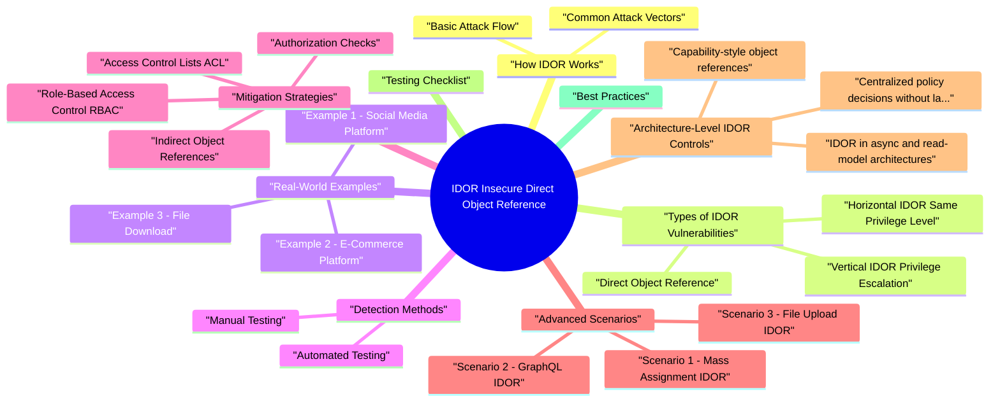

# IDOR (Insecure Direct Object Reference) revision map

I keep this IDOR (Insecure Direct Object Reference) map for the night before a screen, when five markdown files is too many clicks. Built from Critical Clarification IDOR Misconceptions.md, IDOR - Comprehensive Guide.md, IDOR - Interview Questions.md, IDOR - Quick Reference.md, IDOR - VAPT Methodology.md. Twenty minutes. Then I close the laptop.

### What is IDOR?
- OWASP Top 10 2021: A01:2021 - Broken Access Control
- OWASP Top 10 2017: A5:2017 - Broken Access Control

## How IDOR Works

### Basic Attack Flow
- See the source section `Basic Attack Flow` for the worked example.

### Common Attack Vectors
- See the source section `Common Attack Vectors` for the worked example.

## Types of IDOR Vulnerabilities

### Horizontal IDOR (Same Privilege Level)
- Definition: Accessing resources belonging to another user with the same privilege level.
- Data breach (PII, financial data)
- Privacy violation
- Compliance issues (GDPR, CCPA)

### Vertical IDOR (Privilege Escalation)
- Definition: Accessing resources requiring higher privileges.
- Privilege escalation
- Administrative access
- System compromise

### Direct Object Reference
- Definition: Direct access to internal objects without indirection.

## Real-World Examples

### Example 1: Social Media Platform
- See the source section `Example 1: Social Media Platform` for the worked example.

### Example 2: E-Commerce Platform
- See the source section `Example 2: E-Commerce Platform` for the worked example.

### Example 3: File Download
- See the source section `Example 3: File Download` for the worked example.

## Detection Methods

### Manual Testing
- Review URLs, API endpoints, request parameters
- Look for IDs, filenames, tokens in requests
- Check for sequential or predictable patterns
- Change numeric IDs
- Modify UUIDs
- Alter filenames
- Swap user IDs in requests
- [ ] Identify all object references (IDs, filenames, tokens)

### Automated Testing
- [ ] Implement IDOR scanner in CI/CD
- [ ] Use Burp Suite extensions
- [ ] Create custom test scripts
- [ ] Test with different user contexts
- [ ] Monitor for unauthorized access
- [ ] Log and alert on suspicious patterns

## Mitigation Strategies

### Authorization Checks
- See the source section `Authorization Checks` for the worked example.

### Indirect Object References
- See the source section `Indirect Object References` for the worked example.

### Access Control Lists (ACL)
- See the source section `Access Control Lists (ACL)` for the worked example.

### Role-Based Access Control (RBAC)
- See the source section `Role-Based Access Control (RBAC)` for the worked example.

### Multi-Tenant Isolation
- See the source section `Multi-Tenant Isolation` for the worked example.

### Input Validation
- Validate and sanitize object references:

## Advanced Scenarios

### Scenario 1: Mass Assignment IDOR
- See the source section `Scenario 1: Mass Assignment IDOR` for the worked example.

### Scenario 2: GraphQL IDOR
- See the source section `Scenario 2: GraphQL IDOR` for the worked example.

### Scenario 3: File Upload IDOR
- See the source section `Scenario 3: File Upload IDOR` for the worked example.

## Architecture-Level IDOR Controls

### Capability-style object references
- For high-risk object access (exports, downloads, admin actions), use signed short-lived references instead of raw IDs:
- Reference encodes object + actor/tenant scope + expiry
- Signature prevents tampering
- Verification happens before object fetch

### Centralized policy decisions without latency collapse
- Large systems often centralize authZ (PDP/OPA/policy service). Common failure:
- Teams bypass central policy checks on "internal" paths for performance
- Resolver/service caches decisions too broadly and leaks cross-tenant access
- Include subject, tenant, resource, and action in cache key.
- Keep short policy cache TTL for sensitive actions.
- Log policy decision inputs/outputs for audit and incident response.

### IDOR in async and read-model architectures
- In event-driven systems, access control bugs appear when read models lag:
- Permission revoked in source of truth, but stale projection still serves data.
- Background export job resolves object by ID without re-checking current caller permissions.
- Re-check authorization at time of access/download, not only at job creation.
- Version permissions and reject stale authorization contexts.
- Add invariant tests for revoke-then-access race windows.

## Testing Checklist

## Best Practices
- Always verify authorization - Never trust client-provided IDs
- Use indirect references - Tokens/keys instead of direct IDs
- Implement ACL/RBAC - Fine-grained access control
- Validate input - Sanitize and validate all object references
- Log access attempts - Monitor for suspicious patterns
- Test thoroughly - Automated and manual testing
- Defense in depth - Multiple layers of authorization
- Least privilege - Users should only access their own resources

## Key Takeaways
- IDOR is an access control vulnerability - Missing authorization checks
- Always verify ownership - Don't trust client-provided IDs
- Use indirect references - Tokens instead of direct IDs when possible
- Test with multiple accounts - Essential for finding IDOR
- Implement defense in depth - Multiple authorization layers
- Monitor and log - Detect unauthorized access attempts
- Regular security reviews - Audit access control logic

## Interview clusters
- Fundamentals: "What is IDOR?" "Why don't UUIDs fix it?"
- Senior: "Where do GraphQL resolvers often miss authZ?" "How do you test IDOR systematically?"
- Staff: "Design a central authorization service for multi-tenant APIs without N+1 policy calls killing latency."

## Cross-links
- GraphQL and API Security, OWASP access control, JWT/OAuth scopes, Business Logic Abuse, Security Observability (audit logs).
- Remember: Authentication (who you are) is not the same as Authorization (what you can access). Always verify both!

## Cheat sheet bits

## Definition
- IDOR is an access control vulnerability where an application provides direct access to objects without verifying the user has permission to access that specific object.

## Attack Flow

## Types of IDOR

## Common Attack Vectors
- Sequential IDs: /api/user/100 -> /api/user/101
- Predictable identifiers: UUIDs, timestamps
- Direct file access: /download?file=invoice_123.pdf
- API parameters: ?user_id=123, {"account_id": 456}

## Detection Methods

### Manual Testing
- [ ] Identify object references (IDs, filenames, tokens)
- [ ] Test with multiple user accounts
- [ ] Try sequential ID enumeration
- [ ] Test with different privilege levels
- [ ] Check file download endpoints
- [ ] Identify all object references
- [ ] Test API endpoints
- [ ] Verify authorization checks exist

### Automated Testing
- [ ] Burp Suite extensions
- [ ] Custom test scripts
- [ ] CI/CD integration
- [ ] SAST/DAST tools
- [ ] Implement IDOR scanner in CI/CD
- [ ] Use Burp Suite extensions
- [ ] Create custom test scripts
- [ ] Test with different user contexts

## Mitigation Strategies

### Authorization Checks
- See the source section `Authorization Checks` for the worked example.

### Indirect Object References
- See the source section `Indirect Object References` for the worked example.

### Access Control Lists (ACL)
- See the source section `Access Control Lists (ACL)` for the worked example.

### Role-Based Access Control (RBAC)
- See the source section `Role-Based Access Control (RBAC)` for the worked example.

### Multi-Tenant Isolation
- See the source section `Multi-Tenant Isolation` for the worked example.

## Secure Code Patterns

### Vulnerable Code
- See the source section `Vulnerable Code` for the worked example.

### Secure Code
- See the source section `Secure Code` for the worked example.

### Using Decorators
- See the source section `Using Decorators` for the worked example.

## Testing Checklist

## Best Practices
- Always verify authorization - Never trust client-provided IDs
- Use indirect references - Tokens/keys instead of direct IDs
- Implement ACL/RBAC - Fine-grained access control
- Validate input - Sanitize and validate all object references
- Log access attempts - Monitor for suspicious patterns
- Test thoroughly - Automated and manual testing
- Defense in depth - Multiple layers of authorization
- Least privilege - Users should only access their own resources

## Common Mistakes

## Key Differences

### Authentication vs Authorization
- IDOR occurs when authentication exists but authorization is missing.

## Real-World Examples

### Example 1: Social Media
- See the source section `Example 1: Social Media` for the worked example.

### Example 2: E-Commerce
- See the source section `Example 2: E-Commerce` for the worked example.

### Example 3: File Download
- See the source section `Example 3: File Download` for the worked example.

## Quick Fix Template

## Remember
- Authentication ≠ Authorization
- Always verify ownership
- Never trust client input
- Test with multiple accounts
- Use indirect references when possible
- Implement defense in depth

## Traps that dump interviews

## ️ Common Misconceptions

### "IDOR only affects applications with sequential IDs"
- Truth: IDOR vulnerabilities can occur with any type of object reference, not just sequential IDs.
- IDOR affects UUIDs, tokens, filenames, and any object reference
- Predictable patterns in UUIDs can be exploited
- Even random tokens can be vulnerable if authorization is missing
- File-based IDOR doesn't require sequential IDs

### "Authentication prevents IDOR"
- Truth: Authentication alone does NOT prevent IDOR. Authorization checks are required.
- Authentication = "Who you are" (login, session)
- Authorization = "What you can access" (permissions, ownership)
- IDOR occurs when authentication exists but authorization is missing

### "Using UUIDs instead of sequential IDs prevents IDOR"
- Truth: UUIDs make enumeration harder but do NOT prevent IDOR if authorization checks are missing.
- Key Point: UUIDs make enumeration harder but don't replace authorization checks. Always verify ownership/permissions.

### "IDOR only affects REST APIs"
- Truth: IDOR can occur in any application type that uses object references, not just REST APIs.
- Key Point: IDOR is an access control issue that can affect any application architecture or protocol.

### "Input validation prevents IDOR"
- Truth: Input validation helps but does NOT prevent IDOR. Authorization checks are required.
- Key Point: Input validation ensures data format is correct, but authorization ensures the user has permission to access that specific resource.

### "IDOR and Broken Access Control are the same"
- Truth: IDOR is a specific type of Broken Access Control, but they're not identical.
- Broken Access Control = Broad category (OWASP A01:2021)
- IDOR = Specific vulnerability type within Broken Access Control
- IDOR - Insecure Direct Object Reference
- Missing Function-Level Access Control - Missing authorization on functions
- Elevation of Privilege - Unauthorized privilege escalation
- Horizontal Access Control - Accessing same-level resources
- Vertical Access Control - Accessing higher-privilege resources

### "Client-side checks prevent IDOR"
- Truth: Client-side checks are easily bypassed and provide NO security. Server-side authorization is required.
- Key Point: Never trust client-side validation. All authorization checks must be performed server-side.

### "IDOR only affects user data"
- Truth: IDOR can affect any type of resource - files, database records, API endpoints, configuration, etc.
- Key Point: Any object reference without proper authorization can lead to IDOR, regardless of resource type.

### "Using ORM prevents IDOR"
- Truth: ORMs do NOT automatically prevent IDOR. Authorization checks are still required.
- Key Point: ORMs help with SQL injection but don't address authorization. Always add ownership/permission checks.

### "IDOR is easy to detect and fix"
- Truth: IDOR can be subtle and difficult to detect, especially in complex applications with multiple layers.
- Multiple Layers: Authorization might be checked in one layer but missing in another
- Indirect References: IDOR through related objects
- Mass Assignment: IDOR through bulk update operations
- GraphQL Complexity: Nested queries with IDOR
- Microservices: Authorization might be missing in one service

## Key Takeaways
- IDOR affects any object reference type - not just sequential IDs
- Authentication ≠ Authorization - both are required
- UUIDs don't prevent IDOR - authorization checks are still needed
- IDOR affects all application types - not just REST APIs
- Input validation ≠ Authorization - different security controls
- IDOR is a type of Broken Access Control - but not the only type
- Client-side checks are useless - server-side authorization required
- IDOR affects all resource types - not just user data

## The Golden Rule
- Always verify authorization server-side, regardless of:
- ID type (sequential, UUID, token, filename)
- Application type (REST, GraphQL, SOAP, file download)
- Framework or ORM used
- Client-side validation present
- Input validation performed

## How I would test it

## Scope & Access Control Model
- Understand how the app models access:
- Tenants, organizations, projects, accounts, users.
- Roles and permissions (admin, manager, user, support).
- Identify object types that should be access‑controlled:
- User profiles, orders, invoices, tickets, documents, messages.
- Configuration objects (API keys, webhooks, policies).
- Cross‑tenant or cross‑customer data.
- Clarify test identities:

## Mapping Object References
- Use a proxy while exploring the application as different users and record:
- Where object identifiers appear:
- Path parameters: /users/123, /org/456/projects/789.
- Query parameters: ?userId=123, ?account=abc.
- Request bodies and JSON fields containing IDs.
- Indirect identifiers (UUIDs, slugs, tokens).
- How references are used:
- View, update, delete operations.

## Assessment Strategy (Multi‑User Testing)
- IDOR assessment requires comparing behavior across multiple users.
- Create at least two test accounts per role:
- Users in the same tenant (e.g., same organization).
- Users in different tenants/customers.
- Populate them with distinct data:
- Each user creates separate resources (tickets, orders, documents, etc.).
- Label data clearly so you can distinguish ownership in responses.
- Observe the request made by User A to act on User A's resource.

## Dynamic Testing - What to Look For
- Positive expectations:
- The server enforces authorization based on the authenticated user and context.
- Attempts to access or modify another user's resource are rejected (e.g., 403 / access denied).
- Error messages reveal minimal information about other users' data.
- IDOR indicators:
- Being able to:
- View details of another user's resource.
- Modify or delete another user's resource.

## High‑Risk Scenarios
- Multi‑tenant boundaries:
- Any place where IDs contain or imply tenant/customer information.
- Admin/support tools that can act on resources across tenants.
- Financial / sensitive records:
- Invoices, payment methods, bank details, personal records.
- Workflow / approval actions:
- Approve/reject tickets, change order status, modify permissions.
- File and document access:

## Tooling & Techniques
- Proxy tooling (ZAP/Burp):
- Record baseline requests for each operation as different users.
- Use features like "parameterized replays" or manual modification to swap identifiers.
- Cluster endpoints by path pattern to ensure coverage.
- Automation (conceptual, not production‑level):
- In a test environment, scripts may:
- Reuse captured requests and systematically replace IDs with those belonging to other users.
- Compare responses to check for unauthorized access.

## Verifying Exploitability Safely
- Show that a low‑privileged test user can:
- See details of resources they do not own.
- Update or delete resources belonging to another test user or tenant.
- Use only test accounts and synthetic data:
- Avoid real customer data or production secrets.
- Mask or anonymize data in reports and screenshots.
- Exact requests (method, path, parameters) used by the unauthorized user.
- Clear evidence that the resource belongs to another identity.

## Reporting & Risk Assessment
- Affected endpoint(s) and HTTP methods.
- Object types involved (e.g., order, ticket, document).
- Roles and tenants of:
- The unauthorized actor (e.g., normal user).
- The victim/resource owner (e.g., another customer, admin).
- Single resource vs broad enumeration risk.
- Whether bulk operations or listings leak cross‑tenant data.
- Read access to confidential data.

## Remediation Guidance
- Enforce server‑side authorization for every object access:
- Check ownership or access rights based on the authenticated user and context.
- Never rely solely on client‑side logic to hide or filter data.
- Use indirect references where appropriate:
- Replace raw database IDs with opaque references (e.g., securely generated tokens).
- Ensure that opaque IDs are still validated against the current user's permissions.
- Normalize access control patterns:
- Centralize authorization checks in well‑tested middleware or access control layers.

## Re‑Testing Checklist
- [ ] Re‑test previously vulnerable endpoints:
- [ ] Confirm unauthorized users are rejected with clear access‑denied behavior.
- [ ] Ensure legitimate access still works for authorized users.
- [ ] Attempt cross‑tenant and cross‑user ID swaps again.
- [ ] Review new or refactored endpoints for consistent use of access control helpers.
- [ ] Update:
- [ ] Threat models to reflect corrected access control assumptions.
- [ ] Secure coding & review checklists with IDOR‑specific guidance.

## Prompts I drill out loud

- Fundamental Questions
- What is IDOR and why is it dangerous?
- Explain the difference between authentication and authorization in the context of IDOR.
- What are the different types of IDOR vulnerabilities?
- How would you test for IDOR vulnerabilities?
- How do you prevent IDOR vulnerabilities?
- Intermediate Questions
- You discover an IDOR in a production API. Walk through your response.
- Design a secure API endpoint that prevents IDOR.
- How would you implement IDOR protection in a multi-tenant SaaS application?
- How would you detect IDOR vulnerabilities at scale in a large codebase?
- Explain how IDOR relates to other OWASP Top 10 vulnerabilities.
- Scenario-Based Questions
- Scenario 1: E-Commerce Platform
- Scenario 2: File Download Endpoint
- Key Points to Remember
- Depth: Interview follow-ups - IDOR
- Flagship Mock Question Ladder - IDOR (Insecure Direct Object Reference)
- Junior (Fundamental clarity)
- Senior (Design and trade-offs)
- Staff (Strategy and scale)
- 10-minute mock drill format
- Answer quality rubric (quick score)

## Advanced Questions

## Depth: Interview follow-ups - IDOR
- Authoritative references: OWASP IDOR; CWE-639.
- Horizontal vs vertical IDOR-testing matrix.
- Predictable IDs / UUIDs don't fix missing authZ.
- Mass assignment adjacent issues.

## Flagship Mock Question Ladder - IDOR (Insecure Direct Object Reference)
- Primary competency axis: object-level authorization and tenant isolation.

## Sibling folders

- Stay inside this folder for the long guide. Jump only when a section names a sibling topic.
- Cookie Security, CSRF, XSS, JWT, OAuth, and TLS show up as neighbors on a lot of these maps.
