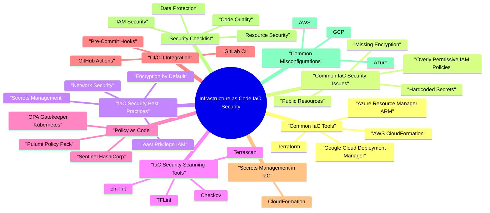

# Infrastructure as Code (IaC) Security revision map

Last mock I bounced around the Infrastructure as Code (IaC) Security folder. This file is the stop that. Drawn from Critical Clarification IaC Security Misconceptions.md, IaC Security - Comprehensive Guide.md, IaC Security - Interview Questions.md, IaC Security - Quick Reference.md. Skim the mermaid, then the outline.

### What is Infrastructure as Code Security?
- See the source section `What is Infrastructure as Code Security?` for the worked example.

### Why IaC Security Matters
- Scale: Infrastructure is defined in code, vulnerabilities scale quickly
- Automation: Misconfigurations are automatically deployed
- Compliance: Infrastructure must meet security and compliance requirements
- Visibility: Code provides visibility into infrastructure security posture

## Common IaC Tools

### Terraform
- Open-source infrastructure provisioning
- Multi-cloud support
- State management
- Module ecosystem

### AWS CloudFormation
- AWS-native IaC
- JSON/YAML templates
- Stack management
- Change sets

### Azure Resource Manager (ARM)
- Azure-native IaC
- JSON templates
- Resource groups
- Deployment scripts

### Google Cloud Deployment Manager
- GCP-native IaC
- YAML templates
- Composite types
- Deployment configurations

### Pulumi
- Multi-language support
- Real programming languages
- State management
- Policy as code

### Ansible
- Configuration management
- Playbooks
- Idempotent operations
- Agentless

## Common IaC Security Issues

### Hardcoded Secrets
- Secrets stored in plaintext in code
- Committed to version control
- Accessible to anyone with repo access

### Overly Permissive IAM Policies
- IAM policies with "*" actions
- Resources accessible to everyone
- Missing conditions

### Public Resources
- S3 buckets publicly accessible
- Databases exposed to internet
- Storage accounts with public access

### Missing Encryption
- Data stored unencrypted
- No encryption at rest
- Missing TLS configuration

### Insecure Network Configurations
- Security groups allowing 0.0.0.0/0
- Missing network segmentation
- Databases accessible from internet

## IaC Security Best Practices

### Secrets Management
- Use environment variables
- Use secret management services
- Use IaC secret management features
- [ ] No hardcoded secrets in code
- [ ] Use secret management services
- [ ] Secrets marked as sensitive
- [ ] Secret rotation implemented
- [ ] Access to secrets restricted

### Least Privilege IAM
- Grant minimum necessary permissions
- Use specific actions
- Add conditions
- Regular reviews

### Encryption by Default
- Encrypt data at rest
- Use TLS for data in transit
- Use managed keys (KMS, Key Vault, Cloud KMS)

### Network Security
- Use private subnets
- Restrict security group rules
- Implement network segmentation
- Use VPC endpoints for private connectivity
- [ ] Private subnets used
- [ ] Security groups restrictive
- [ ] No 0.0.0.0/0 in rules
- [ ] Network segmentation implemented

### Code Review
- Peer review for all IaC changes
- Security-focused reviews
- Automated scanning
- Approval workflows
- [ ] No hardcoded secrets
- [ ] IAM policies follow least privilege
- [ ] Encryption enabled
- [ ] Network security configured

### Version Control
- Store all IaC in version control
- Use meaningful commit messages
- Tag releases
- Branch protection rules
- Require reviews

### State Management
- Encrypt state files
- Use remote state backends
- Enable state locking
- Restrict state access
- Enable versioning

## IaC Security Scanning Tools

### Checkov
- Open-source static analysis
- Multi-cloud support
- Policy as code
- CI/CD integration

### Terrascan
- Static code analysis
- Multi-IaC support
- Policy library
- CI/CD integration

### TFLint
- Terraform linter
- Plugin system
- Rule configuration
- Fast scanning

### cfn-lint
- CloudFormation linter
- AWS best practices
- Custom rules
- IDE integration

### OPA (Open Policy Agent)
- Policy engine
- Rego language
- Multi-tool support
- Policy as code

## Policy as Code

### OPA Gatekeeper (Kubernetes)
- Kubernetes admission controller
- Rego policies
- Constraint templates
- Audit functionality

### Sentinel (HashiCorp)
- Policy as code for HashiCorp tools
- Terraform Enterprise/Cloud
- Vault policies
- Consul policies

### Pulumi Policy Pack
- Policy as code for Pulumi
- TypeScript/JavaScript
- Enforcement modes
- Policy library

## CI/CD Integration

### Pre-Commit Hooks
- See the source section `Pre-Commit Hooks` for the worked example.

### GitHub Actions
- See the source section `GitHub Actions` for the worked example.

### GitLab CI
- See the source section `GitLab CI` for the worked example.

## Secrets Management in IaC

### CloudFormation
- See the source section `CloudFormation` for the worked example.

## Security Checklist

### IAM Security
- [ ] IAM policies follow least privilege
- [ ] No "*" actions in policies
- [ ] Conditions added where appropriate
- [ ] Regular IAM reviews
- [ ] MFA required for privileged operations

### Data Protection
- [ ] Encryption at rest enabled
- [ ] TLS for data in transit
- [ ] Key management service used
- [ ] Backup encryption enabled
- [ ] Data classification completed

### Resource Security
- [ ] Public access blocked
- [ ] Resource limits set
- [ ] Monitoring enabled
- [ ] Logging configured
- [ ] Compliance requirements met

### Code Quality
- [ ] Code reviewed
- [ ] Automated scanning enabled
- [ ] Policies enforced
- [ ] Version control used
- [ ] State encrypted

## Common Misconfigurations

### AWS
- Public S3 Buckets
- Missing Block Public Access
- Public bucket policies
- Fix: Enable Block Public Access
- Overly Permissive Security Groups
- 0.0.0.0/0 allowed
- Missing conditions
- Fix: Use specific CIDR blocks

### Azure
- Public Storage Accounts
- Public access enabled
- Missing network rules
- Fix: Use private endpoints
- NSG Rules Too Permissive
- Allow all traffic
- Missing source restrictions
- Fix: Use specific rules

### GCP
- Public Cloud Storage
- Buckets publicly readable
- Missing IAM policies
- Fix: Remove public access
- Firewall Rules Too Open
- 0.0.0.0/0 allowed
- Missing source tags
- Fix: Use specific source IPs

## Conclusion
- Never hardcode secrets
- Follow least privilege for IAM
- Enable encryption by default
- Implement network security
- Use automated scanning tools
- Enforce policies as code
- Regular security reviews

## Interview clusters
- Fundamentals: "Secrets in Terraform-what's wrong?" "What is drift?"
- Senior: "Policy-as-code in CI-what do you block?" "How do you scope CI cloud roles?"
- Staff: "Monorepo infra owned by 30 teams-governance model."

## Cross-links
- Secure CI/CD, Cloud Security Architecture, Secrets Management, Container/Kubernetes policy engines.

## Flags I check in 90 seconds

## Common Security Issues

## Secrets Management

### Terraform
- See the source section `Terraform` for the worked example.

### CloudFormation
- See the source section `CloudFormation` for the worked example.

## IAM Least Privilege

## Security Scanning Tools

## Security Checklist

### Secrets
- [ ] No hardcoded secrets
- [ ] Use secret management
- [ ] Secrets marked sensitive
- [ ] Secret rotation implemented

### IAM
- [ ] Least privilege policies
- [ ] No "*" actions
- [ ] Conditions added
- [ ] Regular reviews

### Network
- [ ] Private subnets
- [ ] Restrictive security groups
- [ ] No 0.0.0.0/0
- [ ] Network segmentation

### Data Protection
- [ ] Encryption at rest
- [ ] TLS in transit
- [ ] Key management
- [ ] Backup encryption

### Code Quality
- [ ] Code reviewed
- [ ] Automated scanning
- [ ] Policies enforced
- [ ] Version control

## Terraform State Security

## Policy as Code Examples

### OPA
- See the source section `OPA` for the worked example.

### Sentinel
- See the source section `Sentinel` for the worked example.

## CI/CD Integration

## Common Misconfigurations

### AWS
- Public S3 buckets
- Security groups with 0.0.0.0/0
- IAM policies with "*"
- Unencrypted EBS

### Azure
- Public storage accounts
- NSG rules too permissive
- Missing encryption

### GCP
- Public Cloud Storage
- Firewall rules with 0.0.0.0/0
- Missing IAM conditions

## Quick Commands

## Key Takeaways
- Never hardcode secrets - Use secret management
- Least privilege - Minimum necessary permissions
- Encryption by default - Encrypt all data
- Network security - Restrictive rules
- Automated scanning - CI/CD integration
- Policy as code - Automated enforcement
- Secure state - Encrypted remote state

## Misreads that still sneak in

## ️ Common Misconceptions

### "IaC code doesn't need security reviews like application code"
- Truth: IaC code requires the same or greater security scrutiny as application code because misconfigurations can expose entire infrastructure.
- Infrastructure misconfigurations affect entire systems
- Vulnerabilities scale automatically (one misconfig = many resources)
- Infrastructure changes are harder to roll back
- Compliance violations can affect entire organization

### "Terraform state files are safe to commit to Git"
- Truth: Terraform state files contain sensitive information and should never be committed to version control.
- Resource IDs and configurations
- Sensitive values (passwords, keys, tokens)
- Infrastructure topology
- Resource dependencies
- Exposed secrets in Git history
- Infrastructure reconnaissance
- Unauthorized access to resources

### "IaC scanning tools catch all security issues"
- Truth: Scanning tools are essential but not sufficient. They catch known patterns but miss business logic and context-specific issues.
- Known misconfiguration patterns
- Hardcoded secrets
- Missing security controls
- Policy violations
- Business logic flaws
- Context-specific risks
- Complex attack scenarios

### "Using variables prevents secret exposure"
- Truth: Variables help but don't prevent secret exposure if secrets are stored in code, committed to Git, or passed incorrectly.
- Secrets in Variable Files:
- Secrets in Default Values:
- Secrets in Output:

### "IaC security is only about preventing misconfigurations"
- Truth: IaC security includes prevention, detection, response, and compliance across the entire infrastructure lifecycle.
- Prevention:
- Secure coding practices
- Policy as code
- Pre-commit hooks
- Detection:
- Automated scanning
- CI/CD integration

### "Terraform modules are always secure"
- Truth: Terraform modules can have vulnerabilities and misconfigurations. Always review and scan modules before use.
- Untrusted Sources:
- Modules from public registries
- Unknown maintainers
- No security guarantees
- Outdated Modules:
- May have known vulnerabilities
- Missing security updates

### "Infrastructure drift doesn't affect security"
- Truth: Infrastructure drift (manual changes outside IaC) breaks security guarantees and can introduce vulnerabilities.
- Bypassed Security Controls:
- Manual changes may bypass IaC policies
- Security configurations may be removed
- Access controls may be modified
- Compliance Violations:
- Infrastructure no longer matches code
- Audit trails incomplete

### "Policy as Code is the same as IaC security scanning"
- Truth: Policy as Code (OPA, Sentinel) and IaC scanning are complementary but different security controls.
- Detects known misconfigurations
- Pattern matching
- Vulnerability detection
- Tools: Checkov, Terrascan, tfsec
- Enforces custom policies
- Business logic rules
- Compliance requirements

### "IaC security only matters in production"
- Truth: IaC security should be enforced at all stages - development, staging, and production.
- Prevention:
- Catch issues early
- Prevent bad patterns
- Security by design
- Consistency:
- Same security across environments
- Predictable behavior

### "IaC security is only about cloud resources"
- Truth: IaC security applies to all infrastructure - cloud, on-premises, hybrid, and multi-cloud.
- Cloud Resources:
- AWS, Azure, GCP resources
- Cloud services configuration
- Cloud networking
- On-Premises:
- Server provisioning
- Network configuration

## Key Takeaways
- IaC needs security reviews - Same rigor as application code
- Never commit state files - Use remote backends with encryption
- Scanners + reviews - Automated tools + manual security reviews
- Use secret management - Variables don't secure secrets
- Comprehensive program - Prevention, detection, response, compliance
- Review modules - Treat like dependencies
- Detect drift - Manual changes break security guarantees
- Policy + scanning - Both are needed, serve different purposes

## Clusters from the Q&A file

- Fundamental Questions
- What are the main security risks in Infrastructure as Code?
- How do you manage secrets in Terraform?
- How do you implement least privilege in IaC IAM policies?
- What tools do you use for IaC security scanning?
- How do you secure Terraform state files?
- Tool-Specific Questions
- How do you prevent public S3 buckets in Terraform?
- How do you implement policy as code for IaC?
- CI/CD Integration Questions
- How do you integrate IaC security scanning into CI/CD?
- Scenario-Based Questions
- You discover hardcoded credentials in Terraform code. What do you do?
- How would you design a secure IaC workflow?
- How do you handle secrets rotation in IaC?
- How do you ensure compliance in IaC?
- Depth: Interview follow-ups - Infrastructure as Code Security

## Advanced Questions

## Conclusion

## Depth: Interview follow-ups - Infrastructure as Code Security
- Authoritative references: Terraform security best practices (vendor); Checkov / OPA as examples of policy-as-code (mention as patterns); CWE-94 (code injection) for templating risks.
- CI credentials to cloud - OIDC federation vs long-lived keys.
- Drift - Terraform state sensitivity; who can apply?
- Modules - supply chain of third-party modules.

## Cross-links I actually follow

- Stay inside this folder for the long guide. Jump only when a section names a sibling topic.
- Cookie Security, CSRF, XSS, JWT, OAuth, and TLS show up as neighbors on a lot of these maps.
