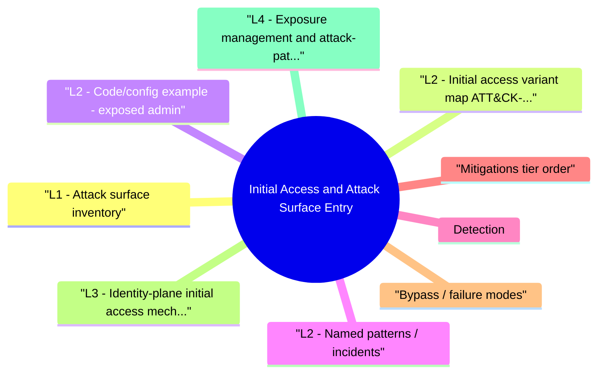

# Initial Access and Attack Surface Entry revision map

When a Initial Access and Attack Surface Entry follow-up lands, I want one page that still has the misconception and the VAPT step. I pulled headings from Critical Clarification Initial Access and Attack Surface Entry Misconceptions.md, Initial Access and Attack Surface Entry - Comprehensive Guide.md, Initial Access and Attack Surface Entry - Interview Questions & Answers.md, Initial Access and Attack Surface Entry - Quick Reference.md, Initial Access and Attack Surface Entry - VAPT Methodology.md. If a heading is here, the guide still owns the detail.

## L1 - Attack surface inventory
- Enumerables: DNS, certificate transparency, Shodan-like views (authorized), cloud misconfigs.
- Human: spear phishing, MFA fatigue, help desk social engineering.
- Supply chain: compromised updates, malicious packages, vendor VPNs.

## L2 - Initial access variant map (ATT&CK-aligned)

## L2 - Code/config example: exposed admin
- Anti-pattern: management UI on 0.0.0.0 without auth.
- Improved: bind to loopback + SSH tunnel, or private VPC only + SSO.

## L2 - Named patterns / incidents
- SolarWinds (SUNBURST) - supply chain initial access via trojaned update (2020).
- ProxyLogon (Exchange) - unauthenticated RCE on edge servers (CVE-2021-26855 et al.)-patch velocity determined exposure.
- Password spray against Azure AD / O365-no MFA tenants fold.

## Detection
- Auth logs: impossible travel, new device, legacy protocol use.
- Email gateway: first-seen URLs, attachment sandbox misses.
- Perimeter: WAF blocks, unexpected geos, spike in 4xx/5xx on login paths.
- Endpoint: first execution of signed but rare binaries from download folders.

## Mitigations (tier order)
- Reduce surface: no admin on internet, close legacy ports, IP allow-lists where viable.
- Strong identity: phishing-resistant MFA, conditional access, device compliance.
- Patch edge fast path for RCE classes.
- Segment so initial access ≠ domain admin.
- Detect early post-access activity (C2/beaconing) with network and endpoint telemetry.

## Bypass / failure modes
- MFA push fatigue bypasses naive MFA.
- Break-glass accounts without supervision.
- Shadow IT SaaS outside SSO.

## L3 - Identity-plane initial access mechanics
- Modern initial access is often identity-first:
- Session token theft (browser/session cookie replay).
- OAuth consent abuse and malicious app registrations.
- Legacy auth protocol fallback (IMAP/POP/basic auth) bypassing stronger controls.
- Password reset/helpdesk workflows exploited via social engineering.
- Phishing-resistant MFA + session binding to device/risk signals.
- Strict app consent governance and tenant-wide risky app monitoring.
- Disable legacy protocols and enforce conditional access globally.

## L4 - Exposure management and attack-path prioritization
- Not all internet-facing assets are equal; prioritize by path to business impact:
- Build external asset inventory (domains, APIs, VPN, IdP, admin planes, third-party integrations).
- Score each entry point by exploitability, identity privilege reachable, and blast radius.
- Map likely attack paths (entry -> privilege escalation -> data/production impact).
- Drive remediation by path risk, not by scanner severity alone.

## L4 - 48-hour containment vs 90-day structural fixes
- For a newly exposed initial-access vector (for example, edge auth bypass):
- First 48h: isolate entry point, restrict access, patch/mitigate, reset risky credentials/sessions, increase detection sensitivity.
- First 2 weeks: incident scoping, log review, forensic preservation, communication and customer/legal coordination if required.
- Within 90 days: architecture hardening (segmentation, identity controls, patch SLAs, automated exposure discovery, runbook updates).

## Labs
- TryHackMe / HTB attack surface rooms (authorized).
- MITRE ATT&CK navigator layer for TA0001-map to your controls.

## Toolchain
- BloodHound (post-compromise, but informs path thinking), nmap/masscan (authorized), cloud CSPM, phishing simulators, CT logs monitoring.

## Interview clusters

## Authoritative references
- MITRE ATT&CK Initial Access (TA0001).
- NIST SP 800-207 (Zero Trust) - identity and segmentation framing.
- CWE-284 / CWE-306 - improper access control on management interfaces.

## Cross-links
- Threat Modeling · SSRF · Supply Chain · Advanced Red Team Operations · Defense in Depth

## Verification checklist
- [ ] List five internet exposures you'd ban by policy.
- [ ] Map one real incident to TA0001 technique.
- [ ] Explain one identity-plane initial access chain and prevention controls.
- [ ] Describe 48h containment vs 90-day fix plan for an edge entry incident.

## Recall list from Quick Reference

## ATT&CK
- TA0001 Initial Access - foothold before lateral movement

## Common vectors
- Phish · valid accounts · edge RCE · supply chain · trusted relationship

## Controls stack
- Shrink surface · phishing-resistant MFA · CA/device posture · fast edge patch · segmentation

## Detection
- Auth anomalies · email threat · perimeter telemetry · first-run endpoint behaviors

## Cross-read
- Threat Modeling · Supply Chain · SSRF · Advanced Red Team Operations

## One-liner

## Corrections I keep repeating

## "MFA solves phishing."
- Reality: Push fatigue, MFA bypass proxies, and legacy protocols still fail without phishing-resistant methods.

## "We have a firewall, so minimal attack surface."
- Reality: SaaS, email, contractors, and cloud APIs bypass classic perimeter assumptions.

## "Initial access always means 0-day."
- Reality: Credentials and unpatched known CVEs dominate real incidents.

## "VPN = zero trust."
- Reality: VPN often grants broad L3 access; ZT emphasizes per-session policy and least privilege.

## "Supply chain risk is just npm typosquatting."
- Reality: Build systems, signing keys, vendor updates, and CI secrets are in scope.

## "Pen test found nothing; we're safe."
- Reality: Time-boxed tests miss misconfigs appearing the next day; continuous monitoring matters.

## "Blocking countries stops initial access."
- Reality: Geo blocks are noisy and bypassed via residential proxies; identity and app security matter more.

## "Detection can replace prevention here."
- Reality: High signal prevention (no admin on internet, MFA) reduces detection load and blast radius.

## Assessment order

## Objective
- Create a repeatable assessment workflow for Initial Access and Attack Surface Entry that produces reproducible evidence and actionable remediation guidance.

## Phase 1 - Scope and preparation
- Confirm in-scope assets, test windows, and prohibited actions.
- Identify critical user journeys and trust boundaries.
- Define severity rubric and evidence requirements before testing.

## Phase 2 - Recon and attack-surface mapping
- Enumerate relevant endpoints, flows, and data paths.
- Document where security checks are expected to happen.
- Mark high-value assets and high-impact paths.

## Phase 3 - Hypothesis-driven testing
- Start with low-risk probes and baseline behavior.
- Test failure hypotheses systematically (one variable at a time).
- Capture request/response artifacts for each finding candidate.

## Phase 4 - Validation and impact proof
- Reproduce findings with clean-state retests.
- Confirm exploitability and practical impact.
- Eliminate false positives; record confidence level.

## Phase 5 - Remediation and verification
- Provide immediate containment + structural fix recommendations.
- Define post-fix verification tests and telemetry checks.
- Re-test after remediation and close with evidence.

## Evidence template
- Asset / endpoint:
- Preconditions:
- Reproduction steps:
- Observed behavior:
- Security impact:
- Business impact:
- Recommended fix:
- Verification result:

## Interview drill
- In 3 minutes, explain how you would run this VAPT workflow for one production-like service and what evidence you need before escalating severity.

## What I answer in 90 seconds

- Q: Phishing vs credential stuffing-different defenses?
- Q: Why is supply chain initial access scary?
- Q: Common cloud initial access mistake?
- Q: How do you prioritize attack surface work with finite people?

## 60-second answer
- Q: What is initial access, and how do you reduce it?

## Vectors

### Q: Phishing vs credential stuffing-different defenses?
- A: Phishing needs email controls, safe browsers, MFA that can't be simply relayed; stuffing needs rate limits, breach password bans, MFA, and device signals.

## Cloud

## Staff

## Mock ladder

## Nearby reading in this repo

- Stay inside this folder for the long guide. Jump only when a section names a sibling topic.
- Cookie Security, CSRF, XSS, JWT, OAuth, and TLS show up as neighbors on a lot of these maps.
