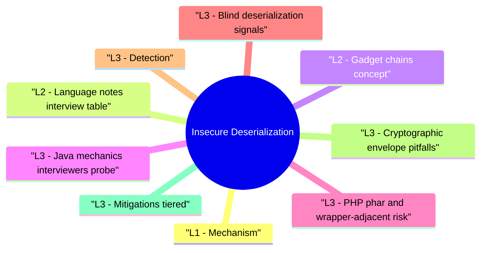

# Insecure Deserialization revision map

I keep this Insecure Deserialization map for the night before a screen, when five markdown files is too many clicks. Built from Critical Clarification Insecure Deserialization Misconceptions.md, Insecure Deserialization - Comprehensive Guide.md, Insecure Deserialization - Interview Questions & Answers.md, Insecure Deserialization - Quick Reference.md, Insecure Deserialization - VAPT Methodology.md. Twenty minutes. Then I close the laptop.

## L1 - Mechanism
- Serialization flattens objects to bytes for storage or transport. Deserialization reconstructs objects, running constructors, readObject, magic methods-attack surface.
- Unsafe when: attacker controls bytes and runtime loads arbitrary classes or prototypes.

## L2 - Language notes (interview table)

## L2 - Gadget chains (concept)
- Gadget: Existing class method that does something useful to attacker when called in sequence.
- Chain: Attacker ties gadgets together via deserialization graph edges-no new code on disk, only data.

## L3 - Java mechanics interviewers probe
- At a conceptual level, Java exploitation narratives usually involve:
- A deserialization entrypoint (ObjectInputStream.readObject or equivalent).
- Magic/callback methods (readObject, readResolve, comparator hooks, collection transforms).
- Gadget classes from common libraries that eventually trigger reflection, process execution, or remote lookups.

## L3 - PHP phar and wrapper-adjacent risk
- In PHP stacks, danger is not limited to direct unserialize($_INPUT) patterns:
- phar:// metadata can trigger object reconstruction through file APIs.
- Magic methods (__wakeup, __destruct, __toString) can act as implicit chain steps.
- Session/plugin middleware may deserialize state blobs outside controller code paths.

## L3 - Blind deserialization signals
- Some assessments have weak visibility, so validation uses indirect indicators:
- Stable timing differences on structured vs malformed payloads.
- Distinct exception fingerprints (class-not-found, type-cast, stream corruption).
- Controlled outbound callback indicators (DNS/HTTP) in authorized test environments.

## L3 - Detection
- Deserialization exceptions spikes; unexpected classes in logs.
- Child processes from JVM / dotnet after blob input.
- SAST rules for dangerous APIs; Dependabot on gadget libraries.

## L3 - Cryptographic envelope pitfalls
- Serialization controls fail frequently because integrity/context design is weak:
- Unsigned payloads: attacker can rewrite object graphs freely.
- Key reuse across token families: confusion and cross-context acceptance.
- Algorithm confusion/downgrade: verifier accepts weaker mode than intended.
- Missing audience/purpose binding: token valid across tenants or services.

## L3 - Mitigations (tiered)
- Do not deserialize untrusted native binary formats.
- If you must: strict allowlist of types; signed payloads with rotation; isolated low-priv worker.
- Patch gadget primitives in commons-collections, Spring, etc.-fast.
- WAF signatures are fragile secondary controls.

## L4 - Program-level hardening pattern
- At scale, teams reduce recurrence by turning ad-hoc fixes into guardrails:
- Ban high-risk serializers in secure coding standards and enforce via CI rules.
- Provide approved internal libraries for schema-constrained, signed serialization.
- Track gadget-bearing dependencies as a dedicated risk class in dependency governance.
- Require threat-model signoff when introducing new cross-service object transport formats.

## Named patterns / CVE classes
- Java deserialization RCE era (commons-collections, etc.)-historical lesson: dependency hygiene.
- Log4j is JNDI, not classic deserialization, but often grouped in "object" injection discussions-keep precise.

## Hands-on (authorized)
- WebGoat / PortSwigger deserialization labs; local Java gadget labs in VM.

## Interview clusters

### Junior
- Why is pickle dangerous?

### Mid
- Gadget chain in one paragraph.

### Senior
- Allowlist vs signing for internal service RPC.

### Staff
- Org policy: ban BinaryFormatter globally-how enforce?

## Authoritative references
- CWE-502 - Deserialization of Untrusted Data
- OWASP Deserialization Cheat Sheet
- CERT advisories on Java serialization

## Cross-links
- RCE · SQL Injection · Supply Chain · Secure Source Code Review · Threat Modeling

## Verification checklist
- [ ] Name two language sinks and fixes.
- [ ] Explain why JSON.parse can still be risky (prototype pollution JS-related topic).
- [ ] No payload details in client reports-behavior only.
- [ ] Explain one cryptographic envelope failure mode and consequence.
- [ ] Describe Java gadget-chain mechanics without payload details.

## Cheat sheet bits

## Risk
- Untrusted bytes -> object graph -> gadget chains -> RCE / authz break

## Sinks (examples)

## Fixes
- JSON + DTO · protobuf · signed tokens · allowlist filters · patch gadget libs

## CWE
- CWE-502 - Deserialization of Untrusted Data

## Detection
- SAST sinks · unexpected classes · process spawn post-request

## Cross-read
- RCE · Supply Chain · Secure Source Code Review

## One-liner

## Traps that dump interviews

## "We use HTTPS, so serialized data is trusted."
- Reality: TLS protects transit-not endpoint compromise or malicious clients. Authenticate and validate payloads.

## "JSON is always safe."
- Reality: Type gadgets and parser bugs exist. Schema validation and safe parser settings matter.

## "We deserialize only our own cookies."
- Reality: Clients forge cookies-treat as untrusted unless signed and verified with strong keys.

## "Updating one library fixed deserialization."
- Reality: Multiple gadget packages may exist-SBOM and recurring scans.

## "WAF blocks deserialization attacks."
- Reality: Encoded payloads and nested structures evade signatures-fix code path.

## "Internal RPC is trusted."
- Reality: Lateral movement and compromised workloads send malicious RPC-zero trust boundaries.

## "Protobuf prevents all object injection."
- Reality: Protobuf reduces graph deserialization risks but implementation bugs and code generation issues still exist-not magic.

## "Only Java has this problem."
- Reality: Every ecosystem with rich native serialization has had incidents-Python, PHP, .NET, Ruby.

## How I would test it

## Objective
- Create a repeatable assessment workflow for Insecure Deserialization that produces reproducible evidence and actionable remediation guidance.

## Phase 1 - Scope and preparation
- Confirm in-scope assets, test windows, and prohibited actions.
- Identify critical user journeys and trust boundaries.
- Define severity rubric and evidence requirements before testing.

## Phase 2 - Recon and attack-surface mapping
- Enumerate relevant endpoints, flows, and data paths.
- Document where security checks are expected to happen.
- Mark high-value assets and high-impact paths.

## Phase 3 - Hypothesis-driven testing
- Start with low-risk probes and baseline behavior.
- Test failure hypotheses systematically (one variable at a time).
- Capture request/response artifacts for each finding candidate.

## Phase 4 - Validation and impact proof
- Reproduce findings with clean-state retests.
- Confirm exploitability and practical impact.
- Eliminate false positives; record confidence level.

## Phase 5 - Remediation and verification
- Provide immediate containment + structural fix recommendations.
- Define post-fix verification tests and telemetry checks.
- Re-test after remediation and close with evidence.

## Evidence template
- Asset / endpoint:
- Preconditions:
- Reproduction steps:
- Observed behavior:
- Security impact:
- Business impact:
- Recommended fix:
- Verification result:

## Interview drill
- In 3 minutes, explain how you would run this VAPT workflow for one production-like service and what evidence you need before escalating severity.

## Prompts I drill out loud

- Q: What is a gadget chain?
- Q: Is JSON deserialization always safe?
- Q: Preferred fix for Java microservices passing objects?
- Q: How do allowlists work in Java deserialization filters?
- Q: Log4j vs deserialization?

## 60-second answer

## Mechanism

### Q: YAML?
- A: yaml.load in Python can construct arbitrary objects-use safe_load or JSON.

## Defense

## Incident

## Depth: Follow-ups
- PHP phar metadata deserialization via file operations.
- Ruby Marshal in Rails sessions (legacy).
- Kotlin serialization vs Java compat.

## Mock ladder

## Sibling folders

- Stay inside this folder for the long guide. Jump only when a section names a sibling topic.
- Cookie Security, CSRF, XSS, JWT, OAuth, and TLS show up as neighbors on a lot of these maps.
