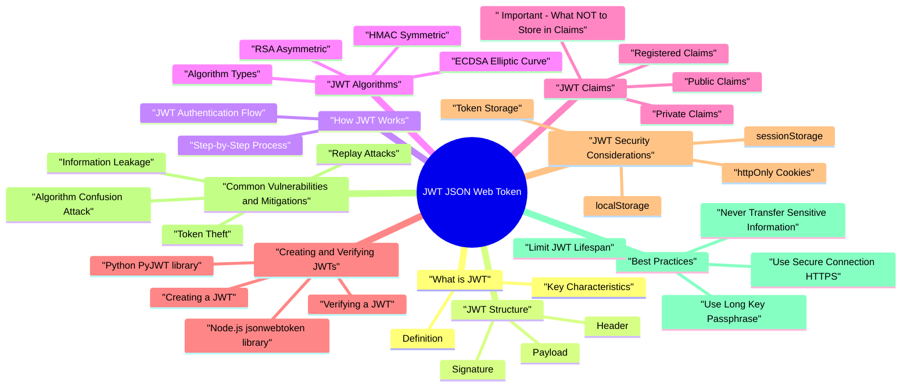

# JWT (JSON Web Token) revision map

When a JWT (JSON Web Token) follow-up lands, I want one page that still has the misconception and the VAPT step. I pulled headings from Critical Clarification JWT Security Misconceptions.md, JSON Web Token (JWT) - Comprehensive Guide.md, JSON Web Token (JWT) - Interview Questions & Answe.md, JSON Web Token (JWT) - Quick Reference Guide.md, JSON Web Token (JWT) - VAPT Methodology.md. If a heading is here, the guide still owns the detail.

### What JWT is Used For
- Authentication: Verifying user identity
- Authorization: Determining user permissions and roles
- Information Exchange: Securely transmitting data between parties
- Session Management: Stateless session tokens
- API Authentication: Authenticating API requests
- Single Sign-On (SSO): Sharing authentication between multiple applications

### Why Use JWT?
- Stateless: No need to store session data on server
- Scalable: Works across multiple servers without shared storage
- Self-contained: Includes all necessary information
- Cross-domain: Can be used across different domains
- Standardized: Industry-standard format (RFC 7519)
- Compact: Small size, easy to transmit
- ️ Larger size: More data than simple session IDs
- ️ Cannot revoke easily: Difficult to invalidate before expiration

## What is JWT

### Definition
- A JWT is a compact, URL-safe token that consists of three parts separated by dots (.):

### Key Characteristics
- Compact: Small size makes it easy to transmit via URL, POST parameter, or HTTP header
- Self-contained: Contains all necessary information (claims) about the user
- Stateless: Server doesn't need to store session data
- Signed: Digitally signed to ensure integrity and authenticity

## JWT Structure

### Header
- The header typically consists of two parts:
- Type (typ): Usually "JWT"
- Algorithm (alg): The signing algorithm (e.g., HS256, RS256, ES256)

### Payload
- The payload contains the claims. Claims are statements about an entity (typically the user) and additional data.
- Registered Claims: Pre-defined claims (exp, iat, iss, aud, etc.)
- Public Claims: Claims defined in the JWT registry
- Private Claims: Custom claims specific to your application

### Signature
- The encoded header
- The encoded payload
- A secret (for HMAC) or private key (for RSA/ECDSA)
- The algorithm specified in the header

## How JWT Works

### JWT Authentication Flow
- See the source section `JWT Authentication Flow` for the worked example.

### Step-by-Step Process
- User Authentication
- User provides credentials (username/password)
- Server validates credentials
- If valid, server creates JWT
- JWT Creation
- Server creates header with algorithm
- Server creates payload with user claims
- Server signs token using secret key

## JWT Algorithms

### Algorithm Types
- JWTs support several signing algorithms:

### HMAC (Symmetric)
- HS256: HMAC using SHA-256
- HS384: HMAC using SHA-384
- HS512: HMAC using SHA-512
- Same secret key used for signing and verification
- Secret key must be shared between all parties
- Single-server applications
- When secret key can be securely shared
- Simple authentication scenarios

### RSA (Asymmetric)
- RS256: RSASSA-PKCS1-v1_5 using SHA-256
- RS384: RSASSA-PKCS1-v1_5 using SHA-384
- RS512: RSASSA-PKCS1-v1_5 using SHA-512
- Private key used for signing (kept secret)
- Public key used for verification (can be shared)
- Multi-server applications
- Microservices architecture
- When verification needs to be done without secret key access

### ECDSA (Elliptic Curve)
- ES256: ECDSA using P-256 and SHA-256
- ES384: ECDSA using P-384 and SHA-384
- ES512: ECDSA using P-521 and SHA-512
- Similar to RSA but uses elliptic curve cryptography
- Smaller keys for same security level
- Private key for signing, public key for verification
- Modern applications requiring efficient cryptography
- Mobile applications (smaller key size)

### Algorithm Selection Guide
- The 'none' algorithm means no signature
- Extremely dangerous - allows token forgery
- Always whitelist algorithms explicitly

## JWT Claims
- Claims are statements about an entity and additional metadata. There are three types of claims:

### Registered Claims
- These are pre-defined claims in the JWT specification:

### Public Claims
- Claims defined in the JWT registry or defined as URIs:

### Private Claims
- Custom claims specific to your application:
- userId: User identifier
- username: Username
- role: User role (admin, user, etc.)
- permissions: Array of permissions
- department: User's department
- Custom business logic data

### ️ Important: What NOT to Store in Claims
- Passwords or password hashes
- Credit card numbers
- Social Security Numbers (SSN)
- Private keys or secrets
- Full personal addresses
- Medical records
- Only store what's necessary for authorization
- Store identifiers, not full user objects

## Creating and Verifying JWTs

### Creating a JWT
- See the source section `Creating a JWT` for the worked example.

### Node.js (jsonwebtoken library)
- See the source section `Node.js (jsonwebtoken library)` for the worked example.

### Python (PyJWT library)
- See the source section `Python (PyJWT library)` for the worked example.

### Verifying a JWT
- See the source section `Verifying a JWT` for the worked example.

### Node.js
- See the source section `Node.js` for the worked example.

### Python
- See the source section `Python` for the worked example.

### Decoding Without Verification (Dangerous!)
- See the source section `Decoding Without Verification (Dangerous!)` for the worked example.

## JWT Security Considerations

### Token Storage
- See the source section `Token Storage` for the worked example.

### localStorage
- Easy to access in JavaScript
- Vulnerable to XSS attacks
- Accessible to any script on the page

### sessionStorage
- Cleared when tab closes
- Still vulnerable to XSS
- Not accessible across tabs

### httpOnly Cookies
- Not accessible to JavaScript (XSS protection)
- Automatically sent with requests
- ️ Vulnerable to CSRF (use SameSite attribute)
- Recommended for sensitive tokens

### Memory (JavaScript variable)
- Not persisted
- Not accessible after page reload
- Lost on page refresh
- Use httpOnly cookies for access tokens
- Use httpOnly cookies with SameSite=Strict or SameSite=Lax
- Add Secure flag for HTTPS-only transmission

### Token Transmission
- JWTs contain sensitive information
- HTTPS encrypts data in transit
- Prevents man-in-the-middle attacks

### Token Expiration
- Recommended: 15 minutes to 1 hour
- Reduces risk if token is stolen
- Forces regular refresh
- Stored securely (httpOnly cookie)
- Used to obtain new access tokens
- Can be revoked server-side
- Recommended: 7-30 days

### Secret Key Management
- Long and random (minimum 256 bits for HMAC)
- Cryptographically secure random generation
- Stored securely (environment variables, secret managers)
- Never committed to version control
- Rotated periodically

### Algorithm Whitelisting
- See the source section `Algorithm Whitelisting` for the worked example.

### Claim Validation
- See the source section `Claim Validation` for the worked example.

## Common Vulnerabilities and Mitigations

### Information Leakage
- Problem: Sensitive information stored in JWT payload can be decoded by anyone.
- Store only necessary identifiers
- Never store passwords, PII, or sensitive data
- Use principle of least privilege
- Use JWE (JSON Web Encryption) if encryption is needed

### Algorithm Confusion Attack
- Problem: Server accepts tokens signed with different algorithms (e.g., 'none' or weak algorithms).
- Always whitelist algorithms explicitly
- Never allow 'none' algorithm
- Use strong algorithms (HS256, RS256, ES256)

### Token Theft
- Problem: If token is stolen (XSS, network sniffing, etc.), attacker can use it until expiration.
- Use httpOnly cookies instead of localStorage
- Use short token expiration times
- Implement token refresh mechanism
- Use HTTPS for all token transmission
- Implement Content Security Policy (CSP)
- Implement token blacklisting (optional, requires storage)

### Replay Attacks
- Problem: Valid token can be reused multiple times even after action is completed.
- Use short token expiration
- Implement jti (JWT ID) claim for one-time tokens
- Use nonce for critical operations
- Implement token blacklisting for critical operations

### Token Expiration Not Validated
- Problem: Server doesn't validate expiration claim, allowing expired tokens.
- Always use jwt.verify() instead of jwt.decode()
- Verify exp claim automatically (built into jwt.verify)
- Validate iat and nbf claims
- Implement clock synchronization

### Weak Secret Keys
- Problem: Short or predictable secret keys can be brute-forced.
- Use long, random keys (minimum 256 bits)
- Generate keys using cryptographically secure random generators
- Store keys securely (environment variables, secret managers)
- Rotate keys periodically

### Insufficient Claim Validation
- Problem: Server doesn't validate all claims, allowing token manipulation.
- Validate all claims (iss, aud, exp, iat, nbf)
- Validate custom claims (roles, permissions)
- Implement proper authorization checks
- Use claim validation libraries

### Key Management Issues
- Problem: Secret keys are compromised, hardcoded, or improperly managed.
- Never hardcode keys in source code
- Use environment variables
- Use secret management services
- Implement key rotation
- Use different keys for different environments
- Never commit keys to version control

## Best Practices

### Use Secure Connection (HTTPS)
- See the source section `Use Secure Connection (HTTPS)` for the worked example.

### Never Transfer Sensitive Information
- See the source section `Never Transfer Sensitive Information` for the worked example.

### Limit JWT Lifespan
- See the source section `Limit JWT Lifespan` for the worked example.

### Use Long Key Passphrase
- See the source section `Use Long Key Passphrase` for the worked example.

### Whitelist Authorized Signature Algorithms
- See the source section `Whitelist Authorized Signature Algorithms` for the worked example.

### Work with One Signature Algorithm Ideally
- See the source section `Work with One Signature Algorithm Ideally` for the worked example.

### Choose Well-Known and Reliable Libraries
- Node.js: jsonwebtoken (node-jsonwebtoken)
- Python: PyJWT
- Java: java-jwt (auth0)
- C#: System.IdentityModel.Tokens.Jwt
- Go: github.com/golang-jwt/jwt

### Always Validate and Sanitize Data
- See the source section `Always Validate and Sanitize Data` for the worked example.

### Use httpOnly Cookies for Storage
- See the source section `Use httpOnly Cookies for Storage` for the worked example.

### Implement Token Refresh Mechanism
- See the source section `Implement Token Refresh Mechanism` for the worked example.

## Implementation Examples

### Node.js/Express - Complete Example
- See the source section `Node.js/Express - Complete Example` for the worked example.

### Python/Flask - Complete Example
- See the source section `Python/Flask - Complete Example` for the worked example.

## Real-World Scenarios

### Scenario 1: Single Page Application (SPA)
- Frontend: React/Vue/Angular
- Backend: REST API
- Authentication: JWT
- User logs in -> Backend returns JWT
- Frontend stores JWT in httpOnly cookie (via backend) or memory
- Frontend sends JWT in Authorization header for API requests
- Backend validates JWT on each request
- Use httpOnly cookies set by backend (most secure)

### Scenario 2: Microservices Architecture
- Multiple services need to verify tokens
- Services don't share secrets
- Use RSA/ECDSA (asymmetric) algorithms
- Auth service signs tokens with private key
- Other services verify with public key
- Public key distributed to all services
- Use RS256 or ES256 algorithm
- Distribute public key securely

### Scenario 3: Mobile Application
- iOS/Android app
- Backend API
- Secure token storage
- User logs in -> Backend returns JWT
- App stores JWT in secure storage (Keychain/Keystore)
- App sends JWT in Authorization header
- Backend validates JWT
- Use platform secure storage (Keychain/Keystore)

### Scenario 4: Third-Party API Integration
- Your app calls third-party API
- Third-party API requires JWT authentication
- Third-party provides API key/secret
- Your backend creates JWT with their requirements
- Your backend signs JWT with their secret
- Your backend includes JWT in API requests
- Follow third-party JWT requirements exactly
- Store third-party secrets securely

## Interview clusters
- Fundamentals: "alg none?" "What claims do you validate?"
- Senior: "HS256 vs RS256-key management implications?" "How to revoke JWT access tokens?"
- Staff: "Multi-region key rotation without downtime-high level."

## Cross-links
- OAuth/OIDC, Encryption vs Hashing, JWT vs OAuth comparison, Cookie Security, Rate Limiting (token abuse).

## Offensive testing additions (advanced)
- Interviewers for offensive AppSec roles may ask beyond basic claim validation:
- Header key injection surfaces: validate and constrain kid, jku, jwk, and x5u; never trust remote key URLs by default.
- Algorithm confusion: enforce strict algorithm allowlists and key-type matching to prevent RS256/HS256 confusion classes.
- JWKS cache hygiene: short TTL, strong kid uniqueness, and safe key rotation semantics.
- Token confusion risks: prevent ID token vs access token misuse across APIs.
- Client storage risks (mobile/web): avoid weak local storage patterns that expose bearer tokens.

## Recall list from Quick Reference

## ️ Critical Clarifications
- JWT = base64url encoded (anyone can decode)
- Signature = integrity verification (prevents tampering)
- JWT does NOT encrypt payload (use JWE for encryption)
- Never store sensitive data in JWT payload

## JWT Structure

### Header
- See the source section `Header` for the worked example.

### Payload (Claims)
- See the source section `Payload (Claims)` for the worked example.

### Signature
- See the source section `Signature` for the worked example.

## JWT Algorithms

## Registered Claims

## Security Best Practices

### DO
- Use HTTPS for token transmission
- Store tokens in httpOnly cookies (not localStorage)
- Use short token expiration (15 min - 1 hour)
- Use long, random secret keys (minimum 256 bits)
- Whitelist algorithms explicitly
- Validate all claims server-side
- Use refresh tokens for longer sessions
- Follow principle of least privilege

### DON'T
- Store sensitive data (passwords, PII, credit cards)
- Allow algorithm 'none'
- Use short or weak keys
- Trust client-side validation
- Use long expiration times for access tokens
- Store tokens in localStorage (if XSS vulnerable)
- Skip claim validation
- Hardcode secrets in source code

## Token Storage Comparison

## JWT vs OAuth 2.0 vs Session Cookies
- Common confusion: JWTs are often used as OAuth 2.0 access tokens, but they serve different purposes.
- Key difference: JWTs are stateless, while session cookies are stateful.
- Use JWTs for API authentication and authorization
- Use OAuth 2.0 for third-party authorization
- Use session cookies for web app sessions

## Implementation Snippets

### Node.js - Create Token
- See the source section `Node.js - Create Token` for the worked example.

### Node.js - Verify Token
- See the source section `Node.js - Verify Token` for the worked example.

### Node.js - Middleware
- See the source section `Node.js - Middleware` for the worked example.

### Python - Create Token
- See the source section `Python - Create Token` for the worked example.

### Python - Verify Token
- See the source section `Python - Verify Token` for the worked example.

## Common Vulnerabilities & Mitigations

## Recommended Configurations

### Standard Web Application
- See the source section `Standard Web Application` for the worked example.

### High-Security Application
- See the source section `High-Security Application` for the worked example.

### Microservices (Asymmetric)
- See the source section `Microservices (Asymmetric)` for the worked example.

## Token Expiration Guidelines

## Key Generation

### Node.js
- See the source section `Node.js` for the worked example.

### Python
- See the source section `Python` for the worked example.

### Command Line
- See the source section `Command Line` for the worked example.

## Error Handling

### Common JWT Errors
- See the source section `Common JWT Errors` for the worked example.

### Example Error Handling
- See the source section `Example Error Handling` for the worked example.

## Attack Protection Matrix

## Common Mistakes to Avoid

### Wrong: Decoding without verification
- See the source section `Wrong: Decoding without verification` for the worked example.

### Correct: Always verify
- See the source section `Correct: Always verify` for the worked example.

### Wrong: No algorithm whitelist
- See the source section `Wrong: No algorithm whitelist` for the worked example.

### Correct: Whitelist algorithms
- See the source section `Correct: Whitelist algorithms` for the worked example.

### Wrong: Storing sensitive data
- See the source section `Wrong: Storing sensitive data` for the worked example.

### Correct: Only identifiers
- See the source section `Correct: Only identifiers` for the worked example.

### Wrong: Long expiration
- See the source section `Wrong: Long expiration` for the worked example.

### Correct: Short expiration with refresh
- See the source section `Correct: Short expiration with refresh` for the worked example.

## Recommended Libraries

## Testing Checklist
- [ ] Using HTTPS for all token transmission
- [ ] Tokens stored in httpOnly cookies (or secure storage)
- [ ] Short token expiration (15 min or less)
- [ ] Algorithm whitelisting implemented
- [ ] All claims validated (exp, iss, aud, etc.)
- [ ] Secret keys stored in environment variables
- [ ] No sensitive data in payload
- [ ] Error handling implemented

## JWT Debugging & Troubleshooting

### Common Errors & Solutions
- See the source section `Common Errors & Solutions` for the worked example.

## Quick Decision Tree
- Stateless API -> Yes
- Microservices -> Yes (with RSA/ECDSA)
- Mobile apps -> Yes
- Need easy revocation -> Consider sessions
- Single server, simple app -> Sessions may be simpler
- Single server -> HS256
- Microservices -> RS256 or ES256
- Mobile/IoT -> ES256 (smaller keys)

## Key Takeaways
- JWT = Encoded, NOT Encrypted - Don't store sensitive data
- Always Verify - Use jwt.verify(), not jwt.decode()
- Whitelist Algorithms - Never allow 'none'
- Short Expiration - Use refresh tokens for longer sessions
- Secure Storage - httpOnly cookies or secure storage
- HTTPS Only - Always use HTTPS
- Validate Claims - Check exp, iss, aud, etc.
- Strong Keys - Minimum 256 bits, cryptographically random

## Corrections I keep repeating

### "JWT encrypts the payload"
- Truth: JWTs are NOT encrypted by default. They are base64url encoded, which is not encryption.
- Anyone can decode the JWT payload and see its contents
- The payload is readable by anyone who has the token
- JWTs do NOT hide or encrypt sensitive data
- Never store sensitive information (passwords, credit cards, SSN) in JWT payload
- Never store PII (personal information) unless necessary
- Store only minimal claims needed for authentication/authorization
- Use JWE (JSON Web Encryption) if you need encryption

### "Signature validation prevents all attacks"
- Truth: Signature validation only ensures the token hasn't been tampered with. It does NOT prevent:
- Token theft
- Replay attacks
- Token leakage
- Expired token usage (if not validated)
- Verifies token wasn't modified after creation
- Ensures token was signed by the server
- Prevents tampering with claims

### "JWT is more secure than session cookies"
- Truth: Security depends on implementation, not the technology choice. Both can be secure or insecure.
- Both are vulnerable to token/session theft
- Both need HTTPS for secure transmission
- Both need proper validation and expiration checks
- Choice depends on use case, not security alone

### "You can trust all claims in a JWT without validation"
- Truth: You MUST validate ALL claims before trusting them, especially:
- exp (expiration time)
- iat (issued at)
- nbf (not before)
- iss (issuer)
- aud (audience)
- Custom claims

### "Algorithm 'none' is safe to use"
- Truth: The none algorithm is EXTREMELY DANGEROUS and should NEVER be allowed.
- JWT specification allows "alg": "none" to indicate no signature
- Meant for tokens that don't need integrity protection
- This is a security vulnerability waiting to happen

### "You don't need to validate expiration if you check it in code"
- Truth: You MUST validate the exp claim server-side during token verification. Client-side checks can be bypassed.

### "Short keys are fine for HMAC"
- Truth: Short keys are vulnerable to brute-force attacks. Use long, random keys.
- HMAC-SHA256: Minimum 256 bits (32 bytes) - Recommended 512 bits (64 bytes)
- RSA: Minimum 2048 bits - Recommended 4096 bits
- ECDSA: Minimum 256 bits (P-256) - Recommended 384 bits (P-384)

## Key Takeaways

### DO
- Validate all claims including expiration, issuer, audience
- Whitelist algorithms - never allow 'none'
- Use long, random keys (minimum 256 bits for HMAC)
- Never store sensitive data in JWT payload
- Use HTTPS for token transmission
- Implement token refresh with short-lived access tokens
- Validate tokens server-side - never trust client-side validation

### DON'T
- Store sensitive information (passwords, PII, secrets) in payload
- Allow algorithm 'none' - always whitelist algorithms
- Use short or weak keys - use cryptographically secure random keys
- Trust claims without validation - always verify signature and claims
- Rely on client-side expiration checks - validate server-side
- Use long expiration times - keep tokens short-lived
- Store tokens in localStorage (if vulnerable to XSS) - prefer httpOnly cookies

## Summary Table
- Remember: JWT is a tool, not a security solution by itself. Proper implementation and validation are essential for security.

## Assessment order

## Scope & Token Model
- Identify where JWTs are used:
- Authentication (ID tokens, access tokens).
- Authorization (API access, scopes/roles).
- Session management or stateless sessions.
- Token transport & storage:
- Cookies (HttpOnly vs JS‑accessible).
- Headers (e.g., Authorization: Bearer).
- Local/session storage in browsers.

## Mapping JWT Flows
- Issuance flows:
- Login, SSO, token refresh.
- Which claims are included (subject, issuer, audience, expiry, scopes).
- Consumption points:
- APIs or services that validate tokens.
- UI components that depend on token presence or contents.
- Lifetimes and rotation:
- Access vs refresh token lifetimes.

## Assessment Strategy (Design & Implementation)
- Token structure & claims:
- Presence and appropriate use of:
- iss, sub, aud, exp, iat, nbf, and custom claims.
- Clear distinction between identity vs authorization data.
- Signature algorithms & keys:
- Algorithms allowed/configured (symmetric vs asymmetric).
- Key management practices (rotation, storage, distribution).
- Validation behavior:

## Dynamic Testing - What to Observe
- Legitimate token behavior:
- Capture JWTs from legitimate flows (for structure analysis only; avoid logging secrets).
- Decode headers and payloads locally to understand:
- Claim usage and expected patterns.
- Algorithm and key IDs (kid) where present.
- Error handling:
- Send intentionally:
- Expired tokens.

## 5. Algorithm Confusion Testing
- In your controlled test environment, specifically test for algorithm confusion:
- RS256 to HS256 confusion:
- Capture a token signed with RS256
- Change header alg from RS256 to HS256
- Attempt to verify using the public key as HMAC secret
- Observe if the service accepts this manipulated token
- Algorithm 'none' testing:
- Change header alg to none

## 6. Key Injection Testing (kid, jku, x5u)
- If tokens contain these header parameters, test for injection vulnerabilities:
- kid (Key ID) injection:
- Attempt path traversal: "kid": "../../../etc/passwd"
- Attempt SQL injection: "kid": "1' OR '1'='1"
- Attempt command injection in key lookup logic
- jku (JWK Set URL) injection:
- Point to attacker-controlled JWKS endpoint
- Attempt SSRF attacks with internal URLs

## High‑Risk Scenarios
- Critical APIs protected by JWTs:
- Financial, personal, or admin actions.
- Token sharing across services:
- Multiple microservices or products relying on the same token issuer.
- Long‑lived tokens:
- Especially those without strong revocation mechanisms.
- Complex claim‑based authorization:
- Privileges derived from roles/scopes in tokens.

## Tooling & Aids
- JWT inspection tools (offline):
- To parse and view token headers/claims without altering them.
- Proxy tooling:
- Capture and replay calls with:
- Legitimate vs clearly invalid tokens (e.g., expired, wrong audience).
- Configuration & code review:
- Libraries and frameworks used for JWT verification.
- How keys are configured and rotated.

## Verifying Validation Strictness Safely
- Confirm that it:
- Rejects tokens when:
- Signature is invalid.
- Token is expired or not yet valid.
- Issuer or audience do not match configured expectations.
- Fails closed when token or key configuration is missing or malformed.
- Check error channels:
- Ensure that error messages do not leak sensitive details about keys or configuration.

## 5. Replay Attack Testing
- Token replay across endpoints:
- Capture valid token for endpoint A
- Replay same token to endpoint B (different purpose)
- Verify token binding to intended audience/service
- Timing attacks:
- Capture token at time T
- Replay token at T+5 minutes (within expiry)
- Replay token at T+20 minutes (past short expiry)

## Reporting & Risk Assessment
- Where tokens are issued and consumed.
- Observed claim usage and validation behavior.
- Any weaknesses such as:
- Missing checks for issuer/audience/expiry.
- Overreliance on long‑lived tokens without revocation.
- Insecure token storage (e.g., in locations easily accessible to scripts).
- Potential impact:
- Unauthorized access if validation is weak.

## Remediation Guidance
- Strict validation everywhere:
- Signature, algorithm, issuer, audience, expiry, and not‑before.
- Secure key and algorithm management:
- Use modern algorithms and rotate keys regularly.
- Centralize key management and distribution.
- Appropriate lifetimes & revocation:
- Short lifetimes for access tokens.
- Clear revocation strategies (blacklists, key rotation, etc.).

## Re‑Testing Checklist
- [ ] Verify that all consuming services:
- [ ] Enforce full validation of signatures and critical claims.
- [ ] Reject expired, mis‑issued, or malformed tokens.
- [ ] Confirm:
- [ ] Tokens are stored and sent in secure channels.
- [ ] Key rotation or revocation mechanisms work as designed.
- [ ] Update:
- [ ] Architecture diagrams of token flows.

## What I answer in 90 seconds

- Fundamental Questions
- What is JWT and how does it work?
- What are the three parts of a JWT?
- What is the difference between JWT encoding and encryption?
- What are JWT claims and what types exist?
- What are the different JWT signing algorithms?
- Is JWT encrypted? Can sensitive data be stored in JWT?
- How do you protect against algorithm confusion attacks?
- How do you prevent token theft and replay attacks?
- What happens if a JWT token is stolen?
- How do you validate JWT expiration?
- What are the security risks of storing JWT in localStorage?
- Implementation Questions
- How do you create a JWT in Node.js?
- How do you verify a JWT in Node.js?
- How do you implement a JWT refresh token mechanism?
- How do you implement JWT middleware for Express?
- Scenario-Based Questions
- How would you implement JWT authentication for a microservices architecture?
- How would you handle JWT token revocation in a stateless system?
- What are the trade-offs between using JWT and session cookies?
- What is JWE (JSON Web Encryption) and when would you use it?
- How do you handle JWT in a mobile application securely?
- How do you implement JWT with role-based access control (RBAC)?

## Security Questions

## Advanced Questions

### What is the difference between JWT and OAuth 2.0?
- A token format (how data is structured)
- Can be used independently
- Defines structure (header.payload.signature)
- Can be used with or without OAuth
- An authorization framework (protocol for authorization)
- Defines how to obtain access tokens
- Specifies flows (Authorization Code, Client Credentials, etc.)
- Often uses JWT as the token format

## File 1: JWT (JSON Web Token).md
- Current Issue: This is just an index file with links to other documents. No content issues.
- Add a brief description of what each linked document covers
- Consider adding a "Recommended Reading Order" section for beginners

## File 2: JSON Web Token (JWT) - VAPT Methodology.md
- Missing "Algorithm Confusion" testing specifics
- No mention of kid (Key ID) parameter testing
- Missing JWKS endpoint testing guidance
- No section on JWT replay attack testing

## File 3: JSON Web Token (JWT) - Quick Reference Guide.md
- Missing JWT debugging/troubleshooting section
- No mention of JWT clock skew handling
- Missing "JWT vs OAuth vs Session" comparison table
- Error handling table could be expanded

## File 4: JSON Web Token (JWT) - Interview Questions & Answers.md
- Missing question about JWT vs PASETO (modern alternative)
- No question about JWT in GraphQL context
- Missing question about JWT and BFF (Backend for Frontend) pattern
- Some answers could be more concise

## File 5: JSON Web Token (JWT) - Comprehensive Guide.md
- Missing section on JWT performance considerations
- No mention of JWT size limits (URL length, cookie size)
- Missing JWT audit logging best practices
- No section on JWT in serverless architectures

## File 6: Critical Clarification JWT Security Misconceptions.md
- Missing misconception about "JWT can be revoked easily"
- No mention of "JWT is better than API keys" misconception
- Missing clarification about JWT in mobile apps

## Summary of Key Improvements
- All suggested improvements maintain consistency with existing content while adding practical value for developers, security testers, and interview preparation.

## Depth: Interview follow-ups - JWT (JSON Web Token)
- Authoritative references (re-check periodically): OWASP JSON Web Token Cheat Sheet; RFC 7519 (JWT); RFC 8725 (JSON Web Signature / JWT best practices-algorithm hygiene, key management).
- Algorithm confusion / none: How does your stack reject alg=none, restrict allowed algs, and prevent RSA/HMAC confusion (use libs that implement RFC 8725 guidance)?
- kid / JKU / x5u abuse: If headers can steer verification keys, how do you pin trust to a known key set (no arbitrary URL fetches)?
- Storage vs threat model: Browser storage vs HttpOnly cookie-what XSS leftover risk remains in each case?
- Replay / rotation: jti, token binding, short exp, refresh rotation-what breaks if the clock skews?

## Flagship Mock Question Ladder - JWT (JSON Web Token)
- Primary competency axis: token validation, key management, claim semantics, session design.

### Junior (Fundamental clarity)
- What is JWT and what are its three parts?
- Why is JWT payload not confidential by default?
- Which claims must be validated before trusting a token?

### Senior (Design and trade-offs)
- How do you prevent RS256/HS256 algorithm confusion in implementation?
- How would you design key rotation with zero downtime?
- When should you choose opaque tokens over JWT for API access?

### Staff (Strategy and scale)
- Design multi-tenant JWT trust boundaries across many services.
- How do you enforce organization-wide issuer/audience policy safely?
- What telemetry proves your JWT controls are actually working?

### 10-minute mock drill format
- 3 min: Pick one Junior prompt and answer with definition, mechanism, and one mitigation.
- 4 min: Pick one Senior prompt and answer with trade-offs and implementation caveats.
- 3 min: Pick one Staff prompt and answer with architecture/policy plus measurement plan.

### Answer quality rubric (quick score)
- Accuracy (facts and mechanism)
- Depth (trade-offs and failure modes)
- Practicality (implementable controls)
- Verification (tests/telemetry proving success)

## Nearby reading in this repo

- Stay inside this folder for the long guide. Jump only when a section names a sibling topic.
- Cookie Security, CSRF, XSS, JWT, OAuth, and TLS show up as neighbors on a lot of these maps.
