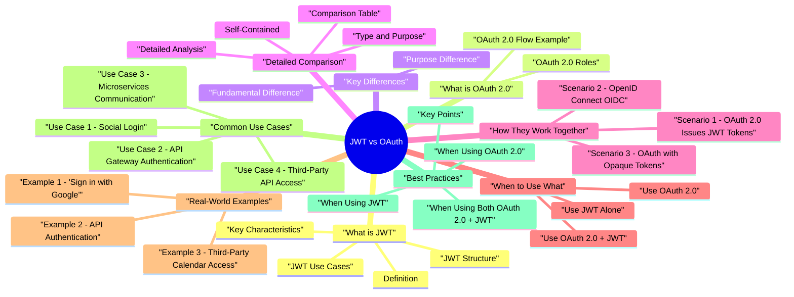

# JWT vs OAuth revision map

JWT vs OAuth in one sitting. That is the deal. I mined Critical Clarification JWT vs OAuth 2 0 Misconcept.md, JWT vs OAuth 2 0 - Comprehensive Guide.md, JWT vs OAuth 2 0 - Interview Questions & Answers.md, JWT vs OAuth 2 0 - Quick Reference Guide.md. The outline keeps every H2 I cared about from those files.

## What is JWT

### Definition
- JWT (JSON Web Token) is a compact, URL-safe token format (RFC 7519) used to securely transmit information between parties as a JSON object. It's a token format, not a protocol or framework.
- OAuth 2.0 is an authorization framework (RFC 6749) that enables third-party applications to obtain limited access to a user's resources on another service without exposing the user's credentials.

### JWT Structure
- A JWT consists of three parts separated by dots (.):

### Key Characteristics
- Self-contained: Contains all necessary information
- Stateless: No database lookup needed for validation
- Compact: Small size, easy to transmit
- Signed: Ensures integrity and authenticity
- Standardized: RFC 7519 standard
- Authorization Framework: Defines how authorization works
- Protocol: Specifies flows, roles, endpoints
- Delegation: Allows apps to act on user's behalf

### JWT Use Cases
- Authentication: Verifying user identity
- Authorization: Determining user permissions
- Session Management: Stateless session tokens
- API Authentication: Authenticating API requests
- Information Exchange: Securely transmitting data

## What is OAuth 2.0

### OAuth 2.0 Roles
- Resource Owner: The user who owns the data
- Client: The application requesting access
- Authorization Server: Issues tokens
- Resource Server: Hosts protected resources

### OAuth 2.0 Flow Example
- See the source section `OAuth 2.0 Flow Example` for the worked example.

## Key Differences

### Fundamental Difference
- See the source section `Fundamental Difference` for the worked example.

### Purpose Difference
- Answers: "How do I structure token data?"
- Focus: Token format and encoding
- Scope: Token-level only
- Answers: "How do I authorize third-party apps?"
- Focus: Authorization flows and processes
- Scope: System-level authorization

## Detailed Comparison

### Comparison Table
- See the source section `Comparison Table` for the worked example.

### Detailed Analysis
- See the source section `Detailed Analysis` for the worked example.

### Type and Purpose
- Type: Token format/standard
- Purpose: How to structure and encode token data
- Scope: Token-level (data format only)
- Type: Authorization framework/protocol
- Purpose: How to authorize third-party applications
- Scope: System-level (entire authorization process)

### Self-Contained
- Always self-contained
- Contains all claims in the token
- No database lookup needed for validation
- Stateless validation
- ️ Depends on token format
- JWT tokens: Self-contained
- Opaque tokens: Requires introspection endpoint
- Can be either stateful or stateless

### Validation
- See the source section `Validation` for the worked example.

### Revocation
- Difficult to revoke before expiration
- Requires token introspection (defeats stateless advantage)
- Or maintain token blacklist (requires state)
- Native revocation support
- Revocation endpoint available
- Can revoke access tokens and refresh tokens

### Token Lifetime Management
- Expiration built into token (exp claim)
- Can validate expiration locally
- Cannot change expiration after issuance
- Controlled by authorization server
- Can issue short-lived access tokens + long-lived refresh tokens
- Can adjust token lifetime based on security requirements

## How They Work Together
- JWT and OAuth 2.0 are complementary and often used together.

### Scenario 1: OAuth 2.0 Issues JWT Tokens
- See the source section `Scenario 1: OAuth 2.0 Issues JWT Tokens` for the worked example.

### Scenario 2: OpenID Connect (OIDC)
- OIDC extends OAuth 2.0 and always uses JWT for ID tokens:

### Scenario 3: OAuth with Opaque Tokens
- OAuth 2.0 can also use opaque (non-JWT) tokens:

## When to Use What

### Use JWT Alone
- Simple authentication for your own application
- API-to-API communication
- When you control both token issuer and validator
- Stateless authentication needed
- No third-party authorization required

### Use OAuth 2.0
- Third-party authorization needed ("Sign in with Google")
- Access delegation (app accessing user's data on another service)
- Granular permissions needed (scopes)
- Multi-party scenarios
- Need token revocation

### Use OAuth 2.0 + JWT
- OAuth flow with self-contained tokens
- OpenID Connect (OIDC) - ID tokens are always JWTs
- When resource server needs to validate without calling auth server
- Stateless token validation needed
- Distributed systems (no shared token database)

## Real-World Examples

### Example 1: "Sign in with Google"
- Uses: OAuth 2.0 + OpenID Connect (OIDC) + JWT
- OAuth 2.0: The authorization framework (the flow)
- OIDC: Extends OAuth with identity (authentication)
- JWT: ID token format (always JWT in OIDC)

### Example 2: API Authentication
- JWT: Token format (self-contained)
- No OAuth: Internal authentication only

### Example 3: Third-Party Calendar Access
- OAuth 2.0: Authorization framework (the flow)
- Opaque tokens: Not JWT (random string)
- Token introspection: Required for validation

## Common Use Cases

### Use Case 1: Social Login
- OAuth 2.0 (authorization framework)
- OpenID Connect (OIDC) - identity layer
- JWT (ID token format)
- OAuth 2.0 provides the authorization flow
- OIDC adds identity/authentication
- JWT provides self-contained ID tokens

### Use Case 2: API Gateway Authentication
- JWT alone (or with custom auth)
- Simple, stateless authentication
- No third-party authorization needed
- Self-contained tokens (no DB lookup)

### Use Case 3: Microservices Communication
- JWT (for service-to-service)
- OAuth 2.0 Client Credentials Flow (optional)
- Stateless token validation
- No shared token database
- Can use JWT with or without OAuth

### Use Case 4: Third-Party API Access
- OAuth 2.0 (authorization)
- JWT or opaque tokens (format depends on provider)
- Third-party authorization needed
- Access delegation
- Granular permissions (scopes)

## Best Practices

### When Using JWT
- Use short expiration times (15 min - 1 hour)
- Use refresh tokens for longer sessions
- Validate all claims (exp, iss, aud, etc.)
- Use strong algorithms (HS256, RS256, ES256)
- Never store sensitive data in payload
- Whitelist algorithms (never allow 'none')
- Use HTTPS for token transmission

### When Using OAuth 2.0
- Use Authorization Code Flow (most secure)
- Use PKCE for public clients
- Always use state parameter (CSRF protection)
- Use HTTPS everywhere
- Request minimum necessary scopes
- Implement token revocation
- Use short-lived access tokens with refresh tokens
- Validate redirect URIs (whitelist)

### When Using Both (OAuth 2.0 + JWT)
- Follow OAuth 2.0 best practices (flows, security)
- Follow JWT best practices (validation, claims)
- Understand token format (JWT vs opaque)
- Validate tokens properly (local for JWT, introspection for opaque)
- Handle revocation (consider stateless vs stateful trade-offs)

### Key Points
- JWT = Token Format: How token data is structured (RFC 7519)
- OAuth 2.0 = Authorization Framework: How authorization works (RFC 6749)
- They're Complementary: OAuth can use JWT as token format
- Not Alternatives: They solve different problems
- Common Combination: OAuth 2.0 + JWT (especially with OIDC)

### Decision Tree
- Yes -> Use OAuth 2.0
- No -> JWT alone may be sufficient
- Need stateless validation -> JWT tokens
- Need easy revocation -> Opaque tokens
- Using OIDC -> ID tokens are always JWT
- Yes -> Use OpenID Connect (OIDC) - extends OAuth 2.0
- No -> OAuth 2.0 alone (authorization only)

## Interview clusters
- Fundamentals: "Is JWT authentication or authorization?" "Can OAuth use non-JWT tokens?"
- Senior: "How do you revoke JWT access tokens at scale?" "What claims must you validate?"
- Staff: "Design token strategy for mobile + SPA + services with strict revocation for admin."

## Cross-links
- JWT (JSON Web Token), OAuth 2.0, OIDC topics, Cookie Security, CORS, Rate Limiting and Abuse Prevention.

## Pocket list

## ️ Critical Clarification
- JWT and OAuth 2.0 are NOT the same thing!
- JWT = Token format (the "what")
- OAuth 2.0 = Authorization framework (the "how")
- They're complementary, not alternatives

## Quick Comparison

## Fundamental Difference

## Detailed Comparison Table

## When to Use What

### Use JWT Alone
- Simple authentication for your own application
- API-to-API communication
- Stateless authentication needed
- No third-party authorization required

### Use OAuth 2.0
- Third-party authorization ("Sign in with Google")
- Access delegation (app accessing user's data)
- Granular permissions (scopes)
- Multi-party scenarios

### Use OAuth 2.0 + JWT
- OAuth flow with self-contained tokens
- OpenID Connect (OIDC) - ID tokens always JWTs
- Stateless token validation needed
- Distributed systems

## How They Work Together

### OAuth 2.0 Issues JWT Tokens
- See the source section `OAuth 2.0 Issues JWT Tokens` for the worked example.

### OpenID Connect (OIDC)
- See the source section `OpenID Connect (OIDC)` for the worked example.

## Token Formats in OAuth 2.0

### JWT Tokens
- Stateless validation
- No server call needed
- Self-contained
- Harder to revoke
- Cannot update token properties

### Opaque Tokens
- Easy revocation
- Token introspection
- Better control
- Requires server call
- Stateful (needs database)

## Decision Tree
- Yes -> Use OAuth 2.0
- No -> JWT alone may be sufficient
- Need stateless validation -> JWT tokens
- Need easy revocation -> Opaque tokens
- Using OIDC -> ID tokens always JWT
- Yes -> Use OpenID Connect (OIDC)
- No -> OAuth 2.0 alone (authorization only)

## Common Misconceptions

## Real-World Examples

### Example 1: "Sign in with Google"
- OAuth 2.0 (authorization framework)
- OpenID Connect (OIDC) - identity layer
- JWT (ID token format)

### Example 2: API Authentication
- JWT alone

### Example 3: Third-Party Calendar Access
- OAuth 2.0 with opaque tokens

## Key Takeaways
- JWT = Token Format (RFC 7519)
- OAuth 2.0 = Authorization Framework (RFC 6749)
- They're complementary, not alternatives
- OAuth can use JWT as token format
- JWT can be used alone (without OAuth)
- OAuth can use opaque tokens (without JWT)
- OIDC always uses JWT for ID tokens
- Choose based on requirements, not as alternatives

## Quick Answers
- Q: Is JWT the same as OAuth? A: No. JWT is a token format, OAuth is an authorization framework.
- Q: Does OAuth always use JWT? A: No. OAuth can use JWT or opaque tokens.

## The clarification file, compressed

## ️ Common Misconceptions

### "JWT and OAuth are the same thing"
- Truth: JWT and OAuth 2.0 are completely different things that serve different purposes.
- JWT: A token format/standard (how data is structured)
- OAuth 2.0: An authorization framework/protocol (how authorization works)
- JWT is like a letter format (envelope, stamp, address format)
- OAuth 2.0 is like the postal service (how mail gets delivered)
- JWT without OAuth (using JWT for your own auth system)
- OAuth without JWT (OAuth can issue opaque tokens)
- JWT with OAuth (OAuth issues JWT-formatted tokens)

### "OAuth always uses JWT"
- Truth: OAuth 2.0 can use either JWT or opaque tokens. It's not required to use JWT.
- When using OpenID Connect (ID tokens are always JWTs)
- When authorization server chooses JWT format for access tokens
- When resource server needs to validate without calling auth server
- When revocation is important (easier to invalidate)
- When token introspection is needed
- When authorization server wants to maintain token state

### "JWT is a protocol like OAuth"
- Truth: JWT is a token format/standard, NOT a protocol or framework.
- Defines how to structure token data
- Specifies encoding (base64url)
- Defines signature algorithms
- Standardized format (RFC 7519)
- Defines how authorization works
- Specifies flows (Authorization Code, etc.)
- Defines roles (Client, Resource Owner, etc.)

### "You need to choose between JWT and OAuth"
- Truth: JWT and OAuth 2.0 are complementary, not alternatives. You often use them together.
- Scenario 2: OAuth 2.0 with OpenID Connect (OIDC)
- Simple authentication for your own application
- API-to-API communication
- When you control both token issuer and validator
- Third-party authorization (Sign in with Google)
- Access delegation (app accessing user's data)
- Multi-party scenarios

### "JWT is better than OAuth" (or vice versa)
- Truth: They solve different problems. You can't compare them directly because they're not alternatives.
- How to structure token data
- Self-contained tokens (no DB lookup needed)
- Stateless token validation
- Compact token format
- How to authorize third-party apps
- Access delegation without password sharing
- Granular permissions (scopes)

### "OAuth tokens are always JWTs"
- Truth: OAuth 2.0 does not specify token format. Tokens can be JWTs, opaque strings, or other formats.
- Access tokens are opaque to the client
- Token format is not specified by OAuth 2.0
- Authorization server chooses the format
- Resource server must understand the format
- Authorization server chooses JWT format
- OpenID Connect (ID tokens are always JWT)
- When self-contained tokens are needed

### "JWT is only used with OAuth"
- Truth: JWT can be used independently of OAuth 2.0. It's just a token format.

## Key Takeaways

### Understanding
- JWT = Token Format
- How token data is structured
- Standard (RFC 7519)
- Self-contained, signed token
- OAuth 2.0 = Authorization Framework
- How authorization works
- Protocol (RFC 6749)
- Defines flows, roles, endpoints

### Common Mistakes
- Saying "JWT and OAuth are the same"
- Thinking OAuth always uses JWT
- Comparing JWT vs OAuth as alternatives
- Saying "choose between JWT and OAuth"
- Thinking JWT is only used with OAuth

## Summary Table
- Remember: JWT is the "what" (token format), OAuth 2.0 is the "how" (authorization process). They're complementary, not competitors!

## Oral prompts worth repeating

- Fundamental Questions
- What is the fundamental difference between JWT and OAuth 2.0?
- Are JWT and OAuth 2.0 the same thing?
- Can you use JWT without OAuth 2.0?
- Can you use OAuth 2.0 without JWT?
- Comparison Questions
- Compare JWT and OAuth 2.0 in terms of validation.
- Compare JWT and OAuth 2.0 in terms of revocation.
- How do JWT and OAuth 2.0 differ in terms of statelessness?
- Relationship Questions
- How do JWT and OAuth 2.0 work together?
- In OAuth 2.0, when would you use JWT tokens vs opaque tokens?
- Implementation Questions
- How would you implement authentication using JWT without OAuth?
- How would you implement OAuth 2.0 with JWT tokens?
- Scenario-Based Questions
- When would you choose JWT alone vs OAuth 2.0?
- Explain how "Sign in with Google" uses both JWT and OAuth 2.0.
- Depth: Interview follow-ups - JWT vs OAuth

## Depth: Interview follow-ups - JWT vs OAuth
- Authoritative references: Same as OAuth (RFC 9700) + JWT (RFC 7519/8725). Concept: OAuth is an authorization framework; JWT is often a token format used inside OAuth (but JWT is not OAuth).
- "We use JWT for auth" - Do you mean self-contained session state, or OAuth-issued access tokens? Clarify trust establishment vs transport.
- OIDC layer: When do you need OpenID Connect (identity) on top of OAuth (authorization)?
- Client types: Confidential vs public-how does your threat model change?

## What sits next to this topic

- Stay inside this folder for the long guide. Jump only when a section names a sibling topic.
- Cookie Security, CSRF, XSS, JWT, OAuth, and TLS show up as neighbors on a lot of these maps.
