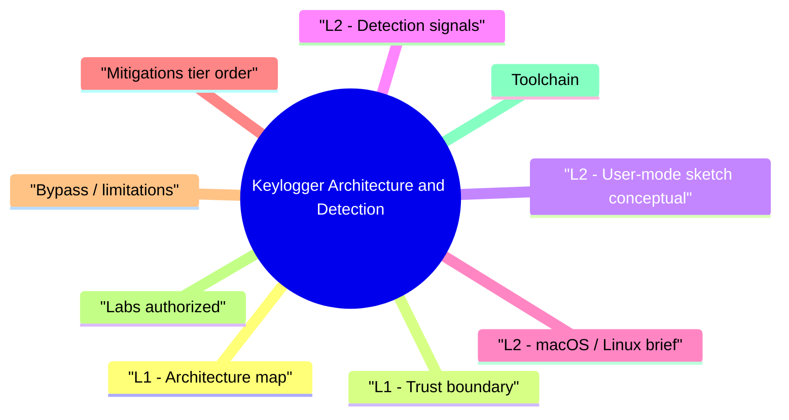

# Keylogger Architecture and Detection revision map

When a Keylogger Architecture and Detection follow-up lands, I want one page that still has the misconception and the VAPT step. I pulled headings from Critical Clarification Keylogger Architecture and Detection Misconceptions.md, Keylogger Architecture and Detection - Comprehensive Guide.md, Keylogger Architecture and Detection - Interview Questions & Answers.md, Keylogger Architecture and Detection - Quick Reference.md. If a heading is here, the guide still owns the detail.

## L1 - Architecture map

## L1 - Trust boundary
- OS input pipeline -> applications. Anything subscribed early in the pipeline sees keystrokes before app handlers in many designs.

## L2 - User-mode sketch (conceptual)
- Legitimate: accessibility software, RDP clients, hotkey managers.
- Malicious: injected DLL in every GUI process via hooks; persistence via Run keys or COM hijacks.

## L2 - Detection signals

## L2 - macOS / Linux (brief)
- macOS: Input Monitoring TCC prompt; evasion targets prompt fatigue.
- Linux: X11 key sniffing vs Wayland compositor model-different exposure.

## Mitigations (tier order)
- Least privilege; block unauthorized driver loads (HVCI, WDAC).
- EDR kernel telemetry + user hook visibility where available.
- Phishing-resistant MFA so stolen passwords hurt less.
- Physical security for high assurance workstations.
- Application password fields with secure desktop / isolated input (rare, specialized).

## Bypass / limitations
- Encrypted keystroke paths don't exist for legacy apps-focus on early detection.
- Hardware keyloggers bypass software entirely.

## Labs (authorized)
- Sysinternals Autoruns to see persistence.
- API Monitor on toy hook demos in VMs.

## Toolchain
- Sysmon (DLL loads), PE-sieve/similar concepts, EDR queries for hook modules, driver inventory tools.

## Interview clusters

## Authoritative references
- MITRE ATT&CK T1056 (Input Capture) and sub-techniques.
- Microsoft driver signing requirements.
- NIST guidance on insider threat and endpoint hardening.

## Cross-links
- EDR Evasion Awareness and Defense · Windows Security Boundaries · Initial Access and Attack Surface Entry

## Verification checklist
- [ ] Name two user-mode vs kernel detection differences.
- [ ] Explain why MFA still matters when passwords are keylogged.

## Recall list from Quick Reference

## Layers
- User hooks · UIA/screen · kernel filter · hardware · browser ext

## Detection
- Hook DLLs · injection · new drivers · Sysmon Image loads · extension policy

## Mitigation
- HVCI/driver policy · EDR · strong MFA · physical controls

## ATT&CK

## Cross-read
- EDR Evasion Awareness · Windows Security Boundaries

## One-liner

## Corrections I keep repeating

## "Antivirus always catches keyloggers."
- Reality: Signed or fileless variants evade static scans.

## "Kernel loggers are extinct."
- Reality: Abused where drivers can load; policy matters.

## "HTTPS stops keyloggers."
- Reality: TLS protects network; keyloggers read before encryption.

## "Screen keyboards are always safe."
- Reality: OSK can still be scraped or clicked by malware with access; raises bar, not absolute.

## "Only malware uses keyboard hooks."
- Reality: Legit assistive tech uses same APIs-context and reputation matter.

## "macOS TCC blocks all capture."
- Reality: Users approve prompts; fatigue and bundled malware exist.

## "Hardware keyloggers are fiction."
- Reality: Rare in enterprise but real in physical access scenarios.

## "Keyloggers only steal passwords."
- Reality: Tokens, PII, 2FA codes typed as SMS OTP, and clipboard sniffing expand impact.

## What I answer in 90 seconds

- Q: Why are kernel keyloggers harder to detect?
- Q: Can Wayland stop keyloggers?
- Q: Accessibility tool vs malware?

## 60-second answer
- Q: How do keyloggers work and how do you detect them?

## Architecture

## Enterprise

## Mock ladder

## Nearby reading in this repo

- Stay inside this folder for the long guide. Jump only when a section names a sibling topic.
- Cookie Security, CSRF, XSS, JWT, OAuth, and TLS show up as neighbors on a lot of these maps.
