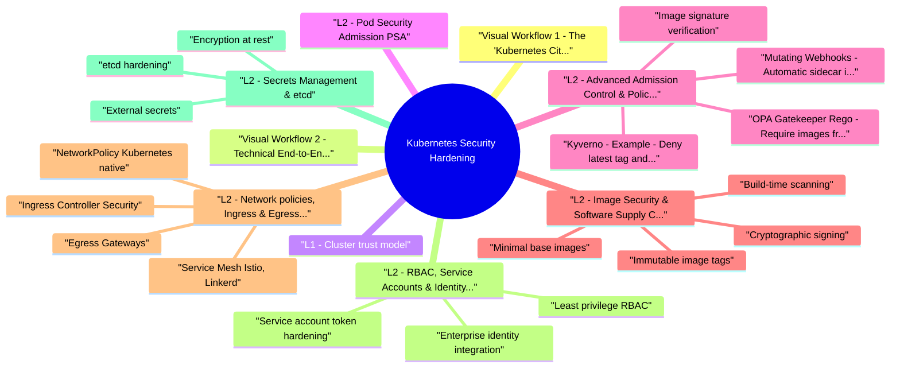

# Kubernetes Security Hardening revision map

Kubernetes Security Hardening in one sitting. That is the deal. I mined Critical Clarification Kubernetes Security Hardening Misconceptions.md, Kubernetes Security Hardening - Comprehensive Guide.md, Kubernetes Security Hardening - Interview Questions & Answers.md, Kubernetes Security Hardening - Quick Reference.md. The outline keeps every H2 I cared about from those files.

## Visual Workflow 1 - The "Kubernetes City" (Analogy)
- Think of Kubernetes as a giant smart city.
- City Hall (Control Plane) handles all requests and remembers everything.
- Apartment Buildings (Worker Nodes) host the actual living spaces (Pods).
- Phone Directory (Service) and Main Gate (Ingress) route traffic.
- Security Guards (the layers below) check IDs, enforce rules, and patrol the streets.

## Visual Workflow 2 - Technical End‑to‑End Map (Implementation -> Deployment -> Security)
- Top left to bottom right follows the path from raw infrastructure, through cluster provisioning, into deployment, and finally to the security layers that wrap every stage.
- Now that you have these two mental maps, the detailed sections that follow explain each security layer in depth.

## L1 - Cluster trust model
- Attacker goals: steal secrets from etcd/API, escalate privileges via mis‑configured RBAC, escape to the node, move laterally through a flat network, or inject malicious code through untrusted images.
- For a more intuitive understanding, refer back to the "Kubernetes City" diagram above: the API Server is the Front Desk, etcd is the City Memory, and the scheduler/controller manager are the City Planner and Repair Crew.

## L2 - Pod Security Admission (PSA)
- Replaces deprecated PodSecurityPolicy. Three enforcement levels per namespace:

## L2 - Advanced Admission Control & Policy as Code
- Admission controllers inspect and potentially mutate/reject API requests before they are persisted into etcd. Use them to enforce custom guardrails.
- Where do they sit in the technical workflow? Right after API authentication and authorization - see the Admission Controllers box in the end‑to‑end map.

### Kyverno - Example: Deny latest tag and require resource limits
- See the source section `Kyverno - Example: Deny latest tag and require resource limits` for the worked example.

### OPA Gatekeeper (Rego) - Require images from a trusted registry
- See the source section `OPA Gatekeeper (Rego) - Require images from a trusted registry` for the worked example.

### Mutating Webhooks - Automatic sidecar injection or default security contexts
- You can use a mutating admission webhook to:
- Inject an Istio sidecar proxy
- Add vault agent containers for secret injection
- Automatically set runAsNonRoot: true if not specified

### Image signature verification
- Both Kyverno and Gatekeeper can verify image signatures (e.g., Cosign) at admission time. Example Kyverno policy:

## L2 - Image Security & Software Supply Chain
- Before a pod runs, you must ensure the container image itself is trustworthy.
- In the end‑to‑end workflow, this starts in the CI/CD Pipeline (image build & scan) and continues through the Image Registry and Admission Controllers.

### Build‑time scanning
- Scan for CVEs with Trivy, Clair, or Snyk in the CI pipeline.
- Break the build on critical/high vulnerabilities (set a severity threshold).
- Generate a Software Bill of Materials (SBOM) for each image (CycloneDX, SPDX).

### Minimal base images
- Use distroless, scratch, or Alpine images.
- Remove shells, package managers, and unnecessary tools to reduce attack surface.

### Cryptographic signing
- Sign every image using Cosign (Sigstore).
- Store signing keys in a KMS or use keyless signing with OIDC.
- Verify signatures in the admission controller before the image runs.

### Immutable image tags
- Never use :latest in production.
- Use digest references (image@sha256:...) for guaranteed immutability.

### Private registry
- Store images in a private registry (Harbor, ECR, ACR, GCR).
- Use imagePullSecrets scoped to specific namespaces.
- Enable registry‑native vulnerability scanning as an extra layer.

### Admission policies
- Reject images from untrusted registries.
- Reject images with no digest or with mutable tags.
- Reject images whose vulnerability scan results exceed the allowed threshold (via scanner integration).

## L2 - Network policies, Ingress & Egress Security
- Network security must be enforced at multiple layers: intra‑cluster, ingress, and egress.

### NetworkPolicy (Kubernetes native)
- Default deny all ingress and egress, then explicitly allow what's needed.
- Example: allow only DNS, API server, and specific services.

### Ingress Controller Security
- Terminate TLS at the ingress point (use cert‑manager to automate certificates).
- Redirect HTTP to HTTPS.
- Configure WAF rules (e.g., ModSecurity with NGINX Ingress) or integrate a cloud WAF.
- Restrict access by IP whitelisting, OAuth2 proxy, or API keys.

### Egress Gateways
- Control outbound traffic to external services using a dedicated egress proxy or firewall (e.g., Istio Egress Gateway, Calico egress policies).
- Deny all egress by default and allow only approved endpoints (API endpoints, monitoring systems, etc.).

### Service Mesh (Istio, Linkerd)
- Enforce mTLS between all service‑to‑service communication automatically.
- Implement fine‑grained L7 authorization policies (e.g., allow GET but not POST).
- Enable observability and tracing with sidecars.

## L2 - RBAC, Service Accounts & Identity Federation

### Least privilege RBAC
- Use Roles (namespaced) and ClusterRoles sparingly.
- Never use cluster-admin for application workloads.
- Implement break‑glass procedures with audit logging for emergency access.

### Service account token hardening
- Disable auto‑mount of service account tokens unless the pod explicitly needs API access:
- Use bound service account tokens (TokenRequest API) that are time‑limited and audience‑scoped, not the legacy long‑lived secrets.
- Employ projected volumes to combine multiple token sources with a single file.

### Enterprise identity integration
- Integrate OIDC (Okta, Azure AD, Keycloak) for user authentication to the API server.
- Use IRSA (AWS) or Workload Identity (GCP/Azure) to give pods a cloud IAM role without static credentials.
- This eliminates the need to store cloud keys in Kubernetes Secrets.

## L2 - Secrets Management & etcd

### Encryption at rest
- Configure EncryptionConfiguration to encrypt secrets in etcd using a KMS plugin (AWS KMS, Azure Key Vault, HashiCorp Vault).
- Without this, secrets are stored as base64 (not encrypted) and can be read by anyone with etcd access.

### External secrets
- Never store secret YAML in Git.
- Use External Secrets Operator or Sealed Secrets to sync secrets from a central vault into Kubernetes.
- Alternatively, mount secrets directly into pods via CSI drivers (e.g., Vault CSI provider).

### etcd hardening
- Restrict etcd network access (dedicated network, firewall rules).
- Use mTLS for all communication with etcd.
- Perform regular encrypted backups.
- Enable audit logging on the API server to track who accesses secrets.

## L2 - Node & kubelet Hardening
- Disable anonymous auth on kubelet (--anonymous-auth=false).
- Disable the read‑only port (--read-only-port=0).
- Enable the NodeRestriction admission plugin to limit kubelet's ability to modify its own node object.
- Use a minimal OS (Bottlerocket, COS, Flatcar) with automated patching.
- Apply CIS Kubernetes Benchmark settings using kube-bench.

### Runtime detection on the node
- Deploy Falco (eBPF‑based) to detect:
- Unexpected shells in containers
- Privilege escalation attempts
- Unauthorized file access
- Outbound connections to suspicious IPs
- Forward Falco alerts to SIEM or notification channels.

## L2 - Multi‑tenant Isolation
- Namespace‑per‑tenant is the minimal baseline.
- Use virtual clusters (vCluster) for stronger isolation (separate control plane per tenant).
- Apply ResourceQuotas and LimitRanges to prevent noisy neighbours.
- Enforce NetworkPolicy per tenant namespace to isolate tenant workloads from each other.
- Use Cilium with L7 policies if fine‑grained API‑level isolation is needed.
- Consider node pools or taint/tolerations to physically separate sensitive tenants.

## L3 - Runtime Security & Continuous Monitoring

### Continuous vulnerability scanning
- Tools like Trivy Operator or Aqua continuously scan running images for newly disclosed CVEs.
- Trigger automated remediation (rolling restart or GitOps‑based update) when new critical CVEs appear.

### Log anomaly detection
- Aggregate all cluster logs (control plane, kubelet, application) with EFK or Loki.
- Create alerts for security events:
- RBAC violations
- Secrets access
- exec into containers
- Pods running as root (if slipped past admission)
- Integrate with SIEM (Splunk, ELK, etc.).

### Monitoring & metrics
- Use Prometheus / Grafana to monitor:
- Pod restarts
- Error rates (5xx)
- Unusual network traffic spikes
- Set alerts on deviations from baselines (e.g., an application pod suddenly making outbound SSH connections).

### Automated rollback
- In a GitOps workflow (Flux, ArgoCD), if a deployment violates a policy or health check after rollout, the GitOps operator can auto‑rollback to the previous revision.
- All of this corresponds to the Runtime Security & Monitoring layer in the end‑to‑end security box - the final safety net.

## L3 - CI/CD & Supply Chain Security (Shift‑Left)
- Scan manifests in the CI pipeline using Kubescape, Polaris, or Datree to catch misconfigurations before they are applied.
- Run admission policy dry‑runs (Kyverno CLI, kubectl --dry-run=server) against all manifests.
- Enforce Git branch protection, code review, and signed commits.
- Use OCI‑compliant registries and attestation (SLSA provenance) to verify build integrity.
- Integrate SBOM collection into the build and store it for vulnerability tracking.

### Example CI step (GitHub Actions)
- See the source section `Example CI step (GitHub Actions)` for the worked example.

## L3 - Verification & Compliance
- kube‑bench: Checks against CIS Kubernetes Benchmark.
- kubectl auth can-i: Manually audit permissions.
- Kubescape / Polaris / Datree: Automated scanning of cluster and manifests.
- Falco audit: Ensure runtime rules are active.
- Chaos tests: Simulate lateral movement - a pod without NetworkPolicy should not be able to connect to a secure service.
- Penetration testing: Use kube-hunter to find internal attack vectors.

## Interview clusters

## Cross‑links
- Container Security
- Cloud Attack Paths
- PKI Program Design
- Secrets Management and Key Lifecycle
- CI/CD Security & GitOps
- Zero Trust Architecture

## Pocket list

## Must-haves
- PSA restricted · Admission policies · NetworkPolicy default-deny · RBAC least privilege · etcd encryption

## PSA labels
- pod-security.kubernetes.io/enforce: restricted

## Policy engines

## SA hardening
- automountServiceAccountToken: false · bound tokens · minimal Role

## Verification
- kube-bench · Kubescape · Polaris · kubectl auth can-i

## Runtime

## Cross-reads
- Container Security · Cloud Attack Paths · PKI Program Design

## The clarification file, compressed

## "Kubernetes is secure by default."
- Wrong. Default allows wide RBAC mistakes, no NetworkPolicy, and privileged pods unless PSA/policies applied.

## "NetworkPolicy optional if we have a firewall."
- Wrong. East-west traffic inside cluster needs CNI policy-perimeter firewall doesn't see pod-to-pod.

## "Running as root in container is fine if cluster is private."
- Wrong. Container escape or supply-chain RCE -> root on node amplifies impact.

## "Service account tokens are harmless."
- Wrong. Default tokens may call Kubernetes API-scope RBAC and automount: false when unused.

## "Admission controllers slow clusters too much."
- Wrong. Policy at admit time prevents thousands of bad pods-optimize hot paths, cache policies.

## "Container Security guide covers all K8s."
- Wrong. Container guide covers images/runtime; this module covers cluster primitives (PSA, RBAC, NetworkPolicy, etcd).

## Oral prompts worth repeating

- OPA Gatekeeper vs Kyverno?
- Pod compromised-what limits damage?
- Authoritative references

## 60-second answer
- Q: How do you harden a Kubernetes cluster for production?

### PSA vs PSP?
- A: PodSecurityPolicy deprecated; Pod Security Admission uses namespace labels (enforce/audit/warn) with restricted/baseline/privileged levels.

### Pod compromised-what limits damage?
- A: NetworkPolicy egress deny, non-root + read-only rootfs, minimal SA RBAC, no hostPath, metadata service not reachable from user-controlled fetchers, secrets not in env (prefer CSI with rotation).

## What sits next to this topic

- Stay inside this folder for the long guide. Jump only when a section names a sibling topic.
- Cookie Security, CSRF, XSS, JWT, OAuth, and TLS show up as neighbors on a lot of these maps.
