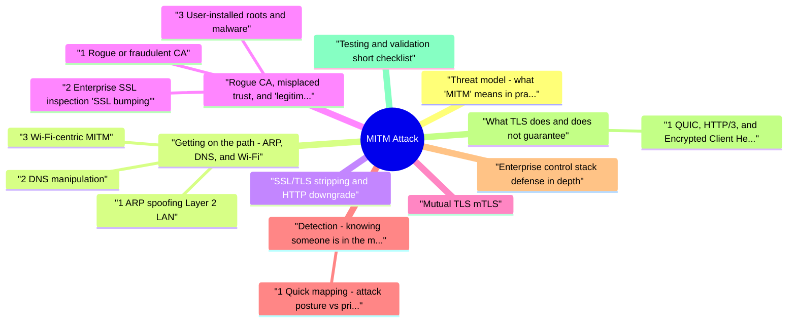

# MITM Attack revision map

MITM Attack in one sitting. That is the deal. I mined Critical Clarification MITM Attack Misconceptions.md, MITM (Man-in-the-Middle) Attack - Comprehensive Gu.md, MITM Attack - Interview Questions & Answers.md, MITM Attack - Quick Reference.md. The outline keeps every H2 I cared about from those files.

## Threat model: what "MITM" means in practice
- A man-in-the-middle adversary can observe, relay, and sometimes modify traffic between endpoints. Outcomes include credential theft, session hijacking, content injection, and silent downgrade of security assumptions.
- The attacker's job is twofold: be on the path (network layer) and win the trust negotiation (cryptographic / UX layer), or avoid TLS entirely (stripping, cleartext legacy).

## Getting on the path: ARP, DNS, and Wi‑Fi

### 1 ARP spoofing (Layer 2 LAN)
- On IPv4 Ethernet LANs, hosts resolve IP -> MAC via ARP. ARP is generally unauthenticated; gratuitous ARP replies can poison neighbor caches.
- What attackers gain: A choke point for cleartext protocols and for TLS interception if they can present a certificate the client trusts (see §4).

### 2 DNS manipulation
- If the attacker steers the client to the wrong IP, many applications follow-before TLS can save the user if the user connects to the attacker's host and trusts its certificate.
- Spoofed responses on the LAN (rogue DHCP options pointing to attacker DNS, or MITM on DNS queries).
- Compromised resolver or resolver configuration on the endpoint.
- Malware altering hosts or system resolver policy.

### 3 Wi‑Fi-centric MITM
- Evil twin / rogue AP: A network with the same or plausible SSID lures clients. Combined with open or weak authentication, the attacker is the first hop.
- Captive portals: Users are trained to click through warnings; attackers mimic portal flows to harvest credentials or push malicious profiles.

## SSL/TLS stripping and HTTP downgrade
- SSL stripping is an active attack: the attacker keeps a plaintext session with the victim while speaking TLS upstream to the real site (or blocks upgrade), often rewriting links and Location headers.
- Why it works: If the user first hits http:// or if any subresource or redirect path allows HTTP, the attacker can keep the browser on HTTP long enough to steal cookies or credentials sent in cleartext.

## Rogue CA, misplaced trust, and "legitimate" interception

### 1 Rogue or fraudulent CA
- If an attacker obtains a publicly trusted certificate for your hostname (compromised CA, mis-issued cert, weak validation workflows), browsers will not warn-classic silent MITM at scale.
- Certificate Transparency (CT) logs and monitoring for unexpected certs.
- CAA DNS records to constrain which CAs may issue for your zone.
- Short-lived certificates and automated rotation (ACME).
- Certificate pinning (careful rollout; pinning wrong keys bricks apps)-often replaced in browsers by expect-ct era patterns; mobile apps may still pin SPKI hashes.

### 2 Enterprise SSL inspection ("SSL bumping")
- Corporate proxies terminate TLS, inspect, and re-encrypt with an internal issuing CA whose root is installed in the enterprise trust store. Functionally this is authorized MITM for managed devices.

### 3 User-installed roots and malware
- See the source section `3 User-installed roots and malware` for the worked example.

## Mutual TLS (mTLS)
- mTLS authenticates both client and server with X.509 certificates. It is widely used for service-to-service APIs, meshes, and high-assurance B2B integrations.
- Against network-only attackers who lack a client cert and a server-trusted client identity, mTLS raises the bar substantially.
- It does not help if the attacker is the client (stolen key), if private keys leak, or if verification is misconfigured (e.g., skipping hostname checks, overly broad SANs, shared weak CAs).

## Detection: knowing someone is in the middle
- ARP/DHCP anomalies: sudden gateway MAC changes, duplicate IPs, DHCP exhaustion patterns.
- TLS fingerprinting / JA3-style signals (where legal and privacy-reviewed) for unexpected middleboxes.
- NetFlow / Zeek (Bro) / NDR alerts for internal hosts acting as routers or unusual proxy traffic.
- East-west flows that should not exist: a workstation suddenly accepts forwarded sessions from peers (possible Internet Connection Sharing abuse or malware).
- Latency step-changes on TLS handshakes when paths move through an unauthorized proxy.
- Unexpected system proxy or WPAD changes.
- New root certificates or TLS interception products.
- Browser certificate errors spikes (often ignored-correlate with helpdesk tickets).

### 1 Quick mapping: attack posture vs primary controls
- See the source section `1 Quick mapping: attack posture vs primary controls` for the worked example.

## Enterprise control stack (defense in depth)
- Zero Trust pattern: Assume the local network is hostile; require authenticated, encrypted channels to apps and continuous verification rather than perimeter trust alone.

## What TLS does and does not guarantee
- TLS provides: Confidentiality and integrity on the wire between endpoints that successfully authenticate the peer per the client's trust rules.

### 1 QUIC, HTTP/3, and Encrypted Client Hello (ECH)
- See the source section `1 QUIC, HTTP/3, and Encrypted Client Hello (ECH)` for the worked example.

## Testing and validation (short checklist)
- Confirm no sensitive paths on HTTP; verify HSTS headers and preload policy if used.
- From an external vantage, review chain, CT presence, CAA, and revocation behavior.
- In enterprise environments, document SSL inspection scope and break-glass procedures.
- Red-team LAN scenarios (authorized tests): ARP positioning + strip attempt vs HSTS-enabled site; measure user agents and mobile apps separately.

## Related network-scale positioning (context)
- Cellular IMSI catchers coerce phones onto rogue base stations; mitigations include user education, carrier features, and app-layer crypto with key continuity policies-not something a typical web property solves alone.

## Application-layer parallels (not "wire" MITM but same outcomes)
- Malicious browser extensions with broad permissions can read and alter page content. Enterprise extension allow lists and split tunnel policies reduce exposure.

## HSTS deployment playbook (operational detail)
- Serve HTTPS broadly; fix mixed content and canonical URLs.
- Emit a short max-age HSTS while monitoring broken clients or hard-coded HTTP.
- Increase max-age to one year or longer; add includeSubDomains when child hosts are ready.
- Optionally pursue preload after verifying redirect chains and no unintended HTTP dependencies.
- max-age: how long the UA must refuse cleartext to this host.
- includeSubDomains: applies policy to all subdomains-misconfiguration can brick internal tools on HTTP.
- preload: browsers ship a hard-coded list; removal is slow-treat as irreversible until browsers refresh.

## mTLS in platforms (Kubernetes, service mesh, APIs)
- API gateways: Offload client cert validation, map issuer -> consumer, and apply rate limits and scopes after TLS handshake success.
- Accepting any cert signed by a broad internal CA without SPIFFE/SAN scoping.
- CRL/OCSP disabled everywhere, so revoked certs still work until gateway config is fixed.
- Shared private keys across environments (dev/stage/prod)-one leak compromises all.

## SSL inspection governance

## Wi‑Fi hardening checklist (concise)
- Prefer WPA3; for enterprise, 802.1X with EAP methods that validate server certificates on clients.
- Guest network isolation from corporate VLANs; captive portal on a dedicated SSID with clear branding.
- Disable legacy protocols where possible; patch AP firmware for known attacks against older WPA implementations.
- For remote workers, always-on device tunnel to corporate ZTNA or VPN for access to sensitive apps-treat home Wi‑Fi as untrusted.

## ARP/DNS lab indicators (for blue teams)
- Gratuitous ARP bursts correlating with gateway MAC changes on workstations.
- DHCP ACK offering non-standard DNS or gateway addresses.
- DNS responses with TTL anomalies or answers from unexpected authorities when validation is off.

## Certificate validation anti-patterns (where MITM survives TLS)
- TLS only works when endpoint identity checks are implemented correctly. Common failures:
- Mobile/backend clients disable certificate verification for convenience in test code and accidentally ship it.
- Hostname validation skipped while still validating certificate chain.
- Over-broad trust bundles (accepting internal test roots in production apps).
- Pinned-key rollout mistakes causing emergency bypass toggles that permanently weaken trust.
- Enforce verification in shared HTTP/TLS client libraries with no insecure toggle in production builds.
- Gate CI on static checks for verify=false/insecureSkipVerify-style flags.
- Separate dev/stage/prod trust anchors and automate trust-store hygiene with MDM/platform policies.

## Pocket list

## MITM Attack Types

### Network-Level MITM
- ARP spoofing
- DNS spoofing
- BGP hijacking
- Rogue access points

### Application-Level MITM
- HTTPS interception with fake certificates
- Proxy attacks
- SSL/TLS stripping

### Browser-Level MITM (MITB)
- Browser extensions
- Malicious plugins
- Keyloggers
- Session hijackers

## Common Attack Techniques
- ARP Spoofing: Fake ARP messages redirecting traffic
- DNS Spoofing: False DNS responses redirecting users
- SSL/TLS Stripping: Downgrade HTTPS to HTTP
- Certificate Spoofing: Fake SSL/TLS certificates
- Rogue Access Points: Fake Wi-Fi access points

## MITM Protection Checklist
- Use HTTPS/TLS (primary defense)
- Implement certificate pinning
- Use HSTS (HTTP Strict Transport Security)
- Validate certificates (don't accept invalid)
- Use VPN on untrusted networks
- Use DNSSEC
- Avoid public Wi-Fi for sensitive operations
- Network monitoring and detection

## Risk Levels

## Key Points
- HTTPS doesn't completely prevent MITM
- Certificate validation is critical
- Defense in depth approach needed
- MITM can occur on any network
- Detection is difficult

## The clarification file, compressed

## ️ Common Misconceptions

### "HTTPS completely prevents MITM attacks"
- Truth: HTTPS provides strong protection but does not completely prevent MITM attacks. Attackers can still use various techniques.
- MITM Techniques That Work Against HTTPS:
- Certificate Authority Compromise:
- Attacker compromises trusted CA
- Issues valid certificate for target domain
- Browser trusts certificate
- Self-Signed Certificate Injection:
- Attacker injects self-signed certificate

### "MITM attacks only work on unencrypted connections"
- Truth: MITM attacks can work on both encrypted and unencrypted connections, using different techniques.
- Attacker intercepts plaintext traffic
- Can read and modify all data
- Attacker uses certificate compromise
- Or uses man-in-the-browser techniques
- Or exploits implementation vulnerabilities

### "MITM attacks only happen on public Wi-Fi"
- Truth: MITM attacks can occur on any network, including:
- Public Wi-Fi (common)
- Corporate networks
- Home networks (if compromised)
- Mobile networks (IMSI catchers)
- Wired networks (if attacker has access)
- Rogue access points (public Wi-Fi)
- ARP spoofing (local network)

### "VPNs completely prevent MITM attacks"
- Truth: VPNs provide protection but don't completely prevent MITM attacks.
- Encrypts traffic between client and VPN server
- Prevents ISP/local network MITM
- Protects against Wi-Fi MITM
- Doesn't protect against browser-level MITM (malware)
- VPN provider could perform MITM
- Certificate compromise can still work
- VPN connection itself can be attacked

### "MITM attacks are easy to detect"
- Truth: MITM attacks can be very difficult to detect, especially for non-technical users.
- No obvious indicators
- Certificate warnings can be ignored
- Traffic appears normal
- Performance impact may be minimal
- Users may not understand warnings
- Certificate validation
- Certificate pinning

## Key Takeaways

### Understanding
- HTTPS doesn't completely prevent MITM - certificate compromise, MITB attacks still possible
- MITM works on encrypted connections - using certificate compromise or MITB
- MITM isn't limited to public Wi-Fi - any network can be compromised
- VPNs don't completely prevent MITM - browser-level attacks, VPN provider risks
- MITM is hard to detect - often invisible to users

### Common Mistakes
- Assuming HTTPS prevents all MITM attacks
- Thinking MITM only works on HTTP
- Believing MITM only happens on public Wi-Fi
- Assuming VPNs prevent all MITM attacks
- Thinking MITM is easy to detect

## Summary Table
- Remember: MITM attacks can occur on any network and even with HTTPS. Use certificate validation, pinning, HSTS, and network security measures for defense in depth!

## Oral prompts worth repeating

- What is a man-in-the-middle (MITM) attack?
- Does HTTPS "solve" MITM?
- Network-layer positioning
- How does ARP spoofing enable a MITM on a LAN?
- How can DNS be abused for MITM?
- What is an "evil twin" Wi‑Fi attack?
- TLS downgrade, trust, and policy
- Explain SSL stripping and how HSTS mitigates it.
- What is a rogue CA scenario, and how do organizations detect it?
- How does enterprise SSL inspection relate to MITM?
- When is mutual TLS (mTLS) an appropriate MITM defense?
- Detection and response
- What telemetry suggests an active MITM on an internal network?
- A user must use hotel Wi‑Fi for work. What guidance do you give?
- Depth: controls and tradeoffs
- What are the tradeoffs of certificate pinning in mobile apps?
- How does HSTS preload differ from ordinary HSTS?
- Does DNS over HTTPS (DoH) stop MITM?
- What enterprise controls complement TLS for MITM resistance?
- Why can malware still defeat TLS?
- How would you test MITM defenses in an authorized assessment?
- Give a concise "defense in depth" summary for MITM.
- What is WPAD abuse, and how does it relate to MITM?
- Contrast passive eavesdropping vs active MITM on an encrypted web session.

## Fundamentals

### Does HTTPS "solve" MITM?
- See the source section `Does HTTPS "solve" MITM?` for the worked example.

### What is an "evil twin" Wi‑Fi attack?
- See the source section `What is an "evil twin" Wi‑Fi attack?` for the worked example.

### Give a concise "defense in depth" summary for MITM.
- See the source section `Give a concise "defense in depth" summary for MITM.` for the worked example.

## Depth: Interview follow-ups - MITM
- Authoritative references: TLS 1.3 RFC 8446; OWASP Transport Layer Protection Cheat Sheet.
- TLS alone doesn't fix phishing - distinguish network adversaries vs malicious or misplaced trust anchors.
- Certificate validation failures - custom trust stores in mobile apps and SSL inspection roots.
- HSTS - downgrade resistance, not a substitute for server-side authn/z or endpoint integrity.

## What sits next to this topic

- Stay inside this folder for the long guide. Jump only when a section names a sibling topic.
- Cookie Security, CSRF, XSS, JWT, OAuth, and TLS show up as neighbors on a lot of these maps.
