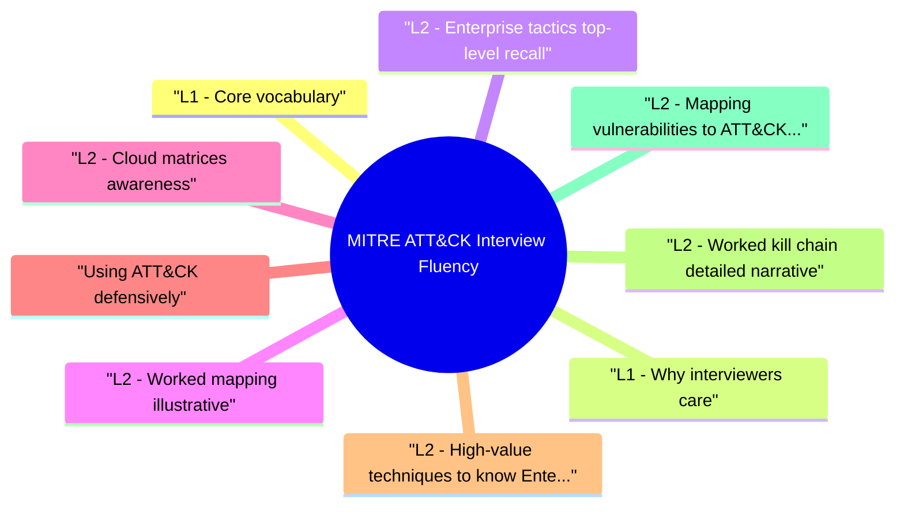

# MITRE ATT&CK (Interview Fluency) revision map

MITRE ATT&CK (Interview Fluency) in one sitting. That is the deal. I mined Critical Clarification MITRE ATTACK Interview Fluency Misconceptions.md, MITRE ATTACK Interview Fluency - Comprehensive Guide.md, MITRE ATTACK Interview Fluency - Interview Questions & Answers.md, MITRE ATTACK Interview Fluency - Quick Reference.md. The outline keeps every H2 I cared about from those files.

## L1 - Core vocabulary

## L1 - Why interviewers care
- Shared language across red, blue, CTI, and GRC.
- Prevents vague answers ("they hack us") by forcing behavioral precision.
- Supports metrics: coverage of techniques with detections / prevent controls.

## L2 - Enterprise tactics (top-level recall)
- You don't memorize IDs in order; you storyboard an attack chronologically.

## L2 - Worked mapping (illustrative)
- Phishing attachment -> macro execution (Execution) -> registry run key (Persistence) -> LSASS access (Credential Access) -> RDP lateral movement (Lateral Movement) -> S3 sync (Exfiltration).
- Interview tip: Say tactic names, then example techniques you're confident about.

## L2 - Cloud matrices (awareness)
- Separate matrices for AWS, Azure, GCP, SaaS-technique IDs differ from Enterprise Windows. Interview: "I'd open the cloud matrix relevant to our estate."

## Using ATT&CK defensively
- Detection engineering: pick high-risk techniques for your threat model, map data sources, write rules, measure coverage.
- Purple team: atomic tests validate sensor visibility.
- Architecture reviews: "Does this design close T1078 paths?"

## L2 - High-value techniques to know (Enterprise, sample IDs)
- Interviewers often probe recognizable IDs-verify current names on attack.mitre.org:
- Sub-techniques matter: T1078.004 Cloud Accounts vs T1078.002 Domain Accounts-different detections.

## L2 - Worked kill chain (detailed narrative)
- Scenario: Phishing doc -> macro -> persistence -> credential theft -> lateral -> exfil
- Interview tip: Walk chronologically; admit uncertainty on exact sub-technique ID rather than guess.

## L2 - Mapping vulnerabilities to ATT&CK (without over-precision)
- Say: "The CVE is the entry primitive; ATT&CK describes behaviors after foothold."

## L2 - ATT&CK Navigator and coverage layers
- ATT&CK Navigator heatmaps show detection/prevention coverage per technique.
- Blue layer: detections implemented
- Purple layer: atomic tests passed
- Gap layer: no data source

## L2 - Cloud and SaaS matrices
- Enterprise matrix alone misses control plane attacks-name the correct matrix in interviews.

## L2 - D3FEND relationship (brief)
- MITRE D3FEND maps defensive techniques to counter offensive techniques (e.g., Network Traffic Analysis counters C2). Useful for architecture interviews linking control to ATT&CK technique.

## L3 - Detection engineering workflow with ATT&CK
- Pick threat (ransomware affiliate, insider, nation-state cloud).
- Select 10-20 techniques from intel reports.
- Map data sources (Sysmon, CloudTrail, IdP logs).
- Write Sigma/KQL rules; tag with technique ID.
- Atomic test -> measure true positive in lab.
- Tune false positives; document coverage in Navigator.

## L3 - Common interview pitfalls
- Confusing CVE with technique-map exploit outcomes to tactics, not 1:1 ID.
- Claiming 100% ATT&CK coverage-impossible and not the goal.
- Ignoring procedures-real detections target behaviors, not IDs alone.

## Toolchain
- ATT&CK Navigator (layer coverage) · Atomic Red Team · Sigma rules tagged with techniques · CTI feeds referencing T-codes

## Authoritative reference
- Official site: https://attack.mitre.org/

## Cross-links
- Threat Modeling · Security Observability and Detection Engineering · Active Directory Attacks · Cloud Attack Paths

## Verification checklist
- [ ] Define procedure vs technique in your own words.
- [ ] Storyboard one attack with ≥5 tactics in order.

## Pocket list

## Vocabulary
- Tactic (goal/phase) -> Technique (method) -> Sub-technique -> Procedure (specific play)

## Enterprise tactic chain (memorize order)
- Recon -> Resource Dev -> Initial Access -> Execution -> Persistence -> Priv Esc -> Defense Evasion -> Credential Access -> Discovery -> Lateral Movement -> Collection -> C2 -> Exfil -> Impact

## How to answer "map this incident"
- Initial foothold tactic
- Persistence/priv if any
- Credential / lateral
- Objective (exfil, ransom, fraud)

## Defender uses
- Navigator layers · detection prioritization · purple atomic tests · CTI mapping

## Links
- attack.mitre.org · ATT&CK Navigator (offline-friendly exports)

## Cross-read
- Security Observability and Detection Engineering · Threat Modeling · Active Directory Attacks

## One-liner

## The clarification file, compressed

## "Memorize all technique IDs."
- Reality: Fluency is storyboarding and mapping-IDs are lookup keys, not flashcards for 900+ rows.

## "ATT&CK is only for SOC analysts."
- Reality: Architects, AppSec, and CTI all use it for shared vocabulary.

## "Full matrix coverage is the goal."
- Reality: Prioritize techniques matching your adversaries and architecture-breadth without depth wastes time.

## "Techniques imply intent."
- Reality: Legitimate admin actions overlap techniques-context separates abuse.

## "ATT&CK replaces CVE tracking."
- Reality: Complementary-patch management and behavior detection solve different facets.

## "Cloud matrix is identical to Enterprise."
- Reality: Different techniques and scopes-use the right matrix.

## "If a technique isn't listed, it's not a risk."
- Reality: ATT&CK is living and not exhaustive-novel behaviors exist.

## "Mitigations in ATT&CK are complete."
- Reality: They're starting points-vendor hardening and app design still required.

## "Purple team = run every atomic test."
- Reality: Risk-based selection and rollback plans matter-safety first.

## "ATT&CK is trademark-free to use loosely."
- Reality: MITRE trademark guidelines apply to naming in products/marketing-respect attribution in commercial contexts.

## Oral prompts worth repeating

- Q: Tactic vs technique?
- Q: Is ATT&CK a compliance framework?
- Q: How would you measure detection coverage?
- Q: CVE-XXXX maps to which technique?

## 60-second answer
- Q: What is MITRE ATT&CK and how do you use it in security work?

## Vocabulary

## Application

## Mock ladder

## What sits next to this topic

- Stay inside this folder for the long guide. Jump only when a section names a sibling topic.
- Cookie Security, CSRF, XSS, JWT, OAuth, and TLS show up as neighbors on a lot of these maps.
