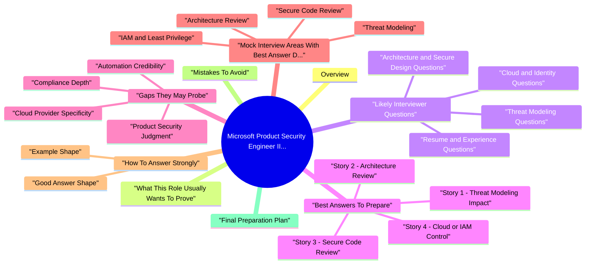

# Microsoft Product Security Engineer II Interview Prep revision map

I keep this Microsoft Product Security Engineer II Interview Prep map for the night before a screen, when five markdown files is too many clicks. Built from Microsoft Product Security Engineer II Interview Prep - Comprehensive Guide.md, Microsoft Product Security Engineer II Interview Prep - Mastery Track.md, Microsoft Product Security Engineer II Interview Prep - Interview Questions & Answers.md, Microsoft Product Security Engineer II Interview Prep - Quick Reference.md. Twenty minutes. Then I close the laptop.

## Overview
- This guide is designed for a Product Security Engineer II style interview loop, especially one centered on:
- Threat modeling
- Secure design and architecture review
- Cloud security and IAM
- Secure-by-default engineering
- Automation and engineering enablement
- Cross-functional influence

## What This Role Usually Wants To Prove
- Interviewers for this type of role are usually trying to answer five questions:
- Can you identify meaningful product risk early?
- Can you reason about architecture, not only vulnerabilities?
- Can you work effectively with engineering teams?
- Can you scale security through process and automation?
- Can you explain trade-offs clearly under pressure?
- Here is the risk
- Here is how I analyzed it

## Likely Interviewer Questions

### Resume and Experience Questions
- These questions test whether your resume claims hold up under technical discussion.
- Walk me through your background and how you moved into product security.
- Which project best represents your product security work?
- Tell me about a time you influenced a design decision before release.
- Tell me about a time you had to disagree with engineers or PMs.
- What part of your background most prepares you for this role?
- Which achievement on your resume are you most proud of?

### Threat Modeling Questions
- How do you run a threat modeling session?
- How do you identify trust boundaries and critical assets?
- Which frameworks do you use and why?
- How do you prevent threat modeling from turning into a documentation exercise?
- Tell me about a threat model that changed the product design.

### Architecture and Secure Design Questions
- How do you review an API-based or microservices architecture?
- What makes a flaw a design issue instead of only a code issue?
- How do you evaluate identity flows, privilege boundaries, and secrets handling?
- What does secure-by-default mean in practice?
- How would you review a regulated workload handling sensitive data?

### Cloud and Identity Questions
- How do you secure workloads in cloud environments?
- What are managed identities and when would you prefer them?
- How do you apply least privilege for both humans and services?
- What cloud misconfigurations create the most serious risk?
- How do you think about network isolation and internal trust assumptions?

### Code Review and Engineering Questions
- How do you perform a secure code review?
- What do you check first in authentication and authorization code?
- How do you review CI/CD or IaC changes from a security perspective?
- How do you distinguish between low-value noise and important issues?

### Automation and Scale Questions
- What have you automated in security?
- How would you scale threat modeling or compliance checks across teams?
- What lightweight tooling would you build first if the security team was overloaded?
- How would you use AI to accelerate security review safely?

### Behavioral and Collaboration Questions
- Tell me about a time you influenced without authority.
- Tell me about a time your recommendation was initially rejected.
- How do you prioritize when multiple teams need help at the same time?
- How do you explain security risk to non-security stakeholders?

## Best Answers To Prepare
- You do not need a perfect answer for every question. You need strong repeatable stories.

### Story 1: Threat Modeling Impact
- reviewed a feature or architecture early
- identified an attack path or trust boundary issue
- changed a design decision
- reduced risk before release
- you can operate early in the SDLC
- you think structurally
- you help teams make better design choices

### Story 2: Architecture Review
- assessed APIs, services, tokens, secrets, or trust assumptions
- identified a design-level weakness
- proposed a practical mitigation
- helped the team adopt it
- you can reason beyond individual bug classes
- you understand identity, boundaries, and secure defaults

### Story 3: Secure Code Review
- reviewed code manually or with tool support
- found a meaningful issue
- explained risk clearly
- helped drive remediation
- engineering depth
- practical vulnerability analysis
- balanced judgment

### Story 4: Cloud or IAM Control
- secrets removal
- service identity
- permission reduction
- segmentation or isolation
- storage / key / certificate hardening
- you can secure infrastructure realities, not only application logic

### Story 5: Automation
- wrote a script, check, report, query, or lightweight workflow
- reduced manual review effort
- improved consistency or visibility
- helped security scale
- you think like an engineer, not only a reviewer

### Story 6: Influence and Trade-Offs
- a team wanted speed or convenience
- your security recommendation created friction
- you found a practical path forward
- the relationship stayed strong
- maturity
- influence
- realistic security judgment

## Gaps They May Probe
- Even if your overall profile is strong, interviewers may intentionally probe areas where candidates often sound broad but not deep.

### Cloud Provider Specificity
- If the JD leans toward Azure, they may ask for concrete thinking about:
- managed identity
- workload identity
- network isolation
- secretless authentication
- Defender for Cloud style posture checks
- service-to-service trust

### Compliance Depth
- how controls map into engineering behavior
- how evidence is gathered
- how secure design supports compliance without becoming checkbox-only work
- start with risk
- map to control intent
- explain technical implementation
- explain validation

### Automation Credibility
- Many candidates say they automated security but cannot describe:
- workflow integration
- measurable value

### Product Security Judgment
- when to block release
- when to accept risk
- how to prioritize findings
- how to separate theoretical risk from realistic abuse

### Scenario Depth
- You may be given vague scenarios on purpose. Interviewers want to see whether you can create structure under ambiguity.
- Clarify scope -> identify assets -> identify trust boundaries -> state assumptions -> rank risks -> propose controls -> explain trade-offs

## Mock Interview Areas With Best Answer Direction

### Threat Modeling
- mention scope, assets, data flow, trust boundaries
- use STRIDE or equivalent structure
- prioritize based on realistic impact and likelihood
- track mitigation owners and follow-up

### Architecture Review
- start with system purpose and exposure
- examine ingress, egress, identity, data handling, secrets, dependencies, logging
- look for broken trust assumptions
- recommend secure-by-default changes first

### IAM and Least Privilege
- separate user identity from workload identity
- remove shared credentials where possible
- reduce permissions to task-specific access
- validate through logs, policy review, and testing

### Secure Code Review
- explain how you target high-risk code paths first
- focus on auth, access control, input handling, sensitive operations, secrets, and logging
- emphasize context, exploitability, and remediation quality

### Automation
- describe what problem was repetitive
- explain what data you collected
- explain how your logic reduced manual effort
- include adoption or outcome if possible

### Collaboration
- show respect for engineering constraints
- explain how you framed risk in business and technical terms
- show that you aim for adoption, not only correctness

## How To Answer Strongly

### Good Answer Shape
- Give a direct answer first
- Add a short structure or framework
- Use one concrete example
- Close with the outcome or trade-off

### Example Shape
- See the source section `Example Shape` for the worked example.

## Mistakes To Avoid
- Over-answering with theory and no example
- Turning every answer into a list of OWASP vulnerabilities
- Recommending maximum security without rollout realism
- Sounding adversarial toward engineering teams
- Talking about tools more than judgment
- Using vague statements like I improved security without explaining how

## Final Preparation Plan
- Before the interview, make sure you can do the following without notes:
- explain your background in 90 seconds
- explain threat modeling in 2 minutes
- describe 3 design review examples
- describe 1-2 automation examples
- explain least privilege, managed identity, network isolation, and secure defaults
- answer one disagreement / stakeholder influence question clearly
- answer one risk prioritization question with nuance

## Depth: What "Complete" Coverage Looks Like (Interview-Complete, Not Encyclopedia-Complete)

### A. Threat modeling - follow-up chain (what they ask next)
- Depth move: distinguish threat (intent + capability) from vulnerability (weakness) from risk (business outcome). Misusing these terms loses credibility fast.

### B. Architecture review - checklist you can say in under 90 seconds
- Purpose and exposure - Internet-facing? Admin path? Partner API?
- Identity - Human vs workload; how is identity established, propagated, revoked?
- Authorization - Object-level? Tenant isolation? Admin vs user? Consistency across APIs.
- Secrets - Static keys vs workload identity; rotation story; who can read secrets in prod?
- Data - Classification, encryption at rest, key custody, logs (no secrets), backups.
- Dependencies - Upstream services, third-party callbacks, supply chain updates.
- Failure modes - Degrade safely? Blast radius if one service is owned?
- Observability - What proves an attack happened or failed?

### C. Azure-aligned depth (patterns, not SKU memorization)
- Map your experience to control patterns interviewers expect for Microsoft-flavored loops:
- If you do not use Azure daily: say "The pattern is X; in Azure that often shows up as Y-I would verify exact names in docs."

### D. Product security judgment - release and exceptions (deep)
- Block when: realistic abuse path + high impact + no acceptable compensating control + cannot bound blast radius in time.
- Do not block by default when: issue is theoretical, hard to reach, or has strong compensating controls-then document leftover risk, owner, expiry, telemetry.

### E. Staff-level prompts (brief direction)
- Metrics: MTTR for security findings, % services with workload identity, critical misconfig backlog trend-not vanity counts.
- Programs: How would you scale design review without becoming a bottleneck? (Tiers, office hours, guardrails, templates, champions.)
- Multi-team conflict: Two VPs want different risk posture-how do you align? (Shared threat model, single risk register, executive summary of trade-offs.)

### F. Cross-cutting topics to mention with one crisp sentence each
- Supply chain: Trusted publishers, lockfiles, SBOM usage, build provenance, pipeline permissions.
- AI in the product: Data exfiltration via prompts, tool abuse, retention, human review for high-risk actions.
- Privacy / residency: Where data lives, cross-border replication, key location, customer commitments.

## Interview clusters (meta)
- Fundamentals: "Why product security vs central AppSec?" "What is threat modeling in one minute?"
- Senior: "Tell me about a design you changed pre-launch-constraints and outcome." "How do you measure a security program?"
- Staff: "Two teams ship conflicting controls-how do you arbitrate?" "How do you scale design review without blocking everyone?"

## Cross-links
- Threat Modeling, Zero Trust / Azure patterns above, Secure Source Code Review, Product Security Real-World Scenarios, Content Mastery Framework.

## Cheat sheet bits

## Quick Reference Guide
- This pack is tailored for a Product Security Engineer II style role with strong focus on threat modeling, secure design, cloud security, IAM, automation, and engineering influence.
- Use this as a last-minute prep sheet before interviews. Replace bracketed placeholders with your own resume examples.

## What The Interviewers Will Likely Test

### Threat Modeling
- Can you run a structured threat modeling session?
- Do you identify assets, trust boundaries, data flows, and abuse cases?
- Can you prioritize risks instead of only listing threats?
- Scope -> Assets -> Data Flows -> Trust Boundaries -> Threats -> Prioritize -> Mitigate -> Track

### Secure Design and Architecture
- Can you review an API, service, or cloud architecture for security?
- Do you understand design flaws, not only code flaws?
- Can you recommend practical mitigations without blocking delivery?

### Cloud and Identity
- Do you understand least privilege, managed identities, network isolation, secrets management, and service-to-service trust?
- Can you explain secure-by-default engineering decisions?

### Engineering Depth
- Have you done secure code review, security assessment, or pipeline / IaC review?
- Can you speak concretely about technical trade-offs?

### Automation and Scale
- Have you written scripts, checks, lightweight tooling, or repeatable workflows?
- Can you explain how to reduce manual security effort with automation?

### Influence and Communication
- Can you influence engineering teams without sounding theoretical?
- Can you balance security, usability, delivery, and risk acceptance?

## Highest-Probability Questions
- Walk me through your background and how it led you into product security.
- Tell me about a time you influenced security early in the SDLC.
- How do you run a threat modeling session with engineers?
- How do you review the security of a cloud-native API architecture?
- What does secure-by-default mean to you?
- How would you enforce least privilege for services and workloads?
- How do you review identity flows and authorization boundaries?
- Tell me about a design-level issue you found before release.

## Best Answers To Prepare
- Prepare 6-8 stories using this structure:
- Context: what system, feature, or product was involved
- Risk: what could go wrong and why it mattered
- Action: what you actually did
- Decision: why you chose that approach
- Result: outcome, reduction, fix, or adoption
- Reflection: what you would improve now

### Must-Have Story Bank
- A threat modeling session that changed a design decision
- An architecture review where you identified an important risk
- A cloud / IAM example involving least privilege, secrets, or isolation
- A secure code review example with a meaningful finding
- An automation example that reduced manual security effort
- A time you influenced developers or PMs without direct authority
- A time you balanced security vs delivery
- A case where you prioritized or downgraded a finding with clear reasoning

## Gaps They May Probe
- If your resume sounds strong in general product security, interviewers may test these areas more aggressively:
- Azure-specific depth: managed identity, Defender for Cloud, private endpoints, NSGs, network isolation
- Compliance mapping: NIST 800-53, secure-by-default programs, control validation
- Automation evidence: actual scripts, repeatable checks, security tooling
- Code-to-design bridge: proving you can move from vuln knowledge to architecture judgment
- Operational realism: how you handle trade-offs, exceptions, rollout risk, and partner resistance

## Short Answer Frameworks

### Architecture Review
- Entry Points -> Identity -> Authorization -> Secrets -> Data Flow -> Isolation -> Logging -> Failure Modes

### Secure Code Review
- Attack Surface -> Input Handling -> AuthN/AuthZ -> Sensitive Data -> Error Handling -> Logging -> Dependency Risk

### Risk Prioritization
- Exploitability -> Impact -> Exposure -> Abuse Potential -> Compensating Controls -> Rollout Practicality

### Incident / Design Issue
- Confirm -> Scope -> Contain -> Fix -> Validate -> Prevent Recurrence

## Strong Resume-to-Interview Positioning
- I focus on integrating security into design and development, not only post-release testing.
- I try to make security actionable for engineering teams through threat modeling, design review, code review, and lightweight automation.
- My strongest area is translating security risk into practical engineering decisions.
- I usually frame recommendations around risk reduction, least privilege, and long-term maintainability.

## Red Flags To Avoid
- Speaking only in definitions with no real example
- Answering architecture questions with only OWASP vulnerability names
- Recommending unrealistic controls without delivery trade-offs
- Saying block release too quickly without explaining severity and alternatives
- Claiming automation experience without describing inputs, outputs, and impact

## Depth Cheat Sheet (One Page)

### Prioritization (say this cleanly)
- Risk ≈ impact × exploitability × exposure, adjusted for compensating controls and assumptions (insider, compromised pipeline, nation-state-only when relevant).

### Threat vs vulnerability vs risk
- Threat: adversary + intent + capability (scenario).
- Vulnerability: weakness that can be exploited.
- Risk: business outcome if the thing happens (tie to assets and obligations).

### Release decision (sound mature)
- See the source section `Release decision (sound mature)` for the worked example.

### Azure pattern -> interview phrase (principles first)
- See the source section `Azure pattern -> interview phrase (principles first)` for the worked example.

### Follow-up you should invite (shows depth)
- "Where does trust flip in this architecture?"
- "What telemetry proves the control works?"
- "What did you not fix and why?"

## Last-Minute Preparation Checklist
- [ ] I can explain threat modeling clearly in under 2 minutes
- [ ] I have at least 2 strong architecture/security review stories
- [ ] I have at least 1 automation story
- [ ] I can explain least privilege, managed identity, and network isolation
- [ ] I can explain a disagreement with engineering professionally
- [ ] I can distinguish code flaw vs design flaw
- [ ] I can discuss security trade-offs without sounding rigid
- [ ] I can give metrics or outcomes for at least 3 stories

## Other notes sitting in the folder

## Competency ladder (what "good" looks like)

## Eight-week mastery curriculum (part-time)
- Assume 6-10 hours/week. Adjust week length to your schedule; keep the sequence.

### Week 1 - Mental model and vocabulary
- Outcomes: Explain product security vs pentesting; map an architecture to assets and boundaries.
- Read: Comprehensive Guide sections "What this role proves" and "Gaps they may probe."
- In this repo, cross-read Threat Modeling (intro + STRIDE) and Risk Prioritization (frameworks section).
- Write: One-page architecture of a system you know (even hypothetical): ingress, identity, data stores, third parties.
- "Where does trust change in this system?"
- "What is the highest-impact asset and why?"

### Week 2 - Threat modeling as an engineering tool
- Outcomes: Run a session that produces owned work items, not shelf-ware.
- Threat Modeling topic: STRIDE, data flow, trust boundaries; compare with your org's reality.
- Practice: Pick a cloud feature (file upload, admin API, webhook). List 5 threats, rank top 2, assign mitigations with owners.
- Facetime yourself: "How do you prevent threat modeling from becoming documentation theater?"

### Week 3 - Architecture and secure-by-default
- Outcomes: Separate design flaws from code flaws; prioritize secure defaults.
- Read: Zero Trust Architecture, Secure Microservices Communication, Cross-Origin Authentication (skim comprehensive guides).
- Build a checklist: Ingress, identity, secrets, data classification, egress, dependencies, logging, failure modes.
- "Give an example where internal network trust created recurring vulnerability."

### Week 4 - Cloud identity and least privilege (Azure-aware)
- Outcomes: Speak credibly about workload identity, secret sprawl, and permission minimization.
- IAM and Least Privilege at Scale, Secrets Management and Key Lifecycle, Cloud Security Architecture.
- Managed identities / workload identity: no long-lived passwords in code; still need tight RBAC.
- Network segmentation: private endpoints, NSGs, service firewalls - boundary layer, not identity.
- Key Vault / platform key management: segregation, rotation, audit, least privilege to vaults.
- Defender for Cloud (conceptually): misconfiguration signals, baseline drift - tie to evidence and remediation owners.

### Week 5 - Code, CI/CD, and supply chain
- Outcomes: Review high-risk code paths; reason about pipeline trust and dependencies.
- Secure Source Code Review, Secure CI/CD Pipeline Security, Software Supply Chain Security.
- Exercise: For one language you know, list top 5 dangerous API patterns (e.g. unsafe deserialization, command exec, SSRF sinks).
- "What would you look for in a PR that changes pipeline permissions?"

### Week 6 - Detection, IR, and abuse
- Outcomes: Connect controls to telemetry; tell a calm IR story.
- Security Observability and Detection Engineering, Production Security Incident Response, Business Logic Abuse and Fraud Threats.
- "What signal proves a least-privilege change worked?"

### Week 7 - Influence, metrics, and GenAI safety
- Outcomes: Narrate conflict and prioritization; bound AI use in security workflows.
- Security-Development Collaboration, Risk Prioritization and Metrics, GenAI LLM Product Security.
- "Tell me about a time security slowed a team down - how you responded."

### Week 8 - Integration and loop simulation
- Outcomes: Full-loop fluency under time pressure.
- Re-read: Quick Reference checklist.
- Run three scenario blocks below out loud (record yourself).
- Optional: Product Security Real-World Scenarios topic for timed case practice.

## Scenario bank (structured drills)
- For each scenario: (1) Clarify (2) Frame risk (3) Controls (4) Trade-offs (5) Validation (6) How you measure success.

### S1 - New microservice stores customer documents
- Prompt: Engineering proposes a shared storage account and a single "super" managed identity for all services.
- Listen-for: Over-broad identity, lack of per-tenant isolation, logging gaps.

### S2 - Third-party OAuth integration
- Prompt: A partner wants full profile scope and a long-lived refresh token for automation.
- Listen-for: Scope minimization, rotation/revocation, breach blast radius, monitoring.

### S3 - Admin API behind VPN only
- Prompt: "VPN means we don't need app-level auth."
- Listen-for: Network boundary ≠ identity; insider threat; lateral movement.

### S4 - CI pipeline with deployment secrets
- Prompt: Developers want the pipeline to hold production keys for speed.
- Listen-for: OIDC to cloud, short-lived creds, environment separation, approval gates.

### S5 - Cross-region replication
- Prompt: Data must sync globally for latency.
- Listen-for: Data residency, encryption scope, key custody, consistency vs confidentiality.

### S6 - Webhook receiver
- Prompt: We verify signatures sometimes, but skip in dev/stage.
- Listen-for: Environment parity, test abuse, replay, idempotency.

### S7 - Feature flag disables authZ check
- Prompt: PM wants a kill switch for performance testing.
- Listen-for: Safe defaults, canary, guardrails so flags can't widen privilege.

### S8 - LLM feature with user documents
- Prompt: Users upload PDFs; model summarizes them.
- Listen-for: Data leakage, prompt injection, retention, sandboxing, DLP-style controls.

### S9 - Incident: spike in token issuance
- Prompt: Identity provider shows abnormal token volume.
- Listen-for: Containment vs blind lockout, session revocation, correlation IDs, comms.

### S10 - "We'll fix it post-MVP"
- Prompt: Team wants to ship with global admin role.
- Listen-for: Phased mitigation, compensating controls, documented risk acceptance.

## Cross-links inside this repository
- Use these bundles when a question goes deep:
- Paths are folder names under interview/ - open the Comprehensive Guide for each.

## Azure interview depth (without trivia memorization)
- Be ready to explain how you decide, not every SKU name.
- Identity: human (PIM/jit concepts) vs workload (managed identity, federated credentials).
- Network: public exposure, private link, segmentation strategy, when network controls fail.
- Data: encryption at rest/in transit, CMK vs platform keys, logging/monitoring of access.
- Assurance: policy-as-code, guardrails, org-level baselines, exceptions with expiry.

## Story bank template (copy and fill)
- Context: product, team size, constraint
- Risk: asset + realistic adversary + blast radius
- What you did: activities (review, TM, PR feedback, automation)
- Trade-off: what you did not do and why
- Evidence: metric, incident avoided, time saved, adoption
- Lesson: what you'd improve now

## Final readiness gate
- [ ] Explain threat modeling in ≤ 2 minutes with a real example
- [ ] Whiteboard identity + data flow for a system you shipped or studied
- [ ] Give two Azure-flavored examples (or principle-mapped multi-cloud equivalents)
- [ ] Walk one automation end-to-end: input -> logic -> output -> adoption
- [ ] Answer disagreement with engineering without sounding like policy police
- [ ] Complete 5 scenario drills from this file under time pressure

## After this track
- Rotate into maintenance mode: one mock interview weekly, 2 quick-reference reviews, and one deep topic from the syllabus per month so knowledge stays fresh.

## Prompts I drill out loud

- Resume and Background
- Walk me through your background and how you moved into product security.
- Which project on your resume best represents your fit for this role?
- How do you run a threat modeling session with an engineering team?
- What makes threat modeling valuable instead of just a process exercise?
- Tell me about a time a threat model changed the design.
- Architecture and Secure Design
- How do you review the security of a cloud-native API architecture?
- What does secure-by-default mean to you?
- What is the difference between a code flaw and a design flaw?
- Cloud, IAM, and Secrets
- How would you enforce least privilege in a production environment?
- Why are managed identities better than long-lived secrets?
- How do you think about network isolation?
- How do you secure secrets, keys, and certificates?
- Secure Code Review and Engineering
- How do you perform a secure source code review?
- What would you look for first in auth and access control code?
- How do you review CI/CD or IaC changes from a security perspective?
- Automation and Scale
- What security tasks have you automated?
- How would you use AI in a security engineering workflow?
- Risk, Prioritization, and Judgment
- How do you prioritize security findings?

## Threat Modeling

### When would you block a release?
- See the source section `When would you block a release?` for the worked example.

## Collaboration and Behavior

### Tell me about a time engineering disagreed with your recommendation.
- See the source section `Tell me about a time engineering disagreed with your recommendation.` for the worked example.

### How do you explain security risk to non-security stakeholders?
- See the source section `How do you explain security risk to non-security stakeholders?` for the worked example.

## Closing Question

### Why are you a good fit for this role?
- See the source section `Why are you a good fit for this role?` for the worked example.

## Follow-Up Depth (What Interviewers Ask Next)
- Use these as second-round practice. A strong candidate anticipates follow-ups instead of treating each question as isolated.

### On threat modeling (after Q3-Q5)
- Follow-up: "STRIDE is a laundry list-how did you prioritize?"
- Direction: Combine business impact and attacker realism; deprioritize exotic threats when prerequisites are unlikely; show one ranked table or top-3 list from a real review.

### On architecture (after Q6-Q8)
- Follow-up: "Where is tenant isolation enforced?"
- Direction: Be explicit: app layer (authZ to object), data layer (row-level, partitions), network (segmentation)-and what fails if one layer is wrong.

### On cloud / IAM (after Q9-Q12)
- Follow-up: "Managed identity is enabled-why is the service still risky?"
- Direction: Over-permissioned RBAC, broad subscription roles, data plane access to storage keys, pipeline identities that deploy with owner rights.

## Additional Interview Questions (Deeper / Staff-Lean)

### How do you approach multi-tenant isolation in a product?
- Follow-ups: cross-tenant IDs in URLs, admin impersonation, backup/restore, analytics pipelines.

### What is your process for security exceptions or risk acceptance?
- See the source section `What is your process for security exceptions or risk acceptance?` for the worked example.

### How do you think about secure software supply chain for a product team?
- See the source section `How do you think about secure software supply chain for a product team?` for the worked example.

### Describe how you would respond to a critical cloud misconfiguration in production.
- See the source section `Describe how you would respond to a critical cloud misconfiguration in production.` for the worked example.

### How do you measure whether product security work is effective?
- See the source section `How do you measure whether product security work is effective?` for the worked example.

### How do you handle conflicting priorities between two product teams?
- See the source section `How do you handle conflicting priorities between two product teams?` for the worked example.

### What role does policy-as-code or automated guardrails play in your worldview?
- See the source section `What role does policy-as-code or automated guardrails play in your worldview?` for the worked example.

### How would you secure an internal admin or "break-glass" path?
- See the source section `How would you secure an internal admin or "break-glass" path?` for the worked example.

### What is the difference between compliance risk and exploitation risk?
- See the source section `What is the difference between compliance risk and exploitation risk?` for the worked example.

### How do you review designs that use third-party SaaS or external APIs?
- See the source section `How do you review designs that use third-party SaaS or external APIs?` for the worked example.

### How do you think about zero trust in one paragraph?
- See the source section `How do you think about zero trust in one paragraph?` for the worked example.

### What would you automate first if the security team were severely understaffed?
- See the source section `What would you automate first if the security team were severely understaffed?` for the worked example.

### How do you stay credible with senior engineers who distrust "security theater"?
- See the source section `How do you stay credible with senior engineers who distrust "security theater"?` for the worked example.

## Depth: Interview follow-ups - Microsoft Product Security Engineer II (Role Pack)
- Authoritative references: NIST SP 800-207 (Zero Trust); Microsoft Zero Trust (pillar mapping); Azure security baseline (posture patterns-verify current benchmark name); RFC 9700 when discussing OAuth/OIDC integrations.
- How you threat-model a regulated or high-CWPP workload on Azure - identity, data residency, encryption, logging.
- Defender for Cloud / posture as signal + remediation ownership, not checkbox theater.
- How you partner with engineering when central policy blocks a release-data-driven trade-off.

## Sibling folders

- Stay inside this folder for the long guide. Jump only when a section names a sibling topic.
- Cookie Security, CSRF, XSS, JWT, OAuth, and TLS show up as neighbors on a lot of these maps.
