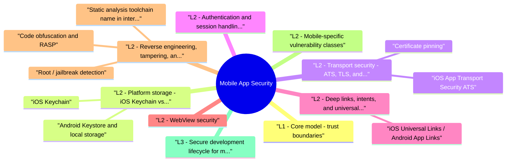

# Mobile App Security revision map

Mobile App Security in one sitting. That is the deal. I mined Critical Clarification Mobile App Security Misconceptions.md, Mobile App Security - Comprehensive Guide.md, Mobile App Security - Interview Questions & Answers.md, Mobile App Security - Quick Reference.md. The outline keeps every H2 I cared about from those files.

## L1 - Core model: trust boundaries
- Interview one-liner: "Treat the mobile client as a convenience UI over APIs you already secure; anything sensitive enforced only on-device is bypassable."

## L2 - Platform storage: iOS Keychain vs Android Keystore

### iOS Keychain
- The Keychain stores small secrets (passwords, tokens, keys) with access control attributes:
- Hardware: Keys can be bound to Secure Enclave (kSecAttrTokenIDSecureEnclave) for asymmetric crypto; symmetric keys use Keychain + Data Protection classes.
- Storing tokens in UserDefaults or plist files (trivial to extract from backup).
- Using kSecAttrAccessibleAlways (deprecated patterns).
- Hardcoding API keys in the binary (extractable via strings / static analysis).

### Android Keystore and local storage
- Hardware-backed: TEE or StrongBox (setIsStrongBoxBacked(true)) - interviewers ask when StrongBox matters (high-value keys, tamper resistance).
- android:allowBackup="true" exporting app data via ADB backup.
- Storing refresh tokens in plain SharedPreferences.
- Hardcoded signing keys or Firebase API keys in strings.xml / Gradle (use remote config with server-side enforcement, not secrecy alone).

## L2 - Transport security: ATS, TLS, and certificate pinning

### iOS App Transport Security (ATS)
- ATS (default since iOS 9) requires HTTPS, TLS 1.2+, forward secrecy, and SHA-256+ certs. Exceptions in Info.plist (NSExceptionDomains) are red flags in review - document each exception with expiry and owner.

### Certificate pinning
- Pinning binds the app to expected SPKI hashes or public keys, blocking corporate MITM and casual Burp interception.
- Operational reality: Pinning without a rotation plan causes outages when CDN certs rotate. Best practice: pin backup keys, monitor expiry, staged rollout, and fail open vs closed decision documented.

## L2 - Authentication and session handling on mobile
- OAuth for mobile (interview): Use PKCE (code_challenge / code_verifier), custom URI scheme or HTTPS app links for redirect (prefer verified app links), no client secret in the app binary.

## L2 - Deep links, intents, and universal links
- Open arbitrary screens without auth (myapp://admin/settings).
- Pass malicious data to WebViews (javascript: bridges).
- Intercept OAuth redirects via custom scheme squatting (another app registers same scheme).

### iOS Universal Links / Android App Links
- Verified links (.well-known/apple-app-site-association, assetlinks.json) reduce hijacking vs custom schemes.
- Validate path and parameters server-side when the link triggers privileged actions.
- Require fresh auth for sensitive deep-link targets (payment, account deletion).
- Never trust query params for authZ (?isAdmin=true).

## L2 - WebView security
- CVE class: Historical WebView remote code execution on outdated Android System WebView - keep WebView updated, minimize attack surface.

## L2 - Reverse engineering, tampering, and runtime integrity

### Static analysis toolchain (name in interviews)
- See the source section `Static analysis toolchain (name in interviews)` for the worked example.

### Root / jailbreak detection
- Signals: su binary, Magisk, /system writability, SafetyNet / Play Integrity, iOS jailbreak files, debugger attachment.
- Reality: Determined attackers patch checks or use Frida to return false. Treat as risk signal for step-up auth or limiting high-value actions, not as a cryptographic guarantee.

### Code obfuscation and RASP
- ProGuard/R8, DexGuard, iXGuard raise cost; RASP (runtime application self-protection) detects hooks. Interview trade-off: maintenance cost, crash telemetry, false positives on custom ROMs.

## L2 - Mobile-specific vulnerability classes
- Strava heat map - aggregate GPS leakage (privacy + OPSEC).
- Banking trojans - overlay attacks, accessibility service abuse (Android malware class).
- Republished apps - stolen signing keys or fake store listings (supply chain).

## L3 - Secure development lifecycle for mobile
- Threat model per feature: data at rest, in transit, on screen, in logs, in backups.
- MASVS / OWASP Mobile Top 10 as review checklist.
- SAST: MobSF, Semgrep mobile rules, platform linters.
- Dependency: SCA on Gradle/CocoaPods/SwiftPM; SBOM for SDKs (analytics, ads are common leak sources).
- Pen test scope: static + dynamic + backend API (mobile-only tests miss half the system).
- Release gates: no cleartext traffic, no debuggable prod, secrets scan, exported component audit.

## L3 - Detection and monitoring
- API-side: anomalous device fingerprints, impossible travel, refresh token reuse, elevated error rates from old app versions.
- Client telemetry (privacy-aware): integrity check failures, pinning failures (may indicate MITM or outdated pins).
- App store monitoring: fake clones, trademark abuse.

## L3 - Operational trade-offs

## Interview clusters

## Hands-on references
- OWASP MASVS / MASTG - mas.owasp.org
- OWASP Mobile Top 10
- PortSwigger: mobile API testing overlaps (Burp + rooted device or pinning bypass lab)
- HackTricks: Android/iOS pentesting chapters
- DVIA (Damn Vulnerable iOS App), InsecureBankv2, OWASP MSTG crackmes

## Toolchain (name 3-4 in interviews)
- MobSF, Frida, objection, jadx, apktool, Burp Suite, Play Integrity / DeviceCheck

## Cross-links
- TLS · Authorization and Authentication · Secrets Management
- GraphQL and API Security · Business Logic Abuse

## Pocket list

## Trust boundary
- Client = untrusted. Server = authoritative for authZ, fraud, business rules.

## Storage cheat sheet

## Transport
- TLS 1.2+, strong ciphers; ATS on iOS (minimize exceptions).
- Pinning: SPKI + backup pins + rotation runbook; bypassable via Frida -> don't rely alone.
- OAuth native: Authorization Code + PKCE (RFC 8252); no implicit flow; no client secret in app.

## Deep links / WebView
- Prefer Universal Links / App Links over custom schemes for sensitive flows.
- Validate host/path; server authZ for privileged actions.
- WebView: minimal JS bridge, no OAuth, patch System WebView.

## Tampering
- Frida/objection bypass pinning and root checks -> server-side fraud + step-up.
- Play Integrity / DeviceCheck as signals, not guarantees.

## Tools
- MobSF · jadx/apktool · Frida · Burp · Hopper/Ghidra

## Frameworks
- OWASP MASVS (storage, crypto, auth, network, platform, code quality, resilience)

## Interview one-liners
- "Pinning is ops-heavy; API auth is mandatory."
- "Keychain beats SharedPreferences; rotation beats eternal refresh tokens."
- "Deep links route UI; they don't grant privileges."

## Cross-reads
- TLS · Authorization and Authentication · GraphQL and API Security

## The clarification file, compressed

## "Obfuscation equals security."
- Wrong. ProGuard, DexGuard, and iXGuard raise reverse-engineering cost only. Secrets, algorithms, and authorization logic in the binary will be extracted. Obfuscation complements server-side authority, not replaces it.

## "SSL pinning makes the app secure."

## "Root/jailbreak detection blocks attackers."
- Wrong. Checks are patchable and routinely hooked. Use integrity signals for risk scoring and step-up, not as a cryptographic guarantee.

## "Biometric login means the user is authenticated to the server."
- Wrong. Biometrics unlock local credentials (Keychain/Keystore). Server sessions still need token issuance, expiry, revocation, and step-up for sensitive transactions.

## "If the UI hides the admin button, non-admins can't access admin APIs."
- Wrong. Client-side authorization is not authorization. Every API must enforce roles and scopes server-side.

## "Keychain/Keystore makes tokens safe forever."
- Wrong. Hardware-backed storage protects at-rest extraction on typical devices, but malware on device, backup misconfiguration, and long-lived refresh tokens still matter. Use short lifetimes, rotation, and revocation.

## "WebView is just a browser-it's fine for OAuth."
- Wrong. Platforms discourage OAuth in embedded WebViews due to phishing and cookie theft. Use system browser flows (Custom Tabs, ASWebAuthenticationSession).

## "Custom URL schemes are as safe as universal links."
- Wrong. Custom schemes are squat-able; verified app/universal links bind HTTPS domains to your app and reduce hijacking.

## "Mobile pentest equals running MobSF on the APK."
- Wrong. Static scans miss API authZ, business logic, and backend flaws. Full assessment requires API testing, dynamic analysis, and threat-modeled manual review.

## "ATS exceptions are harmless for one legacy domain."
- Wrong. Each ATS exception is a deliberate downgrade-document owner, expiry, and migration plan; interviewers treat unexplained exceptions as negligence.

## Oral prompts worth repeating

- Explain the mobile trust boundary in one minute.
- iOS Keychain vs Android Keystore - when do you use each?
- Is SSL pinning always recommended?
- How do deep links and universal links go wrong?
- How would you test a mobile app in a pentest?
- What's your approach to root/jailbreak detection?
- WebView security - top issues?
- Senior / Staff follow-ups
- Design mobile auth for a consumer fintech app.
- How do you run a mobile security program across many teams?
- Depth - topic-specific follow-ups
- Authoritative references

## 60-second answer
- Q: What are the highest-risk mobile security mistakes?

## Core questions

### iOS Keychain vs Android Keystore - when do you use each?
- See the source section `iOS Keychain vs Android Keystore - when do you use each?` for the worked example.

### WebView security - top issues?
- See the source section `WebView security - top issues?` for the worked example.

## Depth - topic-specific follow-ups
- Compare custom URI scheme vs App Link for OAuth redirect security.
- When would you use Secure Enclave vs software Keychain keys?
- Explain Android exported component abuse with a concrete manifest example.
- How does Frida defeat pinning and root checks-what do you monitor instead?
- MASVS-STORAGE-1 vs STORAGE-2 - what changes between levels?

## What sits next to this topic

- Stay inside this folder for the long guide. Jump only when a section names a sibling topic.
- Cookie Security, CSRF, XSS, JWT, OAuth, and TLS show up as neighbors on a lot of these maps.
