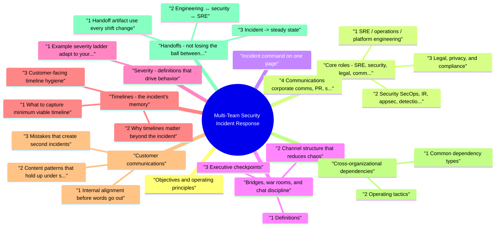

# Multi-Team Security Incident Response revision map

Last mock I bounced around the Multi-Team Security Incident Response folder. This file is the stop that. Drawn from Critical Clarification Multi-Team Security Inciden.md, Multi-Team Security Incident Response - Comprehens.md, Multi-Team Security Incident Response - Interview.md, Multi-Team Security Incident Response - Quick Refe.md. Skim the mermaid, then the outline.

## Objectives and operating principles
- Protect people and data: stop ongoing harm, preserve evidence, and avoid making the situation worse.
- Restore safe service: return to a known-good state with controlled risk, not "fast and sloppy."
- Meet obligations: legal, contractual, and regulatory requirements often have fixed deadlines once certain facts are known.
- Communicate truthfully: say what you know, what you do not know, and when you will update stakeholders next.
- Single threaded leadership: one incident commander (IC) or equivalent owns coordination; technical and comms leads advise and execute in their lanes.
- Written beats verbal: decisions, timelines, customer-facing statements, and scope changes belong in a durable incident record.
- Assume cross-org dependencies: cloud providers, identity vendors, SaaS tools, and partner APIs are part of the blast radius.
- Severity is a coordination tool, not a popularity contest: it sets update frequency, who must be present, and escalation paths.

## Core roles: SRE, security, legal, communications
- Roles below are typical in mid-size and large product companies. Titles vary; the functions matter more than the labels.

### 1 SRE / operations / platform engineering
- Service health and capacity: error budgets, load patterns, deploys, rollbacks, feature flags, traffic shaping.
- Production changes: safe change windows, canary discipline, runbook execution, infrastructure remediation.
- Observability access: logs, metrics, traces, and often the tooling that security relies on during response.
- Customer-visible reliability: status pages, internal SLO dashboards, and bridge discipline ("what is broken for users right now?").
- Security proposes containment (isolate, block, revoke); SRE evaluates availability and blast radius of those actions.
- Joint decisions on evidence preservation: snapshots, memory capture, log export, WORM storage, and whether a host stays up for forensics.

### 2 Security (SecOps, IR, appsec, detection engineering)
- Triage and hypothesis: is this attack, misconfiguration, insider risk, third-party compromise, or benign noise?
- Threat containment guidance: credential rotation, session revocation, firewall/WAF rules, EDR actions, account disables.
- Investigation: timeline reconstruction, indicator collection, malware or persistence checks, scope of access or data touched.
- Risk framing for leadership: plausible worst case, confidence level, and what would change the assessment.
- Security should not silently "take over" production without SRE alignment except where policy explicitly allows emergency containment (and even then, communicate immediately on the bridge).

### 3 Legal, privacy, and compliance
- Regulatory and contractual triggers: breach definitions, notification windows, supervisory reporting, sector-specific rules (examples vary by jurisdiction and contracts-treat as org-specific).
- Privilege and discovery: when communications should be attorney-directed, how to label materials, and how internal notes may be used later.
- Law enforcement and third-party process: preservation requests, court orders, and coordination with outside counsel.
- Customer and partner contracts: obligations in DPAs, BAAs, SLAs, and security addenda.
- Provide decision memos in plain language: "If we notify now, we gain X; if we wait for Y evidence, risk is Z."

### 4 Communications (corporate comms, PR, sometimes marketing)
- Narrative and channels: blog posts, email to customers, press lines, social posts, and executive talking points.
- Tone and accuracy: translate technical reality into language that is correct and not misleading, without leaking sensitive tactics.
- Coordination with support: macros, help center updates, and executive escalation scripts.
- Root cause certainty before engineering and security agree on confidence levels.
- Promises of "no data accessed" unless investigation supports that statement.

### 5 Supporting functions (still on the hook)
- Product and engineering leadership: prioritization of fixes, feature disablement, and customer commitments.
- Customer support / success: inbound volume, account-level outreach, and executive customer management.
- Finance and procurement: vendor urgency, contract escalations, and incident spend.
- HR and people ops: insider-threat scenarios, workforce safety, and sensitive personnel actions.
- Executive sponsor: breaks ties on business risk, approves major external statements, and clears resource conflicts.

## Incident command on one page
- A lightweight command model that works in practice:
- Security and SRE leads are often deputy technical authorities: security for threat and scope, SRE for service operations. The IC does not need to be the smartest engineer in the room; they need to keep the room aligned.

## Bridges, war rooms, and chat discipline

### 1 Definitions
- Bridge call: a live audio or video conference with a named chair, agenda, and time-boxed goals (often 15-30 minutes on a cadence during severe incidents).
- War room: an expanded bridge with additional executives and cross-functional leads; use when severity, legal exposure, or public attention demands tight synchronization.
- Back-channel: small group chats for sensitive topics (legal, HR, executive). They must reconcile to the main incident room so operational teams are not surprised.

### 2 Channel structure that reduces chaos
- #incident-YYYY-NNN-public: default coordination for responders; post updates, commands run, graphs, and decisions (with sensitivity rules).
- #incident-YYYY-NNN-restricted: legal, security investigation details, and sensitive customer data discussions.
- #incident-YYYY-NNN-comms: comms + legal + IC for draft statements and approval flow.
- Ticket or doc: single source of truth for timeline, customer impact, severity rationale, and links to evidence.
- One bridge chair: starts on time, captures decisions, ends with action owners and next bridge time.
- No silent fixes: production changes get a sentence in the incident record ("what changed, why, who approved").
- Label uncertainty: "we believe," "early indicators," "confirmed as of HH:MM UTC."

### 3 Executive checkpoints
- Executives need decisions and risks, not log dumps. A useful checkpoint format:
- Customer impact: who is affected and how (quantified if possible).
- Current state: contained vs ongoing; known blast radius.
- Next 60 minutes: top three actions and owners.
- Comms posture: what we are saying, to whom, and when; what we are not saying yet and why.
- Worst case we are planning for: plain language, no fear-mongering.

## Severity: definitions that drive behavior
- Severity should answer: how fast must we move, who must be online, and how often do we update? Tie severity to customer impact, data sensitivity, active attacker, and regulatory exposure-not to how noisy the alerting is.

### 1 Example severity ladder (adapt to your org)
- SEV1 - Crisis: active exploitation with broad customer or data impact; existential reputation or legal risk; war room mandatory; exec and legal engaged; frequent external updates if customers are affected.
- SEV2 - Major: significant customer impact or credible data risk; full bridge; comms and legal on standby; hourly or tighter internal updates.
- SEV3 - Significant: limited impact or contained issue; standard incident process; periodic updates.
- SEV4 - Minor: low impact, clear remediation; normal queue handling.
- Document why severity changed and who approved it. Severity debates often hide real disagreements about risk-surface those explicitly.

## Timelines: the incident's memory

### 1 What to capture (minimum viable timeline)
- For each notable event, record UTC time, actor (human or system), observation, and source (ticket, log link, chat message). Include:
- Detection: alert, customer report, researcher, internal finding.
- Mobilization: IC assigned, bridge started, teams paged.
- Containment: credential revokes, blocks, isolations, feature kills.
- Eradication and recovery: patches, config fixes, rebuilds, validation.
- Comms milestones: internal briefings, customer emails, regulatory clocks if triggered.

### 2 Why timelines matter beyond the incident
- See the source section `2 Why timelines matter beyond the incident` for the worked example.

### 3 Customer-facing timeline hygiene
- Use consistent timestamps (UTC in technical posts; local only if you also show UTC).
- Separate facts from work in progress.
- Close the loop: "resolved" should mean a defined recovery state, not merely "we stopped paging."

## Customer communications

### 1 Internal alignment before words go out
- Security + SRE agree on what is confirmed vs suspected.
- Legal confirms obligations and prohibited claims.
- Comms ensures clarity, empathy, and channel fit.
- Support receives FAQs and escalation paths.

### 2 Content patterns that hold up under scrutiny
- Impact statement: what users might experience (latency, errors, unavailable features, account safety steps).
- What we did / are doing: high-level response actions without attacker playbook detail.
- What users should do: password reset, session review, MFA enrollment, revoke tokens-only if justified.
- How we will update: next expected update time.

### 3 Mistakes that create second incidents
- Overclaiming: "no data accessed" without evidence.
- Technical fog: jargon that customers cannot act on.
- Silent incidents: customers learn from Twitter first.
- Split-brain messaging: status page contradicts support macros or executive email.

## Cross-organizational dependencies
- Modern incidents routinely involve vendors and partners. Treat them as part of your response graph.

### 1 Common dependency types
- Cloud and CDN: DDoS, WAF, edge config, IAM anomalies.
- Identity providers: SSO outages, SAML/OIDC misconfiguration, MFA bypass attempts.
- SaaS with admin APIs: CRM, ticketing, code hosting, chat-often high-value targets.
- Data processors: subprocessors bound by contract and often part of notification analysis.

### 2 Operating tactics
- Maintain vendor escalation paths before you need them: TAMs, priority support, security portals.
- Assign a single internal owner for each vendor thread to avoid duplicate, conflicting tickets.
- Share minimum necessary indicators and timestamps; use NDAs and secure transfer as required.
- If a vendor is also a customer, separate commercial relationship from incident communication where possible.

## Handoffs: not losing the ball between teams or shifts

### 1 Handoff artifact (use every shift change)
- Current situation: one paragraph, current severity, customer impact.
- Open hypotheses: ranked list with confidence.
- In-flight actions: owner, ETA, dependency.
- Frozen facts: what must not change without IC approval (for example, a public statement or a production freeze).
- Links: bridge recording policy, ticket, timeline doc, critical dashboards.

### 2 Engineering ↔ security ↔ SRE
- Security -> SRE: "Apply this block rule; expected user-visible effect is X; rollback is Y."
- SRE -> security: "Deploy completed at HH:MM; validate with these signals; these anomalies remain."
- Engineering -> both: "Patch ready; risk assessment; feature flag plan; canary plan."

### 3 Incident -> steady state
- When the fire is out, explicitly transfer:
- Remaining vulnerabilities to backlog with severity and owner.
- Detection gaps to detection engineering with concrete log sources or rules to add.
- Runbook updates to the team that owns the service.
- Customer commitments to support and customer success with dates.

## Postmortems and corrective action

### 1 Blameless, not consequence-free
- Blameless means focusing on systems and decisions, not personal attacks. It does not mean ignoring accountability: owners and dates for follow-ups are mandatory.

### 2 Postmortem sections that interviewers expect to hear
- Summary: customer impact, duration, severity.
- Timeline: detection through recovery.
- Root causes: technical and organizational (why safeguards failed).
- What went well: genuine positives build credibility.
- What went poorly: specific, not vague.
- Action items: each with owner and due date; track to completion.

### 3 Security-specific follow-through
- Eliminate bug class, not only the one bug: input validation, authZ checks, secret hygiene, dependency updates.
- Improve detectability: reduce mean time to detect for the failure mode you just lived through.
- Tabletop and game days: rehearse multi-team flows so names and channels are not invented under stress.

## Metrics that show multi-team maturity
- Useful indicators beyond "we have a policy":
- Time to mobilize: detection to IC assigned and bridge live.
- Time to contain: first meaningful harm reduction action.
- Time to recover: defined service health restored.
- Comms latency: time from confirmed customer impact to first responsible update.
- Handoff quality: post-incident survey of responders; number of dropped action items.
- Drill frequency: cross-team exercises per quarter with documented improvements.

## RACI snapshot (who is consulted vs accountable)
- RACI (Responsible, Accountable, Consulted, Informed) prevents "everyone thought someone else was doing it." During security incidents, Accountable should be singular per decision domain.
- If two groups are both "accountable" for the same decision, you will get slow reversals and contradictory updates. Split accountability by decision type, not by team pride.

## Mapping to a standard IR lifecycle
- Many teams align verbally with NIST SP 800-61 style phases: Preparation; Detection and Analysis; Containment, Eradication, and Recovery; Post-incident activity. Multi-team coordination shows up in every phase:
- Preparation: shared runbooks, on-call rosters, vendor escalation lists, counsel-approved comms boilerplate you can complete with verified facts, and joint drills.
- Detection and analysis: detection engineering feeds security; SRE validates customer impact; product confirms feature behavior.
- Containment / eradication / recovery: the highest-conflict zone-balance speed, evidence, and availability with explicit IC decisions.
- Post-incident: postmortem, tracked remediations, and program-level metrics.

## Operational security on bridges and in chat
- Attackers sometimes monitor the same systems you use to coordinate. Practical OPSEC habits:
- Avoid exact IOC strings, exploit details, or unpatched vulnerability names in public channels while the incident is active if disclosure could accelerate abuse.
- Prefer internal ticket links with access control over pasting raw data into wide Slack channels.
- Use restricted rooms for malware artifacts, customer PII, and law-enforcement sensitive material.
- Agree when recordings and transcripts are allowed; legal may constrain retention and distribution.

## Escalation triggers worth writing down
- Escalate early when any of the following appear-waiting usually widens blast radius:
- Confirmed data access or exfiltration hypotheses with credible paths (credentials, admin APIs, database replicas, backup exposure).
- Customer-visible outage tied to security response actions (blocks, kills, revocations).
- Regulatory or contractual clock risk (payment, health, government, or highly regulated datasets-verify with counsel).
- Public attention: social media velocity, press inquiries, influential customers posting.
- Vendor dependency: cloud-wide issues, identity provider degradation, or upstream compromise rumors requiring joint verification.

## Quick checklist (first hour)
- Declare incident; assign IC and scribe; set severity.
- Open timeline doc and ticket; link observability dashboards.
- Start bridge on a published cadence; invite SRE, security, product, comms, legal as severity dictates.
- Agree containment vs investigation plan; document tradeoffs.
- Establish comms lane: drafts, approvers, and update schedule.
- Identify external dependencies early; open vendor tickets with one owner each.
- Schedule executive checkpoint and next severity review.

## Fundamental coordination

### How do you run incident response when security, SRE, legal, and communications all need to be involved?
- See the source section `How do you run incident response when security, SRE, legal, and communications all need to be involved?` for the worked example.

### What is the difference between a bridge and a war room in practice?
- See the source section `What is the difference between a bridge and a war room in practice?` for the worked example.

### How should severity drive behavior across teams?
- See the source section `How should severity drive behavior across teams?` for the worked example.

### Who should be incident commander if the strongest engineer is deep in debugging?
- See the source section `Who should be incident commander if the strongest engineer is deep in debugging?` for the worked example.

### How do SRE and security avoid stepping on each other during containment?
- See the source section `How do SRE and security avoid stepping on each other during containment?` for the worked example.

## Legal, privacy, and communications

### When do you pull legal into a security incident, and what do they need from engineering?
- See the source section `When do you pull legal into a security incident, and what do they need from engineering?` for the worked example.

### How do you prevent customer communications from getting ahead of technical reality?
- See the source section `How do you prevent customer communications from getting ahead of technical reality?` for the worked example.

### What is your approach to executive updates during an active incident?
- See the source section `What is your approach to executive updates during an active incident?` for the worked example.

## Timelines, handoffs, and dependencies

### What belongs in an incident timeline, and why does it matter after the fact?
- See the source section `What belongs in an incident timeline, and why does it matter after the fact?` for the worked example.

### How do you hand off an incident between shifts without losing progress?
- See the source section `How do you hand off an incident between shifts without losing progress?` for the worked example.

### How do you coordinate with external vendors or cloud providers during an incident?
- See the source section `How do you coordinate with external vendors or cloud providers during an incident?` for the worked example.

### What do you do when engineering wants to cut traffic immediately but operations wants more logs first?
- See the source section `What do you do when engineering wants to cut traffic immediately but operations wants more logs first?` for the worked example.

## Conflict, culture, and learning

### How do you resolve conflicts between teams during a high-severity incident?
- See the source section `How do you resolve conflicts between teams during a high-severity incident?` for the worked example.

### What does a strong postmortem look like for a multi-team security incident?
- See the source section `What does a strong postmortem look like for a multi-team security incident?` for the worked example.

### How do you measure whether multi-team incident response is actually improving?
- See the source section `How do you measure whether multi-team incident response is actually improving?` for the worked example.

### How do you keep sensitive investigation details from leaking while still moving fast?
- See the source section `How do you keep sensitive investigation details from leaking while still moving fast?` for the worked example.

## Scenario-style

### A reporter emails while your investigation is still inconclusive. What steps do you take?
- See the source section `A reporter emails while your investigation is still inconclusive. What steps do you take?` for the worked example.

### After containment, leadership wants to declare "all clear" in one hour. How do you respond?
- See the source section `After containment, leadership wants to declare "all clear" in one hour. How do you respond?` for the worked example.

## Depth: Interview follow-ups - Multi-Team Incident Response
- Follow-ups interviewers like: RACI for customer comms; how severity maps to paging; how you document timelines for regulators; how postmortem actions are tracked to completion.
- Production verification: Joint tabletops, realistic handoff drills, and a single timeline document used in both technical response and comms drafting.

## Incident Command Structure

## Team Roles

## Communication Checklist
- Incident response channel (Slack, Teams)
- Regular status updates (every 1-2 hours)
- Separate channels for technical vs. business
- Executive briefings
- Customer communication (if required)
- Document everything

## Decision Authority

## Communication Principles
- Regular updates (even with incomplete information)
- Clear and concise
- Accurate information
- Don't speculate
- Appropriate detail level for audience

## Key Principles
- Clear roles and responsibilities
- Structured communication
- Data-driven decisions
- Collaborative problem-solving
- Post-incident learning

## Misreads that still sneak in

## ️ Common Misconceptions

### "Security team handles incidents alone"
- Truth: Effective incident response requires coordination across multiple teams - security can't do it alone.
- Security: Lead incident response, threat analysis
- Engineering: System access, technical remediation
- Operations: Infrastructure changes, monitoring
- Legal/Compliance: Regulatory requirements, notifications
- PR/Communications: Customer communication
- Executive Leadership: Strategic decisions, resource allocation

### "All teams need all information immediately during incidents"
- Truth: Information should be shared on a need-to-know basis - too much information can slow response.
- Security Team: Full details for analysis and response
- Engineering/Operations: Technical details needed for remediation
- Executive Leadership: High-level status and business impact
- PR/Legal: Information needed for external communication
- Other Teams: Relevant information for their role

### "Incident response coordination can be figured out during the incident"
- Truth: Incident response requires preparation and practice - roles and procedures must be defined beforehand.
- Documented incident response plan
- Defined roles and responsibilities
- Established communication channels
- Pre-approved escalation procedures
- Regular incident response drills

### "One person should make all decisions during incidents"
- Truth: Incident response benefits from structured decision-making with clear authority and escalation paths.
- Incident Commander: Overall coordination and decisions
- Technical Lead: Technical decisions and guidance
- Business Lead: Business impact and priority decisions
- Executive Escalation: For high-impact decisions

### "Communication should wait until all facts are known"
- Truth: Regular communication is critical, even with incomplete information - silence creates uncertainty.
- Regular updates (every 1-2 hours during active incidents)
- Communicate what you know, don't speculate
- Acknowledge what you don't know
- Update stakeholders on status and next steps
- Use appropriate channels for different audiences

## Key Takeaways
- Team Effort: Incident response requires coordination across multiple teams
- Need-to-Know: Share information appropriately, avoid information overload
- Prepare and Practice: Define roles and procedures before incidents
- Structured Decisions: Clear authority and escalation paths for decision-making
- Regular Communication: Communicate regularly, even with incomplete information

## Cross-links I actually follow

- Stay inside this folder for the long guide. Jump only when a section names a sibling topic.
- Cookie Security, CSRF, XSS, JWT, OAuth, and TLS show up as neighbors on a lot of these maps.
