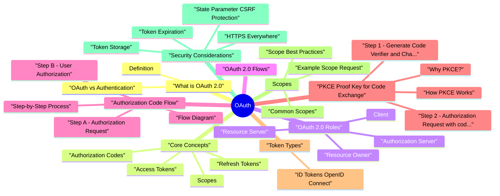

# OAuth revision map

Last mock I bounced around the OAuth folder. This file is the stop that. Drawn from Critical Clarification OAuth 2 0 Security Misconce.md, OAuth 2 0 - Comprehensive Guide.md, OAuth 2 0 - Interview Questions & Answers.md, OAuth 2 0 - Quick Reference Guide.md, OAuth 2 0 - VAPT Methodology.md. Skim the mermaid, then the outline.

### What OAuth 2.0 is Used For
- API Authorization: Allowing third-party apps to access user data on behalf of the user
- Social Login: "Sign in with Google/Facebook/Twitter"
- Delegated Access: Granting limited permissions to applications
- Resource Sharing: Sharing resources across different services
- Mobile App Integration: Allowing mobile apps to access cloud services

### Why Use OAuth 2.0?
- No password sharing: Users don't need to share credentials with third-party apps
- Granular permissions: Apps can request specific scopes/permissions
- Revocable access: Users can revoke access at any time
- Standardized: Industry-standard protocol (RFC 6749)
- Flexible: Multiple grant types for different use cases
- Secure: Properly implemented, it's more secure than password sharing
- ️ Complex implementation: Requires careful implementation
- ️ Security depends on implementation: Must follow security best practices

## What is OAuth 2.0

### Definition
- OAuth 2.0 is an authorization framework, not an authentication protocol. It allows applications to obtain limited access to user accounts on an HTTP service.
- Key Point: OAuth 2.0 answers "What can this app do?" (authorization), NOT "Who is this user?" (authentication).

### OAuth vs Authentication
- Grants permission to access resources
- Answers "What can you do?"
- Provides access tokens
- Does not identify the user
- Verifies identity
- Answers "Who are you?"
- Provides identity information
- Uses protocols like OpenID Connect (OIDC) on top of OAuth

## Core Concepts

### Access Tokens
- Access tokens are credentials used to access protected resources. They represent authorization granted to the client.
- Short-lived (typically 1 hour or less)
- Opaque strings (or JWT format)
- Represent authorization, not identity
- Must be validated by resource server
- Purpose: Credentials used to access protected resources
- Short-lived (typically 15 minutes to 1 hour)
- Opaque strings or JWTs

### Refresh Tokens
- Refresh tokens are credentials used to obtain new access tokens when the current one expires.
- Long-lived (days, weeks, or months)
- Stored securely (like passwords)
- Used to get new access tokens without user interaction
- Can be revoked
- Purpose: Credentials used to obtain new access tokens
- Used server-to-server

### Authorization Codes
- Temporary codes exchanged for access tokens. Used in Authorization Code Flow.
- Short-lived (typically 10 minutes or less)
- Single-use (can only be exchanged once)
- Exchanged server-to-server (more secure)

### Scopes
- Scopes define the specific permissions the client is requesting from the resource owner.
- read: Read access
- write: Write access
- profile: Access to profile information
- email: Access to email address

## OAuth 2.0 Roles

### Resource Owner
- The user who owns the data and can grant access to their resources.
- Grants or denies authorization requests
- Controls what resources are shared
- Can revoke access at any time

### Client
- The application requesting access to the user's resources.
- Confidential Client: Can securely store credentials (web apps with backend)
- Public Client: Cannot securely store credentials (mobile apps, SPAs)
- Requests authorization from resource owner
- Exchanges authorization code for access token
- Uses access token to access protected resources
- Stores tokens securely

### Authorization Server
- The server that authenticates the user and issues tokens.
- Authenticates the resource owner
- Obtains user consent
- Issues access tokens and refresh tokens
- Validates client credentials
- Provides token revocation endpoint
- Google OAuth Server (accounts.google.com)
- Azure AD

### Resource Server
- The server that hosts protected resources and accepts access tokens.
- Validates access tokens
- Checks token scopes/permissions
- Serves protected resources if authorized
- Returns 401 if token is invalid/expired
- Google Calendar API (calendar.google.com)
- Twitter API (api.twitter.com)
- Facebook Graph API (graph.facebook.com)

## OAuth 2.0 Flows
- OAuth 2.0 defines several grant types (flows) for different use cases:
- Authorization Code Flow - Most secure, for web apps and mobile apps
- Implicit Flow - Deprecated, was for SPAs
- Client Credentials Flow - For server-to-server communication
- Resource Owner Password Credentials Flow - Not recommended, only for trusted clients
- Refresh Token Flow - For obtaining new access tokens

## Authorization Code Flow
- The Authorization Code Flow is the most secure and recommended flow for most applications.

### Flow Diagram
- See the source section `Flow Diagram` for the worked example.

### Step-by-Step Process
- See the source section `Step-by-Step Process` for the worked example.

### Step A: Authorization Request
- The client redirects the user to the authorization server with:
- client_id: Client identifier
- redirect_uri: Where to redirect after authorization
- response_type: Must be code for Authorization Code Flow
- scope: Permissions requested
- state: CSRF protection (random string)

### Step B: User Authorization
- User is redirected to authorization server
- User logs in (if not already logged in)
- User sees consent screen showing requested permissions
- User grants or denies access

### Step C: Authorization Code
- If user grants access, authorization server redirects back with:
- code: Temporary authorization code
- state: Same state value (for CSRF protection)

### Step D: Exchange Code for Token
- Client makes server-to-server POST request to exchange code for tokens:
- grant_type: authorization_code
- code: Authorization code from step C
- redirect_uri: Must match the one used in step A
- client_id: Client identifier
- client_secret: Client secret (for confidential clients)

### Step E: Access Protected Resource
- Client uses access token to request protected resources:

### Step F: Resource Server Response
- If token is valid, resource server returns requested data:

### Security Features
- Authorization code is short-lived (10 minutes or less)
- Code is exchanged server-to-server (not exposed to browser)
- Client secret used in token exchange (confidential clients)
- State parameter prevents CSRF attacks
- Tokens not exposed in URL

## PKCE (Proof Key for Code Exchange)
- PKCE (RFC 7636) is an extension to OAuth 2.0 that enhances security for public clients (mobile apps, SPAs).

### Why PKCE?
- Problem: Public clients cannot securely store client secrets. Without PKCE, authorization codes can be intercepted.
- Solution: PKCE uses a dynamically generated code verifier and code challenge to bind the authorization request to the token exchange.

### How PKCE Works
- See the source section `How PKCE Works` for the worked example.

### Step 1: Generate Code Verifier and Challenge
- See the source section `Step 1: Generate Code Verifier and Challenge` for the worked example.

### Step 2: Authorization Request (with code challenge)
- See the source section `Step 2: Authorization Request (with code challenge)` for the worked example.

### Step 3: Authorization Code (same as before)
- See the source section `Step 3: Authorization Code (same as before)` for the worked example.

### Step 4: Token Exchange (with code verifier)
- See the source section `Step 4: Token Exchange (with code verifier)` for the worked example.

### Step 5: Server Validates
- Server receives code verifier
- Server hashes code verifier: hash = SHA256(code_verifier)
- Server encodes hash: challenge = base64url(hash)
- Server compares challenge with original code_challenge
- If match, token exchange succeeds

### PKCE Benefits
- Prevents authorization code interception
- Works for public clients (no client secret needed)
- Recommended for mobile apps and SPAs
- Enhances security even for confidential clients

### When to Use PKCE
- Always for mobile/native apps
- Always for SPAs (Single Page Applications)
- Recommended for all public clients
- Optional but recommended for confidential clients

## Token Types

### ID Tokens (OpenID Connect)
- Purpose: Contains user identity information (OIDC only)
- JWT format
- Contains user claims (sub, email, name, etc.)
- Signed by authorization server
- Used for authentication (not just authorization)

## Scopes
- Scopes define what access/permissions the client is requesting from the resource owner.

### Common Scopes
- read: Read access
- profile: Access to profile information
- email: Access to email address
- write: Write access
- calendar.write: Write to calendar
- files.write: Write to files
- calendar.readonly: Read-only calendar access
- calendar.write: Write calendar access

### Scope Best Practices
- Request minimum necessary scopes (principle of least privilege)
- Use granular scopes (read vs write, specific resources)
- Document what each scope allows
- Validate scopes on resource server
- Show users what permissions are requested

### Example Scope Request
- Profile information access
- Email address access
- Read-only calendar access
- Write calendar access

## Security Considerations

### HTTPS Everywhere
- Always use HTTPS for all OAuth 2.0 communication:
- Authorization requests
- Token exchanges
- API requests with tokens
- Token storage and transmission
- Prevents token interception
- Protects credentials
- Prevents man-in-the-middle attacks

### State Parameter (CSRF Protection)
- Always use state parameter to prevent CSRF attacks:

### Token Storage
- httpOnly cookies (web apps)
- Secure storage (Keychain/Keystore for mobile)
- Server-side storage with encryption
- localStorage (XSS vulnerable)
- Plain text files
- Client-side JavaScript variables (persistent)

### Token Expiration
- Access tokens: 15 minutes to 1 hour
- Refresh tokens: 7-30 days (or longer based on security requirements)
- Limits damage if token is stolen
- Forces regular refresh
- Reduces attack window

### Token Revocation
- Allow users to revoke access
- Revoke tokens on security incidents
- Provide revocation endpoint
- Implement token revocation
- Revoke on security incidents

### Redirect URI Validation
- Whitelist allowed redirect URIs
- Exact match (no wildcards in production)
- Prevent open redirect vulnerabilities

### Client Secret Management
- Store client secret securely (environment variables, secret managers)
- Never commit to version control
- Rotate secrets periodically
- Use different secrets for different environments
- Don't use client secrets (cannot be stored securely)
- Use PKCE instead

## Common Vulnerabilities and Mitigations

### Authorization Code Interception
- Vulnerability: Attacker intercepts authorization code and exchanges it for tokens.
- Use PKCE for public clients
- Short-lived authorization codes (10 minutes)
- Single-use codes
- Validate redirect URI exactly

### CSRF Attacks
- Vulnerability: Attacker tricks user into authorizing attacker's client.
- Always use state parameter
- Generate random, unpredictable state
- Validate state matches before token exchange
- Store state server-side or in sessionStorage

### Token Theft
- Vulnerability: Attacker steals access token (XSS, network sniffing, etc.).
- Use HTTPS everywhere
- Short-lived access tokens
- Store tokens securely (httpOnly cookies)
- Implement Content Security Policy (CSP)
- Use refresh tokens (limit access token exposure)

### Open Redirect
- Vulnerability: Attacker uses OAuth redirect to redirect user to malicious site.
- Whitelist redirect URIs
- Exact match validation (no wildcards)
- Validate redirect URI on both authorization and token exchange
- Use relative URLs where possible

### Scope Confusion
- Vulnerability: Client requests excessive scopes or user doesn't understand permissions.
- Request minimum necessary scopes
- Use granular scopes
- Clearly explain requested permissions to users
- Validate scopes on resource server
- Regularly review and audit granted permissions

### Token Replay
- Vulnerability: Attacker reuses stolen token multiple times.
- Short token expiration
- Token revocation capability
- Monitor for unusual token usage
- Implement token rotation

### Client Secret Exposure
- Vulnerability: Client secret stored insecurely or exposed.
- Never store in client-side code
- Use environment variables or secret managers
- Rotate secrets periodically
- Use PKCE for public clients (no secret needed)

## Best Practices

### Use Authorization Code Flow
- Use Authorization Code Flow (most secure)
- Don't use Implicit Flow (deprecated)
- Use PKCE for public clients

### Implement PKCE
- Always use PKCE for mobile apps
- Always use PKCE for SPAs
- Recommended for all clients

### Secure Token Storage
- Use httpOnly cookies (web apps)
- Use secure storage (mobile apps)
- Encrypt tokens at rest
- Don't use localStorage

### Short Token Lifetimes
- Access tokens: 15 minutes to 1 hour
- Refresh tokens: 7-30 days
- Implement automatic token refresh

### Always Use HTTPS
- HTTPS for all OAuth endpoints
- HTTPS for API requests
- HTTPS for token storage/transmission

### State Parameter
- Always include state parameter
- Generate random, unpredictable state
- Validate state matches

### Scope Management
- Request minimum necessary scopes
- Use granular scopes
- Document scope permissions
- Validate scopes on resource server

### Error Handling
- Handle token expiration gracefully
- Implement retry logic for token refresh
- Provide user-friendly error messages
- Log security events

### Security Monitoring
- Monitor for unusual token usage
- Log authorization events
- Detect and respond to security incidents
- Regular security audits

## Implementation Examples

### Node.js/Express - Authorization Code Flow
- See the source section `Node.js/Express - Authorization Code Flow` for the worked example.

### Node.js/Express - PKCE Flow (Public Client)
- See the source section `Node.js/Express - PKCE Flow (Public Client)` for the worked example.

## OpenID Connect (OIDC)
- OpenID Connect is an identity layer built on top of OAuth 2.0 that adds authentication capabilities.

### OAuth 2.0 vs OpenID Connect
- Authorization only
- Provides access tokens
- Answers "What can this app do?"
- Authentication + Authorization
- Provides access tokens + ID tokens
- Answers "Who is this user?" and "What can this app do?"

### ID Token
- ID token is a JWT that contains user identity information:

### OIDC Flow
- Similar to OAuth 2.0 Authorization Code Flow, but:
- Request openid scope
- Receive ID token along with access token
- Validate ID token signature
- Extract user identity from ID token

## Real-World Scenarios

### Scenario 1: Social Login (OIDC)
- Use OIDC (OpenID Connect)
- Request openid profile email scopes
- Receive ID token with user identity
- Extract user information from ID token
- Create or update user account

### Scenario 2: Third-Party API Access
- Use Case: App needs to access user's Google Calendar
- Use OAuth 2.0 Authorization Code Flow
- Request calendar.readonly or calendar scope
- Store access token and refresh token
- Use access token to call Calendar API
- Refresh token when it expires

### Scenario 3: Mobile App Integration
- Use Case: Mobile app accessing cloud storage
- Use Authorization Code Flow with PKCE
- No client secret (public client)
- Store tokens securely (Keychain/Keystore)
- Implement token refresh
- Handle token expiration gracefully

### Scenario 4: Microservices Architecture
- Use Client Credentials Flow
- Service authenticates with client ID and secret
- Receives access token
- Uses token to call other services
- Tokens scoped to specific services/resources

## Interview clusters
- Fundamentals: "What is OAuth used for?" "Authorization vs authentication?" "What is PKCE?"
- Senior: "How do you validate redirect URIs?" "Where do refresh tokens live for SPAs?"
- Staff: "Design OAuth for multi-tenant B2B with per-customer IdPs and service-to-service clients."

## Cross-links
- JWT, OIDC topics, Cross-Origin Authentication, CSRF, Cookie Security, SAML (enterprise SSO comparison).

## Offensive testing additions (advanced)
- For offensive interview depth and real-world assessments, include these checks:
- Redirect URI bypass testing: exact-match enforcement matters; test parser normalization and open-redirect chaining.
- State/nonce binding: verify anti-CSRF state and OIDC nonce are tied to session and single-use.
- PKCE robustness: ensure code verifier validation is mandatory and cannot be downgraded.
- Token-type confusion: resource APIs must reject ID tokens when access tokens are required.
- Refresh token controls: rotation with reuse detection and revocation strategy.
- Modern hardening options: PAR/JAR/JARM and sender-constrained tokens (DPoP/mTLS) for higher assurance flows.

## Flags I check in 90 seconds

## ️ Critical Clarifications
- OAuth 2.0 is for authorization, NOT authentication!
- OAuth = Authorization (what can you do?)
- OIDC = Authentication (who are you?)
- Use OIDC for "Sign in with Google" style authentication

## OAuth 2.0 Roles

## OAuth 2.0 Flows Comparison

## Authorization Code Flow (Recommended)

## PKCE Flow (For Public Clients)

## Security Best Practices

### DO
- Use Authorization Code Flow (most secure)
- Use PKCE for public clients (mobile, SPAs)
- Always use state parameter (CSRF protection)
- Use HTTPS everywhere
- Store tokens securely (httpOnly cookies, secure storage)
- Use short-lived access tokens (15 min - 1 hour)
- Request minimum necessary scopes
- Validate redirect URIs

### DON'T
- Use Implicit Flow (deprecated)
- Store client secrets in public clients (use PKCE)
- Skip state parameter
- Use HTTP (always HTTPS)
- Store tokens in localStorage
- Use long-lived access tokens
- Request excessive scopes
- Skip redirect URI validation

## Token Storage

## Token Lifetimes

## Common Scopes

## Client Types

## Security Vulnerabilities & Mitigations

## Implementation Snippets

### Node.js - Authorization Code Flow
- See the source section `Node.js - Authorization Code Flow` for the worked example.

### Node.js - PKCE
- See the source section `Node.js - PKCE` for the worked example.

### Token Refresh
- See the source section `Token Refresh` for the worked example.

### Token Revocation
- See the source section `Token Revocation` for the worked example.

## Common Mistakes to Avoid

### Wrong: Using Implicit Flow
- See the source section `Wrong: Using Implicit Flow` for the worked example.

### Correct: Authorization Code Flow
- See the source section `Correct: Authorization Code Flow` for the worked example.

### Wrong: No State Parameter
- See the source section `Wrong: No State Parameter` for the worked example.

### Correct: With State Parameter
- See the source section `Correct: With State Parameter` for the worked example.

### Wrong: Client Secret in Mobile App
- See the source section `Wrong: Client Secret in Mobile App` for the worked example.

### Correct: PKCE for Mobile
- See the source section `Correct: PKCE for Mobile` for the worked example.

### Wrong: Tokens in localStorage
- See the source section `Wrong: Tokens in localStorage` for the worked example.

### Correct: httpOnly Cookie
- See the source section `Correct: httpOnly Cookie` for the worked example.

## OAuth 2.0 vs OpenID Connect

## Quick Decision Tree
- Web app with backend -> Authorization Code Flow + Client Secret
- Mobile app -> Authorization Code Flow + PKCE
- SPA -> Authorization Code Flow + PKCE
- Server-to-server -> Client Credentials Flow
- Yes -> Use OpenID Connect (OIDC)
- No -> Use OAuth 2.0 only
- Can store secret securely -> Confidential (use client secret)
- Cannot store secret -> Public (use PKCE)

## Testing Checklist
- [ ] Using Authorization Code Flow (not Implicit)
- [ ] PKCE implemented for public clients
- [ ] State parameter implemented and validated
- [ ] HTTPS for all OAuth endpoints
- [ ] Tokens stored securely (httpOnly cookies or secure storage)
- [ ] Short token expiration (15 min - 1 hour)
- [ ] Refresh token mechanism implemented
- [ ] Redirect URIs whitelisted and validated

## Key Takeaways
- OAuth 2.0 = Authorization (use OIDC for authentication)
- Authorization Code Flow is most secure (use PKCE for public clients)
- State parameter is critical for CSRF protection
- HTTPS everywhere for all OAuth communication
- Secure token storage (httpOnly cookies or secure storage)
- Short token lifetimes with refresh tokens
- Request minimum scopes (principle of least privilege)
- Validate redirect URIs (whitelist, exact match)

## Misreads that still sneak in

## ️ Common Misconceptions

### "OAuth is for Authentication"
- Truth: OAuth 2.0 is an authorization framework, NOT an authentication protocol.
- OAuth 2.0 authorizes access to resources (what you can do)
- OAuth 2.0 does NOT authenticate users (who you are)
- OAuth answers "What can this app do?" NOT "Who is this user?"
- Use OpenID Connect (OIDC) - adds identity layer on top of OAuth 2.0
- OIDC provides ID tokens with user identity information
- OIDC answers "Who is this user?" (authentication)

### "OAuth 2.0 requires client secrets for all clients"
- Truth: OAuth 2.0 has two types of clients:
- Confidential clients (can securely store secrets) - use client secret
- Public clients (cannot securely store secrets) - use PKCE instead
- Confidential clients (web apps with backend): Use client secret
- Public clients (mobile apps, SPAs): Use PKCE (no client secret)
- Never store client secret in mobile apps or browser JavaScript

### "Implicit Flow is secure for SPAs"
- Truth: Implicit Flow is deprecated and considered insecure. Use Authorization Code Flow with PKCE for SPAs.
- Access token returned in URL fragment (visible in browser history)
- No refresh token (cannot refresh without user interaction)
- Token exposed to browser JavaScript (XSS vulnerability)
- No way to securely exchange authorization code
- Don't use Implicit Flow (deprecated)
- Use Authorization Code Flow with PKCE for SPAs
- Use Authorization Code Flow with client secret for web apps with backend

### "State parameter is optional"
- Truth: The state parameter is critical for CSRF protection and should always be used.
- Prevents CSRF attacks
- Maintains application state during OAuth flow
- Validates that authorization response came from legitimate request
- Always generate random, unpredictable state
- Store state server-side (session) or client-side (sessionStorage)
- Validate state matches before token exchange
- Use state even if you don't need to maintain application state

### "Access tokens contain user identity"
- Truth: Access tokens in OAuth 2.0 are opaque and do not contain user identity information by default.
- Authorization to access resources (scopes)
- Token expiration time
- NOT user identity (user ID, email, name, etc.)
- NOT user profile information
- Use OpenID Connect (OIDC) - provides ID token with user identity
- Call user info endpoint - use access token to fetch user profile
- Decode token - only if using JWT-formatted tokens (not guaranteed)

### "Scopes are just permissions"
- Truth: Scopes define what access is requested, but they also affect what information is available and what actions can be performed.
- Define requested access level
- Limit what resources can be accessed
- Limit what actions can be performed
- May affect what information is returned
- Request minimum necessary scopes (principle of least privilege)
- Use granular scopes (e.g., calendar.readonly vs calendar.write)
- Document what each scope allows

### "Refresh tokens never expire"
- Truth: Refresh tokens can expire and can be revoked. They are not permanent.
- Can be revoked by user or server
- May expire after inactivity
- May have maximum lifetime
- Should be stored securely (like passwords)
- Handle refresh token expiration gracefully
- Implement token refresh logic with retry
- Store refresh tokens securely (encrypted, httpOnly cookie)

### "OAuth 2.0 is secure by default"
- Truth: OAuth 2.0 provides a framework, but security depends on proper implementation and following security best practices.
- OAuth 2.0 doesn't prevent all attacks by itself
- Must implement security measures correctly
- Must follow security best practices
- HTTPS everywhere - protect tokens in transit
- State parameter - prevent CSRF attacks
- PKCE for public clients - prevent authorization code interception
- Short-lived access tokens - limit damage if stolen

## Key Takeaways

### DO
- Understand OAuth is for authorization, not authentication (use OIDC for auth)
- Use PKCE for public clients (mobile apps, SPAs)
- Use Authorization Code Flow (not Implicit Flow)
- Always use state parameter for CSRF protection
- Request minimum necessary scopes (least privilege)
- Use HTTPS everywhere for token transmission
- Store tokens securely (httpOnly cookies, secure storage)
- Implement token refresh and handle expiration

### DON'T
- Use OAuth for authentication without OIDC
- Store client secrets in public clients (use PKCE instead)
- Use Implicit Flow (deprecated and insecure)
- Skip state parameter (critical for CSRF protection)
- Assume access tokens contain user identity (use ID tokens or user info endpoint)
- Request excessive scopes (follow least privilege)
- Use long-lived access tokens (use short tokens with refresh)
- Store tokens in localStorage (use httpOnly cookies or secure storage)

## Summary Table
- Remember: OAuth 2.0 is a framework - security comes from proper implementation and following best practices!

## Lab methodology

## Scope & OAuth Roles
- Clarify the roles in your scenario:
- Authorization Server (AS).
- Resource Server (RS).
- Client (confidential vs public).
- Resource Owner (user).
- Identify flows in use:
- Authorization Code (with/without PKCE).
- Client Credentials.

## Mapping OAuth Flows End‑to‑End
- Sequence the steps:
- User -> Client -> AS (authorization request).
- AS -> User (login, consent).
- AS -> Client (authorization code / tokens).
- Client -> RS (API calls with tokens).
- Record key details:
- Redirect URIs registered and used.
- Scopes requested and granted.

## Assessment Strategy (Configuration & Design)
- Redirect URI handling:
- Only pre‑registered redirect URIs accepted by the AS.
- No use of wildcards or overly broad patterns unless strictly justified.
- Client types and secrets:
- Confidential clients use client secrets securely.
- Public clients (SPAs, mobile) avoid embedding reusable secrets.
- PKCE usage:
- For public clients using Authorization Code, PKCE is in place.

## Dynamic Testing - What to Observe
- Valid flow behavior:
- Confirm tokens are only issued when:
- Redirect URIs match registered values exactly or according to defined rules.
- Users authenticate and, where required, consent explicitly.
- Invalid or edge cases:
- Intentional use of:
- Unregistered or modified redirect URIs.
- Overly broad scope requests.

## Token Handling & Protection
- Where tokens are stored:
- Browser storage, cookies, native secure storage, backend sessions.
- How tokens are transported:
- HTTPS enforced for all token and API endpoints.
- Secure headers (Authorization: Bearer) vs less secure mechanisms.
- Lifetime & revocation:
- Access token lifetimes.
- Refresh token usage and invalidation.

## High‑Risk Scenarios
- Multi‑tenant or multi‑client deployments:
- Shared authorization servers across many applications.
- Risk of mis‑scoped or mis‑routed tokens.
- Public clients (SPAs, mobile):
- Token storage and exposure to client‑side threats.
- Use of PKCE and secure redirect strategies.
- Powerful scopes:
- Scopes that provide extensive account or data access.

## Tooling & Aids
- Proxy tools:
- Observe OAuth authorization and token requests/responses.
- Inspect redirects, parameters, and returned tokens (in test accounts).
- OpenID/OAuth‑aware analyzers:
- Where allowed, tools that can help identify common misconfigurations.
- Configuration/docs review:
- Registered redirect URIs.
- Client types and secrets.

## Verifying Security Properties Safely
- Redirect safety:
- Verify the AS does not send tokens or codes to unregistered or manipulated redirect URIs.
- Scope enforcement:
- Check that resource servers enforce scopes correctly and do not over‑grant access.
- Token validation:
- Confirm resource servers validate tokens:
- Signature, issuer, audience, expiry.
- Intended client and scopes.

## Reporting & Risk Assessment
- Affected client/application and flow.
- Misconfigurations or weak patterns:
- Loose redirect URI rules.
- Missing PKCE where recommended.
- Overly broad scopes or unclear consent.
- Weak token storage or transport.
- Potential impact:
- Unauthorized token issuance.

## Remediation Guidance
- Tight redirect URI control:
- Exact or well‑defined matching rules.
- Avoid open redirects and arbitrary redirect targets.
- Modern, recommended flows:
- Use Authorization Code with PKCE for public clients.
- Avoid deprecated or risky flows in new designs.
- Secure token handling:
- Short‑lived access tokens, careful use of refresh tokens.

## Re‑Testing Checklist
- [ ] Re‑exercise each OAuth flow:
- [ ] Verify only registered redirect URIs are accepted.
- [ ] Confirm PKCE and other protections are enforced where required.
- [ ] Validate token storage and transport patterns are secure.
- [ ] Confirm resource servers:
- [ ] Enforce scopes and validate tokens strictly.
- [ ] Update:
- [ ] OAuth design documentation.

## Clusters from the Q&A file

- Fundamental Questions
- What is OAuth 2.0 and what problem does it solve?
- What is the difference between OAuth 2.0 and authentication?
- What are the four main roles in OAuth 2.0?
- Explain the Authorization Code Flow step by step.
- What is PKCE and why is it important?
- Why is the state parameter critical in OAuth 2.0?
- Why is Implicit Flow deprecated and what should be used instead?
- How do you securely store OAuth tokens?
- What are refresh tokens and how do they work?
- What are OAuth scopes and why are they important?
- Implementation Questions
- How do you implement OAuth 2.0 Authorization Code Flow in Node.js?
- How do you implement PKCE in OAuth 2.0?
- Scenario-Based Questions
- How would you design a secure OAuth integration?
- How would you implement OAuth for a mobile application?
- What is the difference between Authorization Server and Resource Server?
- What is OpenID Connect (OIDC) and how does it relate to OAuth 2.0?
- How do you handle token revocation in OAuth 2.0?
- What is the Client Credentials Flow and when would you use it?
- Depth: Interview follow-ups - OAuth 2.0
- Flagship Mock Question Ladder - OAuth
- Junior (Fundamental clarity)

## Security Questions

## Advanced Questions

## Depth: Interview follow-ups - OAuth 2.0
- Authoritative references: RFC 9700 - OAuth 2.0 Security Best Current Practice (2025; supersedes much informal "OAuth is secure if..." advice); RFC 6749 (framework); OAuth 2.0 for Native Apps BCP where mobile applies.
- Why PKCE for public clients: What stops authorization code interception without a client secret?
- Redirect URI exactness / open redirect: How do you validate redirect_uri and state/nonce patterns?
- Token audience & resource binding: Access token accepted only by intended resource servers?
- Refresh token rotation & reuse detection: What do you do when a reused refresh is seen?

## Flagship Mock Question Ladder - OAuth
- Primary competency axis: authorization flows, redirect safety, token lifecycle, OIDC boundaries.

### Senior (Design and trade-offs)
- How do you implement strict redirect_uri validation to avoid bypass?
- How do you prevent ID-token-as-access-token confusion at APIs?
- What refresh-token rotation model would you deploy and why?

### Staff (Strategy and scale)
- Design OAuth for multi-tenant enterprise SSO with partner IdPs.
- How do you roll out DPoP/mTLS in a large platform incrementally?
- Which controls are mandatory for high-assurance APIs?

### 10-minute mock drill format
- 3 min: Pick one Junior prompt and answer with definition, mechanism, and one mitigation.
- 4 min: Pick one Senior prompt and answer with trade-offs and implementation caveats.
- 3 min: Pick one Staff prompt and answer with architecture/policy plus measurement plan.

### Answer quality rubric (quick score)
- Accuracy (facts and mechanism)
- Depth (trade-offs and failure modes)
- Practicality (implementable controls)
- Verification (tests/telemetry proving success)

## Cross-links I actually follow

- Stay inside this folder for the long guide. Jump only when a section names a sibling topic.
- Cookie Security, CSRF, XSS, JWT, OAuth, and TLS show up as neighbors on a lot of these maps.
