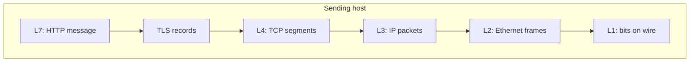

# OSI Layer — Comprehensive Guide

<!-- interview-module:v1 -->

## At a glance

The **OSI (Open Systems Interconnection) model** is a **seven-layer reference** for describing how data moves between systems. It is a **conceptual framework** for teaching, troubleshooting, and architecture discussions—not a literal blueprint of every operating system kernel. Interviewers use it to check whether you can **place protocols** (Ethernet, IP, TCP, TLS, HTTP), explain **encapsulation**, and connect **attacks and controls** to the right layer without pretending the real world is a tidy chart.

**What to hold in your head:** Most production stacks follow a **TCP/IP-style** layering (often described as four layers), while OSI **splits** the top into Session, Presentation, and Application. Be fluent in **both** and ready to **translate**.

---

## Why the model exists

Before the internet dominated everything, vendors needed a shared vocabulary for **interoperable** networking. OSI gave a standard way to answer: *Which part of the stack handles addressing? Which part handles reliability? Where does encryption belong conceptually?* Today, **RFC-defined protocols** and **actual implementations** are authoritative for behavior; OSI remains valuable for **communication** about scope: “This is an L7 problem” vs “We need L3 segmentation.”

---

## The seven layers (bottom → top)

Each layer provides **services to the layer above** and relies on **services from the layer below**. On the sending host, data is **encapsulated** downward; each layer adds its own header (and sometimes trailer). On the receiving host, headers are **stripped** in reverse order (**decapsulation**).

| Layer | Name | Role in one sentence |
|:-----:|------|----------------------|
| 1 | Physical | Moves **raw bits** across a medium. |
| 2 | Data link | **Framing** and **local delivery** on one link using hardware addresses. |
| 3 | Network | **Logical addressing** and **routing** across multiple networks. |
| 4 | Transport | **End-to-end** delivery between processes (ports), optionally reliable/ordered. |
| 5 | Session | **Dialog control** (establish/maintain/teardown of long-lived exchanges)—often absorbed by apps. |
| 6 | Presentation | **Syntax**: encoding, compression, encryption *in the textbook model*—often absorbed by libraries. |
| 7 | Application | **Application protocols** and semantics (HTTP, SMTP, DNS messages as “applications”). |

Below, each layer includes **concrete examples** and a **security lens**.

### Layer 1 — Physical

**Examples:** Electrical signaling on copper, optical pulses on fiber, radio modulation for Wi‑Fi, NIC transceivers, cable specifications, physical ports on switches.

**Security relevance:** Physical access enables **taps**, **evil maid** attacks, and **rogue devices** plugged into closets. Controls include **port security**, **locked MDF/IDF**, **fiber integrity**, and **tamper-evident** cabling where threats warrant it. No amount of TLS helps if an attacker owns the **physical path** undetected.

### Layer 2 — Data link

**Examples:** **Ethernet** frames and **MAC addresses**, **Wi‑Fi** MAC behavior, **switches** (MAC learning/forwarding), **ARP** (maps IP → MAC on a broadcast domain), **VLAN** tags (802.1Q), **STP** for loop prevention.

**PDU name:** **Frame** (often stated as the L2 PDU).

**Security relevance:** **ARP spoofing** and **rogue DHCP** enable **MITM** on LANs. **MAC flooding** can degrade switches. **VLAN hopping** (misconfigurations, double tagging in bad setups) breaks segmentation assumptions. **802.1X** port-based network access control ties **identity** to **L2 admission**.

### Layer 3 — Network

**Examples:** **IPv4/IPv6**, **routers**, **routing protocols** (OSPF, BGP at the control plane), **ICMP** (diagnostics), **IPsec** (often described as **L3 VPN** technology).

**PDU name:** **Packet** (common usage for L3).

**Security relevance:** **IP spoofing** underlies certain DoS and reflection attacks. **Routing manipulation** (BGP incidents, malicious advertisements) redirects traffic. **Firewalls** and **ACLs** classically enforce policy at **L3/L4**. **Segmentation** (subnets, VRFs, cloud VPCs) is an **L3 blast-radius** tool—complement, not replacement, for **identity-based** access.

### Layer 4 — Transport

**Examples:** **TCP** (connections, retransmissions, flow/congestion control), **UDP** (datagrams), **port numbers** as application endpoints, **SCTP** in some telco stacks.

**PDU names:** **Segment** (TCP), **datagram** (UDP—terminology overlaps with “datagram” at IP in some texts; interviews reward clarity: “TCP segment over an IP packet”).

**Security relevance:** **SYN floods** exhaust **connection state**. **Session table exhaustion** on middleboxes. **Port scanning** discovers exposed services. **QUIC** (HTTP/3) runs over **UDP** and **blurs** classical layering—acknowledge that modern stacks do not always match the textbook picture.

### Layer 5 — Session

**Examples (conceptual):** Checkpoints in long file transfers, RPC conversation state—**many systems fold** this into **application libraries** or **TCP’s byte stream** rather than a distinct “session protocol” you configure daily.

**Security relevance:** When session **lifecycle** is mishandled, you get **session fixation**, **stale sessions**, or **orphaned authorization**—often discussed as **application/session management** even if the OSI label is fuzzy.

### Layer 6 — Presentation

**Examples (textbook):** **ASN.1**, **TLS** is *sometimes* taught here because it handles **negotiation** and **binary record framing** above TCP.

**Security relevance:** **Parsing** differences (compression bombs, ambiguous encodings) are **real bugs**, but pinning TLS as “only L6” without mentioning **TCP** and **HTTP** is a common **interview trap** (see below).

### Layer 7 — Application

**Examples:** **HTTP/HTTPS**, **DNS**, **SMTP**, **SSH**, **FTP**, **gRPC**—protocols with **application-visible** semantics.

**Security relevance:** Most **AppSec** findings live here: **injection**, **XSS**, **CSRF**, **broken access control**, **business logic abuse**. **DNS** issues (spoofing without protections, cache poisoning classes) are often discussed at **application/dns** layers even though DNS rides over **UDP/TCP** underneath.

---

## Encapsulation and decapsulation

**Encapsulation (sender, top → bottom):**

1. **L7** produces **application data** (for example an HTTP request body and headers as bytes).
2. **Lower layers** each wrap that payload with **their header** (and occasionally a trailer, e.g. Ethernet FCS).
3. At **L4**, TCP adds a **TCP header** (ports, sequence numbers, flags).
4. At **L3**, IP adds an **IP header** (source/destination addresses, TTL, protocol field).
5. At **L2**, Ethernet adds **Ethernet header** (MAC addresses, EtherType) and **trailer** (FCS).
6. At **L1**, the frame becomes **signals** on the wire or air.

**Decapsulation (receiver, bottom → top):** Each layer reads **only its header**, verifies what it cares about (FCS, IP checksums where used, TCP sequence/ACK logic), then **hands the payload up**.

**Interview tip:** Say **“TCP segment inside an IP packet inside an Ethernet frame”** for a typical wired path. If you mention **MTU**, note **IP fragmentation** is an **L3** concern with **L4** performance side effects.

---

## Where TCP, IP, and TLS sit

### IP (Layer 3)

**IP** provides **host-to-host** delivery across routed networks. It does **not** guarantee reliability—that is **TCP**’s job at **L4**.

### TCP and UDP (Layer 4)

**TCP** and **UDP** multiplex **processes** using **ports** and sit **above IP**. TCP adds **connection state**, **retransmissions**, and **ordering** for a byte stream. UDP is **best-effort**; the application (or QUIC) must supply what it needs.

### TLS (the placement interviewers probe)

**TLS** runs **over a reliable byte stream**, classically **TCP**. It provides **confidentiality and integrity** for application data and **authenticates the peer** (typically the server to the client; mutual TLS when configured).

**How to answer cleanly:**

- **HTTP** is an **L7** protocol.
- **TCP** is **L4**.
- **TLS** sits **logically between** them: it **protects** the bytes that HTTP generates before they are handed to TCP for segmentation and delivery. People describe this as **“between L4 and L7”** or as operating at a **record layer** above TCP.

**Avoid:** Claiming TLS is **only** “Layer 6” **without** mentioning TCP and HTTP—many rubrics mark that as incomplete. **Prefer:** explain the **actual ordering**: HTTP → TLS → TCP → IP → Ethernet.

### QUIC and HTTP/3 (why the model bends)

**QUIC** encrypts much of what older stacks exposed at “transport,” carries **streams**, and is the transport for **HTTP/3** over **UDP**. Mature answers note **OSI is pedagogical** and **real protocols combine concerns**.

---

## TCP/IP model vs OSI (comparison you should be able to draw)

The **TCP/IP model** is often taught as **four layers**:

| TCP/IP layer | Typical mapping to OSI | What lives here (examples) |
|--------------|-------------------------|------------------------------|
| **Link** (Network Interface) | **L1 + L2** | Ethernet, Wi‑Fi MAC, ARP, switches |
| **Internet** | **L3** | IP, ICMP, routing |
| **Transport** | **L4** | TCP, UDP, QUIC (as UDP-based transport) |
| **Application** | **L5 + L6 + L7** (conceptually merged) | HTTP, TLS *as used with apps*, DNS, SSH, SMTP |

**Key interview line:** OSI **splits the top**; TCP/IP **collapses** Session/Presentation/Application into one **Application** layer for practicality. Neither replaces reading **RFCs** for real behavior.

---

## Security relevance by layer (defense in depth)

- **L1:** Physical controls; supply-chain and **hardware trust** where relevant.
- **L2:** **Segmentation** (VLANs), **NAC**, monitoring for **ARP anomalies**, secure **Wi‑Fi** (WPA3 enterprise, rogue AP detection).
- **L3:** **Firewalls**, **routing security**, **IP allow/deny**, **DDoS** mitigation at **network edges**, **IPsec** VPNs.
- **L4:** **Stateful filtering**, **SYN proxy/cookies**, **rate limits** on new connections, **load balancers** as policy enforcement points.
- **L5–7 (as usually discussed in hiring loops):** **TLS** for **channel security**, **authentication/authorization** at the app, **secure cookies**, **input validation**, **WAF** (contested but often called **L7**), **API security**, **logging/detection**.

**Crisp principle:** **TLS** mitigates **many on-path attacks** on the **channel**; it does **not** fix **authorization bugs**, **business logic**, or **stored XSS**. **Segmentation** reduces **lateral movement**; it does not replace **least privilege** for identities and data.

---

## Devices and “which layer?” (practical mapping)

- **Repeater / hub:** **L1** (bits; no intelligence about frames).
- **Switch (classic):** **L2** forwarding by **MAC**; **L3 switch** adds **routing**.
- **Router:** **L3** forwarding by **IP**; may apply **ACLs** and **NAT** (behavior spans **L3/L4** in discussion).
- **Load balancer / reverse proxy:** Often described as **L4** (TCP/UDP balancing), **L7** (HTTP routing), or **both**, depending on product mode.
- **Host firewall:** Commonly **L3/L4** rules; **application firewall** features climb toward **L7**.

---

## Common interview traps (and better answers)

1. **“TLS is Layer 6, full stop.”**  
   **Better:** TLS provides a **cryptographic session/record layer over TCP**, securing data for **L7** protocols like HTTP; cite the **ordering** TLS → TCP → IP.

2. **“Switches are Layer 3 devices.”**  
   **Better:** **Default** teaching answer: **switch = L2**, **router = L3**; acknowledge **L3 switches** and **SVIs** to show nuance.

3. **“OSI is exactly how Linux networking works.”**  
   **Better:** Kernels and NIC offload **blur boundaries**; OSI is a **reference** for discussion, not a one-to-one code map.

4. **“If we use TLS, we’re safe from MITM.”**  
   **Better:** TLS **with proper trust anchors and hostname verification** defeats **many** network MITM scenarios; **not** all MITM is TLS-shaped (DNS, client malware, app bugs, **mis-issued** certs if trust stores are wrong).

5. **“DDoS is always Layer 7.”**  
   **Better:** **Volumetric** attacks often stress **L3/L4** (bits/packets per second); **application-layer** DDoS targets **expensive HTTP** paths. Mitigation differs: **scrubbing**, **anycast**, **SYN cookies**, **caching**, **WAF/rate limits**.

6. **Ignoring QUIC / HTTP/3.**  
   **Better:** Mention **UDP-based transport with built-in encryption** and **layer blending**—signals production awareness.

7. **Confusing PDU names.**  
   **Better:** **Frame (L2)**, **packet (L3)**, **segment (TCP)** / **datagram (UDP)**—use consistent phrasing.

---

## Concrete walkthrough: one HTTPS request (conceptual)

This is the **story** interviewers want you to tell without hand-waving.

1. **Browser builds L7 data:** an **HTTP** request (method, path, headers, optional body) as bytes according to HTTP semantics.
2. **TLS shapes those bytes for protection:** the HTTP plaintext is fed into **TLS** as **application data** records. TLS adds **record headers**, negotiates **ciphers**, performs a **handshake**, and may **batch** multiple HTTP messages across the same connection (**keep-alive**).
3. **TCP segments the TLS byte stream:** TCP slices the outgoing stream into **segments**, each with **source/destination ports**, **sequence/acknowledgement numbers**, and control flags. TCP guarantees **in-order delivery** to the remote TCP endpoint, retransmitting when needed.
4. **IP packets across the internet:** each TCP segment becomes the **payload** of an **IP packet** with **source/destination IP addresses**, **TTL**, and a **protocol** field indicating TCP. **Routers** examine **L3 headers** (and sometimes options) to forward toward the destination.
5. **Ethernet frames on each hop:** on a given link, IP packets ride inside **Ethernet frames** with **source/destination MAC addresses** selected for **next-hop** delivery. The **default gateway** matters here: your host uses **ARP** (L2/L3 boundary behavior) to learn the MAC for the gateway on the local subnet.
6. **Physical transmission:** the NIC converts the frame to **symbols** on the medium.

On the **return path**, **decapsulation** mirrors this: NIC → Ethernet → IP → TCP → TLS → HTTP. **Important nuance:** along the path you may encounter **NAT**, **load balancers**, and **proxies** that **rewrite** addresses or **terminate** TLS—those are **real architecture** facts that the OSI poster alone will not spell out.

---

## ICMP and “where does ping live?”

**ICMP** is an **Internet-layer** companion to **IP** (often discussed as **L3**). **Ping** (ICMP Echo Request/Reply) tests **reachability** and **basic routing**. It is **not TCP or UDP**; it is carried in **IP packets** with a distinct **protocol number**.

**Interview angle:** When ping fails but TCP works (or vice versa), you are often debugging **ACLs**, **path MTU** issues tied to **ICMP Fragmentation Needed**, **firewall rules**, or **control-plane** filtering—not “HTTP being broken.”

---

## NAT, PAT, and stateful inspection (how layers combine)

**Network Address Translation** rewrites **IP addresses** (and often **ports** for **PAT/overload NAT**) so many internal hosts share a public address. Conceptually this is **L3-centric** with **L4 fields** used for **demultiplexing** return traffic.

**Stateful firewalls** track **flows** using **L3/L4 tuples** (addresses, ports, protocol) and sometimes **application awareness** for **L7** policies. In interviews, say **“L3/L4 state”** for classic firewalls and **“L7 inspection”** when policies understand HTTP hostnames or TLS Server Name Indication—while noting **privacy** and **operational** trade-offs of decrypting traffic.

---

## Middleboxes: TLS termination and “which layer is the load balancer?”

Production systems rarely look like a classroom diagram end-to-end.

- **TLS termination at a reverse proxy or CDN** means the **proxy** speaks **TLS** to the client and may speak **plain HTTP** or **a new TLS session** to the origin. Security reviews must ask: **Who is the trust anchor for the client?** Is traffic **re-encrypted** to the origin? Are **certificates** and **cipher** policies consistent?
- **L4 load balancing** distributes based on **IP/port** without parsing HTTP.
- **L7 load balancing** routes based on **HTTP attributes** (path, header, cookie), which is powerful and **security-sensitive** (routing rules can accidentally **bypass** intended paths).

When someone says **“the WAF is Layer 7,”** they mean it inspects **application protocol semantics** (often HTTP). It does not replace **patching** or **secure design**; it is another **control** with **bypass** and **false negative** risk.

---

## Encapsulation diagram (mental model)

If you cannot render Mermaid on a whiteboard, draw the same **vertical stack** with **headers** drawn as boxes prepended to a **payload** bar.

---

## Troubleshooting as “which layer broke?”

A disciplined method prevents random config changes.

- **L1/L2 symptoms:** link down, **FCS errors**, **duplex mismatch** history, Wi‑Fi association failures, **switch port** errors.
- **L3 symptoms:** **no route**, wrong **subnet mask**, **TTL expired**, **blackholing** after a bad static route.
- **L4 symptoms:** **connection refused** (nothing listening), **SYNs not completing**, **RST** storms, **NAT** mapping exhaustion.
- **TLS symptoms:** **certificate errors**, **hostname mismatch**, **protocol/cipher mismatch**, **clock skew** affecting validity windows.
- **L7 symptoms:** **HTTP 4xx/5xx** with meaningful bodies, **API schema** errors, **auth** failures after the tunnel is fine.

Senior candidates tie this to **observability**: **packet captures** show **L2–L4** clearly; **application traces** show **L7**. Know what each tool can **prove**.

---

## Quick reference: map an issue to a layer (examples)

| Symptom or control | Most useful layer framing | Why |
|--------------------|---------------------------|-----|
| ARP cache shows wrong MAC for the gateway | **L2/L3 boundary** | On-path manipulation or misconfiguration on the LAN |
| Traceroute shows a loop or unexpected AS path | **L3 control plane** | Routing policy or provider issue |
| SYN backlog spikes during an incident | **L4** | Connection exhaustion / SYN flood pattern |
| Certificate chain incomplete in browser | **TLS + trust store** | Channel trust failure, not “HTTP syntax” |
| SQL error in JSON API response | **L7** | Application/query handling |

---

## Staff-level framing: Zero Trust and OSI

**Zero Trust** is not an OSI layer—it is an **architecture** that says **“never assume the network interior is friendly.”** Still, interviews often ask you to **map controls**:

- **Micro-segmentation** and **private networking** are discussed as **L3/L2** tools.
- **Identity-aware proxies** and **service mesh mTLS** combine **strong authentication between services** with **L7** routing policies.
- **Device compliance** checks resemble **admission control** spanning **identity** and **network access**.

The winning answer connects **layers** to **assumptions**: legacy designs sometimes **implicitly trusted** “inside the firewall” (**L3 boundary**). Zero Trust tries to make **every hop** justify **identity, policy, and telemetry**—even when packets already crossed a **VPC** boundary.

---

## How to practice (quick)

- Sketch **encapsulation** once with **HTTP + TLS + TCP + IP + Ethernet**.
- For a system you know, list **one control** each for **L2 segmentation**, **L3 firewall**, **L4 rate limit**, **L7 authZ**, and **TLS**.

---

## Cross-read

TCP vs UDP, TLS, MITM Attack, DDoS and Resilience, Security Headers, Zero Trust Architecture, gRPC and Protobuf Security.
